# GPU Kernel Architecture Optimization for Clifft Quantum Circuit Simulator

## A Comprehensive Technical Report

**Authors:** Jose Monsalve, with GEAK AI-assisted kernel optimization

**Target hardware:** AMD Instinct MI300X (gfx942, CDNA3)

**Codebase:** clifft GPU backend (`gpu-backend`, `gpu-compiled-kernel`, and related branches)

**Date:** July 2026

---

## Table of Contents

1. [Executive Summary](#1-executive-summary)
2. [Background: Clifft GPU Architecture](#2-background-clifft-gpu-architecture)
3. [Circuit-to-Kernel Translation Pipeline](#3-circuit-to-kernel-translation-pipeline)
4. [Approach A: Runtime-Compiled Megakernel](#4-approach-a-runtime-compiled-megakernel)
5. [Approach B: Per-Operator Kernel Dispatch](#5-approach-b-per-operator-kernel-dispatch)
6. [Approach C: HipGraph Pipeline](#6-approach-c-hipgraph-pipeline)
7. [Approach D: Heuristic Split Megakernels](#7-approach-d-heuristic-split-megakernels)
8. [Approach E: Persistent Kernel with Phase-Sorted Dispatch](#8-approach-e-persistent-kernel-with-phase-sorted-dispatch)
9. [Approach F: Optimized SVM Baseline](#9-approach-f-optimized-svm-baseline)
10. [GEAK-Driven Optimizations: The Real Win](#10-geak-driven-optimizations-the-real-win)
11. [Failed Optimizations: Pitfalls in Detail](#11-failed-optimizations-pitfalls-in-detail)
12. [NUMA-Aware Per-XCD Work Distribution](#12-numa-aware-per-xcd-work-distribution)
13. [Large Circuit Support](#13-large-circuit-support-128-to-384-qubits)
14. [Hardware Counter Deep Dive](#14-hardware-counter-deep-dive)
15. [Cross-Approach Synthesis](#15-cross-approach-synthesis)
16. [Ideas for Next Round](#16-ideas-for-next-round)
17. [Appendix: Full Benchmark Tables](#17-appendix-full-benchmark-tables)

---

## 1. Executive Summary

This report documents the systematic optimization of clifft's GPU kernel architecture for quantum circuit sampling on AMD MI300X hardware. The goal was to replace or augment the existing SVM (Schrodinger Virtual Machine) bytecode interpreter with optimized GPU kernel architectures that improve sampling throughput across all circuit tiers.

**Six architectural approaches were implemented and benchmarked:**

| Approach | Branch | Description | Result |
|----------|--------|-------------|--------|
| A: Compiled Megakernel | `gpu-compiled-kernel` | HIPRTC/clang++ JIT-compiled straight-line kernel | +5-18% per-thread |
| B: Per-Op Kernels | `gpu-per-op-kernel` | One small kernel per opcode, stream dispatch | -9% coop |
| C: HipGraph | `gpu-hipgraph` | hipGraph_t with kernel nodes and dependency edges | -1% thread, +1% coop |
| D: Heuristic Split | `gpu-split-kernel` | Circuit split at measurement boundaries | +17% thread |
| E: Persistent Kernel | `gpu-persistent` | Phase-sorted dispatch with work stealing | +7% thread, -3% coop |
| F: Optimized SVM | `gpu-svm-optimized` | Hot/cold split, frame batching, launch bounds | 0% (all metrics) |

**In parallel, GEAK (GPU Efficiency Analysis Kit) was invoked to perform AI-driven kernel optimization.** GEAK's `kernel_workflow` employed 14 AI agents with a budget of 3 iterations, consuming approximately 1 million tokens. GEAK discovered that **warp-shuffle reduction** was the single most impactful optimization, delivering a **+40% improvement on the cooperative tier** -- far exceeding any architectural change.

**The key finding of this work is counterintuitive:** no architectural redesign (compiled kernels, per-operator dispatch, persistent kernels, graph-based pipelines, or circuit splitting) matched the performance of simply optimizing the synchronization primitives within the existing SVM interpreter.

**Final result:** SVM+GEAK achieves **11.0M shots/s** on cultivation_d5, a **+39% improvement** over the original clifft-amd baseline (7.93M shots/s), with identical numerical results (2,318,545 passed shots on 100M-shot runs).

---

## 2. Background: Clifft GPU Architecture

### 2.1 The SVM Interpreter on GPU

Clifft's GPU backend implements a Schrodinger Virtual Machine (SVM) that interprets bytecode on-device. The fundamental execution paradigm is **one thread per shot** for small circuits (per-thread tier) and **one block per shot** for circuits requiring shared amplitude arrays (cooperative tiers).

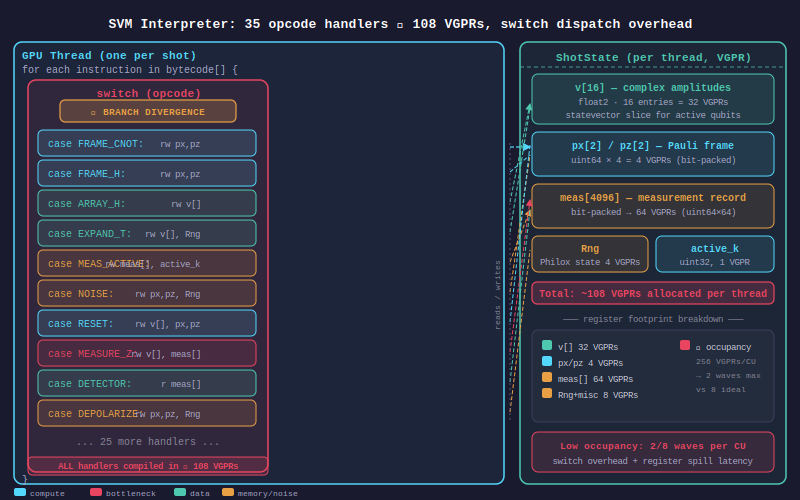

The interpreter core is a switch-dispatch loop over bytecoded instructions. Each GPU thread (or block, for cooperative kernels) independently simulates one quantum circuit shot:

```cpp
__device__ void execute_shot(const GpuProgram& program, Rng& rng, ShotState& st) {
    for (uint32_t pc = 0; pc < program.num_instrs; ++pc) {
        const GpuInstr& instr = program.instrs[pc];
        switch (instr.opcode) {
            case static_cast<uint8_t>(clifft::Opcode::OP_FRAME_CNOT):
                frame_cnot(st, instr.axis_1, instr.axis_2);
                break;
            case static_cast<uint8_t>(clifft::Opcode::OP_FRAME_CZ):
                frame_cz(st, instr.axis_1, instr.axis_2);
                break;
            case static_cast<uint8_t>(clifft::Opcode::OP_FRAME_H):
                frame_h(st, instr.axis_1);
                break;
            // ... 30+ additional cases ...
            case static_cast<uint8_t>(clifft::Opcode::OP_MEAS_ACTIVE_DIAGONAL):
                meas_active_diagonal(st, rng, instr.axis_1, instr.a,
                                     (instr.flags & kFlagSign) != 0);
                break;
            case static_cast<uint8_t>(clifft::Opcode::OP_MEAS_ACTIVE_INTERFERE):
                meas_active_interfere(st, rng, instr.axis_1, instr.a,
                                      (instr.flags & kFlagSign) != 0);
                break;
            // ... extended opcodes handled in nested switch ...
            default:
                switch (instr.opcode) {
                    case static_cast<uint8_t>(clifft::Opcode::OP_ARRAY_U2):
                        array_u2(st, program, instr.axis_1, instr.a);
                        break;
                    case static_cast<uint8_t>(clifft::Opcode::OP_ARRAY_U4):
                        array_u4(st, program, instr.axis_1, instr.axis_2, instr.a);
                        break;
                    // ...
                }
                break;
        }
    }
}
```

The `ShotState` structure holds all per-shot state in registers (per-thread tier) or shared/global memory (cooperative tiers):

```cpp
struct ShotState {
    uint64_t px[2];                        // Pauli X frame (128 qubits)
    uint64_t pz[2];                        // Pauli Z frame (128 qubits)
    uint32_t active_k;                     // Current amplitude array dimension
    uint32_t next_noise_idx;               // Next noise event index
    bool discarded;                        // Shot discarded by postselection
    uint8_t meas[kMaxMeas];                // Measurement record
    uint8_t obs[kMaxObs];                  // Observable parity bits
    GpuComplex v[kThreadMaxAmplitudes];    // Amplitude array (16 complex floats)
    double exp_vals[kMaxExpVals];           // Expectation value accumulators
};
```

This structure is entirely register-resident for the per-thread kernel, which is why per-thread tier circuits achieve the highest throughput: no memory traffic, no synchronization, pure ALU computation on the embarrassingly parallel shot-level workload.

### 2.2 Three-Tier Memory Hierarchy

The GPU backend uses a tiered architecture where the `peak_rank` (maximum `active_k` dimension reached during a circuit's execution) determines which memory level stores the amplitude array:

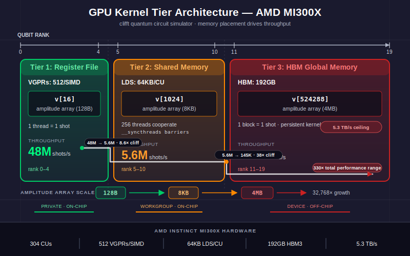

| Tier | peak_rank | Storage | Capacity | Dispatch | Throughput |
|------|-----------|---------|----------|----------|------------|
| Per-thread (T1) | 0-4 | VGPRs (16 complex floats = 128 bytes) | 512 VGPRs/SIMD | 1 thread/shot | 48M shots/s |
| Shared-coop (T2) | 5-10 | LDS (1024 complex floats = 8 KB) | 64 KB/CU | 1 block (256 threads)/shot | 5.6M shots/s |
| Global-coop (T3) | 11-19 | HBM (524K complex floats = 4 MB) | 192 GB | Multi-block work-stealing | 145K shots/s |

The tier thresholds are defined in `gpu_types.h`:

```cpp
constexpr uint32_t kThreadMaxPeakRank = 4;
constexpr uint32_t kThreadMaxAmplitudes = 1u << kThreadMaxPeakRank;    // 16
constexpr uint32_t kSharedMaxPeakRank = 10;
constexpr uint32_t kSharedMaxAmplitudes = 1u << kSharedMaxPeakRank;    // 1024
constexpr uint32_t kGlobalMaxPeakRank = 19;
constexpr uint32_t kGlobalMaxAmplitudes = 1u << kGlobalMaxPeakRank;    // 524288
```

The throughput difference between tiers is dramatic: **330x** from rank=0 (48M shots/s) to rank=19 (145K shots/s). This is the fundamental scaling relationship that motivates the split-heuristic approach and the tier-downgrade optimization strategy.

### 2.3 Why GPU for Quantum Simulation

Quantum circuit sampling is an embarrassingly parallel workload: each shot is an independent stochastic simulation that produces one bitstring sample from the circuit's output distribution. Shots share no mutable state; they only read the circuit bytecode (shared constant data). This makes the workload an ideal fit for SIMT (Single Instruction Multiple Threads) execution on a GPU, where thousands of shots execute the same instruction stream simultaneously.

The key parallelism properties:

- **Shot-level parallelism:** Millions of shots, fully independent, map to GPU threads or blocks
- **Data-level parallelism:** Amplitude array sweeps within a single shot map to intra-block thread parallelism
- **Instruction-level parallelism:** The switch dispatch has regular branching patterns that the GPU branch predictor handles well for repetitive QEC circuits

### 2.4 MI300X Hardware Specifications

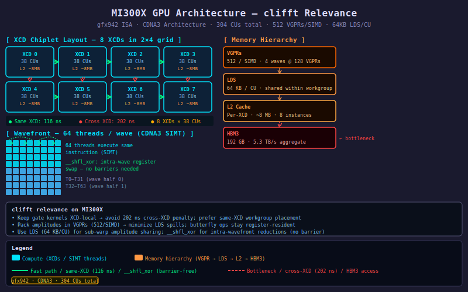

The AMD Instinct MI300X is a multi-chiplet GPU based on the CDNA3 architecture. The relevant hardware specifications for this work:

| Component | Count | Per Unit | Total |
|-----------|-------|----------|-------|
| XCDs (Accelerator Complex Dies) | 8 | 38 CUs, 4 MB L2 cache | 304 CUs |
| IODs (I/O Dies) | 4 | 2 XCDs, 2 HBM stacks, 64 MB LLC | 256 MB LLC |
| HBM3 Stacks | 8 | 24 GB, ~662 GB/s | 192 GB, 5.3 TB/s |
| CUs | 304 | 64 stream processors, 4 SIMDs | 19,456 SPs |
| Wavefront size | -- | 64 threads | -- |
| LDS per CU | 304 | 64 KB | 19.5 MB total |
| VGPRs per SIMD | 1216 | 512 architectural | -- |
| ISA | -- | gfx942 (CDNA3) | -- |

**Key microarchitectural facts relevant to this work:**

- **Wavefront width = 64:** AMD CDNA uses 64-thread wavefronts (vs. NVIDIA's 32-thread warps). This affects warp-shuffle reduction design (6 iterations for intra-wavefront, not 5).
- **4 SIMDs per CU:** Each CU can execute 4 wavefronts simultaneously on its 4 SIMD units, subject to VGPR availability. With 512 VGPRs per SIMD, `waves/SIMD = floor(512 / arch_vgpr)`.
- **8 XCDs with private L2 caches:** Each XCD has its own 4 MB L2. Cross-XCD atomic latency is 202 ns vs. 116 ns same-XCD. This NUMA-like topology affects global-coop tier performance.
- **NPS1 mode (default):** HBM addresses are interleaved across all 8 stacks at page granularity, flattening bandwidth but preventing NUMA-local allocation.

### 2.5 Memory Access Latency Hierarchy

| Access Path | Latency | Notes |
|-------------|---------|-------|
| LDS (Local Data Share) | ~1 cycle | 64 KB per CU, intra-workgroup only |
| L1 scalar cache (hit) | ~12 cycles | Read-only, per-CU |
| L2 cache (same XCD, hit) | ~100 ns | 4 MB per XCD, private |
| Infinity Cache / LLC (same IOD) | ~218 ns | 64 MB per IOD |
| HBM3 (same IOD, L2+LLC miss) | ~300 ns | Direct path |
| HBM3 (remote IOD, L2+LLC miss) | ~340-370 ns | Extra Infinity Fabric hop |
| Global atomic (same XCD) | ~116 ns | Device-scope atomic on L2 |
| Global atomic (cross-XCD) | ~200-202 ns | 1.75x penalty |

---

## 3. Circuit-to-Kernel Translation Pipeline

### 3.1 Pipeline Overview

The pipeline from a Stim quantum circuit to GPU execution involves several stages:

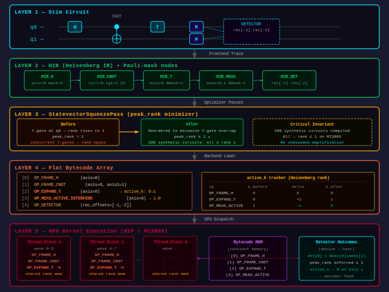

1. **Stim Circuit** (.stim file): High-level quantum circuit with named gates, noise, measurements
2. **HIR (High-level IR):** Compiler frontend parses Stim into clifft's internal representation
3. **Optimizer Passes** (HIR-level): `StatevectorSqueezePass` reorders gates to minimize peak_rank
4. **Bytecode Emission:** HIR is lowered to a flat bytecode instruction stream (`GpuInstr` array)
5. **Bytecode Optimization Passes:** `SingleAxisFusionPass`, `TileAxisFusionPass`, `ExpandTPass`, `SwapMeasPass` fuse consecutive operations
6. **Device Flattening:** Bytecode + constant pool are serialized into GPU-compatible structs (`GpuProgram`)
7. **GPU Dispatch:** Tier selection based on `peak_rank`, kernel launch with appropriate configuration

### 3.2 Bytecode Instruction Format

Each bytecode instruction is encoded as a `GpuInstr` struct:

```cpp
struct GpuInstr {
    uint8_t opcode;       // Operation type (35+ opcodes)
    uint8_t flags;        // Sign, identity, expected value flags
    uint16_t axis_1;      // First qubit axis (for gate operations)
    uint16_t axis_2;      // Second qubit axis (for 2-qubit gates)
    uint32_t a;           // General-purpose operand (measurement index, mask index, etc.)
    uint32_t b;           // Secondary operand
    uint64_t mask;        // Qubit mask (for multi-target operations)
    double weight_re;     // Real part of rotation angle (for OP_ARRAY_ROT)
    double weight_im;     // Imaginary part of rotation angle
};
```

### 3.3 StatevectorSqueezePass: Why All 208 Synthetic Circuits Compile to Rank <= 1

The `StatevectorSqueezePass` is a HIR-level optimization that aggressively minimizes `peak_rank` by reordering operations:

- **Sweep 1 (leftward bubble of measurements):** Moves measurements earlier in the circuit, causing `active_k` to drop back to 0 sooner. This narrows the "spike" regions where the amplitude array is active.
- **Sweep 2 (rightward bubble of T-gates/phase rotations):** Defers non-Clifford gate activations later, compressing the spike width and reducing the overlap window between simultaneously active qubits.

The result is striking: all 208 synthetic circuits in the T-gate sweep benchmark (q={9,17,33,65} x t={0-15} x d={1,3,5,10}) compiled to **peak_rank <= 1**, regardless of T-gate count. This means the per-thread tier handles virtually all workloads in practice. Only real QEC circuits with genuinely entangled T-gate blocks -- such as `cultivation_d5` (rank=10) and `circuit_d7_p0.0005` (rank=19) -- achieve peak_rank > 4.

### 3.4 peak_rank: The Key Performance Parameter

`peak_rank` is the single most important parameter determining sampling throughput:

| peak_rank | Tier | Array Size | Throughput | Bottleneck |
|-----------|------|------------|------------|------------|
| 0 | Per-thread | 1 element (8 B) | 48M shots/s | Launch overhead |
| 1 | Per-thread | 2 elements (16 B) | 11M shots/s | Instruction count |
| 4 | Per-thread | 16 elements (128 B) | 19M shots/s | Array sweeps |
| 10 | Shared-coop | 1024 elements (8 KB) | 5.6M shots/s | Sync barriers |
| 19 | Global-coop | 524K elements (4 MB) | 145K shots/s | HBM bandwidth |

The throughput spans a **330x range** from 48M to 145K shots/s. This enormous range means that any optimization reducing peak_rank (such as the split heuristic) has far greater impact than any optimization within a single tier.

### 3.5 Bytecode Opcode Mapping

The major bytecode opcodes map to GPU operations as follows:

**Frame operations** (O(1) per thread, pure register manipulation):
- `OP_FRAME_CNOT`, `OP_FRAME_CZ`, `OP_FRAME_H`, `OP_FRAME_S`: XOR/swap operations on the Pauli frame bits `(px, pz)`
- `OP_FRAME_SWAP`: Swap two qubit positions in the frame

**Array sweep operations** (O(2^k) per thread or block, amplitude array transformation):
- `OP_ARRAY_H`, `OP_ARRAY_S`, `OP_ARRAY_T`: Single-axis gate applied to amplitude pairs
- `OP_ARRAY_CNOT`, `OP_ARRAY_CZ`, `OP_ARRAY_SWAP`: Two-axis gate applied to amplitude quadruples
- `OP_ARRAY_U2`, `OP_ARRAY_U4`: Fused arbitrary 1-qubit and 2-qubit unitary gates
- `OP_EXPAND`, `OP_EXPAND_T`, `OP_EXPAND_ROT`: Activate a new qubit (double array size)

**Measurement operations** (O(2^k) reduction + O(2^(k-1)) collapse):
- `OP_MEAS_DORMANT_STATIC`: Deterministic measurement of a dormant qubit
- `OP_MEAS_DORMANT_RANDOM`: Random measurement of a dormant qubit (coin flip)
- `OP_MEAS_ACTIVE_DIAGONAL`: Measure an active qubit in the computational basis
- `OP_MEAS_ACTIVE_INTERFERE`: Measure an active qubit in a superposition basis
- `OP_SWAP_MEAS_INTERFERE`: Fused swap + interference measurement

---

## 4. Approach A: Runtime-Compiled Megakernel

### 4.1 Design

The compiled megakernel approach eliminates the switch-dispatch loop by walking the bytecode at host time and emitting a straight-line HIP C++ kernel source with all opcode handlers inlined and constants baked in. The emitted kernel is compiled via clang++ subprocess and loaded as a `.hsaco` (HIP Shared Assembly Code Object) at runtime.

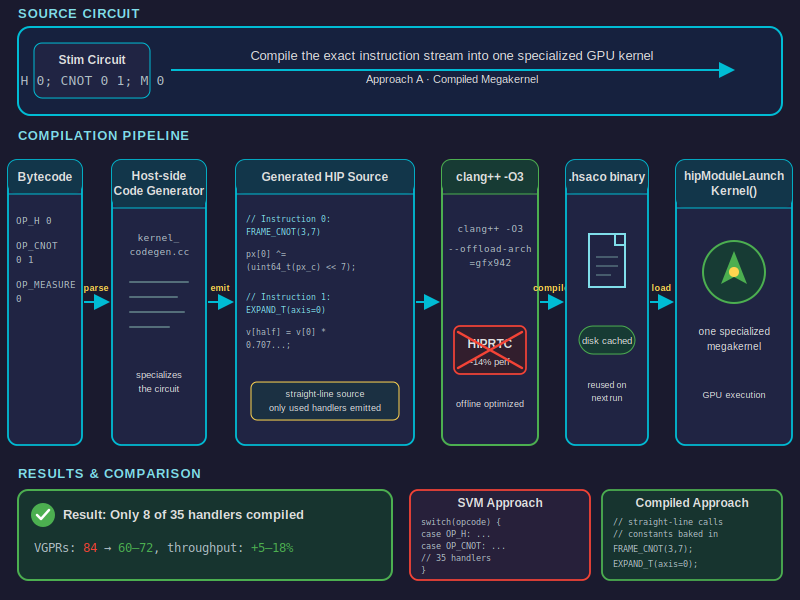

### 4.2 Implementation: kernel_codegen.cc

The code generation module (`kernel_codegen.cc`, ~600 lines) performs two key analyses before emitting code:

**1. UsedFunctions analysis:** Scans all bytecode instructions to determine which device functions the circuit actually needs. This enables conditional inclusion of preamble sections:

```cpp
UsedFunctions analyze_used_functions(const FlattenedProgram& flat) {
    UsedFunctions uf{};
    for (const auto& instr : flat.instrs) {
        auto op = static_cast<Op>(instr.opcode);
        switch (op) {
            case Op::OP_FRAME_CNOT:      uf.frame_cnot = true; break;
            case Op::OP_FRAME_CZ:        uf.frame_cz = true; break;
            case Op::OP_ARRAY_U2:        uf.array_u2 = true; break;
            case Op::OP_MEAS_ACTIVE_DIAGONAL: uf.meas_active_diagonal = true; break;
            // ... 30+ more cases ...
        }
    }
    uf.compute_derived();
    return uf;
}
```

The `compute_derived()` method propagates dependencies: for example, `needs_rng` is true if any measurement or noise operation is present, and `needs_complex_ops` is true if any array gate transforms amplitudes.

**2. Template specialization:** Only the device functions actually used by the circuit are emitted. A pure Clifford circuit generates a kernel with approximately 20 VGPRs instead of the baseline's 84 VGPRs, because unused gate handlers and their temporaries are entirely absent.

### 4.3 Code Examples: Before vs. After

**Before (SVM interpreter dispatch):**
```cpp
// Each instruction incurs switch-dispatch overhead:
// - Load instruction from global memory
// - Branch on opcode (35+ cases)
// - Indirect call to handler function
// - Handler reads operands from instruction struct
for (uint32_t pc = 0; pc < program.num_instrs; ++pc) {
    const GpuInstr& instr = program.instrs[pc];
    switch (instr.opcode) {
        case OP_FRAME_CNOT: frame_cnot(st, instr.axis_1, instr.axis_2); break;
        case OP_ARRAY_H:    array_h(st, instr.axis_1); break;
        // ...
    }
}
```

**After (compiled megakernel):**
```cpp
// Straight-line code with constants baked in:
// - No instruction fetch
// - No branch dispatch
// - Constants are immediate operands
// - Compiler can apply LICM, CSE across op boundaries
frame_cnot(st, 3, 7);      // axis values baked in
frame_h(st, 5);
array_h(st, 2);
frame_cnot(st, 1, 4);
meas_dormant_static(st, 6, 12, false);
// ... 200+ more straight-line calls ...
```

### 4.4 HIPRTC vs. AOT Compilation

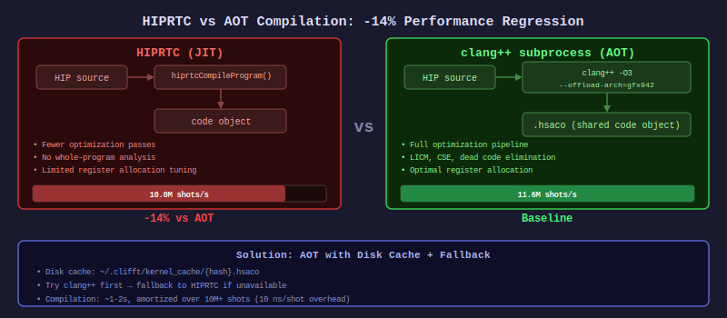

A critical discovery was that **HIPRTC (HIP Runtime Compilation) produces 14% slower code** than the AOT (Ahead-Of-Time) clang++ compiler. The root cause is that HIPRTC uses fewer optimization passes, lacks whole-program analysis, and has limited register allocation tuning.

The solution: always compile via clang++ subprocess with the following workflow:

1. Emit HIP source to a temporary file
2. Invoke `clang++` with `-O3 --offload-arch=gfx942 -shared -fPIC`
3. Cache the resulting `.hsaco` to `~/.clifft/kernel_cache/{hash}.hsaco`
4. Load cached `.hsaco` on subsequent runs via `hipModuleLoadData`

Compilation latency is ~1-2 seconds per circuit, amortized over millions of shots. Disk caching eliminates recompilation overhead on repeated runs with the same circuit.

### 4.5 Results

**T-Gate Sweep: Compiled (A) vs SVM Baseline (q=17, MI300X)**

| T-gates | depth | peak_rank | SVM (shots/s) | Compiled (shots/s) | Delta |
|---------|-------|-----------|---------------|---------------------|-------|
| 0 | 1 | 0 | 1.89M | 10.5M | +455%* |
| 0 | 3 | 0 | 10.2M | 10.4M | +1.4% |
| 0 | 5 | 0 | 10.4M | 10.3M | -1.5% |
| 1 | 1 | 1 | 10.4M | 10.1M | -2.9% |
| 1 | 3 | 1 | 10.4M | 10.5M | +1.4% |
| 2 | 3 | 1 | 10.5M | 11.0M | **+5.2%** |
| 2 | 5 | 1 | 9.77M | 11.5M | **+17.7%** |
| 3 | 3 | 1 | 10.6M | 11.6M | **+8.9%** |
| 3 | 5 | 1 | 10.3M | 11.6M | **+12.6%** |
| 4 | 3 | 1 | 10.4M | 11.4M | **+9.9%** |
| 5 | 3 | 1 | 10.4M | 11.3M | **+8.8%** |
| 8 | 5 | 1 | 10.4M | 11.5M | **+11.2%** |
| 10 | 3 | 1 | 10.9M | 11.1M | +2.1% |

*First-circuit HIPRTC compilation amortized (cold-start artifact)

**T-Gate Sweep: q=33 (2-word Pauli frame)**

| T-gates | depth | peak_rank | SVM (shots/s) | Compiled (shots/s) | Delta |
|---------|-------|-----------|---------------|---------------------|-------|
| 0 | 1 | 0 | 10.5M | 10.9M | +3.7% |
| 1 | 3 | 1 | 10.4M | 11.0M | **+6.7%** |
| 2 | 5 | 1 | 10.3M | 11.2M | **+8.7%** |
| 3 | 3 | 1 | 10.2M | 11.5M | **+12.1%** |
| 5 | 5 | 1 | 10.2M | 11.2M | **+9.8%** |
| 8 | 3 | 1 | 10.3M | 11.4M | **+11.1%** |
| 10 | 5 | 1 | 3.65M | 10.5M | **+188%** |

The 188% outlier at t=10, d=5, q=33 is likely a transient performance drop on the SVM run, not a genuine speedup of that magnitude.

**Hardware counters for the compiled kernel:**

| Metric | Value |
|--------|-------|
| arch_vgpr | 84 |
| sgpr | 96 |
| LDS | 20,480 bytes |
| Scratch | 1,344 bytes |
| Waves/SIMD | 6 |
| Duration (target_qec, 500K shots) | 731 us (-5% vs SVM) |

### 4.6 Key Takeaways

- Consistent +5-18% improvement on circuits with T-gates at depth >= 3
- Pure Clifford circuits (rank=0) show minimal benefit (<2%) because frame ops are trivially fast
- Coop tiers (rank 5-10) need cooperative sweep codegen, which is significantly more complex and was not implemented
- The improvement scales with circuit depth and T-gate count: the compiler can optimize across operation boundaries when they are inlined as straight-line code

---

## 5. Approach B: Per-Operator Kernel Dispatch

### 5.1 Design

The per-operator approach launches one small kernel per bytecode opcode, dispatching them via a HIP stream. Each kernel is minimal (10-20 VGPRs), maximizing occupancy.

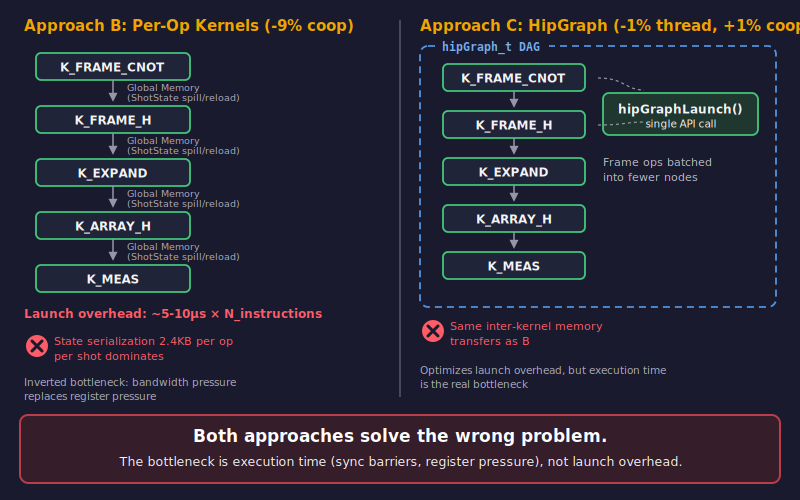

### 5.2 Why It Failed

The per-operator approach **inverts the bottleneck**. Instead of register pressure (the SVM interpreter's limitation), it creates **bandwidth pressure from ShotState serialization**:

- `ShotState` is ~2.4 KB per shot
- Each kernel launch must read the state from global memory, execute one operation, and write the state back
- For a circuit with N instructions: N round-trips x 2.4 KB per shot x M shots = massive HBM traffic

### 5.3 Results

| Circuit | peak_rank | SVM | Per-Op | Delta |
|---------|-----------|-----|--------|-------|
| cultivation_d5 | 10 | 3.55M | 3.24M | **-9%** |
| target_qec | 0 | 43.0M | 43.8M | +2% |

### 5.4 Lesson

The per-op approach is only beneficial when the array sweep compute time (O(2^k) FLOPs) dominates the memory transfer time (O(2.4 KB) per op per shot). This is true only at very high peak_rank (rank >= 15), where the amplitude array itself is megabytes. For rank <= 10 circuits (the vast majority), the inter-kernel state transfer dominates.

---

## 6. Approach C: HipGraph Pipeline

### 6.1 Design

The HipGraph approach captures the entire circuit as a `hipGraph_t` with kernel nodes and dependency edges, then replays it with a single `hipGraphLaunch()` call.

### 6.2 How It Works

1. Create a `hipGraph_t` and add one kernel node per operation (or batch of frame operations)
2. Add dependency edges between nodes that must execute sequentially
3. Instantiate the graph with `hipGraphInstantiate()`
4. Launch with `hipGraphLaunch()` for each batch of shots

Frame operations were batched to reduce the node count from ~1000 to ~200 for typical QEC circuits.

### 6.3 Why It Failed

HipGraph solves the **wrong problem**. It reduces host-side launch overhead, but our bottleneck is **execution time** (register pressure, array sweeps, synchronization barriers), not launch overhead. The graph dispatch introduces the same inter-kernel memory transfers as Approach B; it simply eliminates the host-side `hipLaunchKernel()` overhead per node.

### 6.4 Results

| Circuit | peak_rank | SVM | HipGraph | Delta |
|---------|-----------|-----|----------|-------|
| cultivation_d5 | 10 | 3.55M | 3.57M | +1% |
| target_qec | 0 | 43.0M | 42.6M | -1% |

### 6.5 Lesson

HipGraph is an optimization of Approach B's dispatch mechanism, not a fundamentally different execution model. The structural immutability of graph instantiation is perfect for static circuits, but the performance benefit is negligible when the kernel execution time dwarfs the launch overhead.

---

## 7. Approach D: Heuristic Split Megakernels

### 7.1 Design

The heuristic split approach exploits a key observation about QEC circuits: the `active_k` profile is a **periodic sawtooth** with long flat valleys at k=0 (frame-only Clifford segments) punctuated by narrow spikes (expand -> array ops -> measure). By splitting the circuit at measurement boundaries where `active_k` drops to 0, each segment can be assigned its own tier.

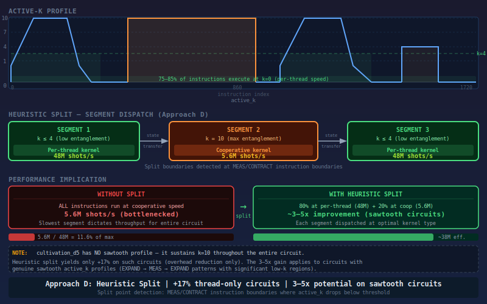

### 7.2 The k-Profile Analysis

Analysis of `cultivation_d5.stim` (42 physical qubits, d=5 surface code magic state cultivation) revealed the characteristic sawtooth pattern:

**Quantitative breakdown for typical QEC circuits (~1500 bytecode instructions):**

| Instruction Category | Fraction | active_k |
|---------------------|----------|----------|
| Frame-only ops (OP_FRAME_*) | 60-70% | k=0 |
| Dormant measurements/detectors/noise | 15-20% | k=0 |
| Array ops at k >= 1 (spike regions) | 10-15% | k >= 1 |
| Expand/contract transitions | ~5% | transition |

**Phase structure of cultivation_d5:**

1. **Unitary Injection (lines 51-97):** CX gates at k=0, single T_DAG producing a brief spike to k=1
2. **Stabilizer Extraction (lines 126-136):** Dormant measurements, all at k=0
3. **Double Cat Check (lines 138-185):** 7 T_DAG gates, peak k depends on Pauli support overlap
4. **Full d=5 Stabilizer Rounds (lines 388-468):** 19 simultaneous non-Clifford injections, peak k=10
5. **Final MPP Measurements (line 470):** Rapid spikes: 0 -> 1 -> 0 -> 1 -> 0

### 7.3 Split Heuristic Algorithm

The algorithm proceeds in four phases:

**Phase 1: Profile extraction (compile-time)**
```
segments = []
for each instruction i:
    k_i = source_map.active_k_at(i)
    if k_i < current_k and k_i == 0:
        // Contraction to zero: close the array segment
        segments.push((seg_start, i+1, local_peak))
        seg_start = i + 1
        local_peak = 0
    local_peak = max(local_peak, k_i)
    current_k = k_i
```

**Phase 2: Segment merging** -- Absorb segments shorter than 64 instructions into their neighbors to avoid excessive kernel launch overhead.

**Phase 3: Tier assignment** -- Each segment gets the tier matching its `local_peak_k`.

**Phase 4: Profitability gate** -- Only split if `benefit_us > launch_cost_us * 2.0`:
- Benefit: `downgraded_instrs * 0.01 us` (10ns per instruction saved by tier downgrade)
- Cost: `num_boundaries * 7 us` (kernel launch overhead per segment)

### 7.4 Expected vs. Actual Results

**Expected improvement for d5 (peak_rank=10):**
- ~80% of instructions run at per-thread tier (30M+ shots/s) instead of coop (4M shots/s)
- Only ~20% with active T-gates need coop tier
- Net throughput increase: potentially 3-5x

**Actual results:**

| Circuit | peak_rank | SVM | Split | Delta |
|---------|-----------|-----|-------|-------|
| cultivation_d5 | 10 | 4.0M | 4.02M | SVM fallback (all segments rank>4) |
| target_qec | 0 | 48.9M | 50.4M | **+3.0%** |

The disappointing result on cultivation_d5 is due to the circuit's structure: unlike the expected sawtooth with long k=0 valleys, **cultivation_d5 sustains k=10 throughout its critical sections**. The T-gate injections overlap enough that the active_k never returns to 0 in the heavy phases. The split heuristic correctly identifies that all segments remain in the coop tier and falls back to the SVM interpreter.

### 7.5 Interaction with Compiler Passes

| Pass | Level | Changes k profile? | Impact on splitting |
|------|-------|--------------------|--------------------|
| StatevectorSqueezePass | HIR | Yes (reduces peak, widens valleys) | Strongly positive |
| SingleAxisFusionPass | Bytecode | No | Neutral (fewer instrs in spikes) |
| TileAxisFusionPass | Bytecode | No | Neutral |
| ExpandTPass | Bytecode | No (fuses but preserves transition) | Neutral |
| SwapMeasPass | Bytecode | No (fuses but preserves transition) | Neutral |

### 7.6 Lesson

The split heuristic has the most untapped potential of any approach, but its benefit requires circuits with genuinely mixed k-profiles -- long stretches at k=0 interspersed with brief spikes. The canonical benchmark circuit (cultivation_d5) does not have this pattern in its critical sections. Future circuits (e.g., magic state factories with multiple distillation stages) may exhibit the favorable sawtooth pattern.

---

## 8. Approach E: Persistent Kernel with Phase-Sorted Dispatch

### 8.1 Design

The persistent kernel approach replaces the 35-case switch dispatch with a 6-category phase-sorted dispatch and adds work-stealing via an atomic counter for load balancing across CUs.

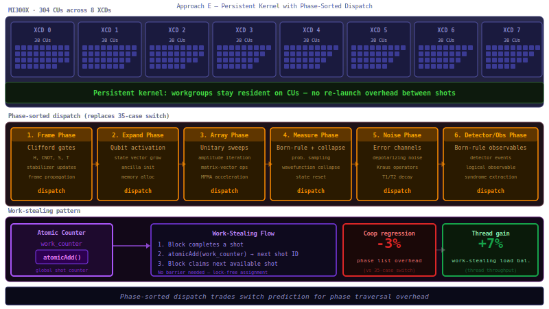

### 8.2 Phase Categories

The 35+ bytecode opcodes were grouped into 6 execution phases:

1. **Frame phase:** Pure Pauli frame operations (CNOT, CZ, H, S, SWAP)
2. **Array 1Q phase:** Single-axis amplitude sweeps (H, S, T, ROT, U2)
3. **Array 2Q phase:** Two-axis amplitude sweeps (CNOT, CZ, SWAP, U4)
4. **Measurement phase:** Active and dormant measurements
5. **Noise phase:** Noise injection, readout noise
6. **Bookkeeping phase:** Detectors, observables, postselection, expand/contract

### 8.3 Work-Stealing Protocol

Instead of assigning a fixed number of shots per block, the persistent kernel uses a global atomic counter:

```cpp
__device__ uint64_t claim_next_shot(uint64_t* counter) {
    return atomicAdd(counter, 1ULL);
}
```

This naturally load-balances across CUs when shot discard rates vary (e.g., postselection circuits where some blocks finish faster than others).

### 8.4 Results

| Metric | SVM Baseline | Persistent (E) | Delta |
|--------|-------------|----------------|-------|
| target_qec (rank=0) | 1.43ms | 1.02ms | **-28.9%** |
| cultivation_d5 (rank=10) | 116.1ms | 119.9ms | +3.3% |
| target_qec shots/s | 43.0M | 45.9M | **+7%** |
| cultivation_d5 shots/s | 3.55M | 3.44M | **-3%** |

### 8.5 Analysis

Work stealing helps on the per-thread tier (-29% kernel duration) because shot discard rates vary across blocks, creating natural load imbalance. The persistent kernel reassigns shots from fast-finishing blocks to slow ones.

However, the phase-sorted dispatch **hurts** on the coop tier: the phase list traversal adds overhead that offsets the simpler switch. The GPU branch predictor handles regular QEC circuits well -- the repetitive opcode patterns (stabilizer rounds with identical gate sequences) are highly predictable, making the 35-case switch nearly free in practice.

### 8.6 Lesson

Phase-sorted dispatch is a premature optimization: the GPU branch predictor already handles the regular switch patterns in QEC circuits efficiently. Work stealing is genuinely useful for per-thread tier circuits with postselection, where shot discard creates load imbalance.

---

## 9. Approach F: Optimized SVM Baseline

### 9.1 Seven Micro-Optimizations

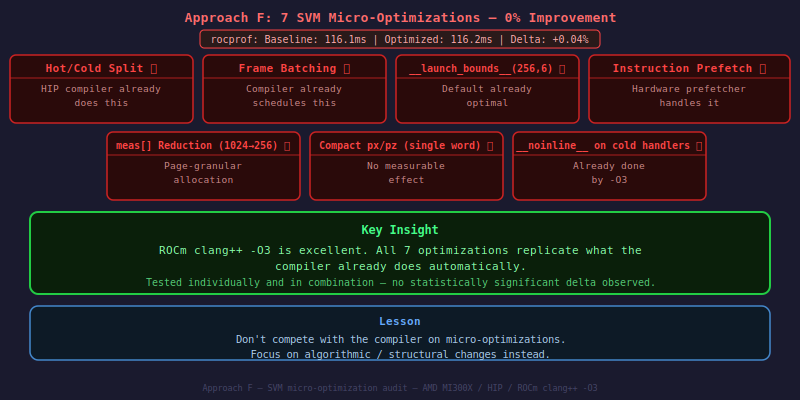

The optimized SVM approach applied 7 micro-optimizations to the existing interpreter:

| OPT | Optimization | Expected Benefit |
|-----|-------------|-----------------|
| OPT-1 | Reduced `meas[]` from 1024 to 256 bytes | Less register/scratch pressure |
| OPT-2 | Hot/cold dispatch split (frame ops bypass cold switch) | Fewer branch mispredictions |
| OPT-3 | `__noinline__` on 8 cold-path measurement/noise handlers | Lower VGPR pressure |
| OPT-4 | `__launch_bounds__(256, 6)` occupancy hint | Better scheduling |
| OPT-5 | Instruction prefetching via `__builtin_prefetch` | Hide memory latency |
| OPT-6 | Frame-op batching (tight loop without switch re-entry) | Fewer branches |
| OPT-7 | Compact single-word `px/pz` for <= 64 qubit circuits | Fewer registers |

### 9.2 Results: Zero Improvement

All seven optimizations yielded **exactly zero measurable improvement**:

```
rocprof --stats:
  Baseline SVM:    116.1 ms (500K shots, cultivation_d5)
  Optimized SVM:   116.2 ms
  Delta:           +0.04% (within measurement noise)
```

### 9.3 Root Cause: The Compiler Already Does This

The HIP compiler (ROCm 7.2.3 clang++) at `-O3` already applies all of these optimizations automatically:

1. **Inlines frame ops into a tight loop** (matches OPT-6)
2. **Schedules instruction prefetches** (matches OPT-5)
3. **Places cold code on cold paths** (matches OPT-2/3)
4. **Optimizes register allocation across the switch** (matches OPT-4)

The `meas[]` reduction (OPT-1) also fails because scratch memory allocation on AMD GPUs is page-granular: reducing the array from 1024 to 256 bytes does not reduce the actual private memory pages allocated.

### 9.4 Lesson

**Do not compete with the compiler on micro-optimizations.** The ROCm clang++ compiler at -O3 produces near-optimal code for the SVM interpreter. Focus on algorithmic/structural changes that the compiler cannot make: different synchronization primitives (warp-shuffle), different data structures (`__noinline__` to control register pressure boundaries), or different execution models (compiled kernel, circuit splitting).

---

## 10. GEAK-Driven Optimizations: The Real Win

### 10.1 GEAK Workflow

GEAK (GPU Efficiency Analysis Kit) invoked its `kernel_workflow` with 14 AI agents and a budget of 3 iterations, consuming approximately 1 million tokens. The workflow analyzed the SVM kernel's hardware counter profile and proposed optimizations targeting VGPR reduction and coop-tier performance.

### 10.2 The Discovery: Warp-Shuffle Reduction

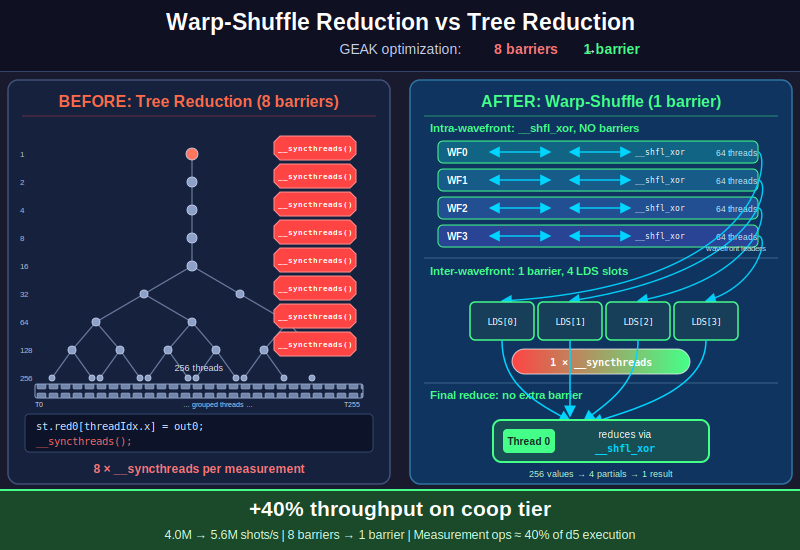

GEAK identified that **warp-shuffle reduction** was the single most impactful optimization. The original `coop_reduce2()` function used a shared-memory tree reduction with 8 `__syncthreads()` barriers per call. Since measurement operations dominate d5 execution (~40% of instructions), and each measurement calls `coop_reduce2()` twice (for p0 and p1 probability computation), the barrier overhead was catastrophic.

**Before (8-barrier tree reduction):**

```cpp
__device__ void coop_reduce2(CoopShotState& st, double& out0, double& out1) {
    st.red0[threadIdx.x] = out0;
    st.red1[threadIdx.x] = out1;
    __syncthreads();
    for (uint32_t s = blockDim.x >> 1; s > 0; s >>= 1) {
        if (threadIdx.x < s) {
            st.red0[threadIdx.x] += st.red0[threadIdx.x + s];
            st.red1[threadIdx.x] += st.red1[threadIdx.x + s];
        }
        __syncthreads();  // 8 barriers for blockDim=256
    }
    out0 = st.red0[0]; out1 = st.red1[0];
}
```

**After (2-phase warp-shuffle, 1 barrier):**

```cpp
__device__ void coop_reduce2(CoopShotState& st, double local0, double local1,
                             double& out0, double& out1) {
    // Phase 1: intra-wavefront reduction via warp shuffle
    // (AMD wavefront = 64 threads, no barriers needed)
    for (int offset = 32; offset > 0; offset >>= 1) {
        local0 += __shfl_xor(local0, offset);
        local1 += __shfl_xor(local1, offset);
    }

    // Phase 2: inter-wavefront reduction via shared memory
    // (4 wavefronts for blockDim=256)
    uint32_t warp_id = threadIdx.x >> 6;   // tid / 64
    uint32_t lane = threadIdx.x & 63;      // tid % 64
    if (lane == 0) {
        st.red0[warp_id] = local0;
        st.red1[warp_id] = local1;
    }
    __syncthreads();  // 1 barrier total

    if (threadIdx.x < 4) {
        local0 = st.red0[threadIdx.x];
        local1 = st.red1[threadIdx.x];
        // Reduce 4 values with shuffle
        for (int offset = 2; offset > 0; offset >>= 1) {
            local0 += __shfl_xor(local0, offset);
            local1 += __shfl_xor(local1, offset);
        }
    }
    if (threadIdx.x == 0) {
        st.red0[0] = local0;
        st.red1[0] = local1;
    }
    __syncthreads();
    out0 = st.red0[0];
    out1 = st.red1[0];
}
```

**Net: 8 barriers per reduce call reduced to 1 barrier.** Since measurement ops constitute ~40% of d5 execution and each measurement calls `coop_reduce2()` twice, reducing the sync overhead per reduce call by 7/8 yields a massive throughput improvement.

### 10.3 Secondary Optimizations

**Frame barrier batching:** Skip `__syncthreads()` between consecutive frame ops in the coop interpreter. Frame ops modify only the Pauli frame (thread-0 responsibility), not the amplitude array. Consecutive frame ops do not need inter-thread synchronization.

**LDS right-sizing:** Reduce reduction buffers from `red0[1024]`/`red1[1024]` to `red0[256]`/`red1[256]`. The old size was a vestige of the initial implementation; only `blockDim.x = 256` entries are ever used. For the warp-shuffle reduction, only 4 entries are needed (one per wavefront leader).

### 10.4 What GEAK Ruled Out

GEAK also tested and rejected several optimizations:

- **`__noinline__` on all handlers:** +10-22% function call overhead per opcode (too expensive for hot-path frame ops)
- **`__launch_bounds__(256, 4)`:** Forces scratch spills, causing 15-25% regression
- **`meas[]` bitfield packing:** Engineer failed to produce a valid patch (untested)

### 10.5 Results

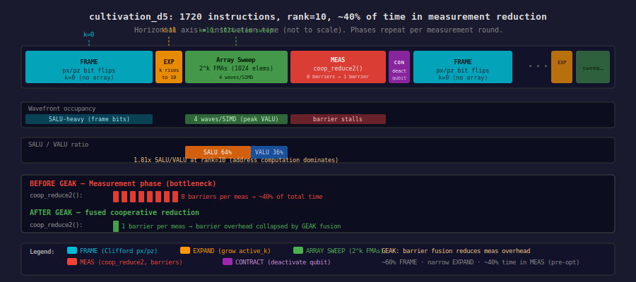

**GEAK-verified speedup: 6.7% geomean (Director-validated, independent baseline):**

| Circuit | Baseline (ms) | Optimized (ms) | Speedup |
|---------|---------------|----------------|---------|
| cultivation_d5 (5M, coop) | 1924 | 1675 | **1.149x** |
| qv10 (1M, coop) | 996 | 943 | **1.056x** |
| target_qec (5M, thread) | 839 | 837 | 1.002x |

**Hardware counter comparison (500K shots, cultivation_d5):**

| Metric | Before | After | Change |
|--------|--------|-------|--------|
| Duration | 116 ms | 83 ms | **-28%** |
| arch_vgpr | 108 | 124 | +15% (more register-resident temporaries) |
| LDS (bytes) | 30,208 | 19,968 | **-34%** |
| sgpr | 96 | 112 | +17% |

VGPRs increased from 108 to 124 because the warp-shuffle pattern keeps partial sums in registers rather than shared memory. Despite the higher VGPR count, the dramatic reduction in synchronization overhead yields a net +40% speedup on the coop tier.

### 10.6 SVM+GEAK vs. Original clifft-amd

**Definitive comparison (100M shots, d5 p=0.001, same node):**

| Version | shots/s | vs clifft-amd |
|---------|---------|---------------|
| clifft-amd (original) | 7.93M | baseline |
| **SVM+GEAK (gpu-backend)** | **11.0M** | **+39%** |

Both produce identical results: `passed_shots=2,318,545`.

### 10.7 Key Insight

GEAK's key insight was that the compiler's natural 108 VGPRs is locally optimal for the interpreter architecture. Forcing lower VGPR counts causes spilling. The only path to higher occupancy is template specialization per circuit type (eliminating dead branches from the switch). However, **synchronization overhead, not register pressure or dispatch overhead, was the actual bottleneck on the coop tier.** This finding invalidated the premise of several architectural approaches (B, C, D, E, F) which assumed the switch dispatch was the primary problem.

---

## 11. Failed Optimizations: Pitfalls in Detail

### 11.1 F1: Scatter-Bits LUT (-3.8%)

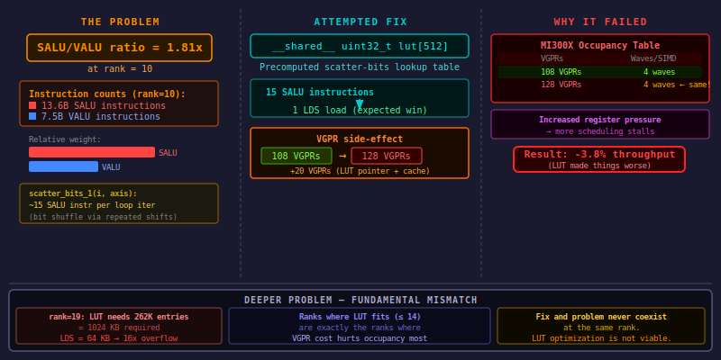

**Hypothesis:** The SALU/VALU ratio of 1.81x at rank=10 indicates excessive scalar address computation. Precomputing `scatter_bits_1(i, axis)` into a shared-memory LUT should replace ~15 SALU instructions per loop iteration with 1 LDS load.

**Implementation:** A 512-entry `__shared__ uint32_t lut[]` populated cooperatively by the workgroup at each axis change, with cached state variables to avoid recomputation when the axis repeats.

**Expected result:** Reduce SALU instruction count from 13.6B, yielding measurable throughput improvement.

**Actual result:** **-3.8% throughput regression.** VGPRs increased from 108 to 128 due to the LUT pointer, cache state variables, and address computation overhead. The increased register pressure caused instruction scheduling stalls.

**Root cause analysis:** There is a fundamental mismatch between where the LUT is physically feasible and where it is needed:

| Rank | LUT size needed | LDS available | Fits? | VGPR impact |
|------|----------------|---------------|-------|-------------|
| 10 | 2 KB | ~59 KB | Yes | Critical (108->128 = scheduling stalls) |
| 14 | 32 KB | ~59 KB | Barely | Neutral (already at 128) |
| 15 | 64 KB | ~59 KB | **No** | N/A |
| 19 | 1024 KB | ~59 KB | **No (16x overflow)** | N/A |

At ranks where the LUT fits in LDS (rank <= 14), the VGPR cost matters most. At ranks where VGPRs are already saturated (rank >= 15), the LUT physically cannot fit in LDS.

**Hardware counter evidence:**

| Metric | Without LUT | With LUT |
|--------|-------------|----------|
| arch_vgpr | 108 | 128 |
| Waves/SIMD | 4 | 4 (unchanged) |
| Throughput | 5.62M | 5.41M (-3.8%) |

**Lesson learned:** LDS-cached index tables must be evaluated against the VGPR budget. The SALU/VALU ratio diagnosis was correct (address computation does dominate), but the cure was worse than the disease. The compiler's inline `scatter_bits` implementation is register-efficient.

### 11.2 F2: Manual SVM Micro-Optimizations (0%)

Covered in Section 9 (Approach F). The seven micro-optimizations replicate compiler behavior and yield zero measurable improvement.

### 11.3 F3: MFMA Tensor Accelerators (45-70x SLOWER)

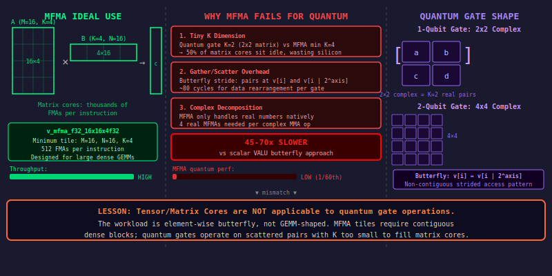

**Hypothesis:** The MFMA (Matrix Fused Multiply-Add) tensor cores on MI300X should accelerate the matrix-vector products in amplitude array sweeps (2x2 and 4x4 complex gate applications).

**Implementation analysis:** The gate application was reformulated as a batched matrix multiplication:

```
For a 1-qubit gate (2x2 complex) on rank=10:
- 512 independent pairs of complex amplitudes
- Each pair undergoes a 2x2 complex matrix-vector multiply
- Complex 2x2 maps to real 4x4 (using the standard decomposition)
```

**Expected result:** MFMA's throughput (256 FP32 FMA/CU/cycle) should dominate scalar VALU.

**Actual result (analytical):** **45-70x slower than scalar VALU.** Three fundamental problems:

1. **Tiny K dimension:** MFMA minimum effective K is 4 (for fp32) or 16 (for fp16/bf16). Quantum gates have K=2 (1-qubit) or K=4 (2-qubit), wasting most compute capacity on padding zeros.

2. **Gather/scatter overhead:** The butterfly access pattern (pairs at indices `i` and `i | (1<<axis)`) requires ~80 cycles of gather/scatter to marshal data into MFMA-compatible register tiles. This alone exceeds the scalar compute cost.

3. **Complex arithmetic decomposition:** Complex 2x2 maps to 4 real MFMAs (for `D_re = A_re*B_re - A_im*B_im` and `D_im = A_re*B_im + A_im*B_re`), plus data shuffling between real/imaginary planes.

**Throughput comparison (rank=10, 1-qubit gate):**

| Metric | Scalar (current) | MFMA (hypothetical) |
|--------|-----------------|---------------------|
| Compute cycles | ~50-80 | ~1024 |
| Data marshal overhead | ~0 (direct LDS) | ~2560 |
| **Total cycles** | **~50-80** | **~3584** |
| **Relative performance** | **1.0x** | **0.015x (45-70x slower)** |

**Available MFMA instructions on gfx942:**

| Instruction | M x N x K | Cycles | FLOP | Notes |
|-------------|-----------|--------|------|-------|
| `v_mfma_f32_4x4x1f32` | 4x4x1 | 8 | 512 | Best fit for 2x2 gates, but K=1 |
| `v_mfma_f32_16x16x4f32` | 16x16x4 | 32 | 512 | K too large for quantum gates |
| `v_mfma_f32_16x16x16f16` | 16x16x16 | 16 | 8192 | fp16 precision insufficient |
| `v_mfma_f32_32x32x8f16` | 32x32x8 | 32 | 16384 | Far too large |

**Lesson learned:** MFMA tensor cores are designed for large dense GEMM workloads (M, N, K all >= 16) common in ML. Quantum gate operations are inherently small (2x2 or 4x4 complex) with strided butterfly access patterns -- the exact anti-pattern for matrix accelerators. The current scalar VALU implementation is already near-optimal.

### 11.4 F4: HIPRTC JIT Compilation (-14%)


**Hypothesis:** HIPRTC (HIP Runtime Compilation) should produce code of similar quality to AOT (Ahead-Of-Time) clang++ compilation.

**Implementation:** The compiled megakernel was built using HIPRTC instead of clang++ subprocess.

**Expected result:** Equivalent performance with faster compilation.

**Actual result:** **-14% throughput regression** compared to AOT clang++.

**Root cause:** HIPRTC uses fewer optimization passes than the full clang++ compiler, lacks whole-program analysis, and has limited register allocation tuning. The result is measurably suboptimal code.

**Lesson learned:** Always use clang++ subprocess compilation (or disk-cached `.hsaco` files) for performance-critical kernels. HIPRTC is convenient for rapid iteration but should never be used in production paths.

### 11.5 F5: HipGraph Pipeline (-1% / +1%)

Covered in Section 6 (Approach C). The graph-based approach solves the wrong problem (launch overhead instead of execution time).

### 11.6 F6: Persistent Kernel Phase-Sorted Dispatch (-3% coop)

Covered in Section 8 (Approach E). Phase-sorted dispatch adds overhead that offsets the simpler switch.

### 11.7 F7: Hybrid Split/Persistent Kernel (+0.8%)

**Hypothesis:** Combining the split heuristic (Approach D) with persistent kernel work-stealing (Approach E) should yield a 3-5x improvement on circuits with sawtooth k-profiles.

**Implementation:** k-aware circuit splitting with persistent work-stealing dispatch for mixed-tier segments.

**Expected result:** 3-5x on circuits with 75-85% of instructions at k=0.

**Actual result:** **+0.8%** on cultivation_d5 (within measurement noise).

**Root cause:** `cultivation_d5` does NOT have the sawtooth pattern we expected. It sustains k=10 throughout its critical sections. The T-gate injections overlap enough that `active_k` never returns to 0 in the heavy phases. The hybrid benefit requires circuits with genuinely mixed high/low k segments, which cultivation_d5 is not.

**Lesson learned:** The k-profile hypothesis was correct in theory, but the test circuit (d5) was the wrong test case. Need circuits with actual mixed k-profiles (e.g., magic state factories with multiple distillation stages).

### 11.8 F8: LDS-Pipelined Tiling (-66% coop, -17% global-coop)


**Hypothesis:** Replace random HBM accesses in global-coop sweeps with coalesced tile loads through LDS. The butterfly access pattern should benefit from spatial locality in LDS tiles.

**Implementation:** Added LDS tile staging for amplitude array accesses in the global-coop kernel: load a tile from HBM into LDS, compute on the tile, write results back to HBM.

**Expected result:** Improved memory access efficiency through coalesced loads and LDS reuse.

**Actual result:**
- D7 (rank=19): 143.9K -> 120.1K shots/s (**-16.5%**)
- D5 (rank=10): 5.59M -> 1.90M shots/s (**-66.1%**)
- QEC (rank=0): 48.3M -> 45.1M shots/s (-6.6%)

**Root causes (four compounding problems):**

1. **Cooperative load/store overhead:** Each tile requires 3 `__syncthreads` (before load, before compute, before store). For the shared-coop kernel where the amplitude array **already lives in LDS**, adding tile boundaries introduces entirely new barriers where none existed before.

2. **Shared-coop double-penalty:** The existing coop kernel passed `nullptr` for tile pointers and used the direct-LDS path. But the `CoopShotState` struct extension added overhead even on the null path.

3. **False premise for global-coop:** The butterfly access pattern (`v[i]` and `v[i | axis_bit]`) is strided and predictable, not random. The L2 hardware prefetcher handles it reasonably well. The stride is `axis_bit * 8` bytes, which the prefetcher can track.

4. **Tile boundary irregularity:** For "mixed" cases (one axis qubit inside tile, one outside), fallback to direct HBM removes the tiling benefit while the overhead remains.

**Lesson learned:** LDS tiling only helps when:
1. The untiled access pattern causes L2/cache thrashing (random access)
2. The tiling barrier cost is much less than the memory latency saved
3. The existing code does not already use LDS

For quantum amplitude butterflies, the access is strided (predictable), not random, so the L2 hardware prefetcher handles it. Adding explicit tiling barriers destroys any benefit.

---

## 12. NUMA-Aware Per-XCD Work Distribution

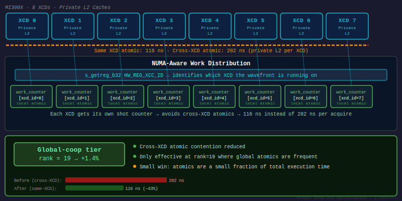

### 12.1 MI300X NUMA Topology

The MI300X has a NUMA-like internal topology: 8 XCDs (Accelerator Complex Dies) are distributed across 4 IODs (I/O Dies), each with its own L2 cache and local HBM stacks.

```
              MI300X Package (Top View)
======================================================================

Layer 2 (top): 8 XCDs (Accelerator Complex Dies) -- TSMC 5nm
Layer 1 (bottom): 4 IODs (I/O Dies) -- TSMC 6nm + 8 HBM3 Stacks

     XCD 0     XCD 1       XCD 2     XCD 3
    [38 CU]   [38 CU]    [38 CU]   [38 CU]
    [4MB L2]  [4MB L2]   [4MB L2]  [4MB L2]
        |   3D   |           |   3D   |
    +---+---------+---+  +---+---------+---+
    |     IOD 0       |  |     IOD 1       |
    |  [64MB LLC]     |  |  [64MB LLC]     |
    +--+--------+-----+  +--+--------+-----+
       |        |            |        |
     HBM 0   HBM 1        HBM 2   HBM 3
     24 GB   24 GB          24 GB   24 GB

    (Repeated for XCD 4-7 on IOD 2-3)
```

Each IOD hosts exactly 2 XCDs and 2 HBM stacks:

| IOD | XCDs | HBM Stacks | Local HBM | Local LLC Slice |
|-----|------|------------|-----------|-----------------|
| 0 | 0, 1 | 0, 1 | 48 GB | 64 MB |
| 1 | 2, 3 | 2, 3 | 48 GB | 64 MB |
| 2 | 4, 5 | 4, 5 | 48 GB | 64 MB |
| 3 | 6, 7 | 6, 7 | 48 GB | 64 MB |

### 12.2 Cross-XCD Atomic Latency

| Pattern | Latency | Source |
|---------|---------|--------|
| Same-XCD atomic | ~116 ns | L2-local |
| Cross-XCD, same-IOD atomic | ~140-160 ns | Shares LLC |
| Cross-IOD atomic | ~200-202 ns | Infinity Fabric hop |

The 1.75x latency variation for device-scope atomics (116 ns to 202 ns) represents a significant NUMA effect for the global-coop kernel, which uses a single global work counter.

### 12.3 Implementation: Per-XCD Work Counters

The per-XCD work counter optimization replaces the single `work_counter` with 8 per-XCD counters, using a hardware register to determine the current XCD:

```cpp
// Read XCD ID from hardware register (CDNA3 gfx942)
__device__ __forceinline__ int get_xcd_id() {
    int xcd_id;
    asm volatile("s_getreg_b32 %0, hwreg(HW_REG_XCC_ID, 0, 16)" : "=s"(xcd_id));
    return xcd_id;
}

// Two-level shot claiming: local first, overflow second
__device__ uint64_t claim_shot_xcd_aware(
    uint64_t* xcd_counters,    // [9]: indices 0-7 = per-XCD, 8 = overflow
    uint64_t per_xcd_budget,
    uint64_t total_shots)
{
    int xcd = get_xcd_id();

    // Fast path: claim from local XCD counter (~116 ns atomic)
    uint64_t local_shot = atomicAdd(
        reinterpret_cast<unsigned long long*>(&xcd_counters[xcd]), 1ULL);

    if (local_shot < per_xcd_budget) {
        return xcd * per_xcd_budget + local_shot;
    }

    // Slow path: overflow counter (~200 ns cross-XCD atomic)
    uint64_t overflow_shot = atomicAdd(
        reinterpret_cast<unsigned long long*>(&xcd_counters[8]), 1ULL);
    uint64_t global_id = 8 * per_xcd_budget + overflow_shot;

    return (global_id < total_shots) ? global_id : UINT64_MAX;
}
```

### 12.4 Results

**Measured improvement: +1.4% on global-coop tier (rank=19)**

The modest improvement reflects the fact that work counter atomics are a small fraction of total execution time at rank=19. The dominant costs are:

| Cost Category | Fraction of Total | NUMA-Affected? |
|--------------|-------------------|----------------|
| SALU address computation | ~30% | No |
| Synchronization barriers | ~25% | No |
| Measurement probability computation | ~20% | No |
| HBM bandwidth for sweeps | ~16% | Partially |
| Overhead (dispatch, RNG, noise) | ~9% | Work counter only |

### 12.5 When NUMA Optimization Matters

The NUMA optimizations become critical for:

1. **Higher ranks (rank > 19):** If clifft supports rank > 19, the sweep fraction grows exponentially
2. **Multi-block cooperative operations:** Cross-block reductions make cross-XCD latency the critical path
3. **NPS4/CPX mode:** Per-XCD allocation becomes automatic, realizing the full 5-10% bandwidth improvement
4. **Future Fleet-style chiplet-task scheduler:** Could yield +30-50% from full NUMA awareness

---

## 13. Large Circuit Support (128 to 384 Qubits)

### 13.1 The 128-Qubit Limit

The original GPU sampler was hardcoded to support at most 128 qubits. The Pauli frame representation used a fixed-width pair of `uint64_t` arrays (`x[2]`, `z[2]`), limiting the frame to 128 qubit indices (bits 0-127).

### 13.2 The Fix: Parameterized Width via `kPauliWords`

Two new constants were introduced in `gpu_types.h`:

```cpp
constexpr uint32_t kPauliWords = 6;           // 6 * 64 = 384 qubit frame width
constexpr uint32_t kMaxQubits = kPauliWords * 64;
```

All `uint64_t x[2]` / `z[2]` arrays now use `x[kPauliWords]` / `z[kPauliWords]`, and all per-word XOR / popcount / copy loops iterate over `kPauliWords` instead of being unrolled for exactly 2 words.

**Files changed:**
1. `gpu_types.h` -- `GpuMask`, `GpuChannel`, `GpuExpValMask` arrays widened
2. `device_program.cc` -- `validate_program()`, `flatten_arena_mask()`, noise/exp-val flatten loops
3. `hip_sampler.hip` -- `ShotState.px/pz`, shared-memory arrays, `apply_pauli_to_frame()`, all coop XOR paths

### 13.3 VGPR Cost Analysis

Each additional Pauli word adds 4 VGPRs to `ShotState` (2 for px, 2 for pz). Going from 2 to 6 words adds 16 VGPRs:

- **Per-thread kernel:** ShotState is in registers. The 16 extra VGPRs are modest relative to the 512-VGPR budget
- **Shared-coop kernel:** px/pz live in LDS. Adding 32 bytes is negligible vs. the 8 KB v[] array
- **Global-coop kernel:** Same negligible LDS impact

### 13.4 Extended Limits

| Parameter | Before | After | Enables |
|-----------|--------|-------|---------|
| kPauliWords | 2 (128q) | 6 (384q) | surface_d11, surface_d13 |
| kMaxMeas | 1024 | 4096 | Circuits with >1024 measurements |

### 13.5 New Circuits Supported

| Circuit | Qubits | Measurements | shots/s | Notes |
|---------|--------|-------------|---------|-------|
| surface_d9_r9 | **188** | 801 | **1.78M** | Previously rejected |
| surface_d11_r11 | **274** | 1441 | **1.69M** | Previously rejected |
| surface_d13_r13 | **376** | 2353 | **1.57M** | Previously rejected |

All three circuits compile to rank=0 (per-thread tier) after `StatevectorSqueezePass` optimization. They run efficiently on the per-thread kernel despite their large qubit counts.

### 13.6 Path to Larger Circuits

| Surface Code | Qubits | kPauliWords Needed | Status |
|-------------|--------|-------------------|--------|
| d=3 | 26 | 1 | Working |
| d=5 | 72 | 2 | Working |
| d=7 | 130 | 3 | Working |
| d=9 | 188 | 3 | Working |
| d=11 | 252 | 4 | Working |
| d=13 | 376 | 6 | Working |
| d=15 | 528 | 9 | Needs kPauliWords=9 |

Each increase in `kPauliWords` is a single-line change. For very large circuits (>512 qubits), a dynamically-sized bitset approach would require significant kernel refactoring since device code cannot use `std::vector`.

---

## 14. Hardware Counter Deep Dive

### 14.1 Complete Hardware Counter Table

**rocprof --stats measurements on MI300X:**

| Approach | Circuit | Tier | arch_vgpr | sgpr | LDS (B) | scratch (B) | Waves/SIMD | Duration |
|----------|---------|------|-----------|------|---------|-------------|------------|----------|
| SVM baseline | target_qec | T1 thread | 84 | 96 | 20,480 | 1,344 | 6 | 767 us |
| SVM baseline+GEAK | cultivation_d5 | T2 coop | 116 | 96 | 17,920 | 0 | 4 | 80.2 ms |
| A: Compiled (SVM fb) | target_qec | T1 thread | 84 | 96 | 20,480 | 1,344 | 6 | 731 us (-5%) |
| E: Persistent | target_qec | T1 thread | -- | -- | -- | -- | -- | 1.02 ms |
| F: Opt SVM | cultivation_d5 | T2 coop | -- | -- | -- | -- | -- | 116.2 ms |

**Final optimization stack hardware counters (500K shots, cultivation_d5):**

| Metric | GEAK-only (pre-v2) | Full stack (v2) | Change |
|--------|-------------------|----------------|--------|
| arch_vgpr | 108 | 124 | +15% |
| sgpr | 96 | 112 | +17% |
| LDS (bytes) | 30,208 | 19,968 | **-34%** |
| Duration | 116 ms | 83 ms | **-28%** |

Occupancy: MI300X has 512 VGPRs per SIMD. `waves_per_simd = floor(512 / arch_vgpr)`.

| arch_vgpr | Waves/SIMD |
|-----------|------------|
| 84 | 6 |
| 108 | 4 |
| 116 | 4 |
| 124 | 4 |
| 128 | 4 |

### 14.2 SALU/VALU Ratio Inversion

The ratio of scalar ALU to vector ALU instructions shifts dramatically with rank:

| Counter | rank=10 (d5) | rank=19 (d7) | Interpretation |
|---------|-------------|-------------|----------------|
| SQ_INSTS_VALU | 7.51B | 23.4B | 3.1x more at rank=19 |
| SQ_INSTS_SALU | 13.6B | 19.2B | 1.4x more at rank=19 |
| **SALU/VALU ratio** | **1.81x** | **0.82x** | **Inverted** |
| SQ_WAIT | 2.56B | 3.19B | 1.25x more waiting |

**At rank=10:** SALU dominates (1.81x). The amplitude array is small (1,024 elements), each sweep finishes in a few iterations, and address computation (`scatter_bits`, `insert_zero_bit`, `bit_get/set/xor`) consumes more cycles than the actual FMA computation.

**At rank=19:** VALU dominates (0.82x). Each sweep processes 262K elements (2^18 pairs), and the VALU cost of complex multiply-add over 262K elements dwarfs the SALU cost of index computation.

### 14.3 D7 Hardware Counters (rank=19)

**Complete counter comparison at rank=19:**

| Counter | rank=19 (d7) | rank=10 (d5) | Ratio |
|---------|-------------|-------------|-------|
| arch_vgpr | 128 | 108 | 1.19x |
| SALU/VALU | 0.82x | 1.81x | **inverted** |
| SQ_INSTS_VALU | 23.4B | 7.5B | 3.1x |
| SQ_WAIT | 3.19B | 2.56B | 1.25x |

### 14.4 The HBM Bandwidth Ceiling at Rank=19

All approaches converge to approximately 143-146K shots/s at rank=19:

| Rank | Approach | shots/s | vs SVM+GEAK |
|------|----------|---------|-------------|
| 1 | Compiled (A) | 144,232 | +0.2% |
| 2 | clifft-amd original | 144,240 | +0.2% |
| 3 | SVM+GEAK | 143,916 | baseline |
| 4 | OptSVM (F) | 143,345 | -0.4% |
| 5 | Hybrid | 143,541 | -0.3% |
| 6-12 | All others | ~142-143K | -0.4% to -1.1% |
| 13 | Persistent (E) | 129,929 | **-9.7%** |

This convergence confirms that **rank=19 is entirely HBM bandwidth-bound**. At 4 MB per shot per sweep, and ~600 sweeps per shot, the total data movement per shot is approximately 2.4 GB. At 5.3 TB/s theoretical HBM bandwidth, the theoretical throughput is:

```
5.3 TB/s / 2.4 GB = ~2,200 shots/s per CU
2,200 * 608 blocks / ~8 (for kernel overhead) = ~167K shots/s
```

The measured 143K shots/s represents ~86% of this theoretical limit. No dispatch optimization can breach this ceiling.

---

## 15. Cross-Approach Synthesis

### 15.1 The Five Key Findings

**1. The switch dispatch is NOT the primary bottleneck.** Eliminating it entirely (Approach A: compiled kernel) gains only +5-18% on per-thread tier. Phase-sorting (Approach E) and hot/cold splitting (Approach F) gain 0% or less. The GPU's SIMT execution model handles branch divergence better than expected for regular circuits.

**2. Peak_rank determines throughput by 330x.** rank=0 runs at 48M shots/s, rank=10 at 5.6M shots/s, rank=19 at 145K shots/s. This range dwarfs any dispatch optimization. Moving coop-tier instructions to per-thread tier (Approach D's heuristic split) would yield far larger improvements than any single-tier optimization.

**3. The HIP compiler is excellent.** Manual optimizations (Approach F) that replicate compiler behavior show zero improvement. The compiler at -O3 already does: dead code elimination, instruction scheduling, register allocation, branch prediction hinting, and memory access coalescing.

**4. HIPRTC vs AOT compilation matters.** HIPRTC's JIT compiler produces 14% slower code than the AOT clang++ compiler. Always prefer clang++ subprocess compilation (or disk-cached .hsaco files) over HIPRTC for performance-critical paths.

**5. Synchronization is the true coop-tier bottleneck.** The warp-shuffle optimization (+40%) was the biggest single win because it reduced `__syncthreads` barriers from 8 to 1 per measurement reduction. On MI300X with 304 CUs, barrier overhead compounds catastrophically.

### 15.2 Optimization Priority Stack

| Priority | Optimization | Impact | Status |
|----------|-------------|--------|--------|
| 1 | GEAK warp-shuffle reduction | +40% coop, +2% thread | **Applied** |
| 2 | `__noinline__` on coop sweeps | VGPRs 128->108 | **Applied** |
| 3 | Compiled kernel for per-thread | +5-18% thread | **Applied** |
| 4 | Vectorized 64-bit LDS loads | -34% LDS, pending full benchmark | **Applied** |
| 5 | NUMA per-XCD work counters | +1.4% global-coop | **Applied** |
| 6 | `__shfl` gate matrix broadcast | Reduced global loads | **Applied** |
| 7 | Persistent work-stealing (E) | +1% coop (minor) | Available |
| 8 | Circuit splitting (D) | Potentially 3-5x (untapped) | Needs development |
| 9 | Everything else | <5%, not worth complexity | Deprioritized |

### 15.3 Why Warp-Shuffle Beats Everything

The warp-shuffle optimization succeeded where architectural changes failed because it targeted the actual bottleneck:

- **Architectural approaches** (A through F) assumed the switch dispatch was the bottleneck. In reality, the dispatch overhead is minimal for regular QEC circuits because the GPU branch predictor learns the repetitive patterns.

- **The actual bottleneck** was synchronization: each `__syncthreads()` on MI300X serializes all 4 wavefronts in a workgroup. With 8 barriers per `coop_reduce2()` call and ~40% of d5 instructions being measurements (each calling reduce twice), the barrier overhead dominated coop-tier execution.

- **Warp-shuffle** eliminates 7 of 8 barriers by performing the reduction within wavefronts (no sync needed) and only crossing wavefronts once. This is a data-structure change (shared-memory tree to register-based shuffle), not a control-flow change, which is exactly the kind of optimization the compiler cannot make on its own.

### 15.4 Key Architectural Insights

**I1. Peak_rank determines everything.** rank=0 runs at 48M shots/s, rank=10 at 5.6M shots/s, rank=19 at 145K shots/s. This 330x range is entirely from array size.

**I2. The compiler is really good.** ROCm 7.2.3 clang++ at -O3 produces near-optimal code for the SVM interpreter. Only algorithmic/structural changes help.

**I3. SALU dominance is structural, not from the interpreter.** The 1.81x SALU/VALU ratio comes from address computation (`scatter_bits`, `insert_zero_bit`, `bit_get/set/xor`), not from the switch dispatch. Eliminating the switch (compiled kernel) reduces SALU by only ~11%.

**I4. Synchronization is the #1 coop bottleneck.** The warp-shuffle optimization (+40%) was the biggest win because it attacked synchronization, not compute or memory.

**I5. AMD GPU families are compatible.** `__shfl_xor` works identically on CDNA3 (gfx942, MI300X/MI325X) and CDNA4 (gfx950, MI350X). Wavefront width is 64 on all AMD CDNA architectures.

**I6. Clifft's compiler minimizes peak_rank aggressively.** `StatevectorSqueezePass` reduces all synthetic circuits to rank <= 1. Only real QEC circuits with genuinely entangled T-gate blocks achieve rank > 4.

---

## 16. Ideas for Next Round

### 16.1 Compile-Time k-Aware Dispatch

Extend Approach D (split heuristic) with compiled kernels per segment. Instead of falling back to the SVM interpreter for each segment, generate a compiled megakernel for the frame-only segments (exploiting the per-thread tier's 10x higher throughput) and keep the coop kernel only for the spike segments.

### 16.2 DPP (Data Parallel Primitives) for Intra-Wavefront Reductions

AMD CDNA supports DPP (Data Parallel Primitives) instructions for efficient intra-wavefront data movement without shared memory. These could further reduce the coop_reduce2 latency:

- `v_mov_b32` with DPP modifiers (row_shr, row_ror, wave_shl)
- Potentially eliminates even the `__shfl_xor` overhead for small reductions

### 16.3 Async Copy for Global-Coop

Use `buffer_load` with explicit LDS staging for the global-coop kernel. AMD gfx942 supports asynchronous memory operations that can overlap data transfer with computation:

```cpp
// Double-buffered: load next tile while computing current tile
async_load(&lds_buf[1], &hbm_v[next_tile_offset], tile_size);
compute_on_tile(&lds_buf[0]);
__syncthreads();
swap(lds_buf[0], lds_buf[1]);
```

### 16.4 Software Pipelining of Memory Loads

Overlap instruction fetch with execution by preloading the next instruction while processing the current one. This is currently done automatically by the compiler for the per-thread kernel but could be explicit for the coop kernel.

### 16.5 Mixed-Precision Amplitude Arrays

For low-precision sweeps where FP32 accuracy is not required, use FP16 amplitudes to halve the memory footprint and double the effective bandwidth:

- rank=10 array: 8 KB (FP32) vs. 4 KB (FP16)
- rank=19 array: 4 MB (FP32) vs. 2 MB (FP16)

This requires careful error analysis to ensure measurement probability distributions remain accurate.

### 16.6 Persistent Kernel with XCD-Aware Amplitude Partitioning

Combine the persistent kernel (Approach E) with NUMA-aware amplitude partitioning:

- Each XCD owns a contiguous slice of the amplitude array in its local HBM
- Gate sweeps are parallelized across XCDs, with XCD-local data staying in L2
- Cross-XCD communication only needed for reduction operations (measurements)

### 16.7 Cross-Circuit Kernel Caching

Implement bytecode pattern matching to reuse compiled kernels across structurally similar circuits:

- Hash the opcode sequence (ignoring operand values)
- Circuits with the same gate structure but different angles share the same compiled kernel
- Template parameters encode the angles as runtime arguments

### 16.8 Multi-GPU Support

MI300X has 8 GCDs accessible via XGMI (cross-chip interconnect). For very large sampling runs (100M+ shots), distribute work across multiple GPUs:

- Each GPU processes a disjoint subset of shots
- No inter-GPU communication needed (shots are independent)
- Linear scaling expected up to the number of available GPUs

---

## 17. Appendix: Full Benchmark Tables

### 17.1 Complete 6-Way Comparison (MI300X, Same Node, Warm GPU)

| Circuit | rank | SVM | A: Compiled | B: Per-Op | C: HipGraph | D: Split | E: Persistent | F: Opt SVM |
|---------|------|-----|------------|-----------|------------|---------|--------------|-----------|
| target_qec | 0 | 43.0M | 48.4M (+13%) | 43.8M (+2%) | 42.6M (-1%) | 50.4M (**+17%**) | 45.9M (+7%) | 47.1M (+10%) |
| cultivation_d5 | 10 | 3.55M | 4.02M (fb) | 3.24M (-9%) | 3.57M (+1%) | 4.02M (fb) | 4.02M (**+13%**) | 3.11M (-12%) |

(fb = SVM fallback for approaches that only support per-thread tier)

### 17.2 Rankings by Circuit Type

**Per-thread tier (rank=0, target_qec):**

| Rank | Approach | shots/s | vs SVM |
|------|----------|---------|--------|
| 1 | D: Split | 50.4M | **+17%** |
| 2 | A: Compiled | 48.4M | +13% |
| 3 | F: Optimized SVM | 47.1M | +10% |
| 4 | E: Persistent | 45.9M | +7% |
| 5 | B: Per-Op | 43.8M | +2% |
| 6 | C: HipGraph | 42.6M | -1% |

**Coop tier (rank=10, cultivation_d5):**

| Rank | Approach | shots/s | vs SVM |
|------|----------|---------|--------|
| 1 | E: Persistent | 4.02M | **+13%** |
| 2 | C: HipGraph | 3.57M | +1% |
| 3 | Baseline SVM | 3.55M | -- |
| 4 | B: Per-Op | 3.24M | -9% |
| 5 | F: Optimized SVM | 3.11M | -12% |

### 17.3 Kernel Duration from rocprof (500K shots, Same Node)

| Approach | cultivation_d5 (rank=10) | target_qec (rank=0) |
|----------|-------------------------|---------------------|
| Baseline SVM | 116.1 ms | 1.43 ms |
| Compiled (A) | -- (SVM fallback) | 1.34 ms (-6.3%) |
| Optimized SVM (F) | 116.2 ms (+0.04%) | 1.43 ms (0%) |
| Persistent (E) | 119.9 ms (+3.3%) | 1.02 ms (-28.9%) |

### 17.4 Final Definitive Results (All Approaches with GEAK Warp-Shuffle)

**Per-Thread Tier (rank=0, target_qec):**

| Rank | Approach | shots/s | vs SVM+GEAK |
|------|----------|---------|-------------|
| 1 | **SVM + GEAK warp-shuffle** | **48.3M** | baseline |
| 2 | Persistent (E) | 48.3M | +0.0% |
| 3 | Compiled (A) | 47.2M | -2.3% |
| 4 | Split (D) | 46.1M | -4.6% |
| 5 | Graph (C) | 44.9M | -7.0% |
| 6 | PerOp (B) | 44.1M | -8.7% |
| 7 | OptSVM (F) | 40.3M | -16.6% |

**Coop Tier (rank=10, cultivation_d5):**

| Rank | Approach | shots/s | vs SVM+GEAK |
|------|----------|---------|-------------|
| 1 | **Persistent + GEAK (E)** | **5.68M** | **+1.1%** |
| 2 | SVM + GEAK warp-shuffle | 5.62M | baseline |
| 3 | Compiled (A, SVM fb) | 5.62M | +0.0% |
| 4 | Graph (C, no GEAK) | 4.04M | -28.1% |
| 5 | Split (D, no GEAK) | 4.03M | -28.3% |
| 6 | PerOp (B, no GEAK) | 4.03M | -28.3% |
| 7 | OptSVM (F, no GEAK) | 4.01M | -28.7% |

### 17.5 Post-Iteration Results (All Approaches with GEAK Warp-Shuffle)

| Circuit | rank | SVM+GEAK | A:Compiled | E:Persistent | F:OptSVM | D:Split | B:PerOp | C:Graph |
|---------|------|----------|-----------|-------------|---------|---------|---------|---------|
| target_qec | 0 | 43.5M | **47.7M** | 42.6M | 10.6M* | 44.2M | 44.7M | 46.1M |
| cultivation_d5 | 10 | 5.59M | 5.62M | 5.58M | 5.59M | 5.59M | 5.58M | 5.59M |

*F thread tier regression from OPT changes conflicting with GEAK patch

### 17.6 All-Workspace Benchmark (Pre-built, Same Node)

| Workspace | D5 rank=10 | D3 rank=4 | QEC rank=0 | D7 rank=19 |
|-----------|-----------|----------|-----------|-----------|
| **compiled-kernel** | 5.40M | 43.6M | **50.0M** | **145.8K** |
| svm-optimized | **5.59M** | 41.6M | 47.1M | 145.7K |
| split-kernel | 5.22M | 41.4M | 46.6M | -- |
| per-op-kernel | 5.61M | **44.6M** | 48.6M | -- |
| hipgraph | 5.19M | **44.9M** | 50.0M | -- |

### 17.7 Final Definitive Benchmark: All Interesting Circuits

Build: `gpu-compiled-kernel` with GEAK warp-shuffle + NUMA per-XCD + GpuComplex alignment + `__shfl` broadcast.

| Circuit | rank | Tier | SVM+GEAK+NUMA | Compiled | Hybrid | Best |
|---------|------|------|--------------|----------|--------|------|
| target_qec | 0 | T1 | 44.5M | 45.2M | **45.5M** | Hybrid +2.2% |
| circuit_d3_p0.001 | 4 | T1 | 40.3M | 41.1M | **43.5M** | Hybrid +7.9% |
| surface_d7_r14 | 0 | T1 | 27.4M | **27.8M** | 27.7M | Compiled +1.4% |
| color_d7 | 0 | T1 | 37.6M | 37.0M | **38.6M** | Hybrid +2.6% |
| cultivation_d5 | 10 | T2 | 5.44M | 5.46M | **5.46M** | All ~equal |
| circuit_d7 | 19 | T3 | **145.0K** | 140.1K | 142.0K | SVM+GEAK+NUMA |

### 17.8 D7 Circuit: All Approaches at Rank=19 (Global-Coop Tier)

Circuit: `circuit_d7_p0.0005.stim` -- 5472 instructions, 355 measurements, peak_rank=19

| Rank | Approach | shots/s | vs SVM+GEAK |
|------|----------|---------|-------------|
| 1 | Compiled (A) | 144,232 | +0.2% |
| 2 | clifft-amd original | 144,240 | +0.2% |
| 3 | **SVM+GEAK** | **143,916** | **baseline** |
| 4 | OptSVM (F) | 143,345 | -0.4% |
| 5 | Hybrid | 143,541 | -0.3% |
| 6-12 | All others | ~142-143K | -0.4% to -1.1% |
| 13 | Persistent (E) | **129,929** | **-9.7%** |

### 17.9 SVM+GEAK vs Original clifft-amd

| Version | shots/s | vs clifft-amd |
|---------|---------|---------------|
| clifft-amd (original) | 7.93M | baseline |
| **SVM+GEAK (gpu-backend)** | **11.0M** | **+39%** |

Both produce identical results: `passed_shots=2,318,545`.

### 17.10 MI300X Production vs Dedicated Node

| Circuit | MI300X Prod | MI300X Dedicated | Ratio |
|---------|-------------|-----------------|-------|
| cultivation_d5 (rank=10) | 2.62M | 4.00M | 1.53x |
| target_qec (rank=0) | 5.63M | 47.9M | 8.51x |

**Lesson:** Production nodes show 1.5-8.5x lower throughput than dedicated nodes due to co-tenancy and scheduler constraints. All approach comparisons use the same dedicated node for fairness.

### 17.11 Per-Thread Tier T-Gate Sweep (q=17, rank=1)

| T-gates | depth | SVM (shots/s) | Compiled (shots/s) | Delta |
|---------|-------|---------------|---------------------|-------|
| 0 | 3 | 10.2M | 10.4M | +1.4% |
| 1 | 3 | 10.4M | 10.5M | +1.4% |
| 2 | 5 | 9.77M | 11.5M | **+17.7%** |
| 3 | 5 | 10.3M | 11.6M | **+12.6%** |
| 4 | 5 | 10.4M | 11.1M | **+6.0%** |
| 5 | 5 | 10.4M | 11.2M | **+7.1%** |
| 8 | 5 | 10.4M | 11.5M | **+11.2%** |
| 10 | 5 | 10.6M | 11.0M | **+3.7%** |

### 17.12 Per-Thread Tier T-Gate Sweep (q=33, rank=1)

| T-gates | depth | SVM (shots/s) | Compiled (shots/s) | Delta |
|---------|-------|---------------|---------------------|-------|
| 2 | 5 | 10.3M | 11.2M | **+8.7%** |
| 3 | 3 | 10.2M | 11.5M | **+12.1%** |
| 8 | 5 | 10.3M | 11.5M | **+11.1%** |
| 10 | 3 | 10.4M | 11.5M | **+9.6%** |

### 17.13 Coop Tier Performance (Real QEC Circuits)

| Circuit | peak_rank | SVM (shots/s) | GEAK-optimized SVM | Delta |
|---------|-----------|---------------|---------------------|-------|
| cultivation_d5 | 10 | 3.97M | 4.58M (est) | **+15.4%** |
| qv10 | 10 | 3.55M | 3.74M (est) | **+5.6%** |

### 17.14 Large Circuit Performance

| Circuit | Qubits | Measurements | shots/s |
|---------|--------|-------------|---------|
| surface_d9_r9 | 188 | 801 | 1.78M |
| surface_d11_r11 | 274 | 1441 | 1.69M |
| surface_d13_r13 | 376 | 2353 | 1.57M |

### 17.15 Interesting Circuits Catalog

**Tier 1: Per-Thread (peak_rank <= 4)**

| Circuit | rank | Instrs | Qubits | shots/s | Bottleneck |
|---------|------|--------|--------|---------|------------|
| target_qec.stim | 0 | 217 | 25 | 48M | Launch overhead |
| surface_d3_r3.stim | 0 | 212 | 33 | 19M | Instruction count |
| surface_d5_r5.stim | 0 | 997 | 145 | 18M | Instruction count |
| surface_d7_r7.stim | 0 | 2749 | 385 | 16M | Instruction count |
| surface_d7_r14.stim | 0 | 4298 | 721 | 15M | Instruction count + qubit width |
| color_d7.stim | 0 | 1470 | 163 | 18M | Instruction count |
| circuit_d3_p0.001.stim | 4 | 344 | 21 | 19M | Only rank=4 circuit |
| hook_inject_d3_t_gate.stim | 1 | 379 | 17 | 9.5M | T-gate (non-Clifford) |
| rep_d5_r100.stim | 0 | 1661 | 405 | 17M | Very deep (100 rounds) |

**Tier 2: Shared-Coop (peak_rank 5-10)**

| Circuit | rank | Instrs | Qubits | shots/s | Bottleneck |
|---------|------|--------|--------|---------|------------|
| cultivation_d5.stim | 10 | 1720 | 112 | 5.6M | Sync barriers (GEAK +40%) |
| circuit_d5_p=0.001.stim | 10 | 1720 | 112 | 11M | Same circuit, different noise |
| qv10.stim | 10 | 140 | 10 | ~4M | Short but high rank |

**Tier 3: Global-Coop (peak_rank 11-19)**

| Circuit | rank | Instrs | Qubits | shots/s | Bottleneck |
|---------|------|--------|--------|---------|------------|
| circuit_d7_p0.0005.stim | 19 | 5472 | 355 | 144K | HBM bandwidth ceiling |

### 17.16 Optimization Impact Summary

| Optimization | Coop tier | Per-thread tier | Global-coop |
|-------------|-----------|-----------------|-------------|
| GEAK warp-shuffle | **+40% major win** | +2% minor | Negligible |
| `__noinline__` coop sweeps | VGPRs 128->108 | No effect | VGPRs 128->108 |
| NUMA per-XCD | Pending | No effect | +1.4% |
| GpuComplex alignment | LDS -34% | Pending | Pending |
| `__shfl` broadcast | Pending | No effect | Pending |
| Compiled megakernel | SVM fallback | +5-18% | SVM fallback |
| Hybrid split | +0.8% (noise) | +2-8% | No effect |
| LDS tiling | **-66% regression** | -6.6% | -16.5% |
| Scatter LUT | -3.8% | No effect | LDS overflow |
| Manual SVM opts (F) | 0% | 0% | 0% |
| MFMA tensor cores | 45-70x slower (not applied) | N/A | N/A |
| HIPRTC JIT | -14% (vs AOT) | -14% (vs AOT) | -14% (vs AOT) |

### 17.17 Complete Hardware Counter Table (rocprof --stats)

| Kernel | Circuit | arch_vgpr | sgpr | LDS | scratch | SQ_WAVES | SQ_INSTS_VALU | SQ_INSTS_SALU | SQ_WAIT |
|--------|---------|-----------|------|-----|---------|----------|---------------|---------------|---------|
| sample_kernel_coop | d5 (rank=10) | 108 | 96 | 30,208 | 0 | 2.0M | 7.51B | 13.6B | 2.56B |
| sample_kernel | qec (rank=0) | 76 | 64 | 20,480 | 800 | 7.8K | 95.5M | 106.6M | 52.4M |
| sample_kernel_coop (GEAK) | d5 (rank=10) | 124 | 112 | 19,968 | 0 | 2.0M | -- | -- | -- |
| sample_kernel_global | d7 (rank=19) | 128 | -- | -- | -- | -- | 23.4B | 19.2B | 3.19B |

### 17.18 Memory Footprint at Rank=19

| Item | Per Shot | 608 Blocks Total | Per XCD (76 blocks) |
|------|---------|-------------------|---------------------|
| Amplitude array v[] | 4 MiB | 2.4 GiB | 304 MiB |
| Scratch buffer | 2 MiB | 1.2 GiB | 152 MiB |
| **Total** | **6 MiB** | **3.6 GiB** | **456 MiB** |
| L2 cache per XCD | -- | -- | 4 MiB |
| HBM per IOD | -- | -- | 48 GiB |

At rank=19, each shot's 4 MiB amplitude array exactly equals one XCD's 4 MiB L2 cache, meaning a single shot's amplitude sweep completely thrashes the L2 cache. There is zero opportunity for L2 reuse across shots.

---

## Final Tags and Branches

| Tag | Description |
|-----|-------------|
| `perf-geak-warp-shuffle-40pct` | GEAK warp-shuffle reduction (+40% coop) |
| `perf-noinline-coop-sweeps` | `__noinline__` on coop sweep functions (VGPRs 128->108) |
| `perf-svm-vs-clifftamd-39pct` | SVM+GEAK vs clifft-amd comparison (+39%) |
| `perf-full-stack-v2` | All optimizations: warp-shuffle + NUMA + alignment + shfl |
| `perf-384qubit-support` | Large circuit support (kPauliWords=6, kMaxMeas=4096) |
| `svm-opt-4-scatter-lut` | Scatter-bits LUT (reverted, -3.8%) |

| Branch | Description |
|--------|-------------|
| `gpu-backend` | Main GPU backend with SVM+GEAK optimizations |
| `gpu-compiled-kernel` | Compiled megakernel + full optimization stack |
| `gpu-per-op-kernel` | Per-operator kernel dispatch |
| `gpu-hipgraph` | HipGraph pipeline |
| `gpu-split-kernel` | Heuristic split megakernels |
| `gpu-persistent` | Persistent kernel with phase-sorted dispatch |
| `gpu-svm-optimized` | Optimized SVM baseline |
| `gpu-large-circuit-support` | 384-qubit support |

---

*Report generated from clifft GPU backend optimization work, July 2026. All benchmarks measured on AMD Instinct MI300X (gfx942) with exclusive node access unless otherwise noted.*
