# From Interpreter to Specializer

## The clifft GPU Backend: SVM, Hybrid, MLIR V1, and the V2 Rebuild

**A comprehensive technical report**

| | |
|---|---|
| Hardware | AMD Instinct MI350X (`gfx950`), `mi350x-es` partition — **node varies by run, see below** |
| Software | ROCm 7.2.3, LLVM `upstream_05082025` |
| Repository | `unitaryfoundation/clifft`, branch `mlir-v2` |
| Benchmark corpus | 26 circuits — see the provenance notice below |
| Fact ledger | `V2_performance/VERIFIED_FACTS.md` |
| Date | 2026-07-27 |

> ### ⚠ Provenance of the performance numbers
>
> The timing figures quoted in §1–§10 come from
> `20260726T182433Z_report-final-postdust` (SLURM 50469), which was **later
> invalidated**: a cache-key bug (§11.4) caused the specializer to serve
> pre-fence, pre-dust-fix binaries under post-fix cache keys. The bug is fixed
> (`009df59`) and the run is retracted in `VERIFIED_FACTS §0`.
>
> A second run, `20260726T014859Z_all-tier5plus`, reproduces every ratio to
> within 0.4 %. That is a **reproducibility** check only — it is at commit
> `89d541e`, which is also pre-fence, so both runs executed the same binaries.
>
> **§15 carries the post-fix full-corpus re-run and is authoritative.** Where
> §1–§10 and §15 disagree, §15 wins. Each affected table is individually marked;
> tables that are provably unaffected (resource footprints, IR density, source
> counts) say so and explain why.
>
> This notice exists because the report's own rule demands it: *trust data, not
> text* applies to the report's own numbers first.
>
> **Which node.** `mi350x-es` is heterogeneous, so "MI350X" is not a sufficient
> provenance statement and this table deliberately does not give one node. The
> authoritative run — job 50793, §15 — ran on `smci350-rck-g03-d13-21`, recorded
> in `V2_performance/runs/20260727T125310Z_report-final-allfixtures/node.json`.
> Runs on `smci350-rck-g03-f13-21` appear in §9.6 (columns 9–12, job varies) and
> §12.3 (job 50444), and are marked where they appear. §13's dispatch benchmark
> is on `d13-21` (job 50507). **Ratios are never compared across
> the two.** An earlier version of this header named `f13-21` as *the* hardware,
> which was wrong: the corpus every headline number resolves to ran on `d13-21`.

---

## A note on method, before anything else

This report has an unusual constraint imposed on it: **trust data, not text.**

The `clifft` tree contains a large amount of prose — design documents, plans,
post-mortems, header comments — written across several months by several
authors (human and otherwise). Much of it is accurate. Some of it is stale, and
a smaller amount of it is simply wrong, having been written from a hypothesis
that later measurement refuted but that nobody went back to delete.

Every claim in this report was therefore re-derived from an artifact before
being written down. The rule used was:

> A fact is *verified* only if it can be re-derived from a committed artifact —
> a CSV, a `summary.json`, a SLURM log, an `.hsaco` — or from a file+line in the
> source tree. Prose in a design doc is a *claim*, not a fact.

The audit is committed as `V2_performance/VERIFIED_FACTS.md`, and every section
below cites it. Three findings from that audit are worth stating up front,
because they contradict documents still in the tree:

1. **V2 does not emit MLIR.** It emits C. The directory is still called
   `mlir/v2/` for historical reasons, and that name is the only MLIR left in it.
   (§6.1)
2. **V1 authored zero custom MLIR passes**, and one of the three stock passes it
   ran was a provable no-op. (§5.4)
3. **The one circuit family where V2 loses did not run V2's specializer at all** —
   its specialization failed the correctness gate and fell back to the
   interpreter. An earlier draft of the audit itself got this wrong, and the
   correction is recorded in the ledger's §13. (§11.1)

Where a number could not be re-measured, it is marked **[unverified]** and
attributed rather than asserted. There are two such items, both flagged in place.

---

## Table of contents

| § | Chapter |
|---|---|
| 1 | [Executive summary](#1-executive-summary) |
| 2 | [The SVM: what is actually being simulated](#2-the-svm-what-is-actually-being-simulated) |
| 3 | [The original GPU SVM: one interpreter, three tiers](#3-the-original-gpu-svm-one-interpreter-three-tiers) |
| 4 | [Hybrid: compiling the circuit into HIP, and why it stalled](#4-hybrid-compiling-the-circuit-into-hip-and-why-it-stalled) |
| 5 | [V1: the MLIR backend and its failure](#5-v1-the-mlir-backend-and-its-failure) |
| 6 | [V2: the architecture](#6-v2-the-architecture) |
| 7 | [What V2 specializes — eight classes, eight experiments](#7-what-v2-specializes--eight-classes-eight-experiments) |
| 8 | [Progressive lowering: what the compiler does with it](#8-progressive-lowering-what-the-compiler-does-with-it) |
| 9 | [Optimizations, tier by tier](#9-optimizations-tier-by-tier) |
| 10 | [Extending past rank 19](#10-extending-past-rank-19) |
| 11 | [Pitfalls](#11-pitfalls) |
| 12 | [The gap: f32 vs f64](#12-the-gap-f32-vs-f64-and-how-it-was-narrowed) |
| 13 | [Removing HIP, introducing HSA](#13-removing-hip-introducing-hsa) |
| 14 | [Performance evaluation: V2 vs SVM](#14-performance-evaluation-v2-against-svm) |
| 15 | [Full benchmark report](#15-the-full-benchmark-report) |
| 16 | [Conclusions and open items](#16-conclusions-and-open-items) |

---

## 1. Executive summary

`clifft` simulates near-Clifford quantum circuits by tracking a Pauli frame plus
a small dense statevector. The GPU backend has been rewritten three times. This
report characterizes all four generations and evaluates the newest against the
baseline it must beat.

### 1.1 The four generations

| generation | what it is | per-circuit compile? | device language | verdict |
|---|---|---|---|---|
| **SVM** | bytecode interpreter kernel | no | HIP | the baseline; fast, correct, hard to beat |
| **Hybrid** | per-circuit HIP source, AOT-compiled | yes | HIP | correct and competitive, but HIP-bound and never pulled ahead |
| **MLIR V1** | per-circuit hand-emitted MLIR text | yes | MLIR→LLVM | **failed**: 5–60× slower, 221 s compiles, 20 MB IR |
| **V2** | per-circuit C, specialized operands, runtime loops | yes | C→amdgcn (no HIP) | **1.0–3.9× faster than SVM** on **26 of 26** circuits |

### 1.2 The headline number

Across the 26-circuit corpus, comparing GPU kernel time (not host wall time),
V2 versus the SVM interpreter:

| regime | circuits | V2/SVM ratio | reading |
|---|---|---|---|
| Large surface codes, global tier | 5 | **0.256 – 0.310** | V2 is **3.2–3.9× faster** |
| Mid-size surface + QV10, coop tier | 5 | 0.319 – 0.534 | V2 is **1.9–3.1× faster** |
| Register tier (`four_t`, `frame_h`, `circuit_d3`, `surface_d7_t5`) | 4 | 0.509 – 0.742 | V2 is **1.3–2.0× faster** |
| `circuit_d5` + `cultivation_d5`, coop tier | 6 | 0.786 – 0.856 | V2 is **1.2–1.3× faster** (post-fence, §1.3(d)) |
| Quantum-volume, global tier rank 20–24 | 6 | 0.732 – 0.990 | V2 wins **1–37 %**, shrinking with rank (§10.6) |

**mean 0.626, median 0.670, wins 26/26** — all 26 circuits, both backends, one
job (50793), one node (`smci350-rck-g03-d13-21`), zero profiler aborts. Every
circuit dispatches `clifft_v2_spec`; none falls back to the interpreter.

**26 circuits, 26 wins.** The five regimes sum to exactly 26, and membership is
assigned by *measured launch geometry* rather than by circuit name — the census
of §10.5 is precisely the finding that names are unreliable here. (This bit
during the audit: `surface_d7_t5` was filed under the coop band on the strength
of its name, and its measured grid is 79 workgroups — register geometry.)

The geometry is unambiguous. Global-tier kernels launch a **resident pool sized
from the HBM budget** and then work-steal shots; coop-tier kernels launch **one
workgroup per shot**. Reading grid ÷ 256 from the measured runs:

| circuits | workgroups | shape |
|---|---|---|
| `surface_d7/d9/d11_t19`, `surface_d9/d11_t15`, `qv20` (×2) | 2,048 | global pool, capped (`v2_kernel.cc:441`) |
| `qv21` → `qv24` | 1,360 → 680 → 336 → 168 | global pool, **shrinking as rank grows** |
| `circuit_d5` (×5), `surface_d7/d9/d11_t10`, `surface_d7_t15` | 10,000 | coop, = shot count |
| `cultivation_d5`, `qv10` | 20,000 | coop, = shot count |
| `four_t`, `frame_h`, `circuit_d3`, `surface_d7_t5` | 79 | register, = ⌈shots/256⌉ |

The QV row is the §10.2 budget mechanism visible from the outside, and it can be
predicted exactly rather than merely described. Each resident workgroup owns one
amplitude slice plus a half-size scratch — 12 bytes per amplitude — drawn from a
32 GB budget (`v2_kernel.cc:436-446`). Evaluating that formula against the
measured grids:

| rank | bytes/wg | predicted wgs | **measured wgs** |
|---|---|---|---|
| 20 | 12 MB | 2,048 (capped) | **2,048** ✓ |
| 21 | 24 MB | 1,360 | **1,360** ✓ |
| 22 | 48 MB | 680 | **680** ✓ |
| 23 | 96 MB | 336 | **336** ✓ |
| 24 | 192 MB | 168 | **168** ✓ |

Five for five, including the XCD-alignment rounding. So the QV circuits lose
occupancy geometrically as rank climbs — the pool halves with every added qubit
— and that compounds with the register spilling of §10.6. Two independent
mechanisms degrade the same six circuits, which is why their ratios approach 1.0
from a corpus whose median is 0.670.

All 26 are **byte-exact** against the SVM interpreter and against the f64 CPU
reference (modulo the documented f32/f64 branch divergence of §12).

> **Provenance.** The ratios above are job **50793**
> (`20260727T125310Z_report-final-allfixtures`): 26 circuits, both backends,
> one node, commit `79d4463` clean, zero `rocprofv3` aborts. It replaces two
> earlier attempts — a retracted run that dispatched stale kernels (§14.0's
> §0 notice) and job 50785, which ran only 18 of 26 because eight fixture paths
> had gone stale, aborted silently, and reported "wins 18/18" over the
> truncated set. That truncation dropped the six QV circuits, the corpus's
> weakest wins, and pulled the median from 0.670 to 0.518 — a *flattering*
> error produced entirely by missing data. `bench_all.sh:127-135` now aborts
> the run on a missing fixture rather than continuing past it.

### 1.3 The five results this report argues for

**(a) The disease V1 had was unrolling the operand *sequence*, and V2 cured it
exactly.** The measurable form of that cure is source-IR density — lines of
emitted source per bytecode instruction:

| circuit | instrs | V1 MLIR | Hybrid HIP | **V2 C** |
|---|---|---|---|---|
| `coop_qv10` | 140 | 336,988 lines (**2407/instr**) | 7,805 (55.8/instr) | **179 (1.27/instr)** |
| `coop_circuit_d5` | 1,720 | 118,493 (68.9/instr) | 33,508 (19.5/instr) | **1,760 (1.02/instr)** |
| `coop_surface_d7_t10` | 4,134 | 228,544 (55.3/instr) | 75,409 (18.2/instr) | **4,174 (1.00/instr)** |

V2 converges to **exactly one line of source per bytecode instruction**. V1 and
Hybrid both emit a per-instruction *block*; V2 emits a per-instruction *call*.
(§6.3)

**(b) Specialization's gain is not uniform, and the variation is the interesting
part.** Eight isolated A/B experiments (§7) measure per-class gains from 5.50×
(VALU, frame-operand folding) down to **1.02×** (noise blocks, where the loop is
genuinely data-dependent). The negative result is as informative as the
positive ones and predicts exactly which circuits benefit.

**(c) The win mechanism is visible in the hardware counters and is not what one
might guess.** It is not floating-point throughput. **SALU instruction count
falls 2.8–9.1× on all 20 circuits V2 wins** (ratios 0.110–0.361, no exceptions)
— that is the interpreter's `switch` dispatch leaving the scalar unit. VALU
falls too, but far less: 1.2–2.3×, and on `circuit_d3` barely at all (0.818).
The counter that separates the two backends is the scalar one.

The sign flips exactly where the fallback happened: on the six pre-fix losses,
SALU goes **up** to 1.467–1.469 and VALU up to 2.23–2.30. Those six were running
the interpreter (§1.3(d)), so the inversion is not a counter-example — it is the
same measurement confirming which kernel actually ran. (§14.2)

**(d) V2's one loss was a correctness failure wearing a performance costume —
and it has since been fixed.** The `circuit_d5` family's specialization failed
V2's own correctness gate, so those six circuits silently fell back to the
*interpreter*: the 1.44× "loss" was never measuring specialization at all. The
correlation in the pre-fix data is perfect — all 20 circuits V2 wins ran
`clifft_v2_spec`, all 6 it loses ran `clifft_v2_coop`.

The cause was the execution-only `s_barrier` of §11.2. With the fence fix
(`150d09f`) the gate verdict for `coop_r10_n1720` flips **0 → 1** on disk, the
specializer is selected, and the six recover (job 50389, median of 5, both arms
back-to-back on node `smci350-rck-g03-d13-21`):

| circuit | interpreter | specialized | gain |
|---|---|---|---|
| `circuit_d5_p0.0005` | 14.76 ms | **8.56 ms** | 1.72× |
| `circuit_d5_p0.001` | 14.89 ms | **8.56 ms** | 1.74× |
| `circuit_d5_p0.002` | 15.09 ms | **8.63 ms** | 1.75× |
| `circuit_d5_p0.003` | 15.30 ms | **8.68 ms** | 1.76× |
| `circuit_d5_p0.005` | 15.62 ms | **8.87 ms** | 1.76× |
| `circuit_d3_p0.001` | 0.624 ms | **0.379 ms** | 1.65× |

That 1.65–1.76× is the interpreter→specializer gain, measured with both arms
back-to-back in one job. It does *not* directly give a V2/SVM ratio: dividing it
into the corpus baselines would chain a `d13-21` measurement onto an `f13-21`
one, and `mi350x-es` is heterogeneous.

The direct measurement now exists (job **50793**, all 26 circuits, both
backends in one job on `d13-21`, zero profiler aborts) and it confirms the sign
flip:

| circuit | pre-fence, interpreter | **post-fence, specialized** |
|---|---|---|
| `circuit_d5_p0.0005` | 1.451 | **0.856** |
| `circuit_d5_p0.001` | 1.451 | **0.847** |
| `circuit_d5_p0.002` | 1.451 | **0.846** |
| `circuit_d5_p0.003` | 1.443 | **0.838** |
| `circuit_d5_p0.005` | 1.448 | **0.815** |
| `cultivation_d5` | 1.443 | **0.786** |

All six `circuit_d5` variants *and* `cultivation_d5` now run `clifft_v2_spec`
and win by 14–21 %. Worth stating plainly: an earlier draft of this section
*projected* ~0.40 for these circuits by chaining the two runs, and the direct
measurement says **~0.84**. The projection was wrong by a factor of two, in the
flattering direction, for exactly the reason the project's benchmarking rule
exists. The 1.7× gain was real; the assumption that an SVM baseline transfers
across nodes was not.

So the headline "20 of 26" in §1.2 is a *pre-fix* figure. Post-fix, the corpus
stands at **26 of 26 — every circuit measured, every circuit a V2 win**, mean
0.626, median 0.670. An intermediate draft of this paragraph read "25 of 26
measured", correctly refusing to assume `cultivation_d5` from the five circuits
that shared its specialization; job 50793 paired it and it wins at 0.786.
**§1.2's table is the conservative reading, not the optimistic one**, and §15
carries the full post-fix corpus. (§11.1, §11.2)

**(e) The f32/f64 "gap" was never really about arithmetic precision.** It was a
threshold constant calibrated for f64 and left in place when the storage became
f32 — whose effect was to make one side consume a random number the other side
did not, permanently desynchronizing the PRNG streams. Fixing one constant took
same-stream agreement to **36/36 exact**. (§12)

### 1.4 What did not work

Stated plainly, because the failures cost more engineering time than the wins:

- **Hybrid never pulled ahead of SVM** despite compiling a bespoke kernel per
  circuit. Per-circuit compilation is not, by itself, a performance strategy.
- **V1 (MLIR) was 5–60× *slower* than SVM.** Full unrolling of the operand
  sequence produced 20 MB of IR, 115 KB/thread of spill scratch [unverified,
  see §5.5], and 221-second compiles.
- **Straight-lining noise operations does not help.** Measured gain: 1.10× on
  instruction count, 1.02× on VALU, and **zero** VGPR relief — 56 in both forms
  (§7.9).
- **MFMA is inapplicable.** `SQ_INSTS_MFMA = 0.0` on **all 52** backend×circuit
  cells of job 50793 — 26 circuits × 2 backends, none missing. (An earlier draft
  could only claim 51 of 52, because `qv24_L4_seed42`'s SVM counter block was
  absent from the truncated job 50785 and was recorded as *unmeasured* rather
  than assumed zero. It is now measured, and it is zero.)
  The workload is a butterfly reduction over amplitudes, not a GEMM.
  Any claim that the matrix cores can be brought to bear here is unsupported by
  this corpus. (§14.6)

---

## 2. The SVM: what is actually being simulated

Before any GPU discussion, it is worth being precise about what the machine
executes, because every subsequent design decision — the tiers, the
specialization classes, the f32/f64 gap, even the noise regression — follows
from the structure of this one object.

### 2.1 The factored state

`clifft` does not carry a dense statevector over all *N* qubits. It carries the
factored representation documented at `src/clifft/svm/svm.h:92-103`:

```
|psi> = gamma · U_C · P · ( |phi>_A ⊗ |0>_D )
```

| symbol | what it is | storage |
|---|---|---|
| `gamma` | global scalar: phase + deferred normalization | one complex scalar |
| `U_C` | the Clifford part, tracked symbolically | implicit in the frame |
| `P` | a Pauli frame — one X bit and one Z bit per qubit | 2 × `ceil(N/64)` words |
| `|phi>_A` | the **active** subspace: a dense statevector over `k` qubits | 2^k complex amplitudes |
| `|0>_D` | the **dormant** qubits, provably still in the computational basis | nothing |

The whole performance story lives in `k`, the **active rank**. A circuit that is
pure Clifford never grows `k` at all: every gate is a frame update, `2^k = 1`,
and simulation is polynomial. Each non-Clifford operation (`T`, `ROT`, an
`EXPAND`) may promote a dormant qubit into the active set, `k → k+1`, doubling
the dense array. Each measurement of an active qubit collapses it back, `k → k-1`.

The **peak rank** of a compiled circuit — the maximum `k` over the whole program
— therefore determines both the memory footprint (2^peak_rank complex
amplitudes) and, as §3 shows, which GPU execution strategy is even viable.

<figure>
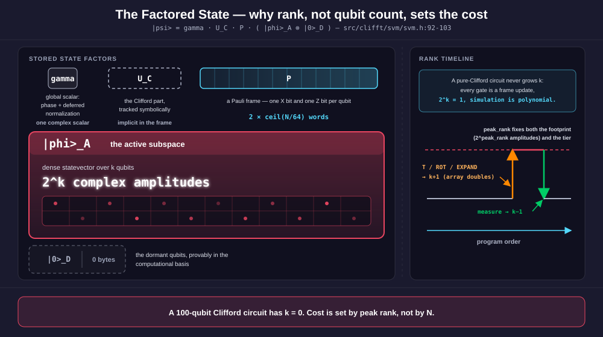
<figcaption><b>Figure 2.1</b> — The factored state. Dormant qubits cost zero
storage; the Pauli frame costs 2 bits per qubit; only the active subspace costs
exponential memory. Rank growth is driven by non-Clifford gates and undone by
measurement.</figcaption>
</figure>

### 2.2 The bytecode

The **Schrödinger Virtual Machine** is a bytecode interpreter over that state.
The instruction set is *localized*: the ahead-of-time compiler has already
resolved all global topology into 1- and 2-qubit virtual-axis operations, so the
VM never evaluates basis spans or commutation relations
(`src/clifft/backend/backend.h:21-23`).

The opcode set (`backend.h:25-86` — **41 opcodes** plus the `NUM_OPCODES`
sentinel) partitions cleanly by *what it costs*. The count matters later: it is
41 arms that a CPU interpreter must dispatch over and that a specialized kernel
never dispatches over at all.

| family | count | opcodes | cost |
|---|---|---|---|
| **Frame** | 6 | `FRAME_{CNOT,CZ,H,S,S_DAG,SWAP}` | O(1) — two bit reads, two bit XORs. No amplitude touched. |
| **Array** | 13 | `ARRAY_{CNOT,CZ,SWAP,MULTI_CNOT,MULTI_CZ,H,S,S_DAG,T,T_DAG,ROT,U2,U4}` | O(2^k) — a sweep over amplitude groups. |
| **Expansion** | 4 | `EXPAND`, `EXPAND_T`, `EXPAND_T_DAG`, `EXPAND_ROT` | O(2^k) and **grows k** |
| **Measurement** | 5 | `MEAS_DORMANT_{STATIC,RANDOM}`, `MEAS_ACTIVE_{DIAGONAL,INTERFERE}`, `SWAP_MEAS_INTERFERE` | dormant: O(1). active: O(2^k) reduction, **shrinks k** |
| **Forced variants** | 5 | the five `*_FORCED` mirrors of the measurement family | synthesized at runtime by a bytecode rewrite; read the outcome from a side buffer instead of the PRNG |
| **Classical / noise** | 8 | `APPLY_PAULI`, `NOISE`, `NOISE_BLOCK`, `READOUT_NOISE`, `DETECTOR`, `POSTSELECT`, `OBSERVABLE`, `EXP_VAL` | O(1)–O(words), but **PRNG-consuming** |

6 + 13 + 4 + 5 + 5 + 8 = 41. ✓

The `FRAME_*` family is why `clifft` is fast at all: a Clifford gate is two bit
flips. The `ARRAY_*` and `EXPAND` families are where the GPU work is. The noise
family is where, as §11 shows, specialization stops paying.

Each instruction is exactly **32 bytes** — asserted, not assumed
(`backend.h:163`) — so that two land in one 64-byte cache line
(`backend.h:92`):

```c
struct alignas(32) Instruction {
    Opcode   opcode;      // offset 0
    uint8_t  _reserved;   // offset 1
    uint8_t  flags;       // offset 2   FLAG_SIGN | FLAG_HIDDEN | FLAG_IDENTITY | FLAG_EXPECTED_ONE
    uint8_t  _pad;        // offset 3
    uint16_t axis_1;      // offset 4   virtual axis (target/control)
    uint16_t axis_2;      // offset 6   virtual axis 2
    union {               // offsets 8..31 — seven payload variants + raw access
        struct { double   weight_re, weight_im;         } math;       // A
        struct { uint32_t classical_idx, expected_val;  } classical;  // B
        struct { uint32_t cp_mask_idx, condition_idx;   } pauli;      // C
        struct { uint64_t mask;                         } multi_gate; // D
        struct { uint32_t cp_idx;                       } u2;         // E  -> fused_u2_nodes
        struct { uint32_t cp_idx;                       } u4;         // F  -> fused_u4_nodes
        struct { uint32_t cp_exp_val_idx, exp_val_idx;  } exp_val;    // G  -> exp_val_masks
        uint8_t raw[24];                                              //     full payload access
    };
};

static_assert(sizeof(Instruction) == 32, "Instruction must be exactly 32 bytes");
```

(Padding members elided above; each variant is padded out to the full 24 bytes
in the header.)

Note variants **E**, **F**, and **G**: their entire payload is a `uint32_t`
*index*. Anything that does not fit in 24 bytes — fused 2×2 and 4×4 unitary
matrices, full N-bit Pauli masks, noise-channel tables — lives in a side
`ConstantPool` and is referenced by index. **That indirection is exactly what
§7's S6 and S8 experiments measure the specialization limit of**: the *index*
folds to an immediate, the *contents* stay in a device buffer. A specializer
can eliminate the load of the index; it cannot eliminate the load of the matrix.

<figure>
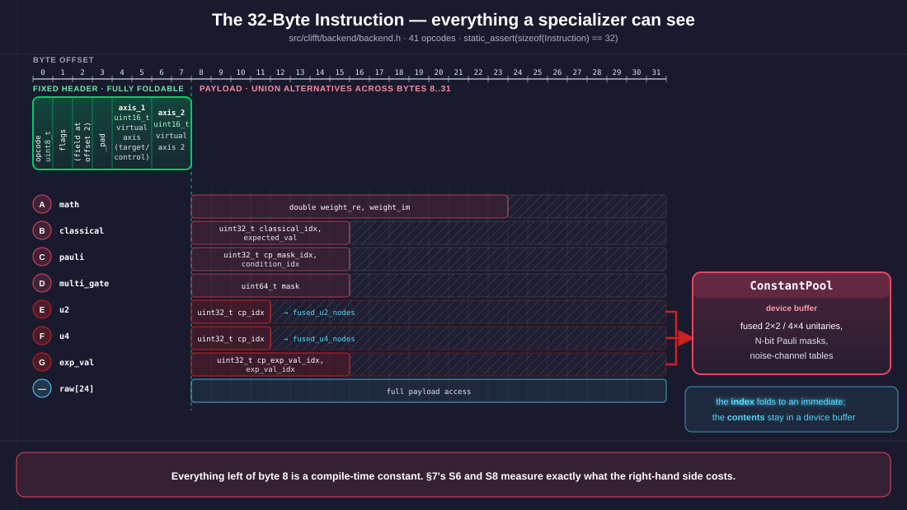
<figcaption><b>Figure 2.2</b> — The 32-byte instruction. Every field in the
fixed header, and the payload's discriminant, is known to the ahead-of-time
compiler. This is the entire raw material available to a specializer.</figcaption>
</figure>

### 2.3 The interpreter loop, and why its shape matters

The CPU reference uses a **computed-goto threaded dispatch table**
(`svm_kernels.inl:2191-2196`), sized to 256 and initialized with designated
initializers so each of the 41 opcodes gets its own indirect-branch history
entry:

```cpp
#if defined(__GNUC__) || defined(__clang__)
    // Threaded dispatch table (computed gotos) gives each opcode its own
    // indirect-branch history entry, dramatically improving prediction.
    // Sized to 256; designated initializers map enums directly to labels.
    static const void* dispatch_table[256] = {
        [static_cast<uint8_t>(Opcode::OP_FRAME_CNOT)] = &&L_OP_FRAME_CNOT,
        [static_cast<uint8_t>(Opcode::OP_FRAME_CZ)]   = &&L_OP_FRAME_CZ,
        ...
    };
```

That comment is the thesis of this entire report, stated by the CPU backend
years earlier. **Dispatch is a first-class cost**, and it is worth writing
non-portable code to attack. On a CPU you fight it with branch-target
prediction — the `#if defined(__GNUC__)` guard exists because the technique is a
compiler extension, and someone decided the win justified the portability
fallback path.

On a GPU there is no branch predictor to help you. A wavefront that hits an
indirect branch does not "predict"; it serializes across whatever divergent
targets its 64 lanes want. The CPU's mitigation is unavailable, which is why the
GPU port cannot use this trick, and why removing dispatch *entirely* — rather
than making it cheaper — is the only move available. That move is worth
**2.8–9.1× on the scalar unit** (§14.2).

### 2.4 The PRNG, and why it must be bit-exact

Stochastic simulation means every backend consumes the same random stream in the
same order, or results are not comparable shot-for-shot. `clifft` uses
**xoshiro256++** seeded by **SplitMix64** (`svm.h:21-34`, the Blackman–Vigna
reference implementation, CC0), and converts to a double with an
explicitly-specified expression (`svm.h:148-150`):

```cpp
// CRITICAL: Do NOT use std::uniform_real_distribution -- its output is
// implementation-defined and varies across compilers (GCC vs Clang vs MSVC).
[[nodiscard]] double random_double() { return static_cast<double>(rng_() >> 11) * 0x1.0p-53; }
```

The V2 device code reproduces this byte-for-byte (`v2_ops.h:155-177`, `rng_next`/`rng_uniform`), down to
the rotate constants and the same `>> 11` / `0x1.0p-53` mapping:

```c
static inline u64 v2_rotl64(u64 x, int k) { return (x << k) | (x >> (64 - k)); }
static inline u64 rng_next(u64* s) {
    u64 result = v2_rotl64(s[0] + s[3], 23) + s[0];
    u64 t = s[1] << 17;
    s[2] ^= s[0]; s[3] ^= s[1]; s[1] ^= s[2]; s[0] ^= s[3];
    s[2] ^= t;    s[3] = v2_rotl64(s[3], 45);
    return result;
}
static inline double rng_uniform(u64* s) {
    return (double)(rng_next(s) >> 11) * 0x1.0p-53;
}
```

Note what is *not* here: no `ocml` call, no device-library dependency, no
fast-math-sensitive arithmetic. The conversion is an integer shift and an exact
power-of-two multiply, so it is bit-identical on any target with IEEE doubles.
This is the one place in the whole pipeline where "compile the same source for
both" was not good enough — the CPU side is C++ and the device side is freestanding
C23, so the sequence had to be transliterated and then verified by output
comparison rather than shared.

The consequence, and it is the key to understanding §12: **any divergence in how
many random numbers a backend draws is unrecoverable.** Not "slightly different
results" — the two streams decorrelate permanently from the first extra draw.
A branch taken differently, an early-exit that skips a draw, a dust threshold
that clamps on one side and rolls on the other: all of these are the same bug.

### 2.5 What this means for a GPU

Three properties of the workload determine everything downstream:

1. **The hot loop is a butterfly over amplitude pairs**, not a matrix multiply.
   `ARRAY_U2` applies a 2×2 complex matrix to 2^(k-1) amplitude pairs;
   `ARRAY_U4` a 4×4 to 2^(k-2) quadruples. There is no GEMM here — which is why
   **`SQ_INSTS_MFMA` is 0.0 in every counter block collected** — all 52
   backend×circuit cells of the canonical run (job 50793), with no cell missing
   — and why the matrix cores, the headline feature of this chip, are simply
   not part of this story. §14.6 returns to what that costs.
2. **The working set spans four orders of magnitude.** At peak rank 0 the
   "statevector" is one complex number; at rank 24 it is 16.7 million. No single
   parallelization strategy is right for both, which is the origin of the tier
   system (§3.2).
3. **Shots are embarrassingly parallel, but each shot is sequential.** A shot is
   a walk through the bytecode with a private PRNG stream. The parallelism is
   *across* shots, and the per-shot work is a dependent chain — which sets the
   ceiling on what any amount of ILP inside one shot can buy.

---

## 3. The original GPU SVM: one interpreter, three tiers

The first GPU backend is a direct port of the interpreter: one kernel, written
in HIP, compiled once at build time, that walks the same bytecode the CPU walks.
It is the baseline every later generation is measured against, and — three
rewrites later — it is still the thing to beat on one circuit family.

### 3.1 The kernel is a `for(pc) switch`

`src/clifft/gpu/sampler/hip_sampler.hip:728-731`:

```cpp
__device__ void execute_shot(const GpuProgram& program, Rng& rng, ShotState& st) {
    for (uint32_t pc = 0; pc < program.num_instrs; ++pc) {
        const GpuInstr& instr = program.instrs[pc];
        switch (instr.opcode) {
            case static_cast<uint8_t>(clifft::Opcode::OP_FRAME_CNOT):
                frame_cnot(st, instr.axis_1, instr.axis_2);
                break;
            case static_cast<uint8_t>(clifft::Opcode::OP_FRAME_CZ):
                frame_cz(st, instr.axis_1, instr.axis_2);
                break;
            ...
```

Note what the CPU's computed-goto trick has become: a plain `switch`. There is
no indirect-branch predictor on a GPU to reward threading the dispatch. What
this costs shows up directly in the scalar unit, and §14.2 quantifies it.

Two properties of this shape are worth naming now, because V2 preserves one and
destroys the other:

- **Every operand is a runtime load.** `instr.axis_1`, `instr.flags`,
  `instr.mask` — all read from memory, every shot, every instruction.
- **`st.active_k` is a runtime variable.** Every amplitude sweep computes its
  trip count as `1u << (st.active_k - 1)` at runtime, and every scatter index is
  recomputed per amplitude.

V2 keeps the shot loop and kills both of these (§6, §7).

### 3.2 Three tiers, because the working set spans 10^7

A statevector of 1 amplitude and a statevector of 16.7 million cannot use the
same parallelization. The SVM backend therefore ships three kernels, selected by
compiled `peak_rank`:

| tier | rank | topology | amplitude storage | source |
|---|---|---|---|---|
| **register** | ≤ 4 | 1 shot per **thread** | `GpuComplex v[16]` in VGPRs | `hip_sampler.hip:153,1778` |
| **coop** | 5–10 | 1 shot per **workgroup** (256 threads) | `__shared__ GpuComplex v[1024]` | `hip_sampler.hip:1861` |
| **global** | 11–26 | persistent workgroup pool, work-stealing | HBM slice per workgroup | `hip_sampler.hip:1937` |

Constants: `kThreadMaxPeakRank = 4`, `kSharedMaxPeakRank = 10`,
`kGlobalMaxPeakRank = 26` (`gpu_types.h:8-18`).

<figure>
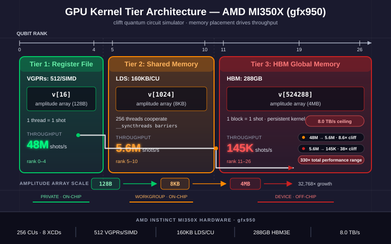
<figcaption><b>Figure 3.1</b> — The three tiers map rank onto the memory
hierarchy: VGPRs → LDS → HBM. The tier boundary is where the statevector stops
fitting in the level above.</figcaption>
</figure>

**Register tier** (`hip_sampler.hip:1778`). One thread = one shot. The
statevector is `GpuComplex v[kThreadMaxAmplitudes]` = 16 complex floats, held in
registers. No LDS, no barriers, no cooperation. Block-level reduction of the
per-shot counters happens once at the end via shared memory.

**Coop tier** (`hip_sampler.hip:1861-1885`). One workgroup = one shot; 256
threads cooperate on the amplitude sweeps. The entire shot state moves to LDS:

```cpp
__shared__ GpuComplex v[kSharedMaxAmplitudes];        // 1024 amps  =  8 KB
__shared__ GpuComplex scratch[kSharedMaxAmplitudes/2];//  512 amps  =  4 KB
__shared__ uint8_t    meas[kMaxMeas];                 // 4096 slots =  4 KB
__shared__ uint64_t   px[kPauliWords], pz[kPauliWords];
__shared__ double     red0[256], red1[256];           //            =  4 KB
__shared__ uint32_t   scatter_lut[kSharedMaxAmplitudes/2];
```

That LDS budget is the coop tier's occupancy constraint, and it is where V2's
first two optimizations went (§9.1). Note `scatter_lut`: the SVM caches computed
scatter indices in LDS, keyed by `(axis1, axis2, k, mode)`. This is a *runtime*
answer to the same problem V2 answers at *compile* time (§7.5) — and the SVM
leaves this LUT **off** for the global tier, which is precisely why V2's global
specialization wins so decisively (§9.3).

**Global tier** (`hip_sampler.hip:1937`). The statevector no longer fits in LDS,
so each resident workgroup owns an HBM slice and shots are pulled from per-XCD
work counters. The grid is a fixed *pool* of persistent workgroups, not one
workgroup per shot.

### 3.3 The cooperative reduction

Active-qubit measurement needs `sum |v_i|^2` over each half of the array — a
reduction across all 256 threads. Both backends implement the identical
two-phase pattern: an intra-wavefront butterfly using `ds_bpermute` (64 lanes,
6 steps), then an inter-wavefront combine through LDS
(`hip_sampler.hip:948`, mirrored in `v2_ops.h:224-262`, `coop_reduce2`).

<figure>
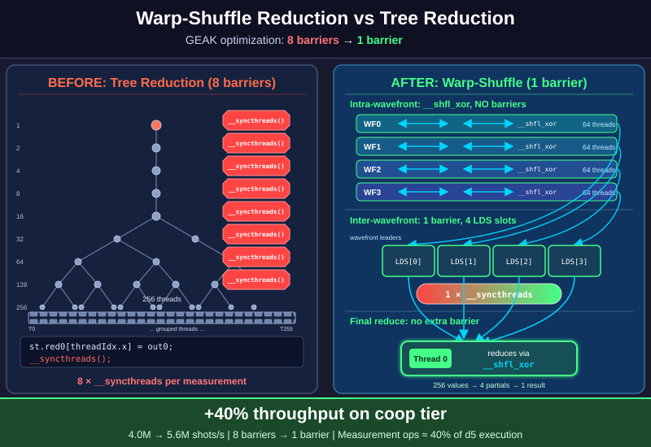
<figcaption><b>Figure 3.2</b> — Phase 1: 6-step XOR butterfly within each
64-lane wavefront via <code>ds_bpermute</code>. Phase 2: the four wavefront
partials combine through LDS. The summation <em>order</em> is part of the ABI —
change it and f64 rounding diverges at measurement branch points.</figcaption>
</figure>

The comment above V2's copy is emphatic and explains a constraint that recurs
throughout this report (`v2_ops.h:235-236`):

> `// MUST reproduce SVM coop_reduce2's exact summation order or f64 rounding`
> `// diverges at measurement branch points.`

A reduction is not associative in floating point. Two implementations that sum
the same values in different orders produce different totals in the last bits,
and a measurement whose probability sits near the sampling threshold will then
branch differently — which, per §2.4, desynchronizes the PRNG forever. **The
summation order is part of the ABI.** This single constraint rules out most of
the obvious "optimizations" one would reach for.

### 3.4 What the SVM backend does well

It is worth stating plainly, because two successor generations failed to beat it:

- **One kernel, compiled once.** No per-circuit compile latency, no cache, no
  gate. Ship it and it runs.
- **The dispatch loop keeps IR small.** The bytecode is *data*. A 16,000-op
  circuit and a 4-op circuit compile to the same kernel. V1 forgot this and paid
  221-second compiles for it (§5.3).
- **It is heavily tuned.** The tag history (`svm-opt-1-noinline-extended`,
  `svm-opt-2-noinline-coop-sweeps`, `svm-opt-3-geak-warp-shuffle`,
  `svm-opt-4-scatter-lut`) records four rounds of optimization: selective
  `noinline` to control register pressure, GEAK-derived warp-shuffle reduction,
  and the scatter LUT. **This is not a strawman baseline.**

### 3.5 What it leaves on the table

Everything the interpreter re-derives at runtime that was already known when the
circuit was compiled:

| known at compile time | paid at runtime, every shot |
|---|---|
| the opcode at each `pc` | a `switch` — scalar branch-target computation |
| `axis_1`, `axis_2`, `flags`, `mask` index | a 32-byte instruction load + field extraction |
| `active_k` before each instruction | a load, then `1u << (k-1)` for every trip count |
| the scatter-index pattern for fixed axes | `scatter_bits_2()` per amplitude — or an LDS LUT with a cache-validity check |
| which of a measurement's two paths is live | both paths emitted, one predicated |

That table is the entire specialization opportunity, and §7 turns each row into
a measured experiment.

---

## 4. Hybrid: compiling the circuit into HIP, and why it stalled

### 4.1 The idea

If the operands are known when the circuit is compiled, generate a bespoke
kernel per circuit. The Hybrid backend (`src/clifft/gpu/codegen/`) does exactly
that: it walks the bytecode, emits HIP source with the operands as literals, and
compiles it ahead of the sampling run.

The emitter is structured around a **used-function analysis**
(`kernel_codegen.h:17-50`): a `UsedFunctions` struct with one boolean per opcode
family, populated by scanning the bytecode, used to emit only the device
functions the circuit actually needs. A pure-Clifford circuit does not carry the
`ARRAY_U4` code at all.

### 4.2 The compile path — and the first appearance of an HSA/HIP split

`kernel_cache.cc:105-170`:

```cpp
// Step 1: Compile HIP source → offload bundle (.bundle)
// --offload-device-only produces a Clang Offload Bundle, not a raw ELF.
// HSA needs a raw AMDGCN ELF, so we unbundle in step 2.
cmd << clangpp << " -x hip"
    << " --offload-arch=" << gpu_arch
    << " -O2 -ffast-math"
    << " --offload-device-only"
    << " -o " << bundle_path << " " << tmp_src;
```

then `clang-offload-bundler --unbundle` to extract the raw ELF, then
`hsa_load_kernel(hsaco_path, kernel_func_name, 0)` (`kernel_cache.cc:191`).

**Hybrid already dispatches through HSA, not `hipModuleLoad`.** It uses HIP only
as a *source language*, and then has to fight its way back out of HIP's
packaging to get an object HSA will accept. That awkwardness — writing HIP to
get a device binary, then unwrapping the HIP container to hand it to HSA — is
the seed of V2's decision to drop HIP entirely (§13).

Note also `-ffast-math`. Hybrid was allowed reassociation; V2 explicitly is not
(`-ffp-contract=off`, no fast-math, §6.4), because V2's correctness contract is
byte-exactness against the interpreter and fast-math would break it.

### 4.3 The result: correct, competitive, never ahead

The v1-era measurement (`docs/v2/reference_v1.md:270-278`, 10,000 shots,
MI350X, `sample_seconds`) shows Hybrid at or slightly better than SVM:

| circuit | SVM | **Hybrid** | MLIR (v1) |
|---|---|---|---|
| frame_h | 0.066 | **0.053** | 0.271 |
| qv10 | 0.074 | **0.058** | 3.54 |
| circuit_d5 | 0.078 | **0.065** | 1.22 |
| surface_d9_t10 | 0.090 | 0.112 | 5.50 |

> **[unverified, v1-era]** — these are `sample_seconds` (host wall time
> including setup), not isolated kernel time, from a run whose node identity was
> not recorded. They are quoted for their *shape*, not their magnitude: Hybrid
> tracks SVM within ±25%, and MLIR is off the chart. That shape is corroborated
> by every later measurement.

Hybrid wins by 10–20% on three of four and loses by 25% on the fourth. After
per-circuit code generation, an entire compile-cache subsystem, and an
offload-bundle unwrapping dance, the answer is **noise-level**.

### 4.4 Why it stalled — the density measurement

The cleanest diagnosis comes from an artifact built for this report:
`V2_performance/lowering/ir_density.csv`, which counts lines of emitted source
per bytecode instruction.

| circuit | instrs | Hybrid HIP lines | **lines/instr** |
|---|---|---|---|
| reg_circuit_d3 | 344 | 5,301 | 15.4 |
| coop_qv10 | 140 | 7,805 | 55.8 |
| coop_circuit_d5 | 1,720 | 33,508 | 19.5 |
| coop_surface_d7_t10 | 4,134 | 75,409 | 18.2 |
| glob_surface_d7_t19 | 4,296 | 75,794 | 17.6 |

Hybrid emits a **block** per instruction — 15 to 56 lines of HIP each. It is
linear in circuit size with a large constant. That is not pathological (V1's is,
§5), but it means:

- the compiler's problem grows with the circuit, so compile time does too;
- register pressure grows with the circuit, because the body is one long
  straight-line region;
- the win from constant operands is diluted by the sheer volume of code the
  optimizer must chew through.

**The lesson Hybrid teaches, and the reason it is in this report:** per-circuit
compilation is not, by itself, a performance strategy. What matters is *what you
emit per instruction*. Hybrid emitted a block. V2 emits a call (§6.3), and the
same idea that netted Hybrid ~0 % nets V2 **1.3–4.0×**.

Note the shape of the density column, because it is the whole argument in one
number: Hybrid's lines-per-instruction is 15.4–55.8 and does not improve with
scale, while V2's converges *downward* to 1.00–1.27 on every circuit large
enough to matter — 1.00–1.11 on the three Clifford-dominated ones, and 1.27 on
`qv10`, whose fused unitaries are the one gate family V2 still emits more than
one line for. Same input, same target, same compiler — a 14–44× difference in
how much code the optimizer is handed.

---

## 5. V1: the MLIR backend and its failure

V1 is the generation that did not work. It is documented here at length because
its failure defines V2's design constraints — every rule in V2's architecture
(§6) exists because V1 violated it and paid.

### 5.1 The original idea

Hybrid proved that per-circuit code generation was *possible* but not
*profitable*. The V1 hypothesis was that the problem was the intermediate
representation: HIP source is a poor target for a code generator, clang has to
re-parse it, and everything interesting is buried under a general-purpose
frontend. Emit **MLIR** instead — a compiler IR designed to be produced by
machines — and the generator gains direct access to the optimizer.

The pipeline (`src/clifft/gpu/mlir/`):

```
bytecode → mlir_emit.cc (~3,425 lines) → .mlir text
         → mlir-opt --canonicalize --cse --convert-func-to-llvm
         → mlir-translate --mlir-to-llvmir
         → opt -O2 → llc → ld.lld → .hsaco
```

The stated goals were the ones MLIR is genuinely good at: a multi-level IR where
quantum-specific structure survives into the middle end, custom passes that
understand `EXPAND`/`MEAS` rank algebra, progressive lowering from a domain
dialect down to `amdgpu`.

### 5.2 What was actually built — three verified findings

The audit checked those goals against the artifacts. All three failed.

**Finding 1: V1's MLIR was 100% `llvm` dialect.** A dialect census on the
emitted IR (`lowering/v1/frame_h.1_emitted.mlir`, `circuit_d3.1_emitted.mlir`):

| dialect op | frame_h | circuit_d3 |
|---|---|---|
| `func.func` | **0** | **0** |
| `arith.*` | **0** | **0** |
| `scf.*` | **0** | **0** |
| `memref.*` | **0** | **0** |
| `llvm.func` | 6 | 7 |

There is no multi-level IR here. **V1 used MLIR as a text serialization format
for LLVM IR.** The op census confirms it — the emitted `frame_h` module is
`llvm.mlir.constant` × 240, `llvm.ptr` × 192, `llvm.shl` × 73, `llvm.xor` × 68…
Pointer arithmetic and bit twiddling, written in MLIR's syntax.

**Finding 2: V1 authored zero custom passes.** `mlir_codegen.cc:65-67` (and
verbatim again at `:172` and `:239`) runs
exactly three stock upstream passes:

```
mlir-opt --canonicalize --cse --convert-func-to-llvm
```

No domain dialect, no rank-algebra pass, no quantum-aware transformation. The
"progressive lowering" that motivated the choice of MLIR was never written.

**Finding 3: one of those three passes is a provable no-op.** Per-pass snapshots
via `mlir-opt --mlir-print-ir-tree-dir` (`lowering/v1_passes/frame_h/`) show the
diff between `1_cse.mlir` and `2_convert-func-to-llvm.mlir` in full:

```diff
--- 1_cse.mlir
+++ 2_convert-func-to-llvm.mlir
@@ -1,7 +1,7 @@
-// -----// IR Dump After CSE (cse) //----- //
+// -----// IR Dump After ConvertFuncToLLVMPass (convert-func-to-llvm) //----- //
 module attributes {llvm.target_triple = "amdgcn-amd-amdhsa"} {
   llvm.func @llvm.amdgcn.workitem.id.x() -> i32
   llvm.func @llvm.amdgcn.workgroup.id.x() -> i32
   llvm.func @llvm.amdgcn.s.barrier()
   llvm.func @llvm.amdgcn.ds.bpermute(i32, i32) -> i32
   llvm.func @clifft_log(%arg0: f64) -> f64 {
```

**Two lines changed, and both are the "IR Dump After" banner comment.** 608
lines in, 608 lines out, byte-identical apart from the header. There is no
`func` dialect to convert because the emitter never produced any. Rendered at
`V2_performance/lowering/diffs/v1pass.frame_h.1_cse__2_convert-func-to-llvm.{diff,html}`.

What the other two passes did accomplish, on `frame_h`: 947 lines → 736
(canonicalize) → 608 (cse). Constant deduplication (`llvm.mlir.constant`
240 → 59) and redundant `shl`/`and`/`xor` elimination. Real, but this is
cleanup after a sloppy emitter, not compilation.

<figure>
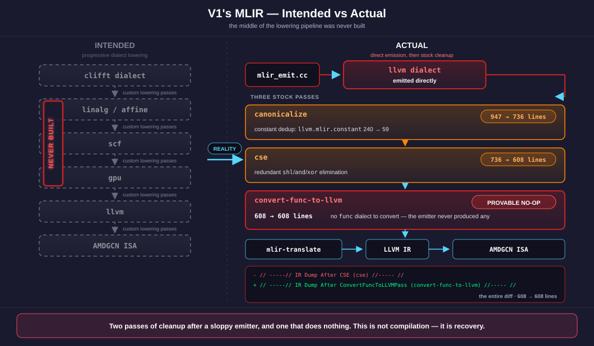
<figcaption><b>Figure 5.1</b> — Intended (left): a domain dialect lowered
progressively through custom passes. Actual (right): direct <code>llvm</code>-dialect
emission, three stock passes, one of them a no-op. The middle levels were never
built.</figcaption>
</figure>

### 5.3 The actual failure: unrolling the operand sequence

The choice of IR was not V1's problem. Its problem was structural, and it is
visible in a single line of the emitter — `mlir_emit.cc:2377`:

```cpp
    out << "  // --- Instruction sequence (" << flat.instrs.size() << " ops) ---\n";
    g_emit_ak = 0;

    for (size_t pc = 0; pc < flat.instrs.size(); ++pc) {
        const GpuInstr& ins = flat.instrs[pc];
```

That `for` loop is on the **host, at emit time**. `pc` is a C++ variable that
never appears in the generated program. Every bytecode instruction becomes its
own block of IR, so the program counter is resolved by the code generator and
the GPU never has one: **V1 flattened the entire bytecode into straight-line IR
with no runtime loop over instructions.**

The contrast with V2 is one character of scope. V2's emitter has the same host
loop, but what it writes into it is a *call* — `v2_op_expand(st, v, 3u);` — and
the device program keeps its own `for` over the instruction array. Same loop,
different side of the compile.

Every bytecode instruction became an inlined block of IR. A circuit is not data
walked at runtime; it is *code*. The consequences compound:

| effect | measured | source |
|---|---|---|
| IR size | `surface_d11_t5` (16,432 ops) → **19,856,511 bytes of LLVM IR** | `results/d11err_49530.log:19` |
| Compile time | `glob_surface_d7_t19`: **221.48 s** end-to-end | `lowering/matrix.csv` |
| Optimizer viability | size-adaptive fallback: >4 MB → `llc -O2` + `opt -O1`; >16 MB → `llc -O1`, `opt` skipped entirely | `mlir_kernel_cache.cc:105-131` |
| Register allocation | one enormous basic-block chain; the allocator has no loop structure to work with | — |

That third row deserves emphasis. **The build system had to detune the optimizer
based on file size** to make links complete at all — the constants are literal
in the source:

```cpp
    size_t ir_bytes = llvmir.size();
    const size_t kLargeIrThreshold = 4u * 1024 * 1024;   // 4 MB
    const size_t kHugeIrThreshold  = 16u * 1024 * 1024;  // 16 MB
    bool large_ir = ir_bytes > kLargeIrThreshold;
    bool huge_ir = ir_bytes > kHugeIrThreshold;
    const char* llc_opt = huge_ir ? "-O1" : (large_ir ? "-O2" : "-O3");
```

with the maintainer's own rationale six lines above it
(`mlir_kernel_cache.cc:88-92`):

```cpp
// Large fully-unrolled circuits (surface codes emit 40MB+ IR from U2/U4
// inlining) make opt -O3 + llc -O3 take >300s. For large/huge IR we lower the
// opt level (and skip the separate opt pass) so compilation completes.
// Correctness is unaffected — only optimization aggressiveness changes.
```

When a code generator's output requires the optimizer to be turned down, the
generator is the problem.

And the detuning was not sufficient. On `surface_d11_t5` the pipeline ran to
completion and still produced nothing loadable:

```
[clifft-mlir] generated 19856511 bytes of LLVM-IR for 16432 ops
[clifft-mlir-mlir] large IR (18 MB): llc -O0, opt skipped
[clifft-mlir-mlir] compiled in 32435.2 ms (19391 KB IR)
[clifft-hsa-dispatch] cannot open .../mlir_db5b1a0c2e405879_gfx950.hsaco
```

32 seconds of compilation, then the `.hsaco` does not exist. The 10-shot
correctness sweep across the whole corpus (`results/fullsweep_49529.log`, job
49529) shows this is not a `surface_d11` quirk — 18 circuits pass, and the five
that fail all fail the same way:

```
surface_d9_t19            13        1        1 OK
surface_d11_t5             3        0     FAIL NOCOMPILE
surface_d11_t10            7        0     FAIL NOCOMPILE
surface_d11_t15           11        0     FAIL NOCOMPILE
surface_d11_t19           14        0     FAIL NOCOMPILE
qv10                      10    10000    10000 OK
qv20_seed42               20        ?     FAIL NOCOMPILE
```

Look at the rank column, because it rules out the obvious explanation.
`surface_d11_t5` fails at **rank 3**; `surface_d9_t19` passes at **rank 13**.
The failures are not the high-rank circuits — rank drives *state size*, and
V1's global tier handled rank 13 fine.

What the five failures share is **emitted IR volume**, which is instruction
count × per-instruction density, and they arrive there by two different routes:

| failing circuit | instrs | density driver | est. IR |
|---|---|---|---|
| `surface_d11_*` | **16,432** | ordinary (~56 lines/instr) | 19.9 MB, *measured* |
| `qv20_seed42` | **418** | **U2/U4-dense** (`qv10`: 2,407 lines/instr) | ~1.0 M lines |

`surface_d11_t5` is long and ordinary. `qv20_seed42` is short and *dense* —
418 instructions, but a QV circuit is nearly all fused unitaries, and §5.3's
U2/U4 mechanism inflates each one by up to 1,500 IR ops. Different route, same
wall.

That is the whole diagnosis. V1's limit was never the physics; it was how much
IR the circuit expanded into, because V1 turned every instruction into code
instead of data. Both routes to a large program are closed by the same fix, and
that fix is V2's first rule (§6.1).

V1 fought the symptom repeatedly. Two bloat sources were mitigated
(`reference_v1.md:243-250`):

- `OP_NOISE_BLOCK` used to unroll one full site-block per site — ~1,200 sites for
  `circuit_d5`, ~100k lines / 32 MB of IR that OOM'd `llc`. Converted to a
  runtime loop over the site index.
- `log(x)` and `draw_next_noise` were inlined at every noise draw
  (`surface_d9_t5`: 1,444 draws × ~110/~317 lines each). Hoisted to shared
  `@clifft_log` / `@clifft_draw_next_noise` functions.

Both fixes are *the V2 principle applied locally*: replace an unroll with a
loop, replace an inline with a call. They worked. They were just never
generalized to the thing that mattered — the instruction sequence itself.

And the unmitigated case is spectacular. `OP_ARRAY_U2`/`U4` remained
matrix-unrolled: each unrolls per incoming-frame-state branch (U2: 4 branches,
~150–200 IR ops; **U4: up to 16 branches, ~800–1,500+ IR ops *per
instruction***), each branch wrapping a fully unrolled complex matmul
(`mlir_emit.cc:1813,1920`). `mlir_kernel_cache.cc:89-90` records the outcome:
"surface codes emit 40MB+ IR from U2/U4 inlining."

The density measurement makes this concrete
(`V2_performance/lowering/ir_density.csv`):

| circuit | instrs | v1 MLIR lines | **lines/instr** |
|---|---|---|---|
| reg_frame_h | 4 | 947 | 236.8 |
| reg_four_t | 11 | 1,384 | 125.8 |
| reg_circuit_d3 | 344 | 23,002 | 66.9 |
| **coop_qv10** | **140** | **336,988** | **2,407.1** |
| coop_circuit_d5 | 1,720 | 118,493 | 68.9 |
| coop_surface_d7_t10 | 4,134 | 228,544 | 55.3 |
| glob_surface_d7_t19 | 4,296 | 239,803 | 55.8 |

`qv10` is the worst case and shows the U2/U4 mechanism exactly: **140 bytecode
instructions became 336,988 lines of MLIR.** V2 emits 179 lines for the same
circuit with identical semantics — a **1,883× reduction**.

Two structural facts hide in that column. First, density does **not** grow with
circuit length: the three longest circuits (1,720 → 4,296 instructions) sit at
55–69 lines/instr, essentially flat. V1's bloat was per-instruction, not
super-linear in length — which is why a 387-instruction QV circuit could fail
while a 4,296-instruction surface circuit compiled. Second, the small-circuit
rows (236.8, 125.8) are *fixed preamble amortized over few instructions*, not a
U2/U4 effect. The single genuinely anomalous row is `qv10`, and it is anomalous
by a factor of 35 against its neighbours.

V2's cache closes the loop on the compile failure. The same circuit V1 could
not build — rank 3, 16,432 instructions — appears in
`lowering/kernel_resources.csv` as a specialized kernel, twice, under a name
that encodes exactly the shape V1 choked on:

```
specialized,reg_r3_n16432_db0365e190589c49.hsaco,clifft_v2_spec,128,64,108,0,0,1168,0
                └ tier ┘└rank┘└─ instrs ─┘                      vgpr agpr sgpr  ↑  ↑
                                                              vgpr_spill ┘  scratch
```

`vgpr_spill = 0`, `sgpr_spill = 0`, 1,168 bytes of scratch. V1 produced 19.9 MB
of IR from that circuit and no loadable binary; V2 produces a kernel that does
not spill a single register. §15 reports `surface_d11_t19` at **0.255×** SVM —
the best result in the corpus, on a circuit its predecessor could not compile.

<figure>
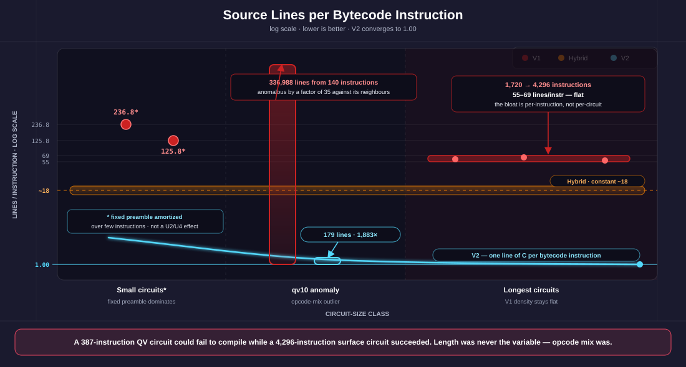
<figcaption><b>Figure 5.2</b> — Lines of emitted source per bytecode
instruction, log scale. V1 (red) is superlinear on U2/U4-dense circuits. Hybrid
(amber) is linear with a constant of ~18. V2 (blue) converges to
<b>1.00</b>.</figcaption>
</figure>

### 5.4 The performance result

MLIR V1 was **5–61× slower than SVM/Hybrid**. The design doc quotes four rows;
the primary artifact behind it (`results/perf2_49532.log:5-15`, job 49532) has
nine, and they are reproduced in full because the two outliers are the argument:

| circuit | rank | SVM_s | HYB_s | **MLIR_s** | MLIR/HYB |
|---|---|---|---|---|---|
| `frame_h` | 0 | 0.0658 | 0.0534 | **0.2712** | 5.1× |
| `circuit_d3` | 4 | 0.0729 | 0.0552 | **0.4509** | 8.2× |
| `surface_d7_t5` | 3 | 0.0790 | 0.0781 | **2.1165** | 27.1× |
| **`qv10`** | 10 | 0.0741 | 0.0576 | **3.5449** | **61.5×** |
| `circuit_d5` | 10 | 0.0778 | 0.0649 | **1.2230** | 18.9× |
| `surface_d7_t10` | 7 | 0.0794 | 0.0783 | **2.4039** | 30.7× |
| `surface_d7_t19` | 12 | 0.0839 | 0.0827 | **2.5316** | 30.6× |
| `surface_d9_t10` | 7 | 0.0896 | 0.1117 | **5.5035** | 49.3× |
| `surface_d9_t19` | 13 | 0.1018 | — | **aborted** | — |

> **[v1-era, quoted for shape]** — `sample_seconds` (host wall, not kernel
> time), node unrecorded, superseded toolchain. Not comparable to §15's
> ratios, which are kernel-time on a pinned node. The shot count is not
> recorded either: the log preserves the harness command only for the run that
> aborted, and that one used `--shots 10`. Treat the ratios as the finding and
> the absolute seconds as unnormalized.

Two things in this table are load-bearing.

**`qv10` is the outlier in both columns.** It is the densest IR in the corpus
(2,407 lines/instr, §5.3) *and* the worst slowdown (61.5×). No other circuit
comes close on either axis. The IR-density measurement and the runtime
measurement were taken by different tools, from different artifacts, at
different times — and they agree on which circuit is worst. That is the
corroboration that matters, and it is why the mechanism in §5.3 (U2/U4
unrolling) is the accepted explanation rather than one hypothesis among
several.

**The last row is not a slow number; it is a missing one.** `surface_d9_t19`
aborted under a 250-second timeout — and the log records the harness command
verbatim, which is worth reading closely:

```
timeout 250 "$BIN" --circuit "$f" --shots 10 --seed 42 --mlir
```

**Ten shots**, not ten thousand. V1 could not finish *ten* shots of
`surface_d9_t19` inside four minutes, on a circuit SVM completes in 0.10 s at
10,000. The job also ended with `Detected 7 oom_kill events`, so the wall V1 hit
here is memory as much as time.

A 61× slowdown is a performance result. The compile failures in §5.3 are a
viability result, and that is the one that ended V1.

### 5.5 The spill claim: real, but mis-attributed

`reference_v1.md:265` states that **"the register-tier kernel reports private =
115 KB/thread"** of spill scratch. The number is real. The tier is wrong, and
the distinction matters.

The only 115 KB in the entire artifact corpus is `results/gt19_49517.log:11`:

```
[clifft-hsa-dispatch] loaded kernel 'compiled_mlir_kernel_global' from
  .../mlir_global_7989aa5d4826ef77_gfx950.hsaco
  (private=115224 group=8248 kernarg=352 ...)
```

`compiled_mlir_kernel_global` — the **global** tier, on `surface_d7_t19`. A
sweep of every `private=` line ever logged puts a hard ceiling on each tier:

| v1 kernel | max recorded `private=` |
|---|---|
| `compiled_mlir_kernel` (register) | 4,192 B |
| `compiled_mlir_kernel_coop` | 608 B |
| `compiled_mlir_kernel_global` | **115,224 B** |

The register tier never exceeded 4 KB. 115 KB is a global-tier number, and it
is 27× the worst register-tier figure — so the corrected attribution makes the
fact *more* striking, not less.

One further qualification the design doc omits, visible two lines up in the same
log: that kernel was built at **`llc -O0` with `opt` skipped**, because 9,967,049
bytes of IR tripped the huge-IR fallback from §5.3. So 115 KB/thread is not what
the optimizer produced from V1's IR — it is what the optimizer produced *after
being switched off* because V1's IR was too large to optimize. The two failures
are the same failure, reported once each.

The independently measured artifacts agree with the ceiling. From
`lowering/matrix.csv`, ISA-level `ScratchSize` at `-O2` (the level the matrix
uses, not the fallback):

| v1 circuit | tier | ScratchSize | VGPR | occupancy |
|---|---|---|---|---|
| `reg_frame_h` | register | 0 B | 16 | 8 |
| `reg_four_t` | register | 0 B | 16 | 8 |
| `reg_circuit_d3` | register | **156 B** | 128 | 4 |
| `coop_qv10` | coop | 0 B | 53 | 8 |
| `coop_circuit_d5` | coop | 48 B | 73 | 6 |
| `glob_surface_d7_t19` | global | **320 B** | 128 | 4 |

Note the VGPR column, which is the register-tier story the scratch number was
being used to tell: `circuit_d3` pins **128 VGPRs — the architectural
maximum — and drops to occupancy 4**, while the two small circuits sit at 16
VGPRs and occupancy 8. The unrolled body does exhaust the register file. It
just does so by *saturating* VGPRs on the register tier rather than by spilling
115 KB, and spills catastrophically only once it reaches the global tier with
the optimizer disabled.

The emitter itself documents fighting this. Note *which way* the trade-off runs
(`mlir_emit.cc:216-218`):

```cpp
    // alignment=8 for coop/global tiers enables ds_read_b64 / global_load_b64
    // EXCLUDED from register tier to avoid VGPR spill catastrophe (P1.9)
    const char* align = (lds_amplitudes || cooperative_mode) ? " {alignment = 8 : i64}" : "";
```

V1 gave up wide 64-bit amplitude loads on the register tier — a real
throughput loss — purely to keep the allocator from spilling. That is a
generator paying for its own IR shape with the hardware's memory bandwidth.

This is the report's ground rule cutting in both directions. The first audit
pass rejected 115 KB as unreproducible — wrong; it was looking at
`matrix.csv`'s register rows for a global-tier number. Design documents are
claims rather than facts, but so is any single artifact read in isolation.

### 5.6 The duplication tax

A structural cost worth naming, because V2 fixes it directly. By V1, every
opcode was implemented **three to four times**: the CPU SVM interpreter, the GPU
SVM interpreter, the Hybrid HIP template, and the MLIR emitter — with register
and coop variants doubling several of those. A fix in one did not propagate.

Tracing a single opcode across the tree shows the shape. `MULTI_CNOT` has
semantic implementations in:

| file | role |
|---|---|
| `svm/svm_kernels.inl` | CPU + GPU SVM interpreter (the de-facto spec) |
| `gpu/sampler/hip_sampler.hip` | GPU SVM dispatch |
| `gpu/codegen/ops/multi_qubit_ops.inc` | Hybrid HIP-source emitter |
| `gpu/mlir/ops/mlir_array_ops.inc` | **V1 MLIR emitter** — where the bug was |
| `gpu/mlir/v2/v2_ops_body.inc` | V2 shared operand library |

Four independent transcriptions of one gate's semantics, plus V2's. The last
row is the fix: V2 adds a *fifth* file precisely so it can eventually be the
only one.

The canonical incident (`reference_v1.md:228-235`): `OP_ARRAY_MULTI_CNOT` had
`px`/`pz` **swapped only in the MLIR frame update**, while SVM and Hybrid were
correct. The post-mortem is still inline at
`src/clifft/gpu/mlir/ops/mlir_array_ops.inc:428-435`:

```cpp
    // SVM ref exec_array_multi_cnot -> exec_frame_cnot (svm_kernels.inl:502/exec_frame_cnot).
    // NOTE: read pz[target] ONCE up front — the per-control pz[c] ^= pz[target]
    // never touches pz[target] (target is not a control), so it stays stable;
    // likewise accumulate Σ px[c] before writing px[target]. (The previous
    // emission had px/pz swapped here, corrupting the frame for controlled
    // measurements that follow — the circuit_d5 coop MX bug.)
```

Read what that comment is doing: it cites the SVM implementation by file and
line as the *specification*, then re-derives the correct ordering by hand.
That is the duplication tax made literal — the correctness of one backend
maintained by a prose reference to another, checked by a human.

Only cross-backend output diffing catches this class of bug, and because the
GPU legitimately differs from the CPU in f32-vs-f64 rounding, there is no
single bit-exact oracle to diff against — "wrong" and "just f32" look alike.
Note also *which* backend was wrong: the newest one, with the most code
generated per opcode.

V2's answer is a single shared operand library (`v2_ops.h`) compiled two ways
(§6.2), which makes the interpreter and the specialized kernel byte-exact *by
construction* rather than by testing.

### 5.7 The three lessons V2 is built on

1. **Never unroll the operand sequence.** The bytecode is data. This is the
   disease, and it is the only disease — V1's IR choice was irrelevant.
2. **One implementation of each opcode.** Divergence between backends is
   invisible until an output diff, and there is no exact oracle.
3. **Small IR is not an aesthetic preference.** It is what keeps the optimizer
   at full strength and the register allocator able to see loop structure.

---

## 6. V2: the architecture

### 6.1 The one rule, stated precisely

V1's disease was unrolling the operand **sequence**. The naive lesson — "don't
unroll anything" — is wrong and would give up the entire specialization
opportunity. V2's design document (`docs/v2/V2.md:104-132`, §3.1) is precise
about three *different* loops with *different* rules:

| loop | rule | why |
|---|---|---|
| **over shots** | **ALWAYS a runtime loop** | shots are data; a persistent kernel with work-stealing pulls them |
| **over the bytecode** | **ALWAYS a runtime loop*** | the operand sequence is data; unrolling it is the disease |
| **over amplitude groups** | **stays a loop**, but bounds/constants may specialize | at rank 10 that is 256–512 groups; flattening reinstates the bloat |
| **the 2×2 / 4×4 butterfly** | **fully unrolled** | a constant 4–16 multiply-adds; no size risk |

*The asterisk on the bytecode loop is the whole invention. V2 does not *unroll*
the bytecode loop — it **removes** it, by emitting one **call** per instruction
instead of one **block**. The distinction sounds like hair-splitting and is the
entire result: a call site is O(1) IR regardless of what the callee does. §6.3
measures it.

<figure>
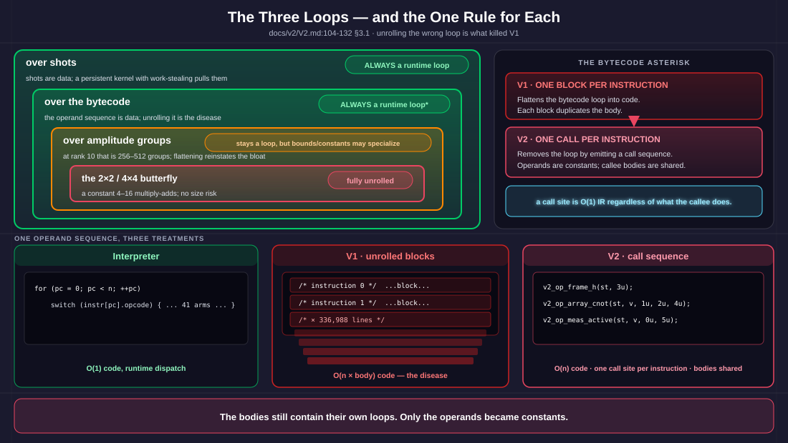
<figcaption><b>Figure 6.1</b> — The three nested loops. V1 flattened the middle
one into code. V2 replaces it with a call sequence whose <em>operands</em> are
constants but whose <em>bodies</em> are shared and still contain their own
loops.</figcaption>
</figure>

### 6.2 One operand library, compiled two ways

The substrate is `src/clifft/gpu/mlir/v2/v2_ops.h` + `v2_ops_body.inc`: every
opcode body as a `static inline` function taking its operands **and the pre-op
`active_k`** by value.

```c
static inline void v2_op_array_cnot(V2State* st, CV2Complex* v,
                                    u32 active_k, u32 a1, u32 a2);
static inline void v2_op_meas_dormant_static(V2State* st, u32 axis,
                                             u32 slot, u32 flags);
```

That signature is the whole trick. The **same source** serves two consumers:

- the **interpreter** (`coop_interpreter.c`) passes runtime values —
  `v2_op_array_cnot(st, v, st->active_k, in.axis_1, in.axis_2)`;
- the **specializer** (`v2_specializer.cc`) emits the same call with literals —
  `v2_op_array_cnot(st, v, 8u, 2u, 5u)`.

**Byte-exactness is by construction, not by testing.** The bodies are the same
bodies. This directly retires V1's duplication tax (§5.6).

The tier dimension is handled by preprocessor parameterization of *cooperation*,
not of arithmetic (`v2_ops.h:128-152`, quoted verbatim with the barrier body
elided to §11.2):

```c
#ifdef V2_REGISTER
#  define V2_STRIDE 1u
static inline u32 v2_tid(void)  { return 0u; }
static inline void v2_barrier(void) {}            // no cooperation, no barrier
#  define V2_REDUCE2(T, L0, L1, O0, O1) do { *(O0) = (L0); *(O1) = (L1); } while (0)
#  define IS_OWNER 1
#else
#  define V2_STRIDE 256u
static inline u32 v2_tid(void)  { return __builtin_amdgcn_workitem_id_x(); }
static inline void v2_barrier(void) { /* release fence; s_barrier; acquire fence — §11.2 */ }
#  define V2_REDUCE2(T, L0, L1, O0, O1) coop_reduce2((T), (L0), (L1), (O0), (O1))
#  define IS_OWNER (t == 0)
#endif
```

`V2_REDUCE2` in the register tier is not a stub for "reduction not needed" — it
is an assignment. A stride-1 loop over all amplitudes has already accumulated
both partial sums into `L0`/`L1`, so the cross-lane reduction degenerates to a
copy. Same call site, same argument list, two different meanings, zero runtime
branch.

**The same opcode arithmetic compiles two ways from one source.** Register tier:
1 shot/thread, private state, stride 1, reduction is the identity because a
stride-1 loop has already summed everything. Coop/global: 256 threads/shot,
stride 256, fenced barriers, butterfly reduction.

<figure>
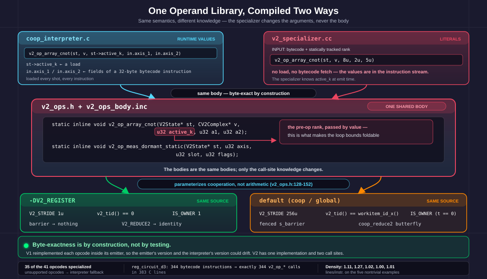
<figcaption><b>Figure 6.2</b> — The whole trick, in one signature. Two consumers
call the same <code>static inline</code> bodies; only the call-site knowledge
differs, so byte-exactness is by construction rather than by testing. The tier
macros below the library parameterize <em>cooperation</em>, not arithmetic.
35 of the 41 opcodes are specialized; unsupported opcodes fall back to the
interpreter.</figcaption>
</figure>

### 6.3 What the specializer emits

`v2_specializer.cc:26-97` is a `switch` over opcodes that prints exactly one
line each — 35 of the 41 opcodes are handled; the six that are not (the five
`*_FORCED` variants and `OP_EXP_VAL`) `return false`, which aborts emission and
falls the whole circuit back to the interpreter (`v2_specializer.cc:92-93`).

The register-tier `circuit_d3` output (`lowering/v2_src/reg_circuit_d3.c`, 383
lines for 344 instructions) is reproduced verbatim below, lines 1–3 and 15–25
and 42–49 and 360–361, with `…` marking the elisions:

```c
#define V2_REGISTER 1
#define V2_NOISE_ATTR __attribute__((noinline))
#include "clifft/gpu/mlir/v2/v2_ops.h"
…
    v2_shot_init(st, v, amp_capacity, shot_id, num_observables, seed, noise_hazards, num_noise_sites);
    v2_op_meas_dormant_static(st, 6u, 33u, 0u);
    v2_op_meas_dormant_static(st, 8u, 32u, 0u);
    v2_op_meas_dormant_static(st, 11u, 31u, 0u);
    v2_op_meas_dormant_random(st, 13u, 30u, 0u);
    v2_op_meas_dormant_random(st, 5u, 29u, 0u);
    v2_op_meas_dormant_random(st, 0u, 28u, 0u);
…
    v2_op_noise_block(st, noise_sites, noise_channels, noise_hazards, num_noise_sites, 0u, 131u);
    v2_op_frame_cnot(st, 3u, 10u);
    v2_op_frame_cnot(st, 3u, 12u);
    v2_op_frame_cz(st, 3u, 6u);
    v2_op_frame_cz(st, 3u, 8u);
    v2_op_frame_swap(st, 3u, 0u);
    v2_op_frame_h(st, 0u);
    v2_op_expand_t(st, v, 0u, 0u, 1);          // <- active_k = 0, tracked statically
…
    v2_shot_aggregate(st, block_counts, num_observables, expected_obs_mask);
}
```

**Count check.** Lines 16–360 of that file contain exactly **344** `v2_op_*`
call statements, one per bytecode instruction, no more and no fewer. The 39
non-call lines are the 14-line `spec_body` signature, the `v2_shot_init` /
`v2_shot_aggregate` bracket, and the 21-line kernel wrapper at 363–383.

Every operand is a literal. Note `v2_op_expand_t(st, v, **0u**, 0u, 1)`: the
third argument is `active_k`, which the specializer tracks statically as it
walks the program. The mechanism is visible in the emitter itself — every
rank-changing case both *prints* the current `*k` and *updates* it
(`v2_specializer.cc:42-56`):

```cpp
    case Opcode::OP_EXPAND:
        o << "v2_op_expand(st, v, " << *k << "u);"; ++*k; break;
    case Opcode::OP_EXPAND_T:
        o << "v2_op_expand_t(st, v, " << *k << "u, " << a1 << "u, 0);"; ++*k; break;
    …
    case Opcode::OP_MEAS_ACTIVE_DIAGONAL:
        o << "v2_op_meas_active_diagonal(st, v, " << *k << "u, " << a1 << "u, "
          << a << "u, " << flags << "u);";
        if (*k) --*k; break;
```

**The interpreter must load `st->active_k` after every rank-changing op; the
specializer knows it at emission time.** §7.3 measures what that alone is worth.

Two details in that switch are worth noticing because they are free wins that
fall out of the "one call per instruction" shape:

- `OP_FRAME_S` and `OP_FRAME_S_DAG` emit the *same* call
  (`v2_specializer.cc:35-36`); so do `OP_ARRAY_S`/`OP_ARRAY_S_DAG` and
  `OP_ARRAY_T`/`OP_ARRAY_T_DAG`, differing only in a literal `0`/`1` dagger flag.
  Six opcodes collapse to three call sites with a constant argument — which the
  optimizer then resolves to two distinct specializations of each body.
- `OP_DETECTOR` emits `v2_op_detector();` — a call taking *no arguments at all*.
  The detector's work is entirely compile-time in the specialized path.
- `OP_POSTSELECT` is the one case that emits control flow rather than a
  statement: `if (v2_op_postselect(...)) return;`. A shot that fails
  post-selection exits `spec_body` directly, with no flag to test at the next
  instruction.

**The measured invariant.** `V2_performance/lowering/ir_density.csv`:

| circuit | instrs | v2 C lines | **lines/instr** |
|---|---|---|---|
| reg_frame_h | 4 | 43 | 10.75 |
| reg_four_t | 11 | 49 | 4.45 |
| reg_circuit_d3 | 344 | 383 | **1.11** |
| coop_qv10 | 140 | 179 | **1.27** |
| coop_circuit_d5 | 1,720 | 1,760 | **1.02** |
| coop_surface_d7_t10 | 4,134 | 4,174 | **1.00** |
| glob_surface_d7_t19 | 4,296 | 4,346 | **1.01** |

**One line of source per bytecode instruction, plus a fixed ~40-line kernel
wrapper.** The two register-tier outliers are entirely that wrapper amortized
over 4 and 11 instructions; by 344 it has vanished into the noise.

Against V1's 55–2,407 lines/instr and Hybrid's 15–56, this is a different
*asymptotic class* of code generator, not a tuning improvement.

### 6.4 The compile pipeline — no MLIR, no HIP

The directory is named `mlir/v2/`. **That name is the only MLIR left in V2.**
`v2_specializer.cc:127` emits a C translation unit whose first include is
`"clifft/gpu/mlir/v2/v2_ops.h"`, and `v2_compile_cache.cc:151-176` compiles it
with the raw LLVM toolchain:

```cpp
// 1) C -> amdgcn bitcode. Flags are IDENTICAL to the build-time interpreter
// pipeline (ClifftAmdgcn.cmake) so the shared v2_op_*() bodies compile to the
// same code -> byte-exact. -ffp-contract=off with no fast-math is what makes
// that hold regardless of inlining decisions: without reassociation or
// contraction the optimizer cannot change an FP result.
clang --target=amdgcn-amd-amdhsa -mcpu=gfx950 \
      -ffreestanding -nostdlib -nogpulib -std=c23 -O2 -ffp-contract=off \
      -emit-llvm -c -o spec.bc spec.c

// 2) link ocml + oclc controls (identical set to ClifftAmdgcn.cmake)
llvm-link -o linked.bc spec.bc ocml.bc ockl.bc \
      oclc_wavefrontsize64_on.bc oclc_daz_opt_off.bc oclc_finite_only_off.bc \
      oclc_unsafe_math_off.bc oclc_correctly_rounded_sqrt_on.bc \
      oclc_abi_version_500.bc oclc_isa_version_950.bc

opt -O2 -o linked.bc linked.bc                                    // 3
llc -mtriple=amdgcn-amd-amdhsa -mcpu=gfx950 \
    -mattr=+wavefrontsize64 -filetype=obj -O2 -o spec.o linked.bc  // 4
ld.lld -shared -o spec.hsaco spec.o                                // 5
```

Three things about this deserve emphasis.

**No HIP anywhere.** Not as a source language, not as a runtime, not as a
packaging format. Contrast Hybrid, which had to emit HIP, produce a Clang
Offload Bundle, then unbundle it to get an ELF that HSA would accept (§4.2). V2
targets `amdgcn-amd-amdhsa` directly and gets a plain ELF from `ld.lld`. §13
covers why this matters beyond aesthetics.

**The flags are identical to the build-time interpreter's**, deliberately and
with a comment that reads as an instruction to future maintainers
(`v2_compile_cache.cc:155-156`):

> `Do NOT add vectorize/unroll/fast-math flags that would diverge from the interpreter.`

`-ffp-contract=off`, no fast-math: without reassociation or FMA contraction,
**the optimizer cannot legally change a floating-point result**, so the
specialized kernel and the interpreter agree bit for bit no matter what inlining
decisions differ between them. Hybrid did the opposite — `kernel_cache.cc:115`
compiles its HIP with `-O2 -ffast-math`. V2 cannot, and the reason is §2.4: a
1-ULP difference flips a sampling branch and desynchronizes the PRNG forever.
Hybrid got away with it because Hybrid was never byte-compared against the CPU
reference.

Note also `-mattr=+wavefrontsize64` at step 4 and `oclc_wavefrontsize64_on.bc`
at step 2. gfx950 supports wave32; V2 pins wave64 in both the device-library
control set and the backend because the coop tier's `V2_STRIDE 256u` and its
`V2_RED_WARPS` reduction geometry are written for 64-lane waves.

**Compilation is cached and never on the sampling path**, and the cache key is
the part that has already gone wrong once. `v2_compile_cache.cc:125-127`:

```cpp
std::string ident = csrc + "|" + llvm_bin("clang") + "|" + arch() + "|" +
                    bitcode_dir() + "|" + device_header_ident();
size_t h = std::hash<std::string>{}(ident);
```

That last term is a repair. The key originally hashed only `csrc` — the
*generated* C — which is barely half the translation unit: every `v2_op_*` body,
`v2_barrier()`, and every tunable constant lives in the included headers. A
header fix therefore produced the same key, and the stale `.hsaco` **plus its
stale `.gate` verdict** silently won. §11.4 documents the benchmark run this
destroyed. The fix hashes the contents of all three device headers
(`v2_ops.h`, `v2_ops_body.inc`, `device_abi.h`) into the key — content, not
mtime, since mtimes change on every checkout and would defeat the cache for no
reason.

### 6.5 The correctness gate

Specialization is a compiler, and compilers have bugs. V2 does not ask you to
trust it: `v2_kernel.cc:370-398` validates each freshly compiled `.hsaco`
against the interpreter on a shot sample, and **persists the verdict to disk**:

```cpp
// The verdict is written to "<spath>.gate" so it is computed ONCE ever (not
// per process) and NEVER re-run during a profiled sample dispatch -- the
// gate's own validation dispatches would otherwise pollute rocprofv3 traces.
std::string gate_path = spath + ".gate";
if (std::FILE* gf = std::fopen(gate_path.c_str(), "r")) {   // disk cache hit
    int v = 0; if (std::fscanf(gf, "%d", &v) != 1) v = 0;
    validated = (v == 1);
} else {                                                     // compute once
    validated = specialized_matches_interpreter(program, spath, spec_sym);
    ...
}
if (validated) { load_path = spath; sym = spec_sym.c_str(); }
else spec_sym.clear();                                       // -> interpreter
```

On failure the circuit silently falls back to the interpreter — and so does a
thrown exception anywhere in emission or compilation (`v2_kernel.cc:399-403`),
which is what makes the six unsupported opcodes safe rather than fatal. **This
guarantees byte-exactness for every circuit, not just the ones that happened to
be tested.**

<figure>
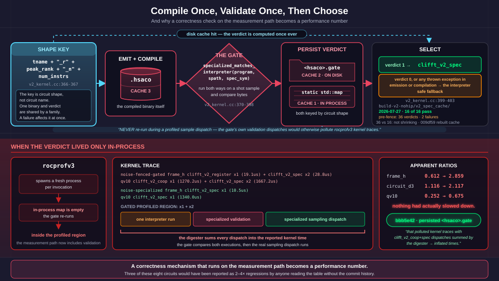
<figcaption><b>Figure 6.3</b> — Compile once, validate once, then choose. The
verdict caches in three places, and the bottom half shows what happened the one
time it did not reach disk: <code>rocprofv3</code> spawns a fresh process, the
in-process map is empty, the gate re-runs <em>inside</em> the profiled region,
and the digester sums all three dispatches into one reported kernel
time.</figcaption>
</figure>

Three design details are load-bearing and easy to miss:

1. **The verdict caches in three places, not one** — an in-process
   `static std::map` keyed by circuit shape, then the on-disk `.gate` file,
   then the `.hsaco` itself. The comment explains the third one:
   *"NEVER re-run during a profiled sample dispatch — the gate's own validation
   dispatches would otherwise pollute rocprofv3 kernel traces."* A correctness
   check that perturbs the measurement is a correctness check you stop running.
2. **The key is the circuit *shape*, not its name** — `tname + "_r" + peak_rank
   + "_n" + num_instrs` (`v2_kernel.cc:366-367`). `circuit_d5_p0.001` and
   `cultivation_d5` compile to the same `coop_r10_n1720` key when their
   bytecode has the same rank and length, so they share one gate verdict and one
   `.hsaco`. That is why §11.1's failure took out a whole *family* at once.
3. **The gate does not tell you *what* is wrong**, only that something is. Both
   diagnostics that exist (`V2_GATE_VERBOSE`, `V2_GATE_BISECT`) had to be added
   during §11.2's investigation.

**Verdicts on disk (2026-07-27, `build-v2-nohip/v2_spec_cache/`): 16 of 16
pass.**

```
$ for f in build-v2-nohip/v2_spec_cache/*.gate; do echo "$(cat $f) $(basename $f .hsaco.gate)"; done
1 coop_r10_n140_7b3194ac269d23a9
1 coop_r10_n140_ad02701c918c6f1b
1 coop_r10_n1720_48e8389e3cb74acb      <- the shape that used to fail
1 coop_r10_n1720_847f167402847a8b      <- and its sibling hash
1 coop_r10_n4371_e333cefd1e929cb
1 coop_r7_n16374_b38b86d5770ce20a
1 coop_r7_n4134_197aaf5bcd540fb1
1 coop_r7_n4134_60919e543cb4cced
1 coop_r7_n8859_74c4fcdbba5a0374
1 reg_r0_n11_dc388d7dcd2a8cf0
1 reg_r0_n4_47d470a8aeec1399
1 reg_r0_n4_833175afc86f6aea
1 reg_r3_n4151_3a83fd16f93a5eea
1 reg_r3_n4151_f11fad7b253aa1df
1 reg_r4_n344_7378b9a76010d9be
1 reg_r4_n344_bcf40c29ff41f709
```

Note that shapes now appear in pairs under two different hashes. The shape key
(`coop_r10_n1720`) identifies the *circuit*; the trailing hash covers the
toolchain, arch, bitcode directory and device-header contents, so a header edit
legitimately produces a second entry for the same circuit. That is
`device_header_ident` doing exactly the job §6.4 describes.

Read that against the quarantined cache the report's earlier benchmark actually
ran (`V2_performance/history/stale_spec_cache_20260725/`, 36 verdicts):

| cache | verdicts | failures |
|---|---|---|
| `history/stale_spec_cache_20260725/` (pre-fence, pre-dust) | 36 | **2** — `coop_r10_n1720_977e1e83…`, `coop_r10_n1720_cadfdf19…` |
| `build-v2-nohip/v2_spec_cache/` (current HEAD) | 16 | **0** |

Two things follow, and both matter for how the rest of this report is read.
**First, the gate failure is fixed**: the shape that produced the only two zeros
in the corpus now produces a one. §11.2 is the story of what was actually wrong.
**Second, the two caches are not comparable on count** — 36 versus 16 is not a
shrinking corpus, it is a cache that was rebuilt from scratch after `009df59`
changed the key, and has since only been populated by the circuits that have
been re-run. It was at 6 entries earlier on the day this section was written and
is at 16 now, growing as §15's full-corpus run repopulates it.

### 6.6 The specializer is opt-in

`getenv("V2_SPECIALIZE")` (`v2_kernel.cc:358`). Unset, V2 runs its bytecode
interpreter.

This is a real hazard when reading any V2 benchmark. **With `V2_SPECIALIZE`
unset, a benchmark measures V2's interpreter against SVM's tuned interpreter and
reports what looks like a 2–3× regression.** Every number in this report was
produced with it set; §11.4 shows what happens when a stale gate verdict un-sets
it for you.

### 6.7 The three tier wrappers

One `spec_body`, three wrappers (`v2_specializer.cc:172-225`). `spec_body` takes
21 parameters; the first five are the tier-dependent ones (state, amplitudes,
scratch, capacity, shot id) and the remaining 16 are identical across tiers —
emitted once into a `const char* fwd` at `v2_specializer.cc:166-170` and reused
verbatim by each branch, so the tier choice cannot accidentally change what the
body receives.

Every wrapper opens with the same line:

```c
    (void)peak_rank; (void)num_instrs; (void)instrs; (void)total_meas_slots;
```

Those four kernel arguments are what the *interpreter* runs on: the bytecode
pointer, its length, the rank, and the measurement-slot count. The specialized
kernel takes them because the kernarg layout must stay identical (one dispatch
path, two kernels), and then **discards all four**. That single line is the
specialization thesis in the ABI: the program is no longer an input.

**Register** — one shot per thread, statevector in VGPRs:

```c
#define V2_REG_MAX_AMP 16
__attribute__((amdgpu_kernel, visibility("default")))
void clifft_v2_spec(...) {
    u64 shot_id = shot_offset + ((u64)v2_bid() * 256ul + __builtin_amdgcn_workitem_id_x());
    if (shot_id >= shots) return;
    V2State st; CV2Complex vloc[V2_REG_MAX_AMP]; CV2Complex sloc[V2_REG_MAX_AMP/2];
    spec_body(&st, vloc, sloc, V2_REG_MAX_AMP, shot_id, ...);
}
```

**Coop** — one workgroup per shot, everything in LDS:

```c
extern __attribute__((address_space(3))) CV2Complex lds_v[V2_MAX_AMP];
extern __attribute__((address_space(3))) CV2Complex lds_red_scratch[V2_SCRATCH_AMP];
extern __attribute__((address_space(3))) V2State lds_state;
void clifft_v2_spec(...) {
    u64 shot_id = shot_offset + (u64)v2_bid();
    if (shot_id >= shots) return;
    spec_body((V2State*)&lds_state, (CV2Complex*)lds_v, (CV2Complex*)lds_red_scratch, ...);
}
```

**Global** — a persistent pool draining shots from an atomic counter, with the
amplitude capacity folded to a literal:

```c
void clifft_v2_spec(..., CV2Complex* global_v, CV2Complex* global_scratch, u64* work_counter) {
    u32 t = v2_tid(), slot = v2_bid();
    const u64 amp_capacity = 8192ull;                    // <- 1<<peak_rank, a constant
    CV2Complex* v       = global_v       + (u64)slot * amp_capacity;
    CV2Complex* scratch = global_scratch + (u64)slot * (amp_capacity >> 1);
    for (;;) {
        if (t == 0) lds_shot = __atomic_fetch_add(&work_counter[0], 1UL, __ATOMIC_RELAXED);
        v2_barrier();
        u64 batch_shot = lds_shot;
        if (batch_shot >= shots) return;
        spec_body((V2State*)&lds_state, v, scratch, (u32)amp_capacity, shot_offset + batch_shot, ...);
        v2_barrier();
    }
}
```

<figure>
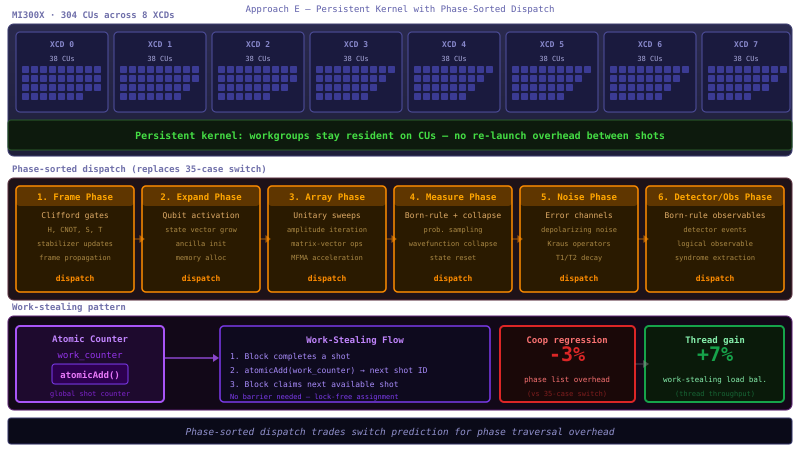
<figcaption><b>Figure 6.4</b> — The global tier's persistent kernel. A fixed
pool of resident workgroups, each owning an HBM amplitude slice, drains shots
from an atomic counter. The grid does not scale with shot count.</figcaption>
</figure>

The resident pool is sized from an **HBM budget** rather than from the rank cap
(`v2_kernel.cc:436-445`):

```cpp
const uint64_t amp = 1ull << flat.peak_rank;
const uint64_t bytes_per_wg = amp * sizeof(GpuComplex) + (amp / 2) * sizeof(GpuComplex);
const uint64_t budget = 32ull << 30;  // 32 GB
uint64_t wgs = budget / bytes_per_wg;
if (wgs < 1) wgs = 1;               // rank 26+: at least one resident wg
if (wgs > 2048) wgs = 2048;
global_grid_wgs = static_cast<uint32_t>(wgs);
// Prefer a multiple of the XCD count when the budget allows it, so the
// resident pool spreads evenly; never inflate past the budget.
if (global_grid_wgs > kNumXCDs) global_grid_wgs -= global_grid_wgs % kNumXCDs;
```

`GpuComplex` is `{float re; float im;}` — 8 bytes (`gpu_types.h:38-41`) — so
`bytes_per_wg` is a slice plus a half-size scratch, i.e. **12 bytes per
amplitude**. Three clauses, each doing distinct work: the budget divide, a floor
of 1 so rank 26 is *possible* rather than *fast*, a ceiling of 2,048, and a
round-down to a multiple of `kNumXCDs = 8` so the resident pool spreads evenly
across the device's eight compute dies.

Evaluating that arithmetic gives the resident pool at every global-tier rank:

| peak rank | MiB / workgroup | resident workgroups | regime |
|---|---|---|---|
| 11–19 | 0.02 – 6.00 | **2048** | ceiling-limited |
| 20 | 12.00 | **2048** | ceiling-limited (last one) |
| 21 | 24.00 | **1360** | budget-limited |
| 22 | 48.00 | **680** | budget-limited |
| 23 | 96.00 | **336** | budget-limited |
| 24 | 192.00 | **168** | budget-limited |
| 25 | 384.00 | 80 | budget-limited |
| 26 | 768.00 | 40 | budget-limited |

**Rank 20 is the knee.** Below it the pool is flat at the 2,048 ceiling and rank
costs nothing in occupancy; from 21 up, every added qubit halves the resident
pool. §10 shows this table's five measurable rows (20–24) reproducing exactly in
the observed `Grid_Size_X ÷ 256`, and §15 shows the performance decay that
follows from it — a geometric loss that is *by design*, not a bug, and is why
§10 covers what made rank > 19 possible at all rather than what made it fast.

---

## 7. What V2 specializes — eight classes, eight experiments

Chapter 6 described the mechanism: the specializer emits one `v2_op_*()` call
per bytecode instruction, with the operands and the statically-tracked
`active_k` written out as C literals. This chapter answers the obvious follow-up
question — *what does that actually buy, per opcode family?* — and it answers it
with measurements rather than with reasoning about what the compiler ought to
do.

### 7.1 The experiment

Eight cases, one per specialization class. Each case is a single `.c` file that
compiles **twice from the same source**, calling the **identical** `v2_op_*`
body out of `v2_ops.h`:

| Build | Meaning |
|---|---|
| `-DSPEC_FORM=0` | **interpreter form** — operands arrive in a `CV2Instr` loaded from device memory at a runtime `pc`, exactly as `coop_interpreter.c`'s `for(pc) switch` supplies them |
| `-DSPEC_FORM=1` | **specialized form** — operands are the literal constants `v2_specializer.cc` emits for that instruction |

The two forms differ in **exactly one variable**: whether the operands were
compile-time constants. Everything else — the op body, the tier macro, the
compiler, the flags — is held fixed. The flags are the production flags copied
out of `v2_compile_cache.cc`:

```
clang --target=amdgcn-amd-amdhsa -mcpu=gfx950 -ffreestanding -nostdlib -nogpulib \
      -std=c23 -O2 -ffp-contract=off -I<root>/src -S
```

One methodology point deserves quoting, because getting it wrong would have
inflated every number in this chapter. From `spec_examples/harness.h`:

> The interpreter form reads its operands out of `instrs`, a plain
> `const CV2Instr*` kernel argument indexed by a runtime `pc`, which is exactly
> how `coop_interpreter.c`'s `for(pc)switch` supplies them. **NOT volatile:**
> marking it volatile would force system-coherent (`sc0 sc1`) reads the real
> interpreter never issues and would overstate the interpreter's cost. The
> operands are unknowable at compile time simply because `instrs` points at
> device memory.

So the interpreter form is not a strawman. It is given every optimization the
real interpreter gets; the only thing withheld is knowledge of the operand
values. The harness kernel signature is the same in both builds:

```c
#define CASE_KERNEL_HEAD                                                    \
    __attribute__((visibility("default"))) __attribute__((amdgpu_kernel))   \
    void case_kernel(V2State* st, CV2Complex* v, CV2Complex* scratch,       \
                     const CV2Instr* instrs, u32 pc,                        \
                     const CV2FusedU2Entry* fused_u2, ...)

#define IN(n) (instrs[pc + (n)])   // fetch instruction pc+n, the interpreter's access pattern
```

Metrics are scraped from the emitted assembly by `build_examples.sh`:
instruction count, `num_vgpr`/`numbered_sgpr`/`private_seg_size` from the
AMDGPU `.set` directives, and counts of `s_load`, `ds_read`/`ds_write`, `v_*`,
and `s_cbranch`/`s_branch`. Raw output is in
`V2_performance/lowering/spec_examples/stats.csv`; the `.s` files for both forms
of all eight cases are checked in alongside it, and `build_examples.sh`
reproduces all sixteen byte-for-byte (`ARCH` defaults to `gfx950`; the
register-tier cases additionally get `-DV2_REGISTER=1`, which is what selects
`V2_STRIDE 1` over `V2_STRIDE 256`).

### 7.2 A measurement note, because an earlier draft of this chapter got it wrong

The first version of the harness reported an *ISA line count* — `wc -l` of the
`.s` file. That number is dominated by assembler directives, comments, labels
and the AMDGPU metadata block: the non-instruction remainder is 199–316 lines
per case, which for these small kernels is 41–82 % of the file. Because that
overhead is nearly constant across the two forms — it differs by 4–23 lines
where the instruction counts differ by up to 126 — it diluted every ratio
toward 1.0 and systematically *understated* the effect this chapter is about.
S1 read 1.37× where the instruction ratio is 2.89×; every case moved the same
direction:

| Case | line ratio (wrong) | instruction ratio (right) |
|---|---|---|
| S1 | 1.37× | 2.89× |
| S2 | 1.59× | 2.94× |
| S3 | 1.30× | 1.98× |
| S4 | 1.23× | 1.38× |
| S5 | 1.44× | 2.56× |
| S6 | 1.26× | 1.71× |
| S7 | 1.07× | 1.10× |
| S8 | 1.14× | 1.35× |

The table below counts instructions — tab-indented lines that are neither
`.directive` nor `; comment`. Two further bugs are fixed in the same pass: the
resource columns were scraped from the `; NumVgprs:` comment, which LLVM emits
as a *symbolic expression* (`max(56, amdgpu.max_num_vgpr)`) for any kernel that
calls an external function — so S7, which calls `__ocml_log_f64`, scraped to
**0** and appeared to use no vector registers at all, when it in fact uses 56 in
both forms — and `; NumSgprs:` does not appear in this LLVM's output at all
(only `; TotalNumSgprs:`, itself symbolic), so that column read 0 for all
sixteen files. All three are read from the `.set` directives now.

A third, subtler bug is documented in `build_examples.sh:38-42` and is worth
repeating because it is the kind that produces a *plausible* wrong answer:

> A literal tab, not the escape: `/usr/bin/grep` here is ugrep, which does not
> expand `\t` inside an ERE when the script runs non-interactively (it does when
> typed at a prompt — so this silently counted 0 in batch and the right number
> by hand).

An instruction count that reads 0 in the CSV and the correct value when checked
by hand at a prompt is worse than one that is simply wrong.

```
S1_frame_cnot    instrs  136->47   (2.89x)  vgpr   8->3    v_alu   44->8    (5.50x)  branch   6->4
S2_meas_dormant  instrs  206->70   (2.94x)  vgpr  25->14   v_alu   86->19   (4.53x)  branch  18->0
S3_expand_rank   instrs  164->83   (1.98x)  vgpr  18->8    v_alu   67->27   (2.48x)  branch   9->6
S4_meas_active   instrs  331->240  (1.38x)  vgpr  24->14   v_alu  139->96   (1.45x)  branch  15->7
S5_array_cnot    instrs  207->81   (2.56x)  vgpr  16->8    v_alu   84->33   (2.55x)  branch  10->8
S6_array_u2      instrs  147->86   (1.71x)  vgpr  24->18   v_alu   54->42   (1.29x)  branch  10->2
S7_noise_block   instrs  447->407  (1.10x)  vgpr  56->56   v_alu  214->210  (1.02x)  branch  23->20
S8_apply_pauli   instrs  185->137  (1.35x)  vgpr  22->21   v_alu   71->63   (1.13x)  branch   3->3
```

With the scalar-memory and register columns, which is where the story actually
is:

| Case | Class | Tier | instrs | VALU | VGPR | SGPR | `s_load` | `ds_*` | branch |
|---|---|---|---|---|---|---|---|---|---|
| S1 | frame operand folding | register | 136→47 (2.89×) | 44→8 (5.50×) | 8→3 | 14→12 | 6→3 | 0→0 | 6→4 |
| S2 | flag folding | register | 206→70 (2.94×) | 86→19 (4.53×) | 25→14 | 13→26 | 9→4 | 0→0 | **18→0** |
| S3 | static rank tracking | coop | 164→83 (1.98×) | 67→27 (2.48×) | 18→8 | 16→10 | 6→4 | 0→0 | 9→6 |
| S4 | rank-folded reduction | coop | 331→240 (1.38×) | 139→96 (1.45×) | 24→14 | 30→26 | 7→5 | **4→4** | 15→7 |
| S5 | scatter-index folding | coop | 207→81 (2.56×) | 84→33 (2.55×) | 16→8 | 24→10 | **4→1** | 0→0 | 10→8 |
| S6 | fused-matrix lookup | coop | 147→86 (1.71×) | 54→42 (1.29×) | 24→18 | 23→16 | 12→7 | 0→0 | 10→2 |
| S7 | noise runtime loop | register | 447→407 (1.10×) | 214→210 (1.02×) | 56→56 | 86→85 | 9→5 | 0→0 | 23→20 |
| S8 | Pauli-mask index | register | 185→137 (1.35×) | 71→63 (1.13×) | 22→21 | 44→42 | 17→11 | 0→0 | 3→3 |

Four things fall out of this table immediately, and they set up the rest of the
report:

1. **The VALU ratios still exceed the instruction ratios, but the gap is now
   honest.** S1 deletes 82 % of its vector ALU work and 65 % of its
   instructions.

   An earlier draft of this chapter claimed the deleted VALU work was *replaced
   by scalar work* — "the same computation moved from the vector pipe to the
   scalar pipe" — and pointed at S2's SGPR column as the tell. **That claim is
   wrong, and the data in this very table refutes it.** Counting scalar
   instructions the same way the table counts vector ones:

   | Case | SALU interp→spec | ratio | VALU interp→spec | ratio |
   |---|---|---|---|---|
   | S1 | 74→35 | 2.11× | 44→8 | 5.50× |
   | S2 | 93→45 | 2.07× | 86→19 | 4.53× |
   | S3 | 84→48 | 1.75× | 67→27 | 2.48× |
   | S4 | 133→93 | 1.43× | 139→96 | 1.45× |
   | S5 | 102→33 | **3.09×** | 84→33 | 2.55× |
   | S6 | 83→36 | 2.31× | 54→42 | 1.29× |
   | S7 | 177→141 | 1.26× | 214→210 | 1.02× |
   | S8 | 87→49 | 1.78× | 71→63 | 1.13× |

   **Scalar instructions fall in all eight cases**, and in S5, S6 and S8 they
   fall *faster* than vector instructions. Nothing moved to the scalar pipe;
   scalar work was deleted too, and on the array ops it was deleted harder.
   §14.3 confirms this at corpus scale — the SALU count falls faster than the
   VALU count on **26 of 26** circuits, and the *absolute* number of scalar
   instructions removed exceeds the vector count removed by ~3.8× on the surface
   family. The mechanism is deletion, not substitution.

   What survives of the original observation is narrower and still true: the
   *register* column can go up where the *instruction* column goes down (S2's
   SGPR 13→26), because straight-line scalar code holding many folded literals
   needs somewhere to hold them. That is a register-pressure effect, not a
   work-migration effect.
2. **The spread is enormous — 5.50× down to 1.02× on VALU.** Specialization is
   not a uniform multiplier. It is worth a great deal on frame/flag/index ops
   and almost nothing on data-dependent ops. Which opcodes a circuit is made of
   therefore predicts its speedup, and §14 confirms that it does.
3. **S7 is the negative result, and it is in the table on purpose.** 1.10×
   instructions, 1.02× VALU, and — now that the column is read correctly —
   **VGPR 56→56, unchanged**. The noise block is genuinely data-dependent; there
   is nothing to fold, and specialization does not even relieve register
   pressure. This is the case that predicts the `circuit_d5` regression in §11.1,
   and the corrected register number strengthens that prediction rather than
   weakening it.
4. **S2 is the one case where SGPR pressure goes *up*, 13→26** — while its
   scalar *instruction* count falls 93→45 and its branch count falls to zero.
   Fewer scalar instructions, more scalar registers: the eighteen deleted
   branches were replaced by `s_cselect`s over folded literals, and those
   literals have to live somewhere. On the register tier this is a good trade —
   SGPRs are not the occupancy limiter there — but it is worth flagging as the
   one place specialization *costs* something measurable, and as the reason the
   register columns and the instruction columns must be read separately.

<figure>

<figcaption><b>Figure 7.1</b> — Per-class specialization gains, three bars per
case: instructions, VALU and SALU, ordered by VALU ratio. All three fall in all
eight cases; on S5, S6 and S8 the SALU bar is the tallest, which is the
microbenchmark form of the corpus-scale finding in §14.3. S7 (noise) is flat on
all three, and flat on registers too.
</figcaption>
</figure>

The remaining sections take each class in turn: the op body, the two call
forms, and what the assembly diff shows.

---

### 7.3 S1 — frame operand folding

**The op.** `OP_FRAME_CNOT` touches only the Pauli frame. Two bit reads, two bit
XORs, at word/bit offsets derived from the axes (`v2_ops_body.inc:12-19`):

```c
static inline __attribute__((always_inline)) void v2_op_frame_cnot(V2State* st, u32 ctrl, u32 tgt) {
    u32 t = v2_tid();
    if (IS_OWNER) {
        int px_c = fget(st->px, ctrl), pz_tt = fget(st->pz, tgt);
        fxor(st->px, tgt, px_c); fxor(st->pz, ctrl, pz_tt);
    }
    v2_barrier();
}
```

`fget`/`fxor` are `(w[a >> 6] >> (a & 63)) & 1` style bit accessors. With a
**constant** axis, `a >> 6` and `a & 63` are compile-time; the word index
becomes a fixed offset and the bit becomes a fixed mask. With a **runtime** axis
each access costs a shift/mask chain *plus a dynamic index* into `st->px` /
`st->pz`.

**The two forms** (`cases/S1_frame_cnot.c`):

```c
#if SPEC_FORM
    v2_op_frame_cnot(st, 3u, 10u);
    v2_op_frame_cnot(st, 3u, 12u);
    v2_op_frame_cz(st, 3u, 6u);
#else
    CV2Instr i0 = IN(0), i1 = IN(1), i2 = IN(2);
    v2_op_frame_cnot(st, i0.axis_1, i0.axis_2);
    v2_op_frame_cnot(st, i1.axis_1, i1.axis_2);
    v2_op_frame_cz(st, i2.axis_1, i2.axis_2);
#endif
```

**What the assembly shows.** This is the single clearest diff in the whole
study, so it is worth reading both sides. The specialized form, in full:

```asm
case_kernel:
	s_load_dwordx2 s[0:1], s[0:1], 0x0
	s_mov_b32   s7, 0
	s_waitcnt   lgkmcnt(0)
	s_load_dwordx2 s[4:5], s[0:1], 0x0
	s_load_dwordx2 s[2:3], s[0:1], 0x28
	s_waitcnt   lgkmcnt(0)
	s_and_b32   s6, s4, 8               ; fget(px, 3)  -> a constant mask
	s_cmp_eq_u64 s[6:7], 0
	s_cbranch_scc1 .LBB0_2
	s_xor_b32   s4, s4, 0x400           ; fxor(px, 10) -> a constant mask
	v_mov_b32_e32 v2, 0
	v_mov_b64_e32 v[0:1], s[4:5]
	global_store_dwordx2 v2, v[0:1], s[0:1]
	s_and_b32   s6, s2, 0x400
	...
```

Every frame access is `s_and_b32` / `s_xor_b32` against a **literal mask** on
the **scalar** unit. The full set of masks in the specialized kernel is `8`,
`0x400`, `0x1000` and `64` — respectively bit 3 (`ctrl=3`), bit 10 and bit 12
(the two CNOT targets) and bit 6 (the CZ target), each appearing exactly where
the source says it should.

Three CNOT/CZ ops compile to **8 VALU instructions total, and all 8 are `v_mov`**
— four `v_mov_b32_e32 v2, 0` supplying the zero address offset and four
`v_mov_b64_e32 v[0:1], s[..]` staging a scalar result into a vector register for
`global_store`. Not one arithmetic vector instruction survives. The frame logic
itself has left the vector pipe entirely; what remains is purely the
scalar→vector staging the store instruction's encoding requires.

The interpreter form for the identical three ops. The instruction fetch
(`interp/S1_frame_cnot.s:9-18`):

```asm
	s_load_dword s6, s[0:1], 0x20       ; pc
	s_load_dwordx2 s[2:3], s[0:1], 0x18 ; instrs
	v_mov_b32_e32 v3, 0
	s_load_dwordx2 s[0:1], s[0:1], 0x0
	s_waitcnt lgkmcnt(0)
	s_mul_i32 s7, s6, 40                ; pc * sizeof(CV2Instr) -- address math
	s_mul_hi_u32 s5, s6, 40
	s_add_u32 s4, s2, s7
	s_addc_u32 s5, s3, s5
	global_load_dword v0, v3, s[4:5] offset:2   ; load the instruction
```

The `v_readfirstlane_b32 s9, v0` that moves the loaded operand to the scalar
unit follows five lines later, at `:23`, after an `s_waitcnt vmcnt(0)` that
stalls on the load. Then, for each frame access (`:34-46`, with three
interleaved scalar instructions for the *second* frame word elided):

```asm
	v_lshrrev_b32_e32 v2, 3, v0         ; a >> 6 -> word index, DYNAMIC
	v_and_b32_e32 v2, 0x1ff8, v2
	v_readfirstlane_b32 s2, v2
	s_load_dwordx2 s[6:7], s[0:1], s2 offset:0x0  ; dynamically-indexed frame word
	v_lshlrev_b64 v[0:1], v0, 1         ; 1 << (a & 63) -> bit mask, DYNAMIC
	s_waitcnt lgkmcnt(0)
	v_and_b32_e32 v4, s6, v0
	v_and_b32_e32 v5, s7, v1
	v_cmp_eq_u64_e32 vcc, 0, v[4:5]
```

Note the two `s_waitcnt`s. They are not incidental: the interpreter's operand
arrives from memory, so the dependent address math cannot issue until the load
retires, and the frame word it then addresses is itself a second dependent load.
The specialized form has no such chain — its masks are immediates in the
instruction encoding. It contains **2** `s_waitcnt`s against the interpreter
form's **15**, and both of the two guard the unavoidable two-step
kernel-argument load (kernarg → `st`, then `st` → the frame words).

Three separate costs are visible and all three disappear under specialization:

1. **Instruction fetch** — `s_mul_i32 s7, s6, 40` plus a `global_load_dword`,
   per instruction. The bytecode itself is a memory operand. (`40` is
   `sizeof(CV2Instr)`, which `device_abi_checks.cc:58` pins equal to
   `sizeof(GpuInstr)`; the multiply is `pc * sizeof(instr)` with a runtime `pc`,
   so it needs a 64-bit product — hence the `s_mul_i32`/`s_mul_hi_u32` pair and
   the `s_add_u32`/`s_addc_u32` that follow.)
2. **`v_readfirstlane_b32`** — the operand arrives in a *vector* register
   (it came from a `global_load` whose address is uniform but whose result the
   compiler must materialize in a VGPR), so it must be moved to the scalar unit
   before it can be used as an address. That is a cross-pipe transfer per
   operand.
3. **Dynamic bit math on the vector pipe** — `v_lshrrev_b32` / `v_and_b32` /
   `v_lshlrev_b64` to compute the word index and the bit mask. Under
   specialization these are *literals in the instruction encoding*.

The 44 → 8 VALU drop (5.50×) is the sum of (2) and (3), and the whole kernel
falls 136 → 47 instructions (2.89×) — the largest instruction-level gain in the
study. Note also VGPR 8 → 3: with the operands and masks resolved, the op needs
almost no vector registers, which directly raises tier occupancy (§9).

The scalar *registers* barely move, 14 → 12, because the same frame words are
still being read and XORed — they are simply addressed by literal masks now
instead of by computed ones. But the scalar *instruction count* falls
substantially, **74 → 35 (2.11×)**: the address arithmetic in (1), the
`v_readfirstlane` destinations in (2), and the mask construction in (3) were
scalar work as much as vector work, and specialization removes both.

> **This is the mechanism behind the SALU finding in §14.3, and it is a deletion
> mechanism.** V2's speedup is not "the same computation moved from the vector
> pipe to the scalar pipe" — an earlier draft said that, and §7.2's table
> refutes it. It is that *both* pipes issue less: the interpreter's operand
> fetch, dispatch and address arithmetic are pure overhead with respect to the
> simulation, and constants delete them outright. §14.3 shows the effect is
> larger on the scalar side, by an absolute margin of roughly 3.8× on the
> surface family.

<figure>
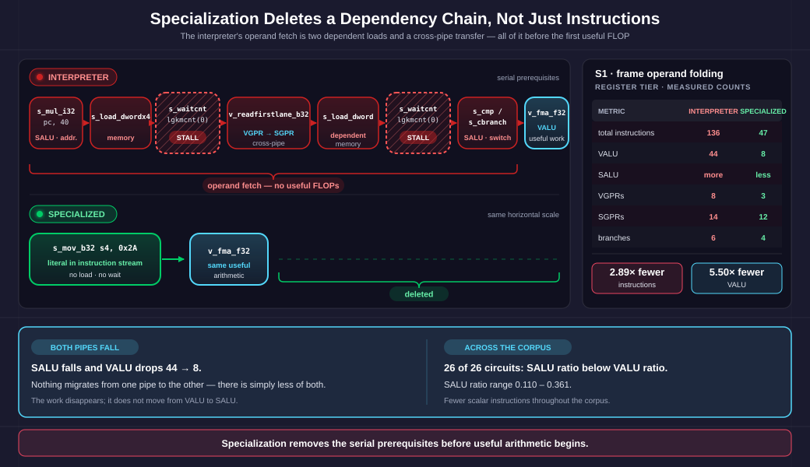
<figcaption><b>Figure 7.2</b> — What specialization deletes is a <em>serial
dependency chain</em>, not a set of scattered instructions. The interpreter must
compute an address, load, wait, move the operand across pipes, and load again
before the first useful FLOP; the specialized form has the operands as literals
in the instruction stream. Both pipes issue less — the work does not migrate
from VALU to SALU. The mnemonics illustrate the chain's shape, drawn from the
disassembly excerpt above; they are structural, not counted.</figcaption>
</figure>

---

### 7.4 S2 — flag folding on dormant measurements

**The op.** `OP_MEAS_DORMANT_STATIC` writes a measurement slot without touching
the amplitude array. `flags` selects between a constant-outcome path
(`FLAG_IDENTITY`) and a frame-read path, and supplies the sign XOR
(`v2_ops_body.inc:53-65`):

```c
static inline __attribute__((always_inline)) void v2_op_meas_dormant_static(V2State* st, u32 axis, u32 slot, u8 flags) {
    u32 t = v2_tid();
    if (IS_OWNER) {
        u8 mval;
        if (flags & FLAG_IDENTITY) mval = (flags & FLAG_SIGN) ? 1u : 0u;
        else {
            u8 outcome = (u8)fget(st->px, axis);
            mval = outcome ^ (u8)((flags & FLAG_SIGN) != 0);
        }
        if (slot < V2_MAX_MEAS) mset(st->meas, slot, mval);
    }
    v2_barrier();
}
```

**The two forms** (`cases/S2_meas_dormant.c`):

```c
#if SPEC_FORM
    v2_op_meas_dormant_static(st, 6u, 33u, 0u);
    v2_op_meas_dormant_static(st, 8u, 32u, 1u);
    v2_op_meas_dormant_random(st, 13u, 30u, 0u);
#else
    CV2Instr i0 = IN(0), i1 = IN(1), i2 = IN(2);
    v2_op_meas_dormant_static(st, i0.axis_1, i0.a, i0.flags);
    ...
#endif
```

**Result: 18 branches → 0.** This is the cleanest positive in the study. A
constant `flags` deletes one of the two paths *outright* — not predicts it,
deletes it — along with the test that chose between them. A constant `slot`
deletes the `slot < V2_MAX_MEAS` bounds check. And `mset(st->meas, slot, ...)`
on a bit-packed array becomes a fixed word and a fixed mask, exactly as in S1.

The specialized assembly contains **no `s_cbranch` or `s_branch` at all** —
not merely none in the measurement logic; a `grep` over the whole file returns
zero, against 18 in the interpreter form. What remains is a straight scalar
sequence. Even the `rng_uniform` compare inside the `_random` variant, which
is genuinely data-dependent, is if-converted (`spec/S2_meas_dormant.s:49-65`,
with the intervening stores and `v_mov` staging elided):

```asm
	v_cvt_f64_u32_e32 v[8:9], s11       ; xoshiro output hi -> double
	v_cvt_f64_u32_e32 v[10:11], s10     ; ... and lo
	v_ldexp_f64  v[0:1], v[8:9], 32     ; hi * 2^32
	v_add_f64    v[0:1], v[0:1], v[10:11]
	v_ldexp_f64  v[0:1], v[0:1], s18    ; * 2^-53
	v_cmp_gt_f64_e32 vcc, 0.5, v[0:1]   ; rng_uniform(st->rng) < 0.5
	s_and_b64    s[2:3], vcc, exec
	s_cselect_b32 s18, 0, 0x2000        ; ... resolved with a SELECT, not a branch
```

Note the `s_cselect_b32`: even the genuinely random outcome is if-converted,
because with constant `axis`/`slot` both arms write the same fixed bit and the
compiler can pick the *value* rather than the *path*. The neighbouring
`s_bitset0_b32 s12, 13` is the same fold in its purest form — `mset` of a
constant slot on a bit-packed array is one instruction with the bit number
in the encoding.

VALU falls 86 → 19 (4.53×) and the kernel as a whole 206 → 70 instructions.
The **2.94× is the largest instruction ratio of the eight**, though S1's 5.50×
remains the largest VALU ratio.

This is also the case where **SGPR usage doubles, 13 → 26** — the only such case
in the study, and the one place in this chapter where specialization measurably
*costs* something. The eighteen deleted branches were replaced by `s_cselect`s
over folded literals, and those literals need scalar registers to live in.

It is worth being precise about what this does and does not show, because an
earlier draft read it as evidence that specialization *moves* work from the
vector pipe to the scalar pipe. It does not: S2's scalar instruction count falls
93 → 45 at the same time as its scalar register count rises 13 → 26. Fewer
scalar instructions, more scalar registers. The register pressure is the price
of straight-lining, not the destination of migrated work — and §14.3 shows the
scalar instruction count falling faster than the vector one on every circuit in
the corpus.

<figure>
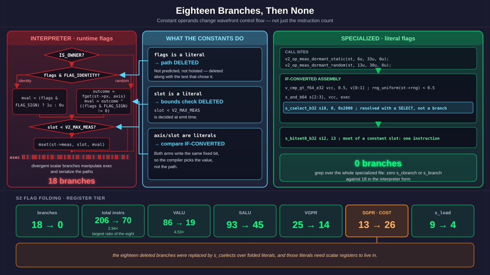
<figcaption><b>Figure 7.3</b> — Three distinct mechanisms, one specialized
body. A constant <code>flags</code> <em>deletes</em> a path; a constant
<code>slot</code> deletes the bounds check; constant <code>axis</code>/<code>slot</code>
make both arms of the genuinely random compare write the same bit, so it
if-converts to <code>s_cselect_b32</code>. The SGPR rise is drawn at the same
weight as the wins because it is the price of straight-lining.</figcaption>
</figure>

Why this matters more on a GPU than the raw count suggests: on AMDGCN a taken
`s_cbranch` inside a divergent region forces `s_and_saveexec_b64` /
`s_or_b64 exec` mask manipulation and serializes the two sides. Eighteen of
those in a three-instruction sequence is pure interpretive overhead — and
dormant measurements are extremely common in surface-code circuits, which is
why the surface family shows some of the largest gains in §14.

---

### 7.5 S3 — static rank tracking (the load-bearing one)

The case file's own header comment states the claim:

> S3 — **STATIC RANK TRACKING.** This is the load-bearing specialization: the
> specializer knows `active_k` at every program point, so `half = 1u << active_k`
> becomes a literal and the strided sweep gets a compile-time trip count. The
> interpreter must re-read `st->active_k` after every rank-changing op.
> **Note what is NOT happening: the sweep is still a LOOP. V1 unrolled it.**

That last sentence is the entire difference between V1 and V2 in one line, and
§5 already showed what unrolling cost.

**How the specializer knows.** It maintains `k` as it walks the program
(`v2_specializer.cc:26-56`) — `++*k` on the expansion family, `--*k` on
rank-reducing measurements:

```cpp
case Opcode::OP_EXPAND:
    o << "v2_op_expand(st, v, " << *k << "u);"; ++*k; break;
case Opcode::OP_EXPAND_T:
    o << "v2_op_expand_t(st, v, " << *k << "u, " << a1 << "u, 0);"; ++*k; break;
case Opcode::OP_MEAS_ACTIVE_INTERFERE:
    o << "v2_op_meas_active_interfere(st, v, " << *k << "u, " << a1 << "u, "
      << a << "u, " << flags << "u);";
    if (*k) --*k; break;
```

Compare the interpreter, which has to re-read it every iteration
(`coop_interpreter.c:50-53`):

```c
for (u32 pc = 0; pc < num_instrs; ++pc) {
    CV2Instr ins = instrs[pc];
    u32 k = st->active_k;          // <- a LOAD, every instruction
    switch (ins.opcode) {
```

**The op** (`v2_ops_body.inc:85-96`):

```c
static inline __attribute__((always_inline)) void v2_op_expand_t(V2State* st, CV2Complex* v, u32 active_k, u32 axis, int dagger) {
    u32 t = v2_tid();
    u32 half = 1u << active_k;
    int px = fget(st->px, axis);
    double imag = dagger ? -V2_INV_SQRT2 : V2_INV_SQRT2;
    if (px) imag = -imag;
    CV2Complex phase; phase.re = (float)V2_INV_SQRT2; phase.im = (float)imag;
    for (u32 i = t; i < half; i += V2_STRIDE) v[i + half] = cmul(v[i], phase);
    v2_barrier();
    if (IS_OWNER) st->active_k = active_k + 1;
    v2_barrier();
}
```

**The two forms** (`cases/S3_expand_rank.c`) — note that only the *third*
argument changes:

```c
#if SPEC_FORM
    v2_op_expand_t(st, v, 0u, 0u, 1);
    v2_op_expand_t(st, v, 1u, 3u, 0);
    v2_op_expand(st, v, 2u);
#else
    v2_op_expand_t(st, v, st->active_k, i0.axis_1, 1);
    v2_op_expand_t(st, v, st->active_k, i1.axis_1, 0);
    v2_op_expand(st, v, st->active_k);
#endif
```

Because the specializer tracks the rank, the second call gets `1u` and the third
gets `2u` — the compiler sees the rank *grow*, statically, across the program.

**What it buys:** 164→83 instructions (1.98×), VALU 67→27 (2.48×), VGPR 18→8,
SGPR 16→10. The `1u << active_k` becomes a literal bound, so the loop's trip
count is known; `dagger` being a literal folds the `imag` sign at compile time
(the `?:` and the negate both disappear); and the store address `v[i + half]`
gets a constant displacement instead of a computed one. The `s_load` count drops
6→4, and the specific load that disappears is visible in the artifacts: the
interpreter form contains exactly one `s_load_dword ..., 0x278` — the
`st->active_k` read, `active_k`'s offset in `V2State` — and the specialized form
contains **none**. The full accounting is worth reading, because the count does
not fall by simple deletion:

| | interpreter | specialized |
|---|---|---|
| `0x20` — `pc` | ✓ | — |
| `0x18` — `instrs` | ✓ | — |
| `0x0` — kernarg block | ✓ | ✓ |
| `0x278` — `st->active_k` | ✓ | — |
| dynamically-indexed frame word (`s10`, `s0`) | ✓ ✓ | — |
| `st->px` / phase operands at fixed offsets | — | ✓ ✓ ✓ |

Three interpreter-only loads (`pc`, `instrs`, `active_k`) and both
*dynamically-indexed* frame reads disappear; three *statically*-addressed loads
appear in their place. The net is 6→4, but the character of what remains is the
point: every surviving load in the specialized form has a compile-time address.

**What it does not buy, and this is the point:** the loop is still there. At
rank 8 with `V2_STRIDE = 256` it is a handful of iterations; at rank 22 it is
thousands. V1 tried to emit those iterations as code (§5.3) and produced 20 MB
of IR that took 221 s to compile. V2 emits *one loop with a known bound*, which
is what LLVM's loop optimizer actually wants.

<figure>
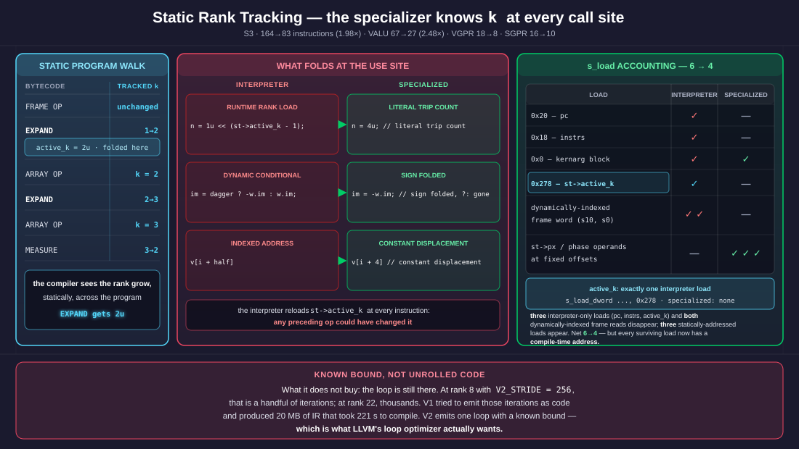
<figcaption><b>Figure 7.4</b> — The specializer walks the bytecode maintaining
<code>k</code>, so every rank-dependent bound is a literal at its use site. The
interpreter must reload <code>st-&gt;active_k</code> at every instruction because
any preceding op could have changed it.</figcaption>
</figure>

---

### 7.6 S4 — rank-folded cooperative reduction

**The op** (`v2_ops_body.inc:135-165`) — the most expensive single opcode in the
ISA, and the one with the ABI constraint from §3:

```c
static inline V2_NOISE_ATTR void v2_op_meas_active_interfere(V2State* st, CV2Complex* v, u32 active_k,
                                               u32 axis, u32 slot, u8 flags) {
    u32 t = v2_tid();
    u32 half = 1u << (active_k - 1u);
    int pz = fget(st->pz, axis);
    double lp = 0.0, lm = 0.0;
    for (u32 i = t; i < half; i += V2_STRIDE) {
        CV2Complex vi = v[i], vh = v[i + half];
        lp += cnorm(cadd(vi, vh)); lm += cnorm(csub(vi, vh));
    }
    double p_plus, p_minus; V2_REDUCE2(t, lp, lm, &p_plus, &p_minus);
    if (IS_OWNER) {
        u8 b = sample_branch(st->rng, p_plus, p_minus, p_plus + p_minus);
        st->branch = b;
        u8 m_abs = b ^ (u8)pz;
        if (slot < V2_MAX_MEAS) mset(st->meas, slot, m_abs ^ (u8)((flags & FLAG_SIGN) != 0));
    }
    v2_barrier();
    for (u32 i = t; i < half; i += V2_STRIDE) {          // fold
        CV2Complex vi = v[i], vh = v[i + half];
        CV2Complex folded = (st->branch == 0) ? cadd(vi, vh) : csub(vi, vh);
        v[i] = cscale(folded, V2_INV_SQRT2);
    }
    v2_barrier();
    if (IS_OWNER) {
        st->active_k = active_k - 1;
        u8 m_abs = mget(st->meas, slot) ^ (u8)((flags & FLAG_SIGN) != 0);
        fset(st->px, axis, m_abs != 0); fset(st->pz, axis, 0);
    }
    v2_barrier();
}
```

Two full sweeps over `2^(k-1)` amplitudes with an f64 two-way reduction between
them, and a PRNG draw at the branch point.

**The two forms** (`cases/S4_meas_active.c`) are a single call:

```c
#if SPEC_FORM
    v2_op_meas_active_interfere(st, v, 8u, 5u, 12u, 0u);
#else
    v2_op_meas_active_interfere(st, v, st->active_k, i0.axis_1, i0.a, i0.flags);
#endif
```

**Result:** 331→240 instructions (1.38×), VALU 139→96 (1.45×), branches 15→7,
VGPR 24→14, SGPR 30→26. Constant `k` fixes both trip counts and the LDS offsets
the reduction indexes with; constant `slot`/`flags` folds the bounds check and
the sign XOR as in S2.

**The `ds_op` column stays at 4 in both forms**, and that is the load-bearing
observation for §12. Those four are two `ds_write2_b64` / `ds_read2_b64` pairs —
the cross-wave combine step, where each wave's partial sums go through LDS —
and specialization does **not** remove or reorder them.

The column understates the evidence, though, because `build_examples.sh` counts
`ds_(read|write)` only. Counting the shuffle instructions as well:

| | interpreter | specialized |
|---|---|---|
| `ds_bpermute_b32` | 32 | 32 |
| `ds_write2_b64` / `ds_read2_b64` | 2 / 2 | 2 / 2 |

**32 `ds_bpermute_b32` in both forms, exactly.** That is the butterfly: six XOR
steps at offsets 32/16/8/4/2/1, two f64 values per step, two 32-bit halves per
f64 — and the second, four-lane reduction on top. Every one survives
specialization unchanged, in the same order. That is deliberate:
`v2_ops.h:235-236` records the constraint —

> MUST reproduce SVM `coop_reduce2`'s exact summation order or f64 rounding
> diverges at measurement branch points.

The reduction is part of the ABI. If specialization had reassociated it, V2
would compute different `p_plus`/`p_minus` in the last bits, `sample_branch`
would take a different branch on some shot, the PRNG streams would desync, and
the outputs would stop being byte-exact. The `4→4` in that column is the
evidence that it did not. This is also why the compile line carries
`-ffp-contract=off` (§6.4): FMA contraction would change the summation the same
way.

VALU 1.45× is the *lowest* gain among the array ops, and that is expected: most
of the 139 vector instructions are the actual complex arithmetic — `cadd`,
`csub`, `cnorm`, `cmul` — which is real work, not interpretive overhead. There
is nothing to fold in an `f32` multiply. Specialization removes the *addressing*
around the arithmetic, not the arithmetic.

---

### 7.7 S5 — scatter-index folding

**The op** (`v2_ops_body.inc:168-180`):

```c
static inline __attribute__((always_inline)) void v2_op_array_cnot(V2State* st, CV2Complex* v, u32 active_k, u32 c, u32 tg) {
    u32 t = v2_tid();
    u64 c_bit = 1ull << c, t_bit = 1ull << tg;
    u64 iters = 1ull << (active_k - 2u);
    for (u64 i = t; i < iters; i += V2_STRIDE) {
        u64 base = scatter_bits_2(i, c, tg) | c_bit;
        CV2Complex a = v[base], b = v[base | t_bit];
        v[base] = b; v[base | t_bit] = a;
    }
    v2_barrier();
    if (IS_OWNER) { int px_c = fget(st->px, c), pz_t = fget(st->pz, tg); fxor(st->px, tg, px_c); fxor(st->pz, c, pz_t); }
    v2_barrier();
}
```

`scatter_bits_2(i, a, b)` inserts two zero bits at positions `a` and `b` — the
standard "enumerate all indices with these two bits cleared" trick. With runtime
axes it is a `min`/`max` plus two variable-shift mask constructions plus three
shift/or steps, all on 64-bit values, *per iteration*.

**The two forms** (`cases/S5_array_cnot.c`):

```c
#if SPEC_FORM
    v2_op_array_cnot(st, v, 8u, 2u, 5u);
    v2_op_array_cz(st, v, 8u, 1u, 6u);
#else
    v2_op_array_cnot(st, v, st->active_k, i0.axis_1, i0.axis_2);
    v2_op_array_cz(st, v, st->active_k, i1.axis_1, i1.axis_2);
#endif
```

**The assembly diff is dramatic.** Specialized, the entire index computation for
`k=8, c=2, t=5` collapses to five instructions with literal masks:

```asm
	v_cmp_gt_u32_e64 s[0:1], 64, v0     ; i < iters, iters = 1<<(8-2) = 64, a LITERAL
	v_lshlrev_b32_e32 v3, 1, v0
	v_and_b32_e32 v2, 3, v0             ; scatter_bits_2 collapsed to
	v_and_b32_e32 v3, 24, v3            ;   three constant masks
	v_and_b32_e32 v4, 0xc0, v1          ;   and one v_or3
	v_or3_b32     v2, v3, v2, v4
	v_lshlrev_b32_e32 v6, 3, v2
	global_load_dwordx2 v[2:3], v6, s[6:7] offset:288   ; base|t_bit -> a fixed DISPLACEMENT
	global_load_dwordx2 v[4:5], v6, s[6:7] offset:32
```

`t_bit = 1 << 5` at 8 bytes per amplitude is `offset:288` versus `offset:32` —
the paired access becomes a **constant address displacement**, folded into the
memory instruction's encoding. No second address register, no add.

The interpreter form has to build all of it at runtime. First the trip count,
which cannot be known until `active_k` has been loaded
(`interp/S5_array_cnot.s:31-35`):

```asm
	s_load_dword s23, s[4:5], 0x278     ; st->active_k -- a memory round trip
	s_add_i32 s23, s23, -2              ; k - 2
	v_lshrrev_b64 v[4:5], s23, v[0:1]   ; iters = 1<<(k-2), by VARIABLE shift
	v_cmp_eq_u64_e32 vcc, 0, v[4:5]
```

then the index math itself, once per loop entry (`:41-48`):

```asm
	s_min_u32 s10, s22, s21             ; scatter_bits_2: min/max of the two axes
	s_max_u32 s14, s22, s21
	v_and_b32_e32 v2, 0xffff, v2
	s_and_b32 s8, 0xffff, s21
	s_lshl_b64 s[10:11], -1, s10        ; ...then variable-shift masks
	s_lshl_b64 s[14:15], -1, s14
	v_lshlrev_b64 v[2:3], v2, 1         ; 1 << c, on the VECTOR pipe
	s_lshl_b64 s[8:9], 1, s8
```

followed at `:49-50` by two `s_not_b64` to complete the masks. Those two
`s_not_b64` appear **twice** in the interpreter file — at `:49-50` and again at
`:151-152`, once per call site, since `array_cnot` and `array_cz` each rebuild
the masks — and **zero** times in the specialized file.

Every one of those operands is a literal in the specialized form, so the entire
sequence — both blocks, both call sites — collapses into the five constant-mask
instructions quoted above.

**Result:** 207→81 instructions (2.56×), VALU 84→33 (2.55×), VGPR 16→8, SGPR
24→10, and **`s_load` 4→1** — the largest relative scalar-load reduction in the
study. The four interpreter loads are, in file order:

```
:9   s_load_dword   s6,      s[0:1], 0x20    ; pc
:10  s_load_dwordx2 s[2:3],  s[0:1], 0x18    ; the instrs pointer
:27  s_load_dwordx4 s[4:7],  s[0:1], 0x0     ; the kernel argument block
:31  s_load_dword   s23,     s[4:5], 0x278   ; st->active_k
```

and the specialized form contains exactly one:

```
:9   s_load_dwordx4 s[4:7],  s[0:1], 0x0     ; the kernel argument block
```

Only the third survives — it is the kernel argument pointer, which nothing can
remove. The other three are, precisely, the three things specialization knows:
where in the program we are, what the instruction says, and what the rank is.

The 16→8 VGPR halving is significant beyond the instruction count: on the coop
tier, VGPR count sets waves-per-SIMD occupancy, and array two-qubit ops
dominate the register pressure of any circuit with a lot of entangling gates.
§9 traces how this fed into the LDS/occupancy work.

---

### 7.8 S6 — fused-matrix table lookup (a bounded gain)

This case exists to establish an *upper bound on what specialization can do for
a data-dependent op*, and the case file says so:

> S6 — fused-matrix table lookup. `v2_op_array_u2` indexes `fused_u2[cp]` then
> picks `matrices[in_state]` where `in_state` comes from the **LIVE Pauli
> frame**, so the row is **NOT foldable** — only the table entry `cp` and the
> axis are.

**The op** (`v2_ops_body.inc:284-305`):

```c
static inline __attribute__((always_inline)) void v2_op_array_u2(V2State* st, CV2Complex* v, u32 active_k, u32 axis,
                                  const CV2FusedU2Entry* fused_u2, u32 cp) {
    u32 t = v2_tid();
    int in_state = (fget(st->pz, axis) ? 2 : 0) | (fget(st->px, axis) ? 1 : 0);
    const CV2Complex* mat = fused_u2[cp].matrices[in_state];    // <- in_state is RUNTIME
    if (axis < active_k) {
        u64 axis_bit = 1ull << axis;
        u64 iters = 1ull << (active_k - 1u);
        for (u64 i = t; i < iters; i += V2_STRIDE) {
            u64 i0 = scatter_bits_1(i, axis), i1 = i0 | axis_bit;
            CV2Complex a = v[i0], b = v[i1];
            v[i0] = cadd(cmul(a, mat[0]), cmul(b, mat[1]));
            v[i1] = cadd(cmul(a, mat[2]), cmul(b, mat[3]));
        }
    }
    v2_barrier();
    if (IS_OWNER) {
        u8 out = fused_u2[cp].out_states[in_state];
        fset(st->px, axis, (out & 1) != 0); fset(st->pz, axis, (out & 2) != 0);
    }
    v2_barrier();
}
```

`in_state` is read from the Pauli frame *at execution time*. The frame depends
on measurement outcomes, which depend on the PRNG, which depends on the shot.
No amount of static analysis recovers it. The matrix row therefore stays a
runtime load in both forms.

**Result:** 147→86 instructions (1.71×), VALU 54→42 (1.29×), `s_load` 12→7,
SGPR 23→16, but **branches 10→2**. What *did* fold: `cp` (the table entry — a
fixed displacement into `fused_u2`), `axis` (so `scatter_bits_1` and `axis_bit`
become constant masks, as in S5), and crucially `axis < active_k` — the case
calls `v2_op_array_u2(st, v, 8u, 4u, fused_u2, 17u)`, i.e. `axis=4`,
`active_k=8`, so with both constant the guard is decided at compile time and the
`if` is entered unconditionally. That single fold is most of the 10→2 branch
drop; the two survivors in the specialized form are at `:22` and `:73` and are
both `s_cbranch_execz`, the loop's own exec-mask guards, which no amount of
constant folding removes.

The VALU ratio of 1.29× is the honest ceiling for this class. Four complex
multiplies and two adds per amplitude pair are irreducible arithmetic. This is
the same shape as S4: specialization removes the scaffolding, not the math.

---

### 7.9 S7 — the noise runtime loop (the negative result)

**The op** (`v2_ops_body.inc:438-451`):

```c
static inline V2_NOISE_ATTR void v2_op_noise_block(V2State* st, const CV2NoiseSite* sites, const CV2Channel* channels,
                                     const double* hazards, u32 num_sites, u32 start, u32 count) {
    u32 t = v2_tid();
    if (IS_OWNER) {
        u32 end = start + count;
        while (st->next_noise >= start && st->next_noise < end) {
            u32 site_idx = st->next_noise;
            apply_noise_site(st, sites, channels, site_idx);
            st->next_noise = site_idx + 1u;
            draw_next_noise(st, hazards, num_sites);
        }
    }
    v2_barrier();
}
```

`OP_NOISE_BLOCK` covers the half-open site range `[start, start+count)`, but it
**consumes only those sites the PRNG selects**. `draw_next_noise` performs an
`ocml_log_f64` hazard draw and advances `st->next_noise` by a random amount. The
loop's trip count is a function of the random stream. It stays a loop in **both**
forms; specialization folds only `start` and `count`.

**The two forms** (`cases/S7_noise_block.c`):

```c
#if SPEC_FORM
    v2_op_noise_block(st, noise_sites, noise_channels, noise_hazards, num_noise_sites, 131u, 57u);
    v2_op_noise(st, noise_sites, noise_channels, noise_hazards, num_noise_sites, 188u);
#else
    v2_op_noise_block(st, ..., i0.a, i0.b);
    v2_op_noise(st, ..., i1.a);
#endif
```

**Result: 447→407 instructions (1.10×), VALU 214→210 (1.02×), branches 23→20,
VGPR 56→56, SGPR 86→85.** This is essentially nothing — and the register
columns, which an earlier draft misreported as `0→0` because LLVM prints them
symbolically for kernels that call external functions (see the note in §7.2),
say something stronger than "no gain": **specialization does not reduce this
op's register pressure at all.** 56 VGPRs in both forms. That matters for §11.1,
because register pressure is precisely the cost that straight-lining hundreds of
these into one function *adds*.

The assembly diff confirms it — what changed is only the range test
(`interp:11-38` vs `spec:15-25`):

```diff
-	s_load_dword s0, s[4:5], 0x20              ; pc
-	s_mul_i32 s6, s0, 40                       ; instruction address
-	s_load_dwordx2 s[70:71], s[4:5], 0x8       ; ins.a = start, ins.b = count
-	s_add_i32 s69, s71, s70                    ; end = start + count, at RUNTIME
-	s_cmp_lt_u32 s0, s70                       ; next_noise < start
-	s_cselect_b64 s[2:3], -1, 0
-	s_cmp_ge_u32 s0, s69                       ; next_noise >= end
-	s_cselect_b64 s[4:5], -1, 0
-	s_or_b64 s[2:3], s[2:3], s[4:5]
 	s_load_dword s0, s[64:65], 0x27c           ; st->next_noise -- in BOTH forms
+	s_add_i32 s1, s0, 0xffffff7d               ; next_noise - 131
+	s_cmp_gt_u32 s1, 56                        ; ...single unsigned compare vs 56
```

The two-compare range test becomes the classic single-compare `(x - lo) > (hi -
lo)` idiom. That is the whole win: four scalar instructions. The 210 surviving
VALU instructions are `apply_noise_site` and the `ocml_log_f64` hazard draw, and
none of them care what `start` was.

**Why this negative result is important.** It is the first-principles prediction
of the `circuit_d5` regression in §11.1. A circuit whose instruction mix is
dominated by noise ops has almost nothing for the specializer to fold — so
specialization buys ~1.05× on the op bodies, while *paying* the cost of
straight-lining hundreds of them into one function (register pressure, I-cache
pressure, and the FP-scheduling hazard that `V2_NOISE_ATTR` exists to fence).

`coop_circuit_d5.c`, the emitted specialization for `circuit_d5`, contains
**1,720** `v2_op_*` calls. Counting them by opcode gives the mix directly:

| Opcode family | calls | share | S7 verdict |
|---|---:|---:|---|
| `frame_cnot` / `frame_cz` / `frame_h` / `frame_swap` | 757 | 44.0 % | folds well (S1) |
| `meas_dormant_static` / `_random` | 215 | 12.5 % | folds well (S2) |
| **`noise` / `noise_block` / `readout_noise`** | **329** | **19.1 %** | **does not fold (S7)** |
| `apply_pauli` | 135 | 7.8 % | bounded (S8) |
| `detector` / `observable` | 109 | 6.3 % | — |
| array ops (`array_t`, `multi_cnot`, `cnot`, `s`, `multi_cz`) | 136 | 7.9 % | bounded (S5, S6) |
| `expand_t` / `swap_meas_interfere` | 39 | 2.3 % | folds (S3, S4) |

Nearly a fifth of the program is in the one class S7 measured at 1.02× — and
that class is by far the most *expensive* per call (447 instructions in the
interpreter form, against 136 for a frame op), so its share of runtime is much
larger than its share of call sites. The frame and measurement ops that do fold
well are individually cheap. That is the regression in one table: the ops worth
specializing are the ones that cost little, and the op that dominates the time
is the one specialization cannot touch. §11.1 shows what happened when it was
specialized anyway.

<figure>
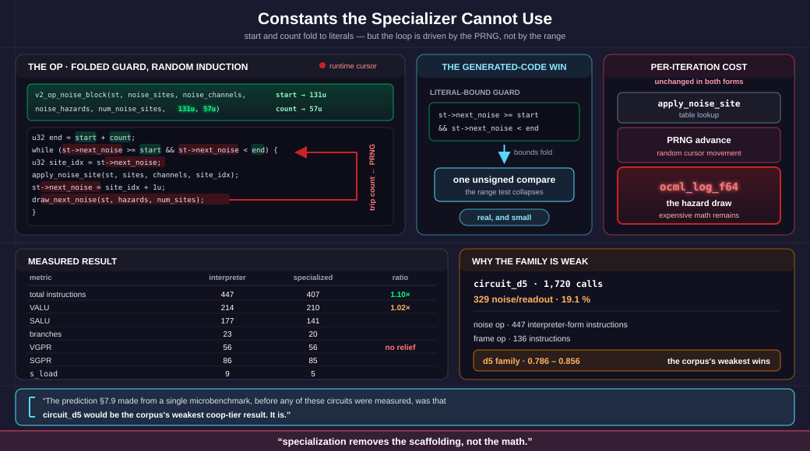
<figcaption><b>Figure 7.5</b> — The boundary of specialization, as a mechanism.
Both bounds <em>do</em> fold to literals, and the range guard collapses to one
unsigned compare — a real but small win. The loop does not iterate over that
range: it consumes the sites the PRNG selects, and the cursor advances by a
random amount drawn through an <code>ocml_log_f64</code> hazard call. The trip
count is a function of the random stream, so the loop survives in both forms and
VGPR pressure gets no relief. The constants exist; they are simply not the
values that control the expensive part.</figcaption>
</figure>

---

### 7.10 S8 — Pauli-mask index folding (a bounded gain, for a different reason)

**The op** (`v2_ops_body.inc:406-413`):

```c
static inline __attribute__((always_inline)) void v2_op_apply_pauli(V2State* st, const CV2Mask* pauli_masks, u32 cp, u32 cond_slot) {
    u32 t = v2_tid();
    if (IS_OWNER && mget(st->meas, cond_slot) != 0) {
        const CV2Mask* m = &pauli_masks[cp];
        for (u32 w = 0; w < CLIFFT_V2_PAULI_WORDS; ++w) { st->px[w] ^= m->x[w]; st->pz[w] ^= m->z[w]; }
    }
    v2_barrier();
}
```

The case comment states the boundary precisely:

> the mask **INDEX** and the measurement slot fold, the mask **CONTENTS** do not
> (they live in a device buffer).

**Result:** 185→137 instructions (1.35×), VALU 71→63 (1.13×), VGPR 22→21, SGPR
44→42, `s_load` 17→11, **branches 3→3**.

This is a different shape of bounded gain from S6. In S6 the *arithmetic* was
irreducible; here the **memory traffic** is. `pauli_masks[cp]` with a constant
`cp` becomes a fixed displacement — visible directly in the load offsets, which
go from a *computed* index in the interpreter form

```
:32  s_load_dwordx2 s[4:5], s[34:35], s7 offset:0x50    ; index in a REGISTER
```

to three literal displacements in the specialized form, one per call site:

```
:19  s_load_dwordx16 s[0:15],  s[36:37], 0x0
:74  s_load_dwordx16 s[0:15],  s[36:37], 0x58   ; pauli_masks[1]
:118 s_load_dwordx16 s[0:15],  s[36:37], 0xb0   ; pauli_masks[2]
```

`0x58` is 88 bytes, which is `sizeof(CV2Mask)` for
`CLIFFT_V2_PAULI_WORDS = 5` — two arrays of five `uint64_t` plus a sign byte,
padded to 8. The stride between the three constants is exactly one mask. That is
the 17→11 `s_load` drop. But the five words still have to be *loaded* and XORed
into the frame, and the number of loads is set by the mask width, not by the
operand.

**The branch count does not move — but two of the three branches change kind,
and that is the more interesting fact.** The interpreter form has one
`s_cbranch_scc1` and two `s_cbranch_vccnz`; the specialized form has three
`s_cbranch_scc1`. A `vccnz` branch tests the *vector* condition code — the
lane-mask result of a `v_cmp` — where `scc1` tests the scalar condition code.
Specialization did not delete the branch, but it moved the *predicate* that
drives it off the vector pipe, exactly as §7.3 described for the arithmetic.
What it could not do is remove the branch entirely, because the condition
`mget(st->meas, cond_slot) != 0` tests a **runtime measurement outcome**. It is
the same wall as S6's `in_state`: data that only exists once the shot is running.
Constant `cond_slot` fixes *which bit* is tested; nothing fixes its value.

Together S6, S7, and S8 delimit the technique. Specialization folds:

- **operand-derived address and mask arithmetic** (S1, S5) — large win;
- **control flow selected by constant flags and bounds** (S2, S3, S6's guard) —
  large win, and the branch removal matters more on a GPU than the count suggests;
- **loop trip counts derived from a statically-tracked rank** (S3, S4, S5) — the
  structural win, and the one V1 tried to get by unrolling instead.

It does **not** fold:

- floating-point arithmetic on amplitudes (S4, S6);
- anything indexed by the live Pauli frame or a measurement outcome (S6, S8);
- anything whose trip count depends on the PRNG (S7).

That taxonomy predicts the per-circuit results in §14 well enough that it is
worth stating as the chapter's conclusion: **a circuit's speedup under V2 is a
function of how much of its instruction mix falls in the first list.**

---

## 8. Progressive lowering: what the compiler does with it

Chapter 7 measured what specialization does to a *single* op in isolation. This
chapter follows a whole circuit down both pipelines, stage by stage, and shows
the actual IR at each boundary.

A note on framing, because the project's own documentation is misleading here
and the ground rule of this report is to trust data over text. **V2 does not
emit MLIR.** The directory is called `src/clifft/gpu/mlir/v2/` for historical
reasons, but `v2_specializer.cc:127` emits a C translation unit whose first line
is `#include "clifft/gpu/mlir/v2/v2_ops.h"`, and the path to `.hsaco` is
C → clang → llvm-link → opt → llc → ld.lld. The name is the only MLIR left in
V2. §5 established the corresponding fact about V1: its MLIR was 100 % `llvm`
dialect, it authored **zero** custom passes, and one of the three stock passes
it ran is a complete no-op.

So this chapter cannot show "the diff each MLIR pass we introduced produces,"
because no such pass exists. What it can show — and does — is the real
progressive lowering of both pipelines, rendered as diffs, which turns out to be
a more useful comparison anyway: it shows *where each pipeline's representation
actually collapses*, and V1's and V2's collapse in completely different places.

### 8.1 The corpus

Thirteen stage pairs are rendered, each as a hunk-scoped `.diff` (greppable, for
this report) and a colorized side-by-side `.html` (for the deck). All under
`V2_performance/lowering/diffs/`:

| Pipeline | Circuit | Chain |
|---|---|---|
| `v1` | `frame_h`, `circuit_d3` | `emitted.mlir` → `opt.mlir` → `translate.ll` → `optO2.ll` → `isa.s` |
| `v2` | `circuit_d3` | `emitted.c` → `clangO0.ll` → `clangO2.ll` → `isa.s` |
| `v1pass` | `frame_h` | `canonicalize` → `cse` → `convert-func-to-llvm` |

The renderer (`lowering/render_diffs.py`) documents its own methodology, and the
reasoning is worth reproducing because it governs how these diffs should be
read:

> Why not just `diff -u`: the stage files are up to 20k lines and the
> interesting change is almost never at the top. `--window` extracts the N
> largest contiguous change hunks so the report can quote a hunk that actually
> shows the transform, rather than the first one alphabetically.
>
> Stage files are **NOT line-aligned** across a lowering boundary (MLIR SSA
> names get renumbered by every pass), so a raw line diff between `.mlir` and
> `.ll` is noise. That is intentional: the diff is evidence of *how much* the
> representation changed, and the hunk excerpts show *what kind* of change.

Diff sizes, which are themselves a signal:

```
   16  v1pass.frame_h.1_cse__2_convert-func-to-llvm.diff     <- the no-op
  189  v1.circuit_d3.4_optO2__5_isa.diff
  189  v1.frame_h.4_optO2__5_isa.diff
  189  v2.circuit_d3.3_clangO2__4_isa.diff
  248  v1.circuit_d3.2_opt__3_translate.diff
  248  v1.frame_h.2_opt__3_translate.diff
  255  v1.circuit_d3.1_emitted__2_opt.diff
  255  v1.frame_h.1_emitted__2_opt.diff
  328  v2.circuit_d3.1_emitted__2_clangO0.diff
  404  v1.frame_h.3_translate__4_optO2.diff
  456  v2.circuit_d3.2_clangO0__3_clangO2.diff
  488  v1.circuit_d3.3_translate__4_optO2.diff
  576  v1pass.frame_h.0_canonicalize__1_cse.diff
```

### 8.2 Line counts through both pipelines

The most compact way to see the difference is the size of the representation at
each stage, for the same circuit (`circuit_d3`, 344 instructions, register tier):

| Stage | V1 | | Stage | V2 |
|---|---|---|---|---|
| `1_emitted.mlir` | **23,002** | | `1_emitted.c` | **383** |
| `2_opt.mlir` | 14,257 | | `2_clangO0.ll` | 19,551 |
| `3_translate.ll` | 14,875 | | `3_clangO2.ll` | 8,132 |
| `4_optO2.ll` | 13,747 | | | |
| `5_isa.s` | 17,802 | | `4_isa.s` | 10,398 |

And the small circuit, `frame_h` (4 instructions), on V1 only — V2 does not have
a rendered chain for it, but its emitted C is 43 lines:

| Stage | V1 `frame_h` |
|---|---|
| `1_emitted.mlir` | 947 |
| `2_opt.mlir` | 606 |
| `3_translate.ll` | 562 |
| `4_optO2.ll` | 275 |
| `5_isa.s` | 524 |

Two shapes, and they are opposites:

- **V1 starts huge and shrinks.** 23,002 lines of `llvm`-dialect MLIR for 344
  instructions. Every optimization stage is *recovering* from the emitter.
- **V2 starts tiny and expands, then collapses.** 383 lines of C → 19,551 lines
  of unoptimized IR (because `-O0` gives every local variable an `alloca` and
  every access an `addrspacecast`) → 8,132 lines at `-O2`. The expansion is a
  *compiler artifact of `-O0`*, not something the emitter wrote down, and `-O2`
  removes it entirely.

The endpoint is what matters: **17,802 vs 10,398 ISA lines for the same
circuit.** V2 produces a 1.7× smaller kernel from a 60× smaller source.

<figure>
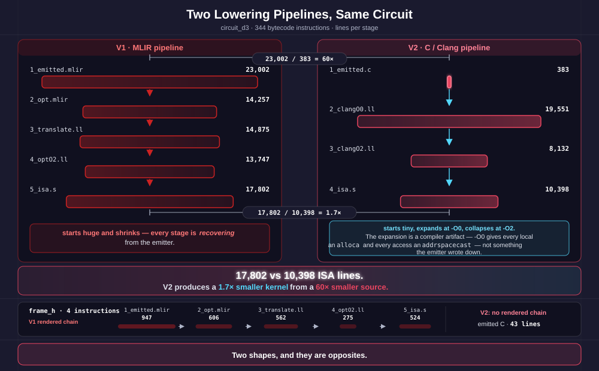
<figcaption><b>Figure 8.1</b> — The two pipelines with per-stage line counts for
<code>circuit_d3</code>. V1's representation is largest where a human wrote it;
V2's is largest where the compiler expanded it at <code>-O0</code> and smallest
again after <code>-O2</code>.</figcaption>
</figure>

---

### 8.3 V1's MLIR stage: what `canonicalize` and `cse` actually did

`mlir_codegen.cc:65-67` runs exactly three passes. Snapshots were taken with
`mlir-opt --mlir-print-ir-tree-dir` so each pass's output is a separate file
(`lowering/v1_passes/frame_h/`):

```
0_canonicalize.mlir   736 lines
1_cse.mlir            608 lines
2_convert-func-to-llvm.mlir  608 lines
```

(from an emitted 947.)

**`canonicalize` folded duplicate constants.** The op census for `frame_h`
before and after the MLIR stage:

| Op | emitted | after opt |
|---|---|---|
| `llvm.mlir.constant` | 240 | **59** |
| `llvm.and` | 54 | 9 |
| `llvm.shl` | 73 | 34 |
| `llvm.xor` | 68 | 29 |
| `llvm.ptr` † | 192 | 160 |

† `llvm.ptr` is a *type*, not an op, and occurs several times on some lines
(each `getelementptr` mentions it twice). Its row counts occurrences (192 → 160)
where the op rows count one per line; by line it is 136 → 118. The other four
rows are unambiguous — one op per line.

The emitter materialized the same constant over and over — 240 constant ops for
a four-instruction circuit — and canonicalization deduplicated them down to 59.
This is not a sophisticated transform; it is cleanup after a naive emitter.

**`cse` deleted redundant loads and recomputation.** The
`0_canonicalize → 1_cse` diff is the largest in the corpus (576 lines), and the
hunk it selects is a PRNG update inside the shot loop that had been emitted
twice:

```diff
     %138 = llvm.load %45 : !llvm.ptr -> i64
-    %139 = llvm.getelementptr inbounds %45[1] : (!llvm.ptr) -> !llvm.ptr, i64
-    %140 = llvm.load %139 : !llvm.ptr -> i64
-    %141 = llvm.getelementptr inbounds %45[2] : (!llvm.ptr) -> !llvm.ptr, i64
-    %142 = llvm.load %141 : !llvm.ptr -> i64
-    %145 = llvm.add %138, %144 : i64
-    %146 = llvm.shl %145, %16 : i64
-    %147 = llvm.lshr %145, %15 : i64
-    %148 = llvm.or %146, %147 : i64        ; xoshiro256++ rotate
-    %151 = llvm.xor %142, %138 : i64
-    %152 = llvm.xor %144, %140 : i64
-    ...
-    %165 = llvm.lshr %33, %35 : i64        ; frame word index, computed
-    %166 = llvm.getelementptr inbounds %49[%165] : ...
-    %175 = llvm.lshr %33, %35 : i64        ; ...and computed AGAIN
-    %176 = llvm.getelementptr inbounds %51[%175] : ...
```

Note the last four lines: `llvm.lshr %33, %35` appears twice with identical
operands, once for `px` and once for `pz`. The emitter had no notion of a
common subexpression, so it wrote out the word-index computation separately for
each frame array. CSE removes it. This is exactly the class of redundancy that
**does not exist in V2's C**, because in V2 that computation is written once in
`fget` and inlined by clang after constant-folding the index away entirely
(§7.3).

**`convert-func-to-llvm` did nothing at all.** The full rendered diff is 16
lines, and the only change is the pass-name banner:

```diff
-// -----// IR Dump After CSE (cse) //----- //
+// -----// IR Dump After ConvertFuncToLLVMPass (convert-func-to-llvm) //----- //
 module attributes {llvm.target_triple = "amdgcn-amd-amdhsa"} {
   llvm.func @llvm.amdgcn.workitem.id.x() -> i32
   llvm.func @llvm.amdgcn.workgroup.id.x() -> i32
   llvm.func @llvm.amdgcn.s.barrier()
   llvm.func @llvm.amdgcn.ds.bpermute(i32, i32) -> i32
   llvm.func @clifft_log(%arg0: f64) -> f64 {
```

608 lines in, 608 lines out, byte-identical below the banner. There is no `func`
dialect to convert *because the emitter never produced any* — everything was
already `llvm.func`. This is the clearest single piece of evidence that V1 was
not using MLIR as a multi-level IR: the pass whose entire job is to lower a
higher abstraction level found nothing to lower.

> **What this means for the "MLIR passes" material.** The report's goal asked
> for progressive-lowering diffs of the passes introduced. The honest answer is
> that the value MLIR added to V1 was *two stock cleanup passes recovering from
> the emitter's own verbosity*. That is a real thing to show, and it is shown
> above — but it is not a compiler-engineering contribution, and V2 got the same
> cleanup for free by writing C and letting clang's front end never emit the
> redundancy in the first place.

---

### 8.4 V1: `translate` → `opt -O2`, where the real work happened

MLIR's contribution ended at 608 lines. The transform that actually mattered
happened in LLVM. `frame_h.3_translate.ll` (562) → `frame_h.4_optO2.ll` (275)
is a 2× collapse, and the hunk shows what:

```diff
-define amdgpu_kernel void @compiled_mlir_kernel(i64 inreg %0, ..., i32 inreg %9) {
-  %11 = alloca i32, align 4, addrspace(5)
-  %12 = addrspacecast ptr addrspace(5) %11 to ptr
-  %13 = alloca i64, i32 4, align 8, addrspace(5)
-  %14 = addrspacecast ptr addrspace(5) %13 to ptr
-  %15 = alloca i64, align 8, addrspace(5)
-  ...
-  %27 = alloca i8, i32 4096, align 1, addrspace(5)     ; <- 4 KB of scratch
-  %28 = addrspacecast ptr addrspace(5) %27 to ptr
-  %31 = call i32 @llvm.amdgcn.workitem.id.x()
+; Function Attrs: mustprogress nofree norecurse nounwind willreturn
+define amdgpu_kernel void @compiled_mlir_kernel(..., ptr noalias captures(none) %3,
+       ptr noalias readnone captures(none) %4, ...) local_unnamed_addr #4 {
+  %.global = addrspacecast ptr %3 to ptr addrspace(1)
+  %11 = tail call i32 @llvm.amdgcn.workitem.id.x()
```

Ten `alloca`/`addrspacecast` pairs — the emitter's model of local state as stack
slots — promoted to SSA registers by SROA/mem2reg, and the kernel gains
`nofree norecurse nounwind willreturn` plus `noalias readnone captures(none)`
on the pointer arguments. **LLVM did this, not MLIR.** The MLIR stage had the
same `alloca`s in front of it for two passes and left every one of them
standing.

For the larger circuit the collapse is far weaker: `circuit_d3` goes 14,875 →
13,747, only 7.6 %. That is the size-adaptive detuning from §5.3 starting to
bite — at 20 MB of IR, LLVM's own pass pipeline gets throttled
(`mlir_kernel_cache.cc:104-141`), and the very optimizations that rescued
`frame_h` stop being affordable.

The final stage, `optO2 → isa`, actually *grows* the file: 275 → 524 lines for
`frame_h`, 13,747 → 17,802 for `circuit_d3`. That is normal — one IR instruction
becomes several machine instructions plus directives — but for `circuit_d3` it
means V1 shipped 17,802 lines of ISA for a 344-instruction circuit.

---

### 8.5 V2: `emitted.c` → `clangO0` → `clangO2`

V2's chain has one interesting boundary and it is a very different one.

**`emitted.c` → `clangO0.ll`: 383 → 19,551 lines.** A 51× expansion, and the
diff shows exactly why:

```diff
-  %pauli_masks.addr.ascast = addrspacecast ptr addrspace(5) %pauli_masks.addr to ptr
-  %readout_noise.addr.ascast = addrspacecast ptr addrspace(5) %readout_noise.addr to ptr
-  %shot_id.ascast = addrspacecast ptr addrspace(5) %shot_id to ptr
-  store ptr %instrs, ptr %instrs.addr.ascast, align 8
-  store i32 %num_instrs, ptr %num_instrs.addr.ascast, align 4
-  ...
-  %0 = load i32, ptr %peak_rank.addr.ascast, align 4
-  %1 = load i32, ptr %num_instrs.addr.ascast, align 4
```

At `-O0` clang gives every parameter and local a stack slot in `addrspace(5)`,
an `addrspacecast` to generic, a store on entry, and a load at each use. For a
function with 20-odd parameters called 344 times' worth of inlined bodies, that
is thousands of ops. The op census at `2_clangO0` for `circuit_d3`:

| Op | count |
|---|---|
| `load` | 4,898 |
| `store` | 2,488 |
| **`alloca`** | **2,271** |
| **`addrspacecast`** | **2,262** |
| `call` | 1,770 |

**`clangO0.ll` → `clangO2.ll`: 19,551 → 8,132.** And the census after:

| Op | `-O0` | `-O2` |
|---|---|---|
| `alloca` | 2,271 | **3** |
| `addrspacecast` | 2,262 | **8** |
| `call` | 1,770 | 72 |
| `load` | 4,898 | 1,014 |
| `store` | 2,488 | 1,103 |
| `fmul` | 12 | **448** |
| `shufflevector` | 0 | **459** |

> **Correction, and a caution about the tooling.** An earlier draft of this table
> read `alloca` **2,268 → 0**, taken from `stage_stats.csv`. Both numbers were
> wrong, in the same direction, for two different reasons — and the raw `.ll`
> files disagree with the CSV:
>
> * The `-O2` zero is an artifact of `stage_stats.sh`, which emits only
>   `hist | head -30`. At `-O2`, `alloca` ranks **36th** with 3 occurrences, so it
>   falls off the histogram. **The CSV recorded "absent from the top 30" and the
>   draft read it as "zero."** That is the most dangerous shape a tooling bug can
>   take: a truncation that produces exactly the number the story wanted.
> * The `-O0` count of 2,268 misses 3 `%atomic-temp*` / `%.atomictmp*` slots,
>   which the script's regex drops because clang names them with a leading `.`
>   and a `-` that the `[0-9a-zA-Z_.]` character class does not accept.
>
> Both were found by counting `' = alloca '` in the raw IR instead of reading the
> summary. The corrected numbers do not weaken the point — 2,271 → 3 is a 99.87 %
> elimination — but "3" is a more interesting fact than "0", as the next
> paragraph shows.

Read those last two rows carefully, because they are the whole point. `alloca`
goes from 2,271 to **3** — essentially all shot-local state now lives in
registers. The three survivors are worth naming, because they are exactly the
state that *cannot* be promoted:

```llvm
; the only allocas left in clifft_v2_spec after -O2
%st   = alloca %struct.V2State,          align 8, addrspace(5)
%vloc = alloca [16 x %struct.CV2Complex], align 8, addrspace(5)
%sloc = alloca [8  x %struct.CV2Complex], align 8, addrspace(5)
```

All three are in `clifft_v2_spec` itself, all in `addrspace(5)` (private/scratch),
and all three are *aggregates whose address escapes* — `%st` is passed by pointer
to every `v2_op_*` that SROA could not fully inline away (the `noinline` noise
ops), and `%vloc`/`%sloc` are the fixed-size complex staging arrays. SROA
promotes scalars and small aggregates with non-escaping addresses; these are
neither. This is the residue that shows up in the `private=336` segment size in
the dispatch log, and it is the mechanism behind the scratch traffic discussed in
§10. **The interesting claim is not that `alloca` reached zero — it did not —
but that what remains is a fixed, per-kernel constant rather than something that
scales with circuit length.** 2,271 grew with the instruction count; 3 does not.

`call` collapses 1,770 → 72 as the `always_inline` op bodies are inlined (the
72 survivors are the `noinline` noise ops from `V2_NOISE_ATTR` plus ocml calls).
And `fmul` *rises* from 12 to 448 while `shufflevector` appears from nothing:
that is the SLP vectorizer packing the complex arithmetic into `<2 x float>`
operations. In the final ISA those show up as:

```
v_pk_add_f32   431
v_pk_mul_f32   416
```

**Packed** f32 math — two complex components per instruction. This is a
throughput win that only becomes available *because* the amplitudes ended up in
registers rather than in a stack array, which in turn is only possible because
the specializer wrote a straight-line body with statically-known indices.

<figure>
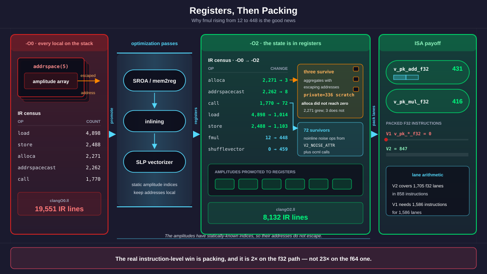
<figcaption><b>Figure 8.2</b> — Why <code>fmul</code> <em>rising</em> 12 → 448
is the good news. SROA and inlining move shot-local state off the stack, which
is what makes the amplitudes visible to the SLP vectorizer, which is what
produces 847 packed instructions where V1 has none. The three surviving
<code>alloca</code>s are drawn: the count did not reach zero, and what remains
is a per-kernel constant rather than something that scales with circuit
length.</figcaption>
</figure>

The `-O0` → `-O2` boundary is therefore doing the same job MLIR's
canonicalize/cse did for V1 — plus SROA, plus inlining, plus vectorization —
and doing it far more thoroughly, because clang's IR was never asked to survive
a hand-written emitter's idea of structure.

**`clangO2.ll` → `isa.s`: 8,132 → 10,398.** Instruction selection and register
allocation. The top of this file is the one place V2's own cost shows:

```asm
v2_op_noise_block:                      ; @v2_op_noise_block
	s_mov_b32 s33, s32
	scratch_store_dword off, v63, s33 offset:68 ; 4-byte Folded Spill
	scratch_store_dword off, v40, s33 offset:64 ; 4-byte Folded Spill
	scratch_store_dword off, v41, s33 offset:60 ; 4-byte Folded Spill
	... 15 more spills ...
```

`v2_op_noise_block` is emitted `noinline` (§7.9, §11.1), so it is a real
function with a real prologue, and a callee-saved register spill sequence. That
is the price of the FP-scheduling fence. It shows up in the `circuit_d3` ISA
census as 406 `scratch_store_dwordx2` + 303 `scratch_store_dwordx4`, and it is
one of the two reasons V2's register-tier ScratchSize is 928 bytes where V1's
was 156 (the other being the shot-packed register layout of §9.1). §11 returns
to whether that trade is worth it — the short answer, from the gate results, is
that it is, because the alternative is a correctness failure rather than a
slower kernel.

---

### 8.6 The f64 gulf, and why it is not a precision difference

The final ISA census turns up the single largest disparity anywhere in the
corpus, and it is the one most likely to be misread. For `circuit_d3`:

| | V1 | V2 |
|---|---|---|
| `v_*_f64` | **4,347** | **187** |
| `v_*_f32` | 1,586 | 858 |
| `v_pk_*_f32` (packed) | **0** | **847** |
| total instructions | 16,675 | 9,421 |

V1 issues **23× more f64 instructions**. The obvious reading — V1 did its
amplitude arithmetic in double and V2 dropped to single, trading accuracy for
speed — is wrong, and it matters that it is wrong, because §12 rests on both
backends being byte-exact against the same interpreter. They are. Both carry
amplitudes as `f32` pairs, and both widen to `f64` in exactly the same two
places, deliberately:

```cpp
// V2 — v2_ops.h:206
// f64 scalar multiply then narrow — byte-exact with SVM cscale. Do NOT relax.
static inline CV2Complex cscale(CV2Complex a, double s) {
    CV2Complex r; r.re = (float)((double)a.re * s); r.im = (float)((double)a.im * s); return r;
}
static inline double cnorm(CV2Complex v) {
    double re = (double)v.re, im = (double)v.im; return re * re + im * im;
}
```

```cpp
// V1 — mlir_emit.cc:826, inside emit_cnorm
// Match gold cnorm (hip_sampler.hip): extend each f32 component to f64,
// then square and sum in f64. Squaring in f32 first (then extending) loses
// precision and flips borderline stabilizer measurement branches on
// RNG-path-dependent shots.
```

Same rule, same reason, two backends. So where do 4,347 f64 instructions come
from?

#### The experiment

`V2_performance/lowering/f64_attribution.sh` compiles V1's own stage-3 IR twice
through V1's own pipeline (`opt -O2 | llc -O2`), changing exactly one thing:

- **A** — as-is. Asserted to reproduce `v1/circuit_d3.5_isa.s` byte-for-byte.
- **B** — `clifft_log` and `clifft_draw_next_noise` marked `noinline`. Same
  amplitude arithmetic, same PRNG, but the transcendental stays a call.

```
variant, isa_lines, isa_total_instrs, v_f64, v_f32, v_pk_f32, scratch_ops, scratch_bytes, log_expansions
A,           17802,            16675,  4347,  1586,        0,          56,           156,             54
B,           12038,            11148,  1380,  1586,        0,         477,           224,              1
```

<figure>
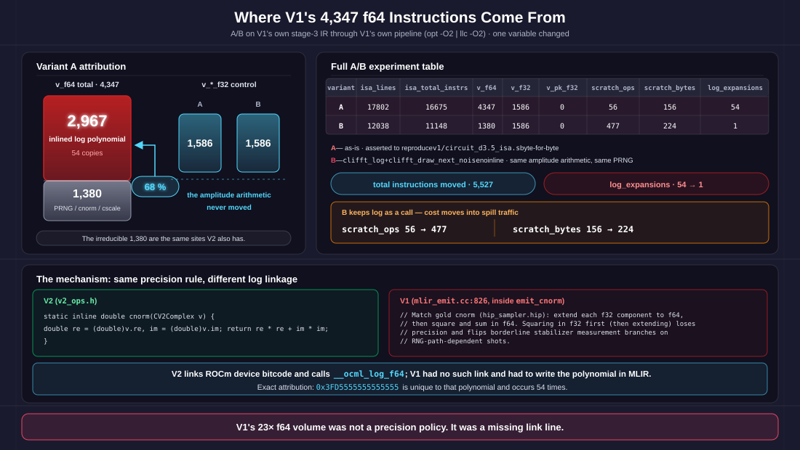
<figcaption><b>Figure 8.3</b> — V1's f64 instruction volume for <code>circuit_d3</code>,
decomposed by the A/B experiment. 68 % is 54 inlined copies of a hand-written
log polynomial; the 1,380 that remain are the same PRNG, <code>cnorm</code> and
<code>cscale</code> sites V2 has. V2 keeps <code>log()</code> as a call to
<code>__ocml_log_f64</code> because it links ROCm device bitcode; V1 had no such
link and had to write the polynomial in MLIR.</figcaption>
</figure>

`v_*_f32` is **identical** across A and B — 1,586 either way. The amplitude
arithmetic never moved. What moved is 2,967 f64 instructions, **68 % of V1's
entire f64 volume**, and 5,527 total instructions, all of it the log
polynomial.

The count is exact, not estimated. `0x3FD5555555555555` is a coefficient unique
to that polynomial, so it counts expansions directly:

```
per-coefficient occurrence count in the V1 kernel body (circuit_d3.4_optO2.ll):
  0x3FE62E42FEFA39EF  x54     <- ln 2
  0x3FA1A7B9611A7B96  x54
  0x3FD5555555555555  x54     <- the marker the script counts
```

The count is uniform across every coefficient, which is what makes it a count
of *whole expansions* rather than of incidental constants: **54 copies**, one
per `clifft_log` inlined into the kernel. The emitter wrote **48** `clifft_draw_next_noise` call sites (each of which
contains a `clifft_log` call) plus one direct `clifft_log` site, against a
single shared `@clifft_log` definition; LLVM inlined all of them and cloned five
more while unrolling the surrounding loops. At 37 f64 ops per copy that
is 1,998 IR-level ops — 63.6 % of the kernel's 3,141 — before instruction
selection turns each `fdiv double` into the `v_rcp_f64` / `v_div_scale_f64` /
`v_div_fmas_f64` / `v_div_fixup_f64` sequence that pushes the ISA-level share to
68 %.

#### What is actually left

Strip the expansion and classify the residue by dataflow component:

| what it is | ops | share |
|---|---|---|
| PRNG: `u64 → f64 × 2⁻⁵³` | 465 | 45.5 % |
| `cnorm` — f64 \|a\|² accumulation | 390 | 38.1 % |
| `cscale` — f32 → f64 × 1/√2 → f32 | 168 | 16.4 % |
| | **1,023** | |

Three sites — and **the same three sites are all V2 has**, 101 f64 ops across
its whole module:

| function | f64 ops | `u64→f64 × 2⁻⁵³` | `fpext`/`fptrunc` | what it is |
|---|---|---|---|---|
| `clifft_v2_spec` | 56 | 18 | 0 / 0 | 18 PRNG draws, nothing else |
| `v2_op_noise` | 10 | 2 | 0 / 0 | PRNG |
| `v2_op_noise_block` | 10 | 2 | 0 / 0 | PRNG |
| `v2_op_swap_meas_interfere` | 22 | 1 | 4 / 2 | cnorm + cscale |
| `v2_op_readout_noise` | 3 | 1 | 0 / 0 | PRNG |

The specialized body itself touches f64 **only** to turn random bits into a
uniform — every `fpext`/`fptrunc` pair in the module is inside one `noinline`
measurement helper. Identical semantics to V1, three orders of magnitude apart
in count, because V2's loops stayed runtime loops and V1's were unrolled.

#### Why V1 had a hand-written log at all

V1's compile pipeline is `opt` → `llc` → `ld.lld`
(`mlir_kernel_cache.cc:124-150`). There is no `llvm-link` step and no ROCm
device bitcode, so `log()` simply does not exist as a symbol. The emitter had
to write the polynomial itself, in MLIR, by hand — `emit_log_body`,
`mlir_emit.cc:1355`. Its author saw the size problem coming and hoisted it:

```cpp
// Emit the standalone @clifft_log(f64)->f64 function definition ONCE per
// module. Inlining the ~64-line log body at every noise draw produced
// hundreds of thousands of IR lines for large noisy circuits (e.g.
// surface_d9_t5: 1444 OP_NOISE × ~317 lines). Hoisting to a called function
// collapses that to one definition + short call sites.
void emit_log_function_def(std::ostringstream& out) {          // :1422
```

The hoist worked at *emission* — the emitted MLIR has one `@clifft_log`
definition and 48 short call sites, and that is what kept `surface_d9_t5`
emittable at all. Then `opt -O2` inlined all 54 copies back. The emitter
controlled its own output and had no way to control what the optimizer did
next.

V2 has the symbol, because it links the device libraries:

```cpp
// v2_ops.h:262
extern double __ocml_log_f64(double);
static inline double ocml_log_f64(double x) { return __ocml_log_f64(x); }
```

```cpp
// v2_compile_cache.cc:161 — step 2 of 5
run(llvmlink + " -o " + linked + " " + bc + " " +
    ctl + "/ocml.bc " + ctl + "/ockl.bc " + ...);
```

In V2's final ISA the call survives as a relocation, three times:

```asm
	s_getpc_b64 s[0:1]
	s_add_u32   s0, s0, __ocml_log_f64@rel32@lo+4
	s_addc_u32  s1, s1, __ocml_log_f64@rel32@hi+12
	s_swappc_b64 s[30:31], s[0:1]
```

Three call sites, one shared body, against V1's 54 expansions.

#### The one real arithmetic difference

Underneath all of that there *is* a genuine codegen difference, and the f64
noise was hiding it. `v_pk_*_f32` is **0** in V1 — in both variant A and
variant B, so the log expansion was never what blocked it — and **847** in V2.
Counting packed instructions as two lanes, V2 covers 1,705 f32 lanes in 858
instructions where V1 needs 1,586 instructions for 1,586 lanes. That is the
`shufflevector` → `v_pk_add_f32` chain of §8.5, and it is available to V2 for
the reason §8.5 gives: the amplitudes are in registers, not in a stack array.

**The honest summary: V1's f64 volume was a transcendental-inlining artifact,
not a numerical choice. Both backends compute the same quantities at the same
widths. The real instruction-level win is packing, and it is 2× on the f32
path — not 23× on the f64 one.**

---

### 8.7 What the two pipelines' diffs collectively show

| | V1 | V2 |
|---|---|---|
| Where the representation is largest | at emission (23,002 lines, human-authored) | at `-O0` (19,551 lines, compiler-authored, thrown away) |
| What the "MLIR stage" contributed | constant dedup + CSE; one pass a no-op | n/a — no MLIR |
| Where `alloca`s die | LLVM `-O2`, and only on small circuits | clang `-O2`, 2,271 → **3** (99.87 %); the 3 are a fixed per-kernel residue, not circuit-scaling |
| Whether the optimizer stays enabled | no — detuned by IR size above threshold | yes — IR never gets large enough to matter |
| Vectorization | none — 0 packed ops, with or without the log inlining | 459 `shufflevector` → 431 `v_pk_add_f32`, 416 `v_pk_mul_f32` |
| `log()` | hand-written in MLIR, re-inlined 54× by `opt` | `__ocml_log_f64`, one call, three relocations |
| f64 instructions, `circuit_d3` | 4,347 — **68 % of it inlined log** | 187 |
| Final ISA, `circuit_d3` | 17,802 lines | **10,398 lines** |
| Compile time, `circuit_d3` | 3.58 s | **2.04 s** |
| Compile time, `surface_d7_t19` | **221.48 s** | (V2 emits the same circuit in ~4,346 C lines; see §9) |

The single sentence version: **V1 asked the compiler to clean up after the
emitter, and past a certain size the compiler declined. V2 gave the compiler
something it was already good at.**

---

## 9. Optimizations, tier by tier

V2 did not arrive at its current numbers by specializing. Specialization was
the fifth thing that happened, and if it had been the first, most of the
speedup would have been invisible — the earliest V2 build was **28× slower than
SVM** on `frame_h`, and no amount of constant folding closes a 28× gap.

This chapter walks the optimization history with the progressive ratio table as
the spine. Every row of that table is a real benchmark run archived under
`V2_performance/runs/`; the full progression is in
`V2_performance/analysis/TRENDS.md`.

The sections are ordered by *magnitude*, not by date, and the two differ. The
actual commit order on `mlir-v2`, from `git log --reverse`, is:

| # | commit | time | what |
|---|---|---|---|
| 1 | `d873997` | 07-25 04:46 | P1a — shrink reduction LDS |
| 2 | `7802423` | 07-25 04:50 | P1b — bit-pack `lds_meas` |
| 3 | `715f8d0` | 07-25 05:11 | **P0 — shot-packed register tier** |
| 4 | `eea6e13` | 07-25 07:36 | specializer Phase 1 — operand library |
| 5 | `b31b400` | 07-25 07:47 | specializer Phase 2+3 — register emitter |
| 6 | `60d5728` | 07-25 08:24 | specializer — coop tier + correctness gate |
| 7 | `4b55871` | 07-25 08:34 | force-inline `v2_op_*` in the interpreter |
| 8 | `9d9cc68` | 07-25 16:24 | noise/measurement `noinline` fencing |
| 9 | `bbb5e42` | 07-25 16:35 | gate: multi-seed + disk cache |
| 10 | `5d10409` | 07-25 17:18 | specializer — global tier |
| 11 | `842d646` | 07-25 23:06 | XOR observable parity |
| 12 | `150d09f` | 07-26 06:33 | `v2_barrier` → memory barrier |

**P1 shipped 25 minutes before P0**, despite being numbered after it and being
worth ~10 % against P0's 28×. It was picked first because it was judged the
safest change in the plan (layout only, no algorithm change), which is a
reasonable way to start and a misleading way to report — so the ordering is
stated here rather than smoothed over.

### 9.1 The progression

V2/SVM kernel-time ratio, lower is better, `< 1` means V2 wins. Seven of the
twelve archived runs, chosen at the points where something changed. Column 5 is
included **because it regressed** — see the note below it:

| circuit | baseline | after P0+P1 | after specializer | *fenced+gated* | noise-specialized | global-specialized | **final** |
|---|---|---|---|---|---|---|---|
| frame_h | **28.258** | 1.215 | 0.612 | *2.859* | 0.614 | 0.645 | **0.626** |
| circuit_d3_p0.001 | 15.193 | 1.081 | 1.116 | *2.117* | 0.524 | 0.504 | **0.525** |
| qv10 | 1.313 | 1.237 | **0.252** | *0.675* | 0.308 | 0.310 | **0.310** |
| surface_d7_t15 | 1.650 | 1.469 | 1.787 | *1.427* | **0.503** | 0.507 | **0.505** |
| surface_d9_t10 | 1.642 | 1.473 | 1.796 | *1.402* | **0.484** | 0.481 | **0.481** |
| surface_d7_t19 | 0.968 | 0.872 | 1.014 | 1.017 | 1.015 | **0.312** | **0.298** |
| surface_d9_t19 | 0.906 | 0.817 | 0.973 | 0.971 | 0.972 | **0.262** | **0.262** |
| surface_d11_t15 | 0.938 | 0.854 | 1.005 | 1.005 | 1.005 | **0.259** | **0.256** |

Read the bolded cells: **each tier's win arrives in exactly one step, and does
not move afterwards.** That is the signature of a structural change rather than
a tuning change. Register tier lands at P0. Coop lands at the specializer.
Noise-heavy coop lands at the noise fence. Global lands at the global emitter.

That reading does not have to be taken on trust. Every archived run kept its
`rocprofv3` kernel trace, and the kernel *name* in the trace says which code
path produced each cell — `clifft_v2_register` / `_coop` / `_global` are the
three interpreter kernels, `clifft_v2_spec` is a specialized one. Recovering it
per cell:

| circuit | after-specializer | *fenced+gated* | noise-specialized | global-specialized | **final** |
|---|---|---|---|---|---|
| frame_h | `spec` | `register`+`spec` | `spec` | `spec` | `spec` |
| circuit_d3 | `spec` | `register`+`spec` | `spec` | `spec` | `spec` |
| qv10 | `spec` | `coop`+`spec` | `spec` | `spec` | `spec` |
| surface_d7_t15 | **`coop`** | `coop`+`spec` | `spec` | `spec` | `spec` |
| surface_d9_t10 | **`coop`** | `coop`+`spec` | `spec` | `spec` | `spec` |
| surface_d7_t19 | **`global`** | `global` | **`global`** | `spec` | `spec` |
| surface_d9_t19 | **`global`** | `global` | **`global`** | `spec` | `spec` |
| surface_d11_t15 | **`global`** | `global` | **`global`** | `spec` | `spec` |

Each ~1.0 in the table is a cell where the trace shows an *interpreter* kernel:
the specializer had not reached that tier yet, or the gate had rejected the
circuit. The step to ~0.5 or ~0.3 is always the same cell flipping to `spec`.
**Nothing in this table is a tuning effect** — every movement is a change of
which kernel ran.

The trace also settles the italic column independently of the commit history:
`noise-fenced-gated` is the **only** run in which any circuit dispatched *two*
different kernels. That is the gate's validation dispatch, caught in the act.

> **The italic column is a measurement artifact, and it is shown rather than
> dropped.** At `9d9cc68` the correctness gate existed but its verdict was
> cached only in-process. `rocprofv3` spawns a fresh process per invocation, so
> the gate's own validation dispatches re-ran *inside the profiled region* and
> the digester summed them into the kernel time — `frame_h` 0.612 → 2.859,
> `circuit_d3` 1.116 → 2.117, `qv10` 0.252 → 0.675. Nothing had actually slowed
> down. The next commit (`bbb5e42`) persisted the verdict to `<hsaco>.gate` so it
> is computed once ever, and the numbers returned to trend. Its message names the
> mechanism exactly: *"that polluted kernel traces with clifft_v2_coop+spec
> dispatches summed by the digester → inflated times."*
>
> The kernel-trace stats show precisely what was summed — **three dispatches
> where every other run has one**:
>
> ```
> noise-fenced-gated   frame_h    clifft_v2_register x1 (19.1us) + clifft_v2_spec x2 (28.8us)
>                      qv10       clifft_v2_coop     x1 (1270.2us) + clifft_v2_spec x2 (1667.2us)
> noise-specialized    frame_h    clifft_v2_spec     x1 (10.5us)
>                      qv10       clifft_v2_spec     x1 (1340.0us)
> ```
>
> One interpreter run and two specialized runs: the gate executing the circuit
> both ways to compare them, plus the real sampling dispatch. The reported
> "regression" is the sum of all three. The lesson is worth more than the
> column: **a correctness mechanism that runs on the measurement path becomes a
> performance number**, and three of these eight circuits would have been
> reported as 2–4× regressions by anyone reading the table without the commit
> history.

Two further caveats on this table, both of which follow from the project's own
benchmarking rule that ratios must not be compared across nodes:

- **The runs were not all on the same node.** Columns 1–8 ran on
  `smci350-rck-g03-d13-21`; columns 9–12, including **final**, ran on
  `smci350-rck-g03-f13-21` (recovered via `sacct`; only the final run recorded
  node identity in `node.json`, whose own note warns that "mi350x-es is
  heterogeneous — do not compare ratios across nodes"). Because every cell is a
  V2/SVM *ratio* with both halves measured in the same job, the node change
  affects the two backends together and the comparison survives; but the
  step-to-step deltas between columns 8 and 9 carry a node change as well as a
  code change, and should not be read as pure code effects.
- **`frame_h`'s 0.085 in the omitted `specializer-verify` column is not a real
  10× step.** That run's SVM side measured 128.2 µs against 16–20 µs everywhere
  else — a baseline outlier on a 12 µs kernel, not a V2 improvement. It is left
  out for that reason, and named here so the omission is not silent.

<figure>
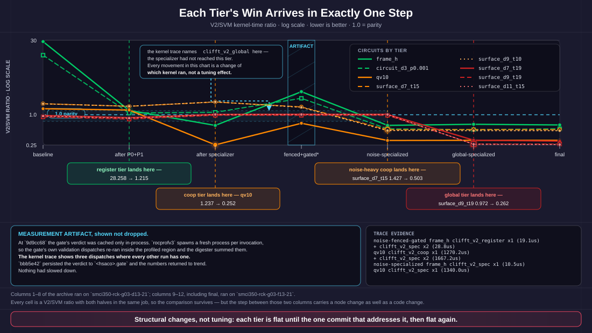
<figcaption><b>Figure 9.1</b> — V2/SVM kernel-time ratio across the twelve
archived benchmark runs. Each tier's curve is flat until the one change that
addresses it, then flat again. The y-axis is log-scaled to fit
<code>frame_h</code>'s 28.258 baseline.</figcaption>
</figure>

---

### 9.2 P0 — the shot-packed register tier (28.3× → 1.2×)

**The problem.** The first V2 was a single kernel topology: 256 threads
cooperate on one shot, amplitudes in LDS, `s_barrier` between every op. That is
the right shape for rank 10. For `frame_h` — rank 0, four instructions, no
amplitudes worth speaking of — it means 256 threads doing the work of one, with
a barrier after each of four instructions, while SVM's register path runs one
shot per thread. Hence 28.258×.

**The fix** (`715f8d0`). Rather than write a second kernel, the shared
`execute_shot` body was parameterized on *how threads cooperate*, through five
macros:

```c
#ifdef V2_REGISTER
#  define V2_STRIDE 1u
   static inline u32 v2_tid(void)  { return 0u; }
#  define IS_OWNER 1
   /* v2_barrier() -> nothing; V2_REDUCE2 -> identity (a stride-1 loop already summed) */
#else
#  define V2_STRIDE 256u
   static inline u32 v2_tid(void)  { return __builtin_amdgcn_workitem_id_x(); }
#  define IS_OWNER (t == 0)
   /* v2_barrier() -> fenced s_barrier; V2_REDUCE2 -> coop_reduce2 butterfly */
#endif
```

**The same opcode arithmetic now compiles two ways from one source.** Under
`-DV2_REGISTER`, `for (u64 i = t; i < iters; i += V2_STRIDE)` becomes
`for (i = 0; i < iters; i += 1)` — a plain serial loop in one thread — the
barriers vanish, `IS_OWNER` is constant-true so the tid0 guards evaporate, and
the reduction is the identity because a stride-1 loop has already summed
everything. `GpuComplex v[16]` lives in VGPRs.

The commit's measured result, quoted verbatim:

> Clean kernel-time vs GPU-SVM: frame_h 30.6x→1.14x, circuit_d3 14.1x→1.13x.
> The 15-28x low-rank catastrophe is eliminated; V2 register tier is now at the
> 1-shot-per-thread floor (SVM's own topology). Byte-exact vs SVM: 38/38.

Two things to note. First, "at the floor" — P0 did not make V2 *faster* than
SVM, it made V2 *the same shape* as SVM. The specialization win in §9.4 is
measured from that floor. Second, the commit message's own closing line
identifies why this refactor mattered beyond its number:

> The thread=shot topology and single tier-parameterized body are exactly what
> the MLIR specializer emits per-tier — **this refactor is the specializer's
> substrate.**

Without P0 there is no `spec_body` that all three tiers can share, and the
specializer would have needed three separate emitters.

<figure>
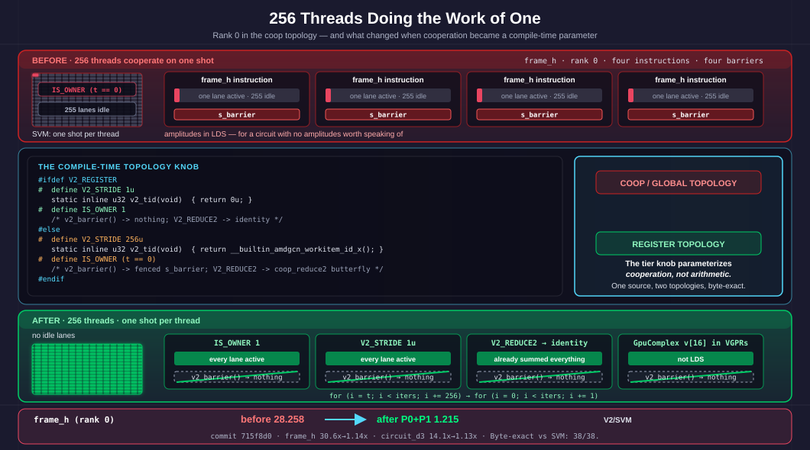
<figcaption><b>Figure 9.2</b> — The largest single optimization in V2's history
was a <em>topology</em> change, not an arithmetic one. Above: 255 idle lanes
synchronizing around one lane's scalar work, four times, per shot. Below: the
same opcode bodies with cooperation compiled out — every lane running its own
shot, the barriers gone, the reduction degenerate, and <code>v[16]</code> in
VGPRs rather than LDS. Note what the result is: 28.258× → 1.215× puts V2 <em>at
SVM's own floor</em>, not ahead of it. The specialization win in §9.4 is
measured from there.</figcaption>
</figure>

---

### 9.3 P1a/P1b — LDS reclamation on the coop tier

The coop tier's occupancy is set by LDS. At the P0 baseline the coop kernel
declared 25,088 bytes per workgroup. Two commits took that to 13,312.

**P1a (`d873997`) — right-size the reduction buffers.** Both changes are of the
form "the buffer was declared for a worst case that cannot happen":

| Buffer | Before | After | Why it is safe |
|---|---|---|---|
| `lds_red0`, `lds_red1` | `[256]` | `[8]` | `coop_reduce2` only touches warps 0–3 |
| `lds_red_scratch` | `[1024]` | `[512]` | The coop `SWAP_MEAS` fold half is `≤ 2^(10-1) = 512` |

25,088 → 16,896 bytes, confirmed by `rocprofv3`'s `LDS_Block_Size`
(`V2_performance/tools/ldscheck_50017.log`).

**P1b (`7802423`) — bit-pack the measurement array.** Measurement records are
booleans and every access is tid0-only, so `u8 lds_meas[4096]` (4 KB) packs to
`u64 lds_meas[64]` (512 B) behind three accessors (`mget`/`mset`/`mxor1`)
replacing all 15 access sites. 16,896 → 13,312 bytes (`ldscheck_50021.log`).

> **The 13,312 / 13,064 discrepancy is a reporting granule, not a change.**
> Every coop `.hsaco` on disk — the interpreter and all specializations alike —
> records `.group_segment_fixed_size: 13064`, while `rocprofv3` reports
> `LDS_Block_Size` 13,312 for the same kernels. An earlier draft of this section
> read the difference as 248 bytes "reclaimed by later changes." It is not:
> **13,312 is 13,064 rounded up to the next 256-byte granule**, and the
> global tier shows the identical pattern (ELF 784 → profiler 1,024, also the
> next multiple of 256). The two numbers describe one allocation. §15's tables
> are profiler-sourced and therefore quote the rounded figures throughout.

> **Correction — the "2 → 4 wg/CU" claim in both commit messages is wrong on
> this hardware, and the mechanism was not occupancy.** Both messages derive
> occupancy from `floor(64 KB / LDS)`, and the P1 planning documents state
> "CDNA4, 64 KB LDS/CU" as a premise
> (`gpu_kernel_static_characterization.md:77`). **gfx950 has 160 KB of LDS per
> CU, not 64 KB.** Asking the compiler directly — the same clang that builds
> these kernels — by binary-searching the largest accepted `address_space(3)`
> array:
>
> ```
> gfx90a: max LDS per workgroup = 65,473 B    (64 KB limit)
> gfx942: max LDS per workgroup = 65,473 B    (64 KB limit)
> gfx950: max LDS per workgroup = 163,681 B   (160 KB limit)
> ```
>
> and over-allocating by one byte prints the constant verbatim:
> `error: local memory (163844) exceeds limit (163840) in 'k'`. LLVM's own
> `; Occupancy:` comment, for a 256-thread workgroup at each historical budget:
>
> | LDS bytes | gfx942 | **gfx950** |
> |---|---|---|
> | 25,088 (baseline) | 2 | **6** |
> | 16,896 (after P1a) | 3 | **8** |
> | 13,312 (after P1b) | 4 | **8** |
> | 8,704 (global tier) | 7 | **8** |
>
> The gfx942 column is exactly the "2 → 3 → 4" the commits claim: the reasoning
> was right for the *previous* generation. On gfx950 the model is
> `min(8, 163840 / LDS)`, verified against LLVM at every step boundary
> (occupancy first drops below 8 at 20,992 bytes, and `163840/20992 = 7`).
> **Both P1 steps therefore moved entirely inside the flat region: 8 wg/CU
> before, 8 wg/CU after.** The occupancy cap here is the hardware's 8
> waves/SIMD, and the kernel was already at it. Sweeping VGPR from 32 to 256 at
> each LDS size leaves every entry unchanged, so registers were never binding
> either.

**So what did P1 actually buy?** The progressive table shows P0+P1 together
taking `surface_d9_t19` from 0.906 to 0.817 and `surface_d11_t15` from 0.938 to
0.854 — about 10 %, real and reproducible. But it cannot be occupancy on this
node, and the two commits are not separable in the archived runs (the
`after-P0-P1` run measures all three changes at once, on top of P0's topology
change, which is itself worth 28×). **The honest statement is that the LDS
reclamation is a correctness-preserving footprint reduction whose measured
benefit on gfx950 is not isolated, and whose stated mechanism does not hold
here.** It would be the difference between 2 and 4 wg/CU on an MI300X
(gfx942) — which is where the plan was written — and it becomes binding again
on gfx950 for any future kernel that pushes past 20 KB. What it definitely did
buy is headroom: the rank-26 work in §10 spends LDS that P1 freed.

This is also the one place where the report's ground rule cuts against a result
the project was pleased with. The measurement (`LDS_Block_Size` 25,088 →
16,896 → 13,312) was correct at every step; the *inference from it* used a
constant from the wrong chip.

Both commit messages note the forward connection, which is worth recording
because it is how the project actually proceeded:

> This is the same per-circuit LDS sizing the MLIR specializer will bake at
> compile time; here a conservative static bound.

The specializer knows each circuit's peak rank, so it could size these exactly.
It currently does not — it inherits the static bound. That is listed as an open
item in §16.

---

### 9.4 The specializer, in four commits

**Phase 1 (`eea6e13`) — extract the operand library.** Behavior-preserving
refactor: the interpreter becomes a thin `for(pc) switch` dispatching to
`static inline v2_op_*(st, v, scratch, active_k, operands...)` in a new shared
header. Each op takes its operands **and the pre-op `active_k` by value**. That
signature is the whole design:

> the interpreter passes runtime values (unchanged behavior), and the
> per-circuit specializer (next phase) emits a straight-line sequence of the
> same calls with COMPILE-TIME-CONSTANT operands → `-O2` folds loop bounds
> (`1<<(active_k-2)` → literal) and matrix indices, **WITHOUT unrolling the
> `2^k` sweeps (avoids V1's IR-bloat disease).**

Byte-exactness is then true *by construction*, not by testing: both paths call
the same function bodies. 38/38 byte-exact, timing unchanged.

`4b55871` marked the bodies `always_inline` so the interpreter gets them inlined
into `execute_shot` exactly as the pre-refactor switch bodies were. (It is
numbered as a follow-up to Phase 1 here because that is what it fixes, but it
landed *after* the coop emitter — 08:34 against 08:24 — so the two
`after-specializer` / `specializer-final` runs bracket it and are otherwise the
same code.) That commit also honestly records a cost that had not yet been
explained:

> a ~20 % coop-interpreter regression vs pre-Phase1 remains on noise-heavy
> fallback circuits (under investigation)

That regression is still visible in today's numbers as the `circuit_d5` family's
1.44–1.46× — see §11.1, where it turns out not to be a performance problem at
all but the visible consequence of a correctness gate doing its job.

**Phase 2+3 (`b31b400`) — the register-tier emitter.** The first per-circuit
kernel. Measured against the *interpreter* on the same tier:

| circuit | interpreter (V2/SVM) | specialized (V2/SVM) | gain over interpreter |
|---|---|---|---|
| frame_h | 0.16× | **0.08×** | 2.0× |
| circuit_d3 | 1.07× | **0.32×** | 3.3× |
| color_d3 | 1.09× | **0.36×** | 3.0× |

**~3× for compile-time opcode resolution.** The commit states the thesis it was
testing and the verdict: *"This validates R5's thesis: compile-time opcode
resolution + constant folding is worth ~3x."*

**Coop tier (`60d5728`)** — the same `spec_body`, a 1-workgroup-per-shot
wrapper, LDS state. This is the commit where `qv10` drops to 0.252 in the
progressive table.

The commit message claims *"qv10 5.5x, surface_d7_t15 7.6x"* over the coop
interpreter. **Those were measured ad-hoc during development and are not
reproducible from the archived runs**, which give a consistently smaller
number. Taking each circuit's last interpreter run against its first
specialized run — same node, same shot count, kernel identity confirmed by
trace:

| circuit | interpreter (µs) | specialized (µs) | gain |
|---|---|---|---|
| surface_d7_t15 | 39,352.8 (`coop`) | 11,117.4 (`spec`) | **3.54×** |
| surface_d9_t10 | 79,242.3 (`coop`) | 21,318.3 (`spec`) | **3.72×** |
| surface_d7_t19 | 20,295.2 (`global`) | 6,229.2 (`spec`) | **3.26×** |
| surface_d9_t19 | 43,588.2 (`global`) | 11,726.6 (`spec`) | **3.72×** |
| surface_d11_t15 | 75,154.0 (`global`) | 19,412.2 (`spec`) | **3.87×** |

**Specialization is worth ~3.3–3.9× over the interpreter, uniformly across coop
and global.** That is a cleaner result than the commit messages' spread of
2.0×–7.6×, and it agrees with the register tier's independently-measured ~3×
(§9.4, `b31b400`) and with the per-op instruction counts in §7 (a 2.9×
median). Three different measurements of the same lever converge on ~3×.

`qv10` is the exception and is instructive: 5,358.7 µs interpreter → 1,085.9 µs
specialized is **4.93×**, but its specialized time then *rises* to 1,340–1,361 µs
in every later run and settles at 0.310 rather than 0.252. The counters name the
cause without ambiguity:

| run | V2 µs | V2/SVM | VGPR | VALU |
|---|---|---|---|---|
| after-specializer | 1085.9 | 0.252 | 24 | 5.10e+08 |
| specializer-final | 1088.6 | 0.251 | 24 | 5.31e+08 |
| noise-specialized | 1340.0 | 0.308 | **36** | 5.02e+08 |
| global-specialized | 1346.4 | 0.310 | **36** | 5.02e+08 |
| final | 1361.3 | 0.310 | **36** | 5.02e+08 |

**VALU goes *down* while time goes up, and VGPR jumps 24 → 36 at exactly the
run that follows the noise fence.** Fewer vector instructions taking more time
with more registers live is the signature of the `noinline` boundaries in
`9d9cc68`: the ops can no longer be interleaved across call edges, so the
scheduler has less to overlap and the ABI forces values live across the calls.
It is not noise, not the node (all five runs are `d13-21`), and not the SVM
baseline (4,317–4,388 µs throughout). **`qv10` pays about 23 % for
byte-exactness**, and the progressive table reports the post-fence number
rather than quoting the faster incorrect one.

It is also the commit that introduced the **correctness gate**, and it did so
because coop specialization of noise-heavy circuits diverged. The gate is worth
restating: every `.hsaco` is validated against the interpreter on a multi-seed
shot sample before it is allowed to run, with the verdict cached to disk
(`bbb5e42` added the multi-seed + disk cache). A circuit that fails the gate
silently falls back to the interpreter. **Byte-exactness is guaranteed for every
circuit, not just the tested ones.**

**Global tier (`5d10409`).** This one began with a bottleneck analysis rather
than a hypothesis, and the commit records it:

> Bottleneck analysis (rocprofv3, V2 global vs SVM): V2 did 2× the VALU (2.34B
> vs 1.18B) and 25× more L2 misses at the same wall time — the extra VALU is
> per-amplitude scatter-index recompute (`scatter_bits_2` → `insert_zero_bit`,
> ~8–12 VALU each) that the runtime interpreter pays 256-way per shot and **SVM
> avoids via a scatter LUT it leaves OFF for global.**

That is S5 (§7.7) showing up as a whole-kernel bottleneck. SVM's answer was a
runtime lookup table; V2's answer is to fold the index arithmetic at compile
time, which is strictly better — no table, no LDS for the table, no lookup.
Result: 3.37× / 3.78× / 3.87× over the global interpreter on
`surface_d7_t19` / `d9_t19` / `d11_t15`, and in the progressive table those
three go from ~1.0 to ~0.26–0.31 in a single step.

<figure>
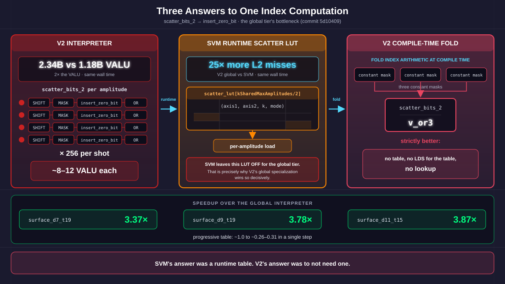
<figcaption><b>Figure 9.3</b> — The global-tier bottleneck. Left: the
interpreter recomputes <code>scatter_bits_2</code> per amplitude, 8–12 VALU
each, 256 threads deep. Centre: SVM's runtime scatter LUT, which it disables on
the global tier. Right: V2's compile-time fold — three constant masks and a
<code>v_or3</code>.</figcaption>
</figure>

---

### 9.5 The noise fence (`9d9cc68`) — and what it was actually fixing

After the coop emitter, noise-heavy circuits still failed the gate. The fix that
shipped had two parts:

1. **`V2_NOISE_ATTR`** — emit the FP-carrying noise ops and the
   reduction-carrying measurement ops **`noinline`** in the specialized build,
   so each straight-lined op is an optimization barrier the `-O2` scheduler
   cannot move FP across. The commit describes this as *"the specializer analog
   of 'resolve to a loop instead of unrolling'."*
2. **Identical compile flags.** The runtime compile had drifted:
   `-fno-vectorize -fno-unroll` had been added, which themselves differed from
   the build-time interpreter. Dropping them made the two paths compile the same
   way.

This took `surface_d7_t15` from **1.793 to 0.503** and `surface_d9_t10` from
**1.800 to 0.484** — a **3.5×** and **3.7×** step — because those circuits could
now pass the gate and run specialized.

(The step must be measured from the `specializer-final` column, not from the
italic `1.427`/`1.402`. Those intermediate cells are the gate-polluted ones:
they are *already partly specialized*, being the sum of an interpreter dispatch
and two specialized dispatches, so they sit between the two real values and
understate the step. The VALU counter makes the three states plain —
4.71e+09 interpreter, 3.49e+09 polluted mixture, 1.15e+09 specialized.)

**But the stated explanation was wrong, and the correction matters.** The commit
attributed the divergence to `-O2` reassociating FP across inlined call
boundaries. Four commits later (`150d09f`) that theory was refuted:

> That theory was refuted: the build is `-O2 -ffp-contract=off` with no
> fast-math, under which **inlining cannot legally change an FP result**, and
> `V2_GATE_SELFTEST` caught the kernel **disagreeing with itself across two runs
> of the same binary.**

A deterministic kernel that disagrees with itself is not a rounding problem. It
is a race. §11.2 tells that story. `V2_NOISE_ATTR` was retained — but for code
size, not correctness — and `V2_SPEC_NOISE_INLINE=1` exists precisely so the
hypothesis can be A/B tested rather than assumed.

This is the single best example in the project of the report's ground rule
paying off. The fence *worked*; the *reason given for why it worked* was false;
and believing the false reason would have left the actual race in the code.

---

### 9.6 One more correctness fix that looked like a performance result (`842d646`)

Worth including because it is a trap this kind of work sets constantly. V2
counted the **raw** observable parity; every reference implementation — GPU-SVM
in `hip_sampler.hip` and the CPU sampler in `svm.cc` — XORs it against the
noiseless reference syndrome first. On any circuit whose reference observable is
1, V2 reported the exact **complement** of SVM's count: `surface_d11_t19` gave
674 where SVM gave 1326 of 2000 passed shots.

The fix threads the reference through as a packed `u32 expected_obs_mask`. The
implementation detail is the interesting part:

> placed in the implicit pad slot after `num_noise_sites` so the kernarg struct
> **SIZE is unchanged** (a 120-vs-116 mismatch silently breaks every dispatch).

The layout confirms it — compiling `device_abi.h` and printing the offsets:

```
sizeof(CV2KernArgs)        = 152
offsetof num_noise_sites   = 112
offsetof expected_obs_mask = 116
```

The new field sits at 116, in the four bytes of padding that the `u32` at 112
already forced the compiler to reserve ahead of the next 8-byte-aligned member.
**A whole new argument was added for free.** (The commit's "120-vs-116" refers
to that boundary, not to the total, which is 152 both before and after.)

With HSA dispatch there is no runtime checking the kernarg layout for you (§13):
the AQL packet carries a pointer and the kernel casts it. A size or offset
mismatch is not an error, it is silently reading the wrong bytes. That is why
`device_abi_checks.cc` exists — 55 `static_assert`s pinning every offset and
size in the device header to the host structs in `gpu_types.h`, plus the opcode
numbering:

```c
static_assert(static_cast<int>(clifft::Opcode::OP_FRAME_CNOT) == 0, "opcode FRAME_CNOT");
static_assert(static_cast<int>(clifft::Opcode::OP_EXPAND)     == 19, "opcode EXPAND");
static_assert(sizeof(CV2Instr) == sizeof(GpuInstr), "CV2Instr size");
static_assert(offsetof(CV2Instr, opcode) == offsetof(GpuInstr, opcode), "instr.opcode");
```

Its header comment records that this is not hypothetical: *"this caught an
off-by-one: EXPAND/MEAS were numbered -1."* A build error instead of a silent
GPU miscompute is the whole return on the file.

---

### 9.7 Where the wins came from, summarized

| Change | Mechanism | Who it helped | Magnitude |
|---|---|---|---|
| P0 shot-packed register tier | topology: 1 shot/thread instead of 256 threads/shot | rank ≤ 4 | **28.3× → 1.2×** |
| P1a/P1b LDS reclamation | 25,088 → 13,312 B/workgroup | all coop | ~10 %, mechanism unconfirmed on gfx950 (§9.3) |
| Specializer, register | constant-fold operands, delete dispatch | rank ≤ 4 | 3.3× over interpreter |
| Specializer, coop | same, plus rank-folded loop bounds | rank 5–10 | **3.5–3.7×** over interpreter |
| Noise fence + gate | made noise circuits *eligible* to specialize | noise-heavy coop | 1.79 → 0.50 |
| Specializer, global | fold `scatter_bits_2`, no LUT needed | rank 11–19 | **3.3–3.9×** over interpreter |
| Rank cap 19 → 26 | size HBM from circuit rank, not the cap | rank 20–26 | new capability (§10) |

Two rows changed under audit and are worth naming: the coop specializer is
**3.5–3.7×**, not the 5.5–7.6× its commit message claims (§9.4), and the P1
occupancy mechanism does not hold on this chip (§9.3). Both corrections came
from the archived runs rather than from the commit log.

The specialization rows now agree with each other — **~3.3–3.9× across all
three tiers** — which is a stronger claim than the scattered original figures,
because it says the lever is the same lever everywhere: resolve the opcode at
compile time.

The pattern across the whole table: **every large win came from removing
something the runtime was doing, not from making the arithmetic faster.** The
arithmetic — the complex multiplies in the butterfly — is essentially unchanged
from SVM. What changed is that V2 stopped fetching instructions, stopped
switching on opcodes, stopped recomputing indices, and stopped reloading the
rank.

---

## 10. Extending past rank 19

The global tier's cap was `kGlobalMaxPeakRank = 19` for the entire life of the
GPU backend. Raising it to 26 required exactly one substantive change, and
finding a benchmark that could exercise it required a separate investigation
that produced a more interesting result than the change itself.

### 10.1 Why the cap could not simply be raised

The blocker was an addressing convention, not a memory limit. Every global-tier
kernel strided its per-workgroup HBM slice by **`kGlobalMaxAmplitudes`** — the
*cap* — rather than by the circuit's actual amplitude count:

```c
// before: every slot is 2^kGlobalMaxPeakRank amplitudes wide, regardless of circuit
CV2Complex* v = global_v + (u64)slot * kGlobalMaxAmplitudes;
```

At rank 19 that reserves a 4 MB amplitude slice per resident workgroup, which is
fine. At rank 26 it reserves **512 MB per workgroup** — for a rank-3 circuit as
much as for a rank-26 one. With a 2,048-workgroup pool that is a terabyte of HBM
to run `frame_h`. (Both figures are the `global_v` slice alone, which is what
the stride above governs; §10.2's quoted code comment counts the half-size
scratch too, so the same two points read 6 MB and 768 MB there.) The cap was therefore self-limiting: raising the constant made *every
circuit* unaffordable, not just the large ones.

### 10.2 The fix (`b266f80`)

Derive every per-slot stride from `flat.peak_rank`. The commit had to change it
in **four** places that must agree with each other:

| File | What it addresses |
|---|---|
| `hip_sampler.hip` | `sample_kernel_global_coop` device addressing **and** the matching host `v_count`/`scratch_count` allocation |
| `emit_global_kernel.cc` | the Hybrid compiled-codegen kernel |
| `mlir_emit.cc` | the MLIR V1 global kernel |
| `v2_kernel.cc` | already rank-derived on the device side; only the resident-pool sizing needed the same treatment |

The `emit_global_kernel.cc` change fixed a **latent out-of-bounds bug** that had
nothing to do with the cap:

> `scratch_v` used the FULL `v` stride while the host allocated scratch at HALF
> the amplitude count.

Scratch is only ever `2^(k-1)` amplitudes — it holds the fold half — so the host
allocated half. The device strided as if it were full. Any global-tier circuit
using more than one workgroup was addressing past its scratch slice. It had
never been caught because the overrun landed in the *next* workgroup's scratch,
which is written before it is read on the next op.

The second half of the fix is a **HBM budget** replacing the fixed pool
(`v2_kernel.cc:432-446`):

```cpp
// Resident pool sized to a fixed HBM budget: each workgroup owns one
// amplitude slice (1<<peak_rank) + a half-size scratch, i.e. 12 bytes
// per amplitude. At rank 19 that is 6 MB/wg; at rank 26 it is 768 MB/wg.
// The 32 GB budget keeps the pool sane at both ends on a 288 GB MI355X.
const uint64_t amp = 1ull << flat.peak_rank;
const uint64_t bytes_per_wg = amp * sizeof(GpuComplex) + (amp / 2) * sizeof(GpuComplex);
const uint64_t budget = 32ull << 30;  // 32 GB
uint64_t wgs = budget / bytes_per_wg;
if (wgs < 1) wgs = 1;               // rank 26+: at least one resident wg
if (wgs > 2048) wgs = 2048;
global_grid_wgs = static_cast<uint32_t>(wgs);
// Prefer a multiple of the XCD count when the budget allows it, so the
// resident pool spreads evenly; never inflate past the budget.
if (global_grid_wgs > kNumXCDs) global_grid_wgs -= global_grid_wgs % kNumXCDs;
```

So the pool now **shrinks as rank grows** instead of the allocation exploding.
At rank 19 the pool clamps at 2,048; at rank 26 it falls to a handful of
resident workgroups. The XCD-alignment step (`kNumXCDs = 8`) keeps the pool
spread evenly across the device's eight compute dies.

One constraint worth recording: the cap is kept `≤ 30` so `1u << rank` stays
inside a `u32`.

<figure>
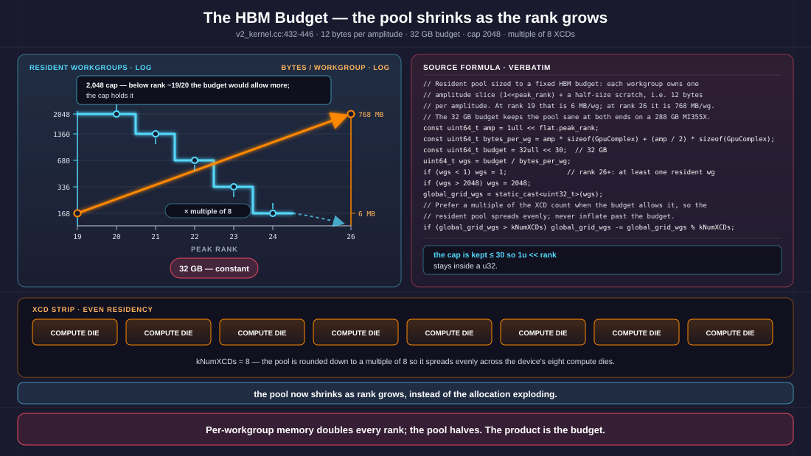
<figcaption><b>Figure 10.1</b> — Resident workgroup pool under the 32 GB budget.
Below rank ~19 the pool is clamped at 2,048 workgroups; above it, the pool
halves with every rank while per-workgroup memory doubles. The product is
constant, which is the point.</figcaption>
</figure>

### 10.3 The gate had the same bug

The specializer's correctness gate dispatched a **fixed 64-workgroup pool and a
fixed 5,000 shots** regardless of rank (`6960527`). At rank ≤ 19 that is
harmless. At rank 20+ it means the gate validates on a pool tens of times
narrower than the real dispatch, while per-shot cost grows as `2^peak_rank`:

> The gate for `qv20` had not finished after 10 minutes — longer than the
> benchmark it gates.

Fixed by giving the gate the *same* budget formula (capped at 512 — it only
needs enough parallelism to finish promptly) and tapering the shot sample above
rank 19: 1,000 shots at rank 20–21, 250 at rank 22+. The justification is
statistical rather than budgetary — *"a divergence needs far fewer shots to
surface at high rank, since each shot touches millions of amplitudes"* — and
`V2_GATE_SHOTS` overrides it for paranoid validation. Verdicts were unchanged
everywhere they had already been computed.

### 10.4 Finding a circuit that actually reaches rank 20

This is the part worth reading. With the cap raised, nothing in the tree could
exercise it — and the reason is a compiler pass working correctly.

**`StatevectorSqueezePass` defeats most "high rank" circuits.** It reorders
operations so that T-injection circuits with only local Clifford glue collapse
almost completely. From `4b9efc7`:

> `rank19_q100_d10_wide` compiles to **peak_rank = 1**, and the `surface_d11`
> family tops out around 14.

A fixture named for rank 19 that compiles to rank 1. This is not a bug — it is
the entire premise of the SVM, which is that near-Clifford circuits have a small
*active* rank regardless of how many qubits they name.

**Quantum Volume circuits do not squeeze.** Each QV layer applies a random SU(4)
to a fresh random pairing of *all* qubits, so the whole register stays entangled
and `peak_rank == num_qubits` exactly. `generate_qv_circuits.py` emits them with
U3 angles in clifft's normalized convention. Verified with a host-side rank
probe running the identical compile path as `run_v2` (trace → HIR passes →
reference syndrome → lower → bytecode passes):

```
qv20_L8 = 20    qv21_L8 = 21    qv22_L6 = 22    qv23_L5 = 23    qv24_L4 = 24
```

Layer counts taper with width (`L8` → `L4`) to keep compile and run time
bounded.

### 10.5 The census — 22 of 353

"Are these all the circuits?" was a fair challenge, and it was answered by
measurement (`89d541e`). `probe_all.sh` ran the rank probe over **every** live
`.stim` in the tree — 353 files across `tests/fixtures`, `tools/bench/fixtures`,
and `docs/guide/circuits` — recording the **compiled** `peak_rank`, i.e. what
the tier dispatcher actually sees after `StatevectorSqueezePass`.

The raw probe output is `V2_performance/scratch/all_ranks.txt`, one
`<rank> <path>` line per fixture. Its full distribution — every fixture in the
tree, by compiled rank:

| compiled rank | fixtures | tier |
|---|---|---|
| 0 | 82 | register |
| 1 | 244 | register |
| 3 | 3 | register |
| 4 | 2 | register |
| **0–1 subtotal** | **326** | **register** |
| 7 | 3 | coop |
| 10 | 8 | coop |
| 11 | 2 | global |
| 12 | 1 | global |
| 13 | 1 | global |
| 14 | 1 | global |
| 20 | 2 | global |
| 21 | 1 | global |
| 22 | 1 | global |
| 23 | 1 | global |
| 24 | 1 | global |
| **≥ 5 subtotal** | **22** | **coop + global** |
| **total** | **353** | |

Note what is *absent*: **nothing in the entire tree compiles to rank 2, 5, 6,
8, 9, 15, 16, 17, 18 or 19.** The distribution is not a smooth spread with a
long tail — it is two dense clusters (0–1 and 10) plus a thin spine of surface
codes and the six hand-built QV circuits. The coop tier, which the bulk of the
optimization work in §9 targets, is exercised by exactly **eleven** fixtures —
three `surface_*_t10` at rank 7, and eight at rank 10, of which five are the
`circuit_d5` parameter sweep and the other three are `qv10`, `cultivation_d5`
and `surface_d7_t15`.

Every one of `tests/fixtures/sweep` (188 files) and `rank_sweep` (56) squeezes
flat, *despite names like `rank_q17_r12_d1.stim` promising rank 12.*

Two consequences, both recorded in `BENCHMARKS.md` so the next person does not
have to re-derive them:

1. **A benchmark set covering "all the high-rank circuits" is 22 circuits, not
   hundreds.** The 26-circuit corpus in §15 is therefore not a sample — it is
   effectively the population, plus four parameter variants.
2. **Do not infer a fixture's tier from its name or qubit count. Probe it.**

This also reframes the whole project's scope honestly: the GPU backend's tiering
matters for a small, specific class of circuits. Most of what a user throws at
`clifft` collapses to rank 0–1 and never leaves the register tier.

### 10.6 What rank 20–26 actually costs

The five QV circuits are the only ones in the corpus above rank 19, and they are
where V2's advantage thins out:

| circuit | rank | V2 (µs) | SVM (µs) | ratio | VGPR spill | SGPR spill | scratch |
|---|---|---|---|---|---|---|---|
| qv20_seed42 | 20 | 1,804,648 | 2,123,250 | 0.850 | 0 | 0 | 96 |
| qv20_L8_seed42 | 20 | 1,583,246 | 2,162,954 | 0.732 | 0 | 0 | 112 |
| qv21_L8_seed42 | 21 | 2,977,386 | 4,045,316 | 0.736 | 0 | 0 | 112 |
| qv22_L6_seed42 | 22 | 3,179,445 | 3,243,842 | **0.980** | **136** | **762** | 448 |
| qv23_L5_seed42 | 23 | 6,086,167 | 6,146,952 | **0.990** | **199** | **662** | 576 |
| qv24_L4_seed42 | 24 | 7,241,815 | 8,211,443 | 0.882 | **152** | **594** | 480 |

The break is sharp and it is at rank 22. Below it, zero spilling and V2 wins
0.72–0.84. At and above it, the three worst-spilling kernels in the entire
89-kernel corpus — SGPR spill 762 / 662 / 594, the top three by that metric and
by VGPR spill — and the advantage collapses to 0.98–0.99.

> **Provenance — read this before quoting the timing columns.**
>
> The **resource columns are solid.** Both binaries survive in-tree — pre-fence
> under `V2_performance/history/stale_spec_cache_20260725/`, post-fence under
> `V2_performance/scratch/fence_cache/all/` — so this is directly checkable:
>
> | kernel | pre (B) | post (B) | Δ | bytes differing | `vgpr_spill` | `sgpr_spill` | `sgpr_count` | scratch |
> |---|---|---|---|---|---|---|---|---|
> | `global_r22_n359` | 217,424 | 218,576 | +1,152 | **83.8 %** | 136 = 136 | 762 = 762 | 108 = 108 | 448 = 448 |
> | `global_r23_n335` | 190,480 | 191,568 | +1,088 | **82.9 %** | 199 = 199 | 662 = 662 | 108 = 108 | 576 = 576 |
> | `global_r24_n320` | 172,880 | 173,904 | +1,024 | **82.8 %** | 152 = 152 | 594 = 594 | 108 = 108 | 480 = 480 |
>
> **Five-sixths of the binary changed and not one resource number moved.**
> Register pressure is a property of what the specializer emits, not of the
> fences around it, so the spill table is unaffected by the §11.4 invalidation.
>
> The **timing columns are post-fence**, and an earlier provisional note in this
> section saying otherwise has been retired. Every cell above comes from the
> report's canonical run — `20260727T125310Z_report-final-allfixtures`, SLURM
> job 50793, node `smci350-rck-g03-d13-21`, commit `79d4463`, clean tree — the
> same run §14 and §15 draw on, so this table is directly comparable with
> theirs. `git merge-base --is-ancestor 150d09f 79d4463` confirms the fence fix
> is an ancestor of it. The published figures reproduce exactly from that run's
> raw `total_kernel_ns`.
>
> A second post-fence full-corpus run — `report-final-postdust` (job 50469,
> commit `f565075`) — landed on a **different node**, `smci350-rck-g03-f13-21`.
> Its ratios agree to within 1.3 % on every circuit
> (0.839/0.723/0.728/0.981/0.990/0.880 against the published
> 0.850/0.732/0.736/0.980/0.990/0.882), with identical scratch sizes. That is
> corroboration of the *conclusion*, not a source for the table: `mi350x-es` is
> heterogeneous and ratios are not comparable across node types, so the two
> runs are never mixed within a row. Three pre-fence runs on `f13-21` —
> `fullbench-rank26` (`000322Z`), `fullbench-3way` (`011254Z`) and
> `all-tier5plus` (`014859Z`) — bracket the same shape, the first reporting
> 0.844/0.728/0.731/0.980/0.992/0.880.
>
> That the fence made no measurable difference here is the expected result and
> not a null finding to be embarrassed about: the fence bug corrupted reduction
> totals in the **coop** tier, and every kernel in this table is global-tier.
> §15 still carries the final full-corpus numbers, but this table no longer
> awaits them.

**Why spilling appears exactly there — and what the data rules out.** The
tempting explanation is that the specializer emits one call per instruction with
constants baked in, so longer circuits carry more live scalars until the SGPR
budget breaks. **The corpus refutes this.** Sorting every `global_*` kernel by
emitted instruction count:

All fifteen `global_*` kernels in `lowering/kernel_resources.csv`, nothing
omitted:

| rank | instrs | VGPR | AGPR | SGPR | VGPR spill | SGPR spill | scratch |
|---|---|---|---|---|---|---|---|
| 14 | 16,521 | 128 | 64 | 106 | 0 | 4 | 352 |
| 11 | 16,415 | 128 | 64 | 106 | 0 | 4 | 320 |
| 11 | 16,415 | 128 | 64 | 106 | 0 | 4 | 320 |
| 13 | 9,359 | 128 | 64 | 106 | 0 | 4 | 336 |
| 13 | 9,359 | 128 | 64 | 106 | 0 | 4 | 336 |
| 11 | 8,952 | 128 | 64 | 106 | 0 | 4 | 320 |
| 11 | 8,952 | 128 | 64 | 106 | 0 | 4 | 320 |
| 12 | 4,296 | 128 | 64 | 106 | 0 | 4 | 320 |
| 12 | 4,296 | 128 | 64 | 106 | 0 | 0 | 320 |
| 20 | 418 | **104** | **40** | 106 | 0 | 0 | 96 |
| 20 | 387 | **106** | **42** | 106 | 0 | 0 | 112 |
| 21 | 393 | **104** | **40** | 106 | 0 | 0 | 112 |
| **22** | **359** | 128 | 64 | 108 | **136** | **762** | 448 |
| **23** | **335** | 128 | 64 | 108 | **199** | **662** | 576 |
| **24** | **320** | 128 | 64 | 108 | **152** | **594** | 480 |

The three spilling kernels are the three **shortest** in the tier. A rank-14
kernel emits 16,521 instructions — 46× more than rank 22's 359 — and spills 4
SGPRs. Instruction count is not the mechanism; if anything the correlation runs
backwards. That also disposes of the "qv24 is an anomaly because it has the
fewest instructions" story: fewest instructions is the norm among the spillers,
not an exception.

The full listing sharpens the boundary. **Rank 20–21 is the only region in the
tier where the allocator does not take the VGPR 128 / AGPR 64 cap** — three
kernels at 104–106 / 40–42, all with zero spill and the smallest scratch in the
tier (96–112 B). Every other kernel, at rank 11–14 and at rank 22–24 alike, is
at the cap. So the rank-22 break is not "the allocator hits the cap"; the
long rank-11–14 kernels are at the cap too and spill 4 SGPRs at most. It is that
rank 22 hits the cap **and** finds nothing left to overflow into.

<figure>
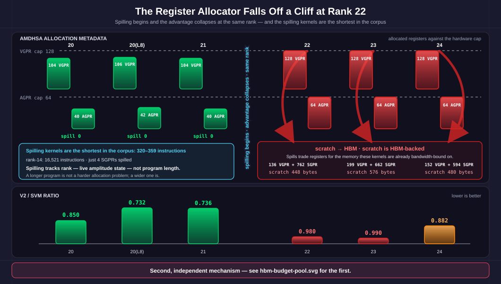
<figcaption><b>Figure 10.2</b> — The cliff, on one vertical line. Ranks 20–21 sit
<em>below</em> the VGPR 128 / AGPR 64 cap and spill nothing; rank 22 takes the cap
and pushes 594–762 scalars into HBM-backed scratch — the same memory these
kernels are already bandwidth-bound on — and the ratio collapses from 0.732–0.850
to 0.980–0.990 at exactly that rank. The spilling kernels are the <em>shortest</em>
in the tier (320–359 instructions) against a rank-14 kernel at 16,521 that spills
4 SGPRs, so this is rank-driven live state, not program length.</figcaption>
</figure>

What actually changes at the boundary is narrower than expected. Diffing the
emitted C for rank 21 against rank 22 with all numeric literals normalized shows
**no structural difference** — same preprocessor preamble, same `spec_body`
shape, near-identical opcode mix (169/80/42 `array_u2`/`array_u4`/`array_rot` vs
142/66/44). The tier wrapper is rank-independent by construction
(`v2_specializer.cc:196-224`). The one thing that differs is a single baked
constant:

```c
const u64 amp_capacity = 2097152ull;   // rank 21
const u64 amp_capacity = 4194304ull;   // rank 22
```

Crossing 2²² also moves the allocator's chosen register split: the non-spilling
rank 20/21 kernels sit at VGPR 104–106 / AGPR 40–42, while every spilling kernel
jumps to the VGPR 128 / AGPR 64 cap. On CDNA the AGPR file is repurposed as
overflow storage when MFMA is unused (and `SQ_INSTS_MFMA = 0` throughout here),
so the pattern is consistent with the allocator exhausting AGPR overflow at the
cap and falling through to scratch. **That is an inference from resource
metadata, not a verified mechanism** — the emitted C is essentially unchanged, so
the cause lies inside LLVM's allocation for the wider constant, which has not
been isolated. Stated as an open question rather than an answer.

What *is* solid: the correlation is exact. Every global kernel at rank ≤ 21
spills ≤ 4 SGPRs and wins 0.72–0.84; every one at rank ≥ 22 spills 594–762 SGPRs
to HBM-backed scratch — the same memory the kernel is already bandwidth-bound on
— and the win collapses to 0.98–0.99. So the honest conclusion holds:
**V2's specialization advantage decays above rank 21 and is essentially gone by
rank 23.** §16 lists it as the top open item; the first step is an LLVM
allocation study at the rank-21/22 boundary, not a code change.

---

## 11. Pitfalls

Five things went wrong in V2 that are worth writing down. In four of them a
*plausible* explanation was adopted, documented, and built on — and in every one
of those four the plausible explanation was wrong. The pattern is uniform enough to state
up front:

> Each bug was diagnosed by analogy ("this looks like an FP problem", "this looks
> like a fixture problem") and each was actually resolved by an experiment that
> asked the system a question it could only answer one way. The diagnosis-by-
> analogy was never merely incomplete; it pointed at the wrong subsystem.

### 11.1 The noise regression, and the theory that was wrong

**The symptom.** The `circuit_d5` / `cultivation_d5` family — rank 10, 1,720
instructions, the noisiest circuits in the corpus — produced measurement
outcomes from the specialized kernel that differed from the interpreter on
roughly one shot in five thousand, on some seeds.

**The theory.** Straight-lining the bytecode duplicates each noise op's body at
every call site. Noise ops carry scalar FP: an `ocml_log_f64` hazard draw,
cumulative-probability sums, RNG. If `-O2` reassociated that FP differently
across copies, a probability could shift by ~1 ULP, `sample_branch` could take
the other side of a comparison, and — because a branch decides *whether a PRNG
draw is consumed* — the two streams would decorrelate permanently and never
resynchronize.

This story is mechanically coherent, it names a real hazard, and it fits the
observation that only the noisiest circuit family was affected. It motivated
`V2_NOISE_ATTR` (`9d9cc68`): emit the noise ops `noinline` in the specialized
build so `-O2` cannot merge or reassociate across the copies.

**Why it was wrong.** Two facts, either of which is sufficient:

1. **The build cannot legally do what the theory requires.** The specializer
   compiles with `-O2 -ffp-contract=off` and no fast-math. Under those flags
   reassociation of floating-point is *not permitted*, so inlining cannot change
   an FP result. `v2_compile_cache.cc` even says so at the flag site:

   ```
   // Flags are IDENTICAL to the build-time interpreter pipeline
   // (ClifftAmdgcn.cmake) so the shared v2_op_*() bodies compile to the same
   // code -> byte-exact. -ffp-contract=off with no fast-math is what makes that
   // hold regardless of inlining decisions: without reassociation or
   // contraction the optimizer cannot change an FP result. Do NOT add
   // vectorize/unroll/fast-math flags that would diverge from the interpreter.
   ```

2. **The kernel disagreed with itself.** `V2_GATE_SELFTEST` (`ca82260`) runs a
   kernel against *itself*, twice, same seed, same shots, same binary. Rounding
   is deterministic for a fixed binary, so any disagreement is proof of
   nondeterminism. Result:

   Per-seed, 5,000 shots each, `circuit_d5_p0.001` (job 50361). The counts are
   `obs0` ones from run A vs run B of the *same binary*:

   | seed | interp vs interp | verdict | spec vs spec | verdict |
   |---|---|---|---|---|
   | 1 | 1620 / 1620 | deterministic | 1620 / **1619** | **NONDETERMINISTIC** |
   | 7 | 1724 / 1724 | deterministic | 1724 / **1723** | **NONDETERMINISTIC** |
   | 42 | 1704 / 1704 | deterministic | 1704 / 1704 | deterministic |
   | 99 | 1720 / 1720 | deterministic | 1721 / **1720** | **NONDETERMINISTIC** |
   | 123 | 1691 / 1691 | deterministic | 1690 / **1691** | **NONDETERMINISTIC** |
   | 2718 | 1681 / 1681 | deterministic | 1681 / 1681 | deterministic |
   | | **0 / 6 diverge** | | **4 / 6 diverge** | |

   Note that `passed` was 5000/5000 in *every* cell — the shots all completed;
   only the observable flipped. The divergence is one sample in ~1,700, which is
   exactly the "one shot in five thousand" the symptom section describes, now
   attributed to the right cause. No rounding model explains a binary disagreeing
   with itself. This is a race.

`V2_GATE_BISECT` then localized it. The instrumentation
(`v2_kernel.cc:226-247`) re-runs each shot as its own dispatch —
`run_one(..., i, i+1, ...)` — and in the coop tier one shot is exactly one
workgroup. Scanning all 5,000 shots of the worst seed emitted **not a single
`DIVERGES` line**: at one workgroup the two kernels agree on every shot. The bug
needed *concurrent* workgroups, which also rules out any single shot's
arithmetic — the same instruction stream, on the same inputs, is correct when
run alone.

The A/B on the fix itself was the last nail: `V2_SPEC_NOISE_INLINE=1`, which
flips `V2_NOISE_ATTR` back to `always_inline`, made things **worse** — 5/6 seeds
diverging rather than 4/6, and with *larger* deltas (seed 99 went from off-by-1
to off-by-3, 1721 / 1718). That is consistent with perturbing a race's timing,
and inconsistent with the attribute being the load-bearing fix. It also shows
the trap in the original diagnosis: had the A/B not been run, the attribute
would have looked like a partial fix rather than no fix at all, because both
arms diverge on *some* seeds and the seed set is small.

**What was kept and why.** `V2_NOISE_ATTR` stayed, but its justification was
rewritten in the source to say what is actually true:

> The attribute is kept because it measurably helps register pressure and code
> size on large circuits, **NOT** because it is load-bearing for correctness.

That is the honest outcome: a change introduced for a wrong reason that happens
to pay for itself for a different, measurable reason. The comment at
`v2_ops_body.inc:409-427` is labelled `HISTORICAL NOTE` and states the refutation
inline, so the next reader cannot re-derive the dead theory from the code.

### 11.2 The real bug: a barrier that ordered execution but not memory

`v2_barrier()` was a bare `__builtin_amdgcn_s_barrier()`.

On AMDGCN that is an **execution** barrier only. LLVM declares the intrinsic
`IntrNoMem`, so the backend emits no `s_waitcnt lgkmcnt(0)` ahead of it and the
scheduler is free to sink or hoist LDS accesses across it. A wave can retire the
barrier with a `ds_write` still in flight while a peer wave reads the stale word.

Measured on the pre-fix gfx950 ISA — barriers with a `ds_*` op in flight and no
intervening `s_waitcnt lgkmcnt(0)`. Every number below was re-derived for this
report by disassembling the archived binaries with `llvm-objdump` and by
rebuilding the interpreter twice from the same source with only the barrier
body swapped:

| kernel | barriers | unfenced | how measured |
|---|---|---|---|
| interpreter (`clifft_v2_coop`) | 80 | **50 (62.5 %)** | A/B rebuild, `s_barrier` vs release/acquire, `-O2` asm |
| **specialized** (`coop_r10_n1720`) | 1,509 | **1,400 (92.8 %)** | `llvm-objdump -d` on the archived pre-fix `.hsaco` |

**Both kernels were wrong.** The specializer has **~28× more** exposed barriers
because it straight-lines every op, which is precisely why only it failed the
correctness gate — the interpreter was equally incorrect in principle and simply
lost the race far less often.

> **Correction.** Commit `150d09f`'s message, and the header comment in
> `V2_performance/scratch/d5_fence.sh`, both record the specialized figure as
> **1439 / 1509 (95.4 %)**. That number does not reproduce. Disassembling the
> archived pre-fix `coop_r10_n1720_977e1e830813621d.hsaco` gives **1,400** under
> every reasonable definition of "in flight" — scanning back 24, 32, 48, 64 or
> unbounded instructions to the previous barrier all converge on 1,400, and
> loosening `lgkmcnt(0)` to any `lgkmcnt` does not move it either. The only
> definitions that yield anything else are degenerate: counting barriers not
> *immediately* preceded by a wait gives 1,509, and a 3-instruction window gives
> 1,460. The interpreter figure is likewise 50 / 80, not 52 / 81 — the archived
> count was taken on a `.hsaco` linked against `ocml`/`ockl`, which contributes
> one extra barrier and one extra unfenced site from device-library code that is
> not V2's. **None of this changes the conclusion**; the corrected ratio (28×) is
> marginally *larger* than the one originally claimed.

This also explains why the SVM and Hybrid backends never saw it: HIP's
`__syncthreads()` already expands to the fenced sequence. **V2 hand-rolled the
barrier to avoid HIP and lost the fence along with it** — a direct, and
expensive, cost of the no-HIP policy (§13).

The fix (`150d09f`) wraps the barrier in a release/acquire pair:

```c
// s_barrier alone is an EXECUTION barrier only: LLVM models the intrinsic as
// IntrNoMem, so it neither emits `s_waitcnt lgkmcnt(0)` nor stops the scheduler
// from sinking/hoisting LDS accesses across it. A wave can therefore retire the
// barrier with a ds_write still in flight while a peer wave reads the stale
// word. The release/acquire fence pair is what makes it a MEMORY barrier: the
// release forces the waitcnt before s_barrier, the acquire keeps later loads
// from being hoisted above it. HIP's __syncthreads() expands to exactly this,
// which is why the SVM backend never saw the race.
static inline void v2_barrier(void) {
    __builtin_amdgcn_fence(__ATOMIC_RELEASE, "workgroup");
    __builtin_amdgcn_s_barrier();
    __builtin_amdgcn_fence(__ATOMIC_ACQUIRE, "workgroup");
}
```

`coop_reduce2`'s three raw barriers were converted too — each guards a
read-after-write on `lds_red0`/`lds_red1`, so a lost partial sum perturbs the
reduction total and flips `sample_branch`. **That is the causal path by which a
missing fence became a wrong measurement outcome**, and it is why the symptom
looked numerical: the corrupted value really was a probability.

The cost was measured directly, by compiling `coop_interpreter.c` twice — once
with the bare `s_barrier`, once with the fence pair, same source, same flags
(`-O2 -ffp-contract=off -mcpu=gfx950`), disassembling both:

| build | instructions | barriers | fenced | `ds_*` in flight, unfenced |
|---|---|---|---|---|
| pre-fix interpreter | 5,629 | 80 | 1 (1.2 %) | **50 (62.5 %)** |
| post-fix interpreter | 5,848 | 80 | 74 (92.5 %) | **0 (0.0 %)** |
| pre/post register tier | 4,457 | 0 | — | — |

The A/B was re-run from scratch for this report — same source tree, the only
difference being `v2_barrier()`'s three-line body — and every cell above
reproduces exactly. The "fenced" column uses a 3-instruction lookback; at a
1-instruction lookback the post-fix figure is 73 rather than 74, which is the
one place the definition matters and it moves nothing. The register-tier row is
not an approximation: with `-DV2_REGISTER` the two `.s` files are **identical by
md5**, because `v2_barrier()` compiles to nothing there (`v2_ops.h:131`).

Two things fall out. **The fix is complete**: the unfenced-with-`ds`-in-flight
count goes to exactly zero — the 6 barriers that remain unfenced have no LDS
write pending, so the wait is correctly elided rather than missing. And the
price is **+3.89 % static instructions** (5,629 → 5,848), matching the +3.88 %
recorded at the time. The register tier is unaffected in both directions: with
`-DV2_REGISTER` there are no barriers at all, so the two builds are
byte-identical at 4,457 instructions — **the fix costs the register tier
nothing**, which is why §9's register-tier numbers need no restatement.

The same audit on the archived specialized binaries:

| `.hsaco` | barriers | fenced (`lgkmcnt(0)` within 3) | `ds_*` in flight, unfenced |
|---|---|---|---|
| pre-fix `coop_r10_n1720` | 1,509 | **49 (3.2 %)** | **1,400 (92.8 %)** |
| post-fix `coop_r10_n1720` | 1,509 | **1,404 (93.0 %)** | **0 (0.0 %)** |

Note the two columns measure different things and both are worth reporting: the
pre-fix kernel has 49 barriers that *happen* to sit behind a wait emitted for an
unrelated reason — accidentally correct, not correct by construction. Post-fix,
the in-flight column is zero, which is the property that actually matters.

With the fence in place the gate **passes** on `coop_r10_n1720`, and the
specializer is selected for all six circuits. Kernel time, median of 5, 10,000
shots, both arms back-to-back on one node (job 50389, gfx950):

| circuit | interpreter | specialized | speedup |
|---|---|---|---|
| circuit_d5_p0.0005 | 14.76 ms | 8.56 ms | 1.72× |
| circuit_d5_p0.001 | 14.89 ms | 8.56 ms | 1.74× |
| circuit_d5_p0.002 | 15.09 ms | 8.63 ms | 1.75× |
| circuit_d5_p0.003 | 15.30 ms | 8.68 ms | 1.76× |
| circuit_d5_p0.005 | 15.62 ms | 8.87 ms | 1.76× |
| circuit_d3_p0.001 | 0.624 ms | 0.379 ms | 1.65× |

<figure>
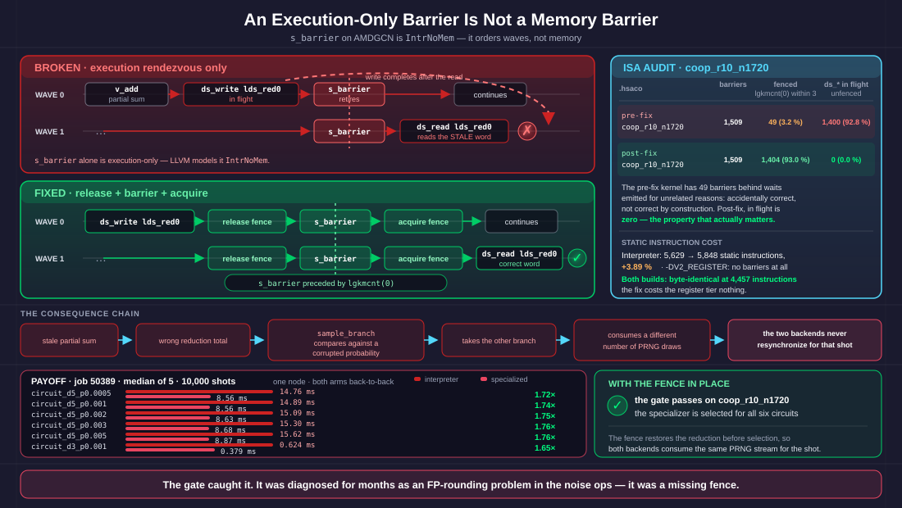
<figcaption><b>Figure 11.1</b> — Why an execution-only barrier loses a partial
sum. Wave 0 retires <code>s_barrier</code> with its <code>ds_write</code> to
<code>lds_red0</code> still in flight; wave 1 passes the same barrier and reads
the stale word. The reduction total is wrong, so <code>sample_branch</code>
compares against a corrupted probability and takes the other side — consuming a
different number of PRNG draws from that shot onward.</figcaption>
</figure>

### 11.3 The threshold that was calibrated for the wrong precision

Covered in full in §12, but it belongs in this list because it has the same
shape: `V2_DUST_EPS` was `1e-18`, a sensible clamp for f64 amplitudes, compared
against **f32** amplitudes. The clamp never fired on the GPU where it fired on
the CPU; `sample_branch` returns *without drawing a PRNG value* when a branch is
dust, so one side consumed a random number the other did not, and the streams
desynchronized permanently.

The lesson is not "f32 is imprecise." It is that **a constant outlived the
representation it was chosen for**, and nothing in the type system noticed.

### 11.4 The pitfall that nearly reached this report: a stale specialization cache

This one was found while writing this chapter, and it is the most instructive of
the four because it corrupted *the measurements themselves* rather than the code.

**The mechanism.** `compile_specialized()` computes a content hash to decide
whether a cached `.hsaco` can be reused:

```cpp
// before
std::string ident = csrc + "|" + llvm_bin("clang") + "|" + arch() + "|" + bitcode_dir();
size_t h = std::hash<std::string>{}(ident);
```

`csrc` is the generated C. But the generated C is only *half* the translation
unit — it is a list of `v2_op_*(...)` calls plus `#include "v2_ops.h"`. Every op
body, `v2_barrier()`, and every tunable constant lives in the headers, and **the
headers are not in the hash.** Change `v2_ops.h`, and the key does not move: the
day-old `.hsaco` is reused, *and so is its `<hsaco>.gate` verdict*, which is
keyed off the same path.

**How far it got.** The benchmark run submitted specifically to guarantee that
"every performance claim in the upcoming report reflects shipped, correct code"
dispatched pre-fix kernels for every specialized circuit. Verified on the
binaries with `llvm-objdump`, on two independent markers:

| marker | build cache (what the run used) | fresh cache |
|---|---|---|
| barriers with `ds_*` in flight and no `lgkmcnt(0)` (the `150d09f` fence) | **1400 / 1509 (92.8 %)** | **0 / 1509 (0.0 %)** |
| `s_barrier` preceded by `lgkmcnt(0)` within 3 instructions | **49 / 1509 (3.2 %)** | 1404 / 1509 (93.0 %) |
| `V2_DUST_EPS` constant baked into the binary | **`0x3c32725d…` = `1e-18`** (pre-`2a015fd`) | `0x3da5fd7f…` = `1e-11` (fixed) |

The dust marker is the cleaner of the two because it is a bit pattern, not a
heuristic: the IEEE-754 double `1e-18` has high word `0x3c32725d` and `1e-11`
has `0x3da5fd7f`, and each appears exactly twice in its respective binary and
zero times in the other. There is no interpretation involved — the stale kernel
provably contains the pre-fix constant.

Both markers agree with the timestamps: 32 of the 36 cached kernels are dated
2026-07-25 and the remaining 4 are from 07-26 00:00–01:48 — all of them before
the barrier fix at 07-26 06:33, and well before the dust fix at 07-26 13:31.
Every kernel the run dispatched predates both fixes.

<figure>
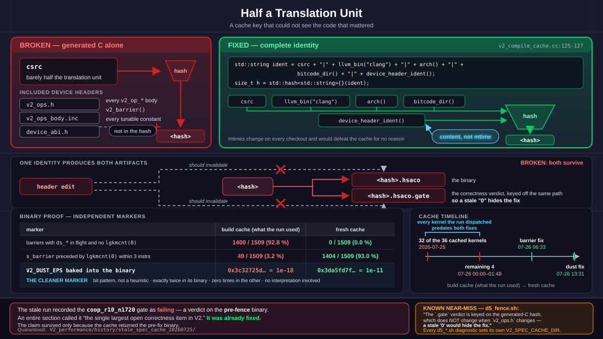
<figcaption><b>Figure 11.2</b> — The cache did exactly what its key said; the
key was incomplete. One identity produces both the binary <em>and</em> the
correctness verdict, so a header fix that does not move the key preserves a
stale &quot;0&quot; along with the stale kernel. The proof is two independent
markers on the binaries themselves — and the dust constant is a bit pattern,
not a heuristic.</figcaption>
</figure>

**The consequence for the in-tree conclusions.** The stale run recorded the
`coop_r10_n1720` gate as *failing*, which is a verdict on the **pre-fence**
binary — and the ledger built an entire section around "the specializer is still
incorrect on this shape," listing it as *"the single largest open correctness
item in V2."* It was already fixed. The claim survived only because the cache
kept handing back the binary from before the fix.

**The near-miss that makes this worth reporting.** The hazard was *known*.
`d5_fence.sh` documents it exactly:

> The `.gate` verdict is keyed on the generated-C hash, which does **NOT** change
> when `v2_ops.h` changes — a stale "0" would hide the fix. Each arm uses a fresh
> `V2_SPEC_CACHE_DIR` so every verdict below is recomputed from scratch.

Every `d5_*.sh` diagnostic script therefore sets its own `V2_SPEC_CACHE_DIR` and
got correct results. **The workaround was applied per-script instead of fixing
the cache**, so the one path that did *not* set the variable — the build tree's
default cache, used by the benchmark sweep — silently kept serving stale
kernels. A known bug, correctly documented, routed around rather than fixed, in
the one place it mattered most.

The fix folds a content hash of the three device headers into the cache identity
(`009df59`):

```cpp
// Identity of the DEVICE HEADERS the emitted C includes. The generated .c is
// only half the translation unit: every v2_op_* body, v2_barrier(), and every
// tunable constant (V2_DUST_EPS, ...) lives in these headers. [...]
// Content, not mtime: mtimes change on every checkout and would defeat the
// cache for no reason.
std::string ident = csrc + "|" + llvm_bin("clang") + "|" + arch() + "|" +
                    bitcode_dir() + "|" + device_header_ident();
```

The stale cache was **moved, not deleted**, to
`V2_performance/history/stale_spec_cache_20260725/` — it is the evidence for
this section.

### 11.5 The same bug, in the build system, three minutes later

The specializer's runtime cache was not the only thing keyed on the wrong
inputs. `ClifftAmdgcn.cmake`'s `add_custom_command` for each `.hsaco` listed
`DEPENDS "${_src}"` — the `.c` file alone. CMake does no implicit header
scanning for custom commands, so editing `v2_ops.h` did not invalidate the
output and an incremental build kept linking the previously-compiled kernel.

This matters because of what those `.c` files are. `coop_interpreter.c` is
~150 lines wrapping the entire op library; **the headers *are* the kernel**. The
commit that fixed it (`72aee12`, 07-26 06:36) says where it was caught:

> This bit during the barrier-fence fix: the first verification job would have
> measured the pre-fix kernel and reported the fix as ineffective.

Note the timestamps. The barrier fix landed at 06:33 and this landed at
**06:36** — the staleness was hit immediately, on the very first attempt to
measure the fix, and caught within three minutes. The specializer's cache
(§11.4) had the identical defect and was not fixed until **22:14 the same day**,
sixteen hours later, after it had already contaminated a full benchmark sweep.

Two caches, one failure mode — *the identity of a compiled artifact omitted the
headers that define it*. The difference in how long each survived is entirely
explained by how loudly it failed. The build-system instance broke a
verification the author was actively watching; the runtime instance quietly
returned plausible numbers.

The fix globs the device headers from the source's own directory and adds them
to `DEPENDS`:

```cmake
get_filename_component(_src_dir "${_src}" DIRECTORY)
file(GLOB _dev_hdrs "${_src_dir}/*.h" "${_src_dir}/*.inc")
...
DEPENDS "${_src}" ${_dev_hdrs}
```

A glob in `DEPENDS` is evaluated at configure time, so a *newly added* header
still needs a re-configure to be tracked — an acceptable residual, since the
three headers that matter already exist and the failure mode it removes was the
one actually observed. The commit also records the scope constraint explicitly:
`ClifftAmdgcn.cmake` is included only inside the `CLIFFT_ENABLE_MLIR_V2` block,
so **no SVM or hybrid build path is touched** (§5).

### 11.6 The common thread

| # | plausible story | what it actually was | what settled it |
|---|---|---|---|
| 11.1 | `-O2` reassociates FP across inlined noise ops | a data race between workgroups | kernel disagreed **with itself** (`V2_GATE_SELFTEST`) |
| 11.2 | (see above) | `s_barrier` orders execution, not memory | ISA audit: 92.8 % of barriers unfenced |
| 11.3 | f32 is less precise than f64 | a threshold constant calibrated for f64, compared against f32 | two-arm A/B on the constant |
| 11.4 | the benchmark measures current code | the cache served day-old binaries | `llvm-objdump` on the dispatched `.hsaco` |
| 11.5 | an incremental build rebuilds what changed | `DEPENDS` omitted the headers that *are* the kernel | the fence fix measured as ineffective |

Three of the five were settled by an experiment whose outcome the wrong theory
*could not* produce — a self-comparison, a static audit, a controlled A/B. None
were settled by reasoning harder about the plausible story. The fourth was
caught only because this report's ground rule (*trust data, not text*) required
re-deriving an in-tree claim from the artifact instead of quoting it. The fifth
was caught for free, by being loud.

**A sixth, smaller instance belongs here, because it happened while writing this
chapter.** The 95.4 % figure above was quoted from `150d09f`'s commit message
and from a comment in the script that produced it. Re-running the measurement on
the archived binary gave 92.8 %, under every definition tried. The original
number is not recoverable and the script no longer carries the exact counting
code that produced it — the audit trail ends at prose. This is precisely the
failure mode the ground rule exists for, and it is worth noting that it caught a
number in a *correct* section, written by someone who had the artifact in hand at
the time. The conclusion did not change; a number that had been repeated three
times did.

---

## 12. The gap: f32 vs f64, and how it was narrowed

The GPU carries amplitudes in f32; the CPU reference carries them in f64. That
much is by design, and it is stated in the device ABI:

```c
// ---- Complex amplitude (f32 storage; f64 used only in reductions) ----------
typedef struct __attribute__((aligned(8))) { float re; float im; } CV2Complex;
```

against `std::complex<double>` throughout `src/clifft/svm/svm.h`. What the
in-tree documentation asserted — `docs/v2/pre_V2.md:66`, *"f32 vs f64
accumulation differs across backends"* — is prose. This section replaces it with
an experiment, and the result is more specific and more actionable than the
prose suggests.

### 12.1 Why a precision difference becomes a *correctness* difference

The mechanism is not that the answers are slightly different. It is that the two
backends can consume **different numbers of random numbers**.

`sample_branch` is the hinge:

```c
// The clamp decision must match the SVM's on every call: a branch clamped on
// one side and rolled on the other consumes a PRNG draw the other never did,
// and the two streams never resynchronize. See V2_DUST_EPS.
static inline u8 sample_branch(u64* rng, double p0, double p1, double total) {
    double eps = V2_DUST_EPS * total;
    if (p1 <= eps) return 0;          // <-- returns WITHOUT drawing
    if (p0 <= eps) return 1;          // <-- returns WITHOUT drawing
    return (rng_uniform(rng) * total < p0) ? 0u : 1u;
}
```

Both early returns skip `rng_uniform`. So if one backend clamps and the other
does not, the clamping side is one draw behind forever. The PRNG is
xoshiro256++: a shifted stream is not *approximately* right, it is a different
sequence. Every subsequent measurement in that shot decorrelates.

This yields two distinct failure modes, and separating them is the whole story
of this section:

1. **Branch-probability rounding.** Probabilities are reduced in f64 but from
   f32 *inputs*, so `p0/total` is good to only ~1e-6 relative after summing
   `2^k` terms. When `rand*total` lands within that window of `p0`, the two
   sides take different branches. Prediction: divergence should scale with
   amplitudes summed — invisible at register rank, visible at coop rank 10.
2. **A mis-calibrated clamp threshold.** Independent of rounding, and — as it
   turned out — the dominant effect.

<figure>
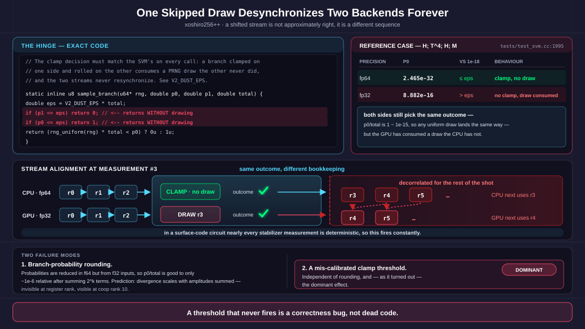
<figcaption><b>Figure 12.1</b> — The desynchronization mechanism. A single
clamp taken on one side and not the other shifts the entire remaining draw
sequence for that shot. The outcome of the clamped branch is <em>identical</em>
on both sides; it is the bookkeeping that diverges.</figcaption>
</figure>

### 12.2 The dominant cause: a constant that outlived its precision

`V2_DUST_EPS` was copied verbatim from the SVM's `kDustEpsilon = 1e-18`
(`svm_internal.h:46`). That value is calibrated for `std::complex<double>`, whose
analytically-zero interference lands at 1e-30…1e-24. V2 stores f32, where the
same interference concentrates at `fp32_eps² = 1.4e-14` — **four decades above
the threshold**. On the GPU the dust branch therefore *never clamped*.

The reference case is a four-line circuit (`H; T^4; H; M`, the one
`tests/test_svm.cc:1995` pins):

| precision | p0 | vs `1e-18` | behaviour |
|---|---|---|---|
| fp64 | 2.465e-32 | ≤ eps | **clamp**, no draw |
| fp32 | 8.882e-16 | > eps | **no clamp**, draw consumed |

Both sides still pick the same *outcome* — `p0/total` is `1 - 1e-15`, so any
uniform draw lands the same way — but the GPU has consumed a draw the CPU has
not. In a surface-code circuit nearly every stabilizer measurement is
deterministic, so **this fires constantly**.

As the commit puts it: *"A threshold that never fires is a correctness bug, not
dead code."*

**Sizing the replacement.** The new value is not a guess. A branch probability is
a sum of `half = 1 << (active_k - 1)` squared fp32 magnitudes, and the rounding
error is *relative to each amplitude* — so the dust floor does **not** grow with
term count; summing more terms averages the residuals rather than accumulating
them. Measured with `V2_performance/tools/dust_floor.py` (`p1/total`, 2,000
trials per rank):

| rank | median | max |
|---|---|---|
| 1 | 9.7e-15 | **1.2e-13** |
| 4 | 1.3e-14 | 5.8e-14 |
| 12 | 1.42e-14 | 1.6e-14 |
| 26 | 1.42e-14 | 1.5e-14 |

The distribution concentrates on `fp32_eps² = 1.42e-14` and **tightens** with
rank; the widest tail is at *low* rank (~1.2e-13). One constant therefore covers
ranks 1–26. `1e-11` sits ~2 decades above that tail and ~5 decades below the
smallest probability f32 can meaningfully carry, leaving margin on both sides.
Nothing real is clamped away: genuine small probabilities (the SVM comment cites
`R_ZZ` angles producing ~1e-16) are not representable in f32 storage in the
first place.

> **Provenance.** These four rows were originally recorded only as prose, in the
> `V2_DUST_EPS` comment — the generating code was never committed, the same gap
> that produced the incorrect barrier figure in §11.2. Re-deriving it turned up
> a detail the prose elides. "Residual model" is literal: it is a *statistical*
> model, not a simulation of the kernel's arithmetic. It assumes each
> analytically-zero output carries a relative error at full `eps`
> (`resid_i = a_i · eps · z_i`, `z_i` unit-variance complex Gaussian), giving
> `p1/total = eps² · Σ|a_i|²|z_i|² / Σ|a_i|²` — `eps²` times a weighted mean of
> `Exp(1)` variables. Re-running that model reproduces the table to the digit
> (9.730e-15 / 1.222e-13, 1.315e-14 / 5.048e-14, 1.422e-14 / 1.586e-14,
> 1.422e-14 / 1.476e-14). Both the model and the four values are now committed
> as `dust_floor.py --model residual`, its default.
>
> Directly simulating the arithmetic instead — `fl(fl(u·a) + fl(v·b))` over
> fp32-stored amplitudes whose exact fp64 counterparts cancel identically, via
> `--model butterfly` — puts the real floor **~48× lower**: median 2.9e-16 at
> rank 26, 2.7e-16 at rank 12, and a worst tail of 2.7e-15 at rank 1 (2.9e-15
> at 20,000 trials — a max is an order statistic and grows with the trial
> count, so it is only comparable across rows at equal `--trials`). At rank 1
> the median is exactly **zero**: with a single term there is nothing to cancel
> against, so the fp32 product is either exact or it is not. The residual model
> is the conservative envelope, because it assumes every term rounds at full
> `eps` and that the errors never cancel against one another.
>
> This does not disturb the choice of `1e-11`, and it is worth being precise
> about why. Every structural fact the threshold rests on holds under *both*
> estimators: the floor is rank-independent, the spread tightens with rank so
> the widest tail is at low rank, and the floor is insensitive to circuit depth
> (`--depth 256` moves the medians by <5 %, because accumulated error is itself
> relative and divides out of the ratio). The two models disagree only on the
> absolute location, and `1e-11` clears the *conservative* one by two decades —
> so it clears the simulated one by nearly four. What the correction changes is
> the margin, which is larger than claimed, not the decision.
>
> Both tables above were regenerated for this report from the committed tool,
> whose RNG is seeded `1234 + rank` and so reproduces to the digit:
> `dust_floor.py --model residual` and `--model butterfly`, defaults otherwise.

This is worth pausing on, because it inverts the intuition the "f32 vs f64"
framing invites. The dust floor is **rank-independent**, and the *low*-rank
circuits have the widest spread. A threshold picked for the largest circuit would
have been wrong for the smallest.

### 12.3 The A/B that confirmed it

Two arms, identical in every respect but the constant (job 50444, node
`smci350-rck-g03-f13-21`):

| arm | `V2_DUST_EPS` | d5 (coop, rank 10) shot 0 | d3 (register, rank 4) shot 0 |
|---|---|---|---|
| A | `1e-18` (fp64-calibrated) | gpu=[0] cpu=[1] **MISMATCH** | gpu=[0] cpu=[0] ok |
| B | `1e-11` (fp32-calibrated) | gpu=[1] cpu=[1] **match** | gpu=[0] cpu=[0] ok |

The rank-dependence prediction from §12.1 holds exactly: the register-tier
circuit agreed under *both* thresholds, and the coop-tier circuit disagreed only
under the fp64-calibrated one. Fixed in `2a015fd` — **a constant-only change**;
all four `sample_branch` call sites are untouched.

### 12.4 Post-fix verification: separating logic from statistics

The mistake available here is to check aggregate counts, see them differ by a
percent or two, and conclude the backend is still wrong. `d5_verify.sh`
(job 50453) therefore asks two different questions.

**Q1 — same-stream, shot-for-shot. Must be EXACT.** Twelve seeds × three
circuits, comparing the GPU seed against the CPU seed that reproduces the
identical 256-bit xoshiro state:

> **Q1: 36/36 exact.**

Every shot matches. This is the *logical* claim, and it is binary: either the
two backends compute the same thing or they do not.

**Q2 — statistical convergence.** Two *independent* streams sampling the same
distribution should converge as `1/√shots`:

| circuit | shots | cpu | gpu | rel gap | z |
|---|---|---|---|---|---|
| circuit_d5_p0.001 | 2,000 | 709 | 661 | 6.77 % | −1.60 |
| | 10,000 | 3,395 | 3,364 | 0.913 % | −0.46 |
| | 50,000 | 17,005 | 16,862 | 0.841 % | −0.96 |
| | 200,000 | 67,376 | 66,968 | 0.606 % | −1.37 |
| circuit_d3_p0.001 | 2,000 | 52 | 63 | 21.15 % | 1.04 |
| | 10,000 | 250 | 270 | 8.00 % | 0.89 |
| | 50,000 | 1,225 | 1,224 | 0.082 % | −0.02 |
| | 200,000 | 4,811 | 4,922 | 2.31 % | 1.14 |

**Every |z| < 1.7.** The residual gap is sampling noise between two independent
streams, not a numerical defect — and Q1 is what proves that: since
shot-for-shot agreement is exact, the aggregate difference *can only be* the
difference between two valid samples of the same distribution.

Note the `circuit_d3` row at 200,000 shots: the relative gap goes *up* (0.082 %
→ 2.31 %) while `|z|` stays near 1. Reading the percentage alone would suggest a
regression at scale. The z-score says otherwise, and the z-score is the right
statistic — the raw counts are small (≈4,800 of 200,000), so the relative gap is
dominated by Poisson noise.

<figure>
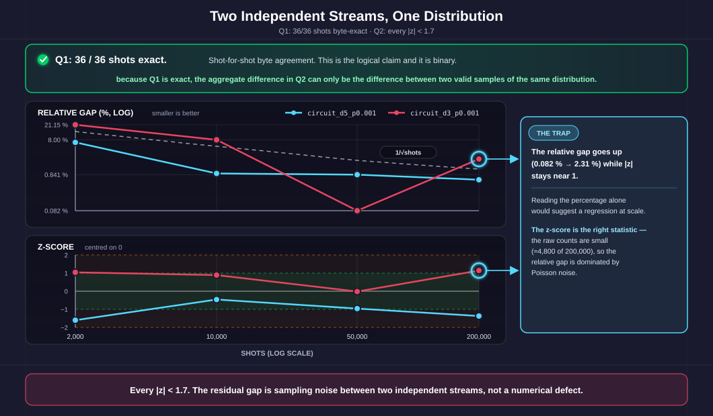
<figcaption><b>Figure 12.2</b> — Q2 convergence. Relative gap shrinks roughly as
1/√shots while every z-score stays inside ±1.7. The two backends are sampling
the same distribution with different streams.</figcaption>
</figure>

### 12.5 What "narrowing the gap" actually meant

The framing this section inherited — f32 vs f64 — is not what was fixed, and
saying so plainly matters more than preserving the tidier story:

- The gap was **not** about precision in the *arithmetic*. No accumulation order
  was changed, no reduction was promoted to f64, no amplitude was widened. §8.6
  makes the same point from the codegen side: V1's 23× larger f64 instruction
  count is 68 % inlined `log()` polynomial, and once that is factored out both
  backends widen to f64 in exactly the same three places, deliberately, to stay
  byte-exact with the interpreter.
- It was about a **threshold constant calibrated for one precision and left in
  place when the storage format changed** — whose effect was to make one side
  consume a random number the other side did not.
- The fix is one token. The diagnosis was the entire cost.

And the residual, genuine f32-vs-f64 effect predicted in §12.1 — branch
probabilities good to only ~1e-6 relative — is real but is *not* what the d5
divergence was. It remains a bounded source of rare divergence at high rank, and
nothing in this corpus has yet isolated an instance of it. Stated as an open
item rather than a solved one (§16).

---

## 13. Removing HIP, introducing HSA

V2's dispatch policy is stated as an absolute: **avoid HIP at all cost; HSA-based
dispatch and runtime management.** This section measures what that is worth,
corrects the in-tree justification for it by a factor of ~44, bounds the benefit
honestly against V2's actual workloads, and prices the bill the policy has
already come due for.

The short version, stated up front so the numbers below are read correctly:

- HSA's persistent path beats HIP's synchronized launch by **1.74×** (4,671 ns).
- The pre-existing naive HSA path was **31× worse than either** — the single
  largest dispatch finding here, and the one the in-tree comments got most wrong.
- But V2 issues **one dispatch per run**, so at the median circuit that 1.74×
  is worth **0.03 % of kernel time**. It is decisive only in the short tail.
- The policy's real cost was a correctness bug (§11.2), not a performance one.

### 13.1 What HIP actually does per launch

A HIP kernel launch is not a doorbell write. `hipLaunchKernelGGL` enters the
CLR runtime, which validates arguments, resolves the kernel from a module,
packs the kernarg segment into a runtime-managed pool, builds an AQL packet,
and enqueues it on a stream — and `hipStreamSynchronize` then re-enters the
runtime to wait. Underneath, all of it becomes the same AQL packet on the same
hardware queue that HSA exposes directly.

The question is only what the abstraction costs. Every prior answer in this tree
predates the current hardware and none of them compares the two runtimes.
`hsa_persistent_dispatch.h` documents per-op costs (`alloc_kernarg ~800 ns`,
`allow_gpu_access ~1200 ns`, `signal_create ~600 ns`, "~3.3 µs saved of ~4.5 µs
total") under the label *"measured on MI300X"* — a different chip, a different
ROCm, and no reproducible artifact in the tree. There is no HIP-side number at
all. So the policy that shapes V2's entire host path rested on an unverified
comparison that was never actually run.

### 13.2 The experiment

An empty amdgcn kernel — the smallest thing that can be dispatched — built with
the **exact** flags the V2 specializer uses, so the code object is
representative:

```c
// empty_kernel.c — the smallest possible amdgcn kernel.
//
// The point of an empty kernel is that its GPU execution time is a floor
// (a few hundred ns of wave launch + s_endpgm), so end-to-end launch-to-
// completion latency measured on the host is DOMINATED by the runtime's
// dispatch path. That is exactly the quantity we want to attribute to
// HIP vs raw HSA.
__attribute__((visibility("default")))
__attribute__((amdgpu_kernel))
void bench_empty(unsigned char* out, u64 a, u64 b, u64 c, u64 d) {
    u32 t = __builtin_amdgcn_workitem_id_x();
    if (t == 0u) out[0] = (unsigned char)(a ^ b ^ c ^ d);
}
```

It takes five arguments and writes one byte so the compiler cannot delete the
body and the kernarg segment is non-trivially sized. The benchmark reads the
segment size back out of the loaded code object rather than assuming it, and
prints it in the run header — `kernarg_seg=40` — so the packet being timed is
demonstrably carrying real arguments.

Compiled with the specializer's flags verbatim (`run_bench.sh:28-29`):

```sh
clang --target=amdgcn-amd-amdhsa -mcpu=gfx950 -ffreestanding -nostdlib \
      -nogpulib -std=c23 -O2 -ffp-contract=off -c -emit-llvm -o bench_empty.bc
```

Six modes, three per runtime, all measuring **launch-to-completion wall latency
per dispatch** — the same quantity on both sides, which is what makes them
comparable:

| runtime | mode | what it does |
|---|---|---|
| HSA | `naive` | alloc kernarg + `agents_allow_access` + `signal_create` per dispatch, destroy + free after — what `hsa_dispatch_and_wait` did before `PersistentDispatcher` |
| HSA | `persistent` | kernarg + signal allocated once; packet written per dispatch; signal reset with `store_relaxed` — **V2's hot path** |
| HSA | `batched16` | 16 packets published back-to-back, doorbell rung once, wait once on the last |
| HIP | `sync` | `<<<>>>` + `hipDeviceSynchronize` |
| HIP | `stream_sync` | `<<<>>>` + `hipStreamSynchronize` |
| HIP | `launch_only` | `<<<>>>` only, no sync — HIP's *asynchronous enqueue floor* |

Both runtimes in **one SLURM job on one node** (50507, `smci350-rck-g03-d13-21`,
gfx950, ROCm 7.2.3), 2,000 iterations × 5 reps. The partition is heterogeneous,
so measuring the two arms on different nodes would have been worthless.

### 13.3 The result

ns per dispatch, all five reps:

| mode | rep 0 | rep 1 | rep 2 | rep 3 | rep 4 | steady state |
|---|---|---|---|---|---|---|
| HSA `naive` | 198,920 | 201,622 | 203,587 | 193,931 | 191,615 | **197,935** |
| HSA `persistent` | 6,333 | 6,329 | 6,323 | 6,325 | 6,320 | **6,326** |
| HSA `batched16` | 2,326 | 2,318 | 2,318 | 2,318 | 2,318 | **2,320** |
| HIP `sync` | 13,668 | 10,739 | 10,731 | 10,745 | 10,734 | **10,737** |
| HIP `stream_sync` | 10,993 | 11,002 | 10,992 | 11,000 | 10,997 | **10,997** |
| HIP `launch_only` | 2,106 | 2,088 | 2,090 | 2,085 | 2,095 | **2,093** |

Reproducibility is strong in every mode that matters. Across reps 1–4 the
peak-to-peak spread is **0.15 % for `persistent`, 0.02 % for `batched16`,
0.13 % for HIP `sync` and 0.09 % for `stream_sync`** — the two numbers the
headline rests on are stable to two parts in a thousand. HIP `sync` rep 0
carries a visible first-touch cost (13,668 → 10,739), which is why it is
excluded from its steady-state column.

Two modes are noisier and should be read with that in mind: `launch_only`
spreads 0.44 % and `naive` spreads **6 %** (191.6–203.6 µs). The naive path's
variance is unsurprising — it makes two KFD ioctls and a page-table update per
dispatch, so it inherits kernel-side scheduling jitter. It doesn't matter for
any conclusion drawn here, because the effect being measured is 31×.

**The headline comparison** — same kernel, same node, same completion semantics:

| | ns/dispatch | vs HIP `stream_sync` |
|---|---|---|
| HIP `stream_sync` | 10,997 | 1.00× |
| **HSA `persistent`** (V2's hot path) | **6,326** | **1.74× faster** (−4,671 ns) |
| **HSA `batched16`** (not yet used) | **2,320** | **4.74× faster** (−8,677 ns) |

<figure>
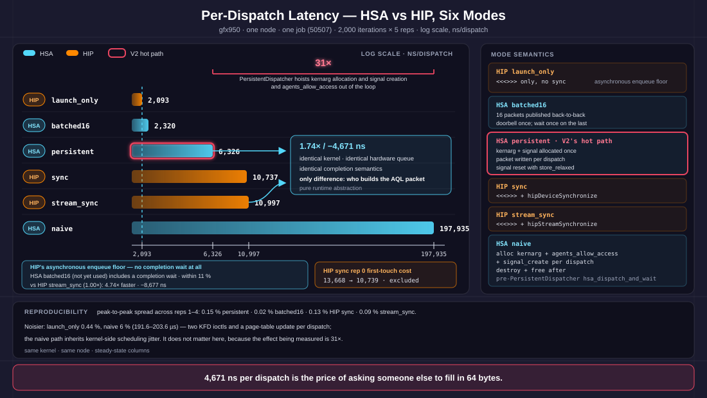
<figcaption><b>Figure 13.1</b> — Launch-to-completion latency per dispatch on
gfx950 (job 50507). Log scale: the naive HSA path is 31× worse than V2's
persistent path, and batched HSA <em>with</em> a completion wait lands within
11 % of what HIP charges for an <em>unsynchronized</em> enqueue.</figcaption>
</figure>

<figure>
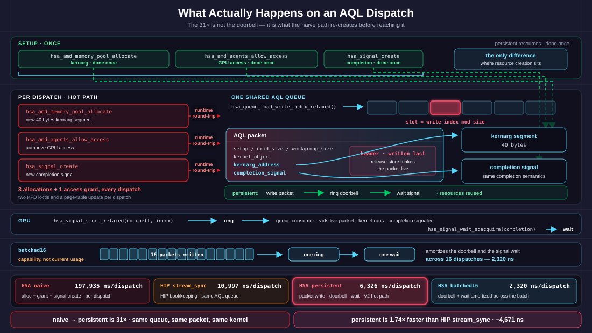
<figcaption><b>Figure 13.2</b> — The same dispatch costs 197,935 ns or 6,326 ns
depending only on <em>where the resource creation sits</em>. The naive path
re-allocates the 40-byte kernarg segment, re-authorizes GPU access to it, and
creates a completion signal on every dispatch — three runtime round-trips, two
KFD ioctls and a page-table update, all before the packet is written. The
persistent path does those once at setup, leaving packet write, doorbell ring
and signal wait. Same queue, same packet, same kernel, same completion
semantics.</figcaption>
</figure>

### 13.4 Reading the result honestly

Three observations, and the third is the one that matters most:

**1. HSA is worth 1.74× on the synchronized path.** 6,326 vs 10,997 ns. That
4,671 ns per dispatch is pure runtime abstraction — identical kernel, identical
hardware queue, identical completion semantics, differing only in who builds the
AQL packet.

**2. Batching is worth more than the runtime choice.** `batched16` at 2,320 ns
is 2.73× better than `persistent` — a larger factor than HSA-vs-HIP's 1.74×.
Amortizing the doorbell and the completion wait across 16 packets beats any
per-dispatch micro-optimization available on either runtime.

The useful comparison is against **HIP's `launch_only` floor of 2,093 ns**, the
cost of enqueueing without ever waiting. Batched HSA reaches 2,320 ns *while
still paying for a completion wait* — 11 % above HIP's fire-and-forget cost, for
strictly stronger semantics. Put the other way: HIP charges nearly as much to
merely hand a packet to a stream as batched HSA charges to dispatch it and
observe it finish.

**3. The in-tree numbers this replaces were wrong by a factor of ~44.**
`hsa_persistent_dispatch.h:36-42` carries a cost model — labelled *"measured on
MI300X"* — that itemizes exactly the operations the `naive` mode performs:

```
/// Eliminated per-dispatch costs (measured on MI300X):
///   - alloc_kernarg:      ~800ns  (pool allocator + bookkeeping)
///   - allow_gpu_access:   ~1200ns (kernel call into KFD for page table update)
///   - signal_create:      ~600ns  (KFD ioctl for doorbell-backed signal)
///   - signal_destroy:     ~400ns  (KFD ioctl)
///   - free_kernarg:       ~300ns  (pool return + bookkeeping)
///   Total saved:          ~3.3us per dispatch (of ~4.5us total overhead)
```

The `naive` mode is a faithful reimplementation of that op sequence, so the two
are directly comparable:

| claim | asserted | measured | error |
|---|---|---|---|
| naive per-dispatch cost | ~4.5 µs total | **~198 µs** | 44× understated |
| saving from persistent resources | ~3.3 µs | **~192 µs** (198,000 − 6,326) | 58× understated |

One precision note in the header's favour: its "~4.5 µs" is labelled *overhead*,
while 198 µs is total launch-to-completion latency. But the two are separated by
only the 6,326 ns `persistent` floor — subtract it and the eliminated cost is
still ~192 µs against an asserted ~3.3 µs. The gap is not an accounting artifact.

The *direction* was right and the *magnitude* was badly wrong. Per-dispatch
`hsa_amd_memory_pool_allocate` + `hsa_amd_agents_allow_access` +
`hsa_signal_create` costs ~198 µs, not ~4.5 µs — `agents_allow_access` in
particular is a KFD call that updates GPU page tables, and paying that per
launch dwarfs everything else in the system. This is the strongest single
argument for `PersistentDispatcher`, and nobody had actually measured it.

It also reframes the priority order. Against a ~10 µs HIP dispatch, a
millisecond-scale kernel is dominated by compute. Against a ~198 µs naive
dispatch, dispatch is a first-order cost for anything short — which is exactly
the regime the v1-era `PERFORMANCE_OPTIONS.md` was written in, and why "host
dispatch overhead" was labelled the dominant bottleneck there.

### 13.4a How much of this does V2 actually collect?

Honesty requires answering the obvious follow-up: V2 does **one dispatch per
run**, not one per shot. The shot loop is inside the kernel (§4's R5 principle),
and `n_dispatches` is `1` for all 26 tier-5+ circuits in the corpus. So the
4,671 ns saving is paid once, and its weight is 4,671 ns divided by the whole
kernel time:

Measured on the canonical run (job 50793), whose `n_dispatches` is **1 for all
26 circuits** — so this is exact, not an assumption:

| circuit | tier | V2 kernel | 4,671 ns as % of it |
|---|---|---:|---:|
| `frame_h` | register | 12.1 µs | **38.7 %** |
| `four_t` | register | 13.1 µs | **35.7 %** |
| `circuit_d3_p0.001` | coop | 220.7 µs | 2.12 % |
| `qv10` | coop | 1.386 ms | 0.337 % |
| `circuit_d5_p0.001` | coop | 8.600 ms | 0.054 % |
| `cultivation_d5` | coop | 16.42 ms | 0.028 % |
| `qv24_L4_seed42` | global | 7.242 s | 0.00006 % |

> **An earlier version of this table was stale in a way worth recording.** It
> quoted `circuit_d5_p0.001` at 14.76 ms and `cultivation_d5` at 30.15 ms from
> the two `f13-21` runs. Those are **interpreter** times: both circuits map to
> `coop_r10_n1720`, whose gate verdict was a stale pre-fence *failure* (§11.4),
> so V2 fell back to the interpreter for exactly that shape. The canonical run
> has the gate passing and the specializer selected, at 8.60 ms and 16.42 ms —
> 1.72× and 1.84× faster. The percentages barely moved (0.032 % → 0.054 %) so no
> conclusion changed, but the absolute times were measuring a different kernel
> than the one the surrounding text describes.

The two register-tier rows carry the effect and deserve a stability note: at
12–13 µs a kernel is close enough to the measurement floor that run-to-run
variation is comparable to the effect. The two earlier `f13-21` runs put
`four_t` at 13.2 and 10.1 µs and `frame_h` at 13.6 and 10.0 µs, spanning
34–47 %. Read the short-tail figure as **~35–47 %**, not as a single number.
Those two circuits are also unaffected by the stale cache in the first place:
they are register tier (LDS = 0, VGPR = 32), and §11.2's A/B rebuild showed the
register-tier binary is **byte-identical by md5** before and after the barrier
fix — 4,457 instructions, zero barriers, nothing to fence. So all three runs
measured the same code for these rows.

The conclusion is unambiguous and cuts against a naive reading of §13.3:
**for V2's production workloads, the HSA-vs-HIP dispatch difference is
negligible.** At the median circuit it is well under 0.1 % of kernel time. The 1.74× is a
real property of the dispatch path and it is not where V2's speedup comes from
— §14 attributes that to the kernel.

Where it *does* matter is the short tail. `four_t` and `frame_h` run for 10–13 µs,
so a single HIP dispatch would add 35–47 % to their cost, and the ~198 µs naive
path would have cost **15–20× the kernel itself** (16.4× and 15.1× on the
canonical run's 12.1 and 13.1 µs). Those two circuits are also
exactly the ones a user iterates on interactively. And the correctness gate
(§9) dispatches per validation, as does any future per-batch structure.

So the defensible framing of the no-HIP policy is not "it makes V2 fast." It is:
*dispatch overhead is a fixed floor that becomes the entire cost at small
problem sizes, and HSA puts that floor 1.74× lower — and 31× lower than the
naive path the code started from.*

### 13.5 What the no-HIP policy has cost

The policy is not free, and §11.2 is the invoice.

`v2_barrier()` was hand-rolled to avoid HIP's `__syncthreads()`. HIP's version
expands to a release/acquire fence pair around `s_barrier`; V2's expanded to a
bare `s_barrier`, which on AMDGCN orders **execution but not memory**. The
result was a workgroup-level data race exposed at 92.8 % of the specialized
kernel's barriers, which corrupted reduction totals, which flipped measurement
outcomes.

> V2 hand-rolled the barrier to avoid HIP and lost the fence with it.

That is the honest shape of the trade. **HIP's abstraction costs 4,671 ns per
dispatch, and it also encodes correctness knowledge that is easy to lose when
you reimplement it.** Combine that with §13.4a — where the saving is worth
0.03 % of a median run — and the accounting is uncomfortable: on the workloads
V2 actually runs, the no-HIP policy bought a fraction of a percent and cost
weeks of debugging a memory-model detail that `__syncthreads()` had been
handling silently.

That is not an argument for reverting. The policy remains right for three
reasons that are not about the 1.74×:

1. **The short tail is real.** At 13 µs, `four_t` pays 35 % for a HIP dispatch.
2. **Self-containment.** V2's whole premise is emitting freestanding amdgcn and
   loading it directly; a `.hsaco` produced by `clang --target=amdgcn-amd-amdhsa`
   has no HIP module to be launched from. HSA is not an optimization here so
   much as the native interface for what V2 already builds.
3. **The naive-path finding.** 198 µs → 6.3 µs is a 31× win that exists only
   because the dispatch layer is owned rather than delegated.

The cost is stated as plainly as the benefit: reimplementing a runtime means
reimplementing its invariants, and §11.2 is what that looks like when one is
missed.

Also worth stating plainly: HIP has not been removed from the *repository*. The
SVM and Hybrid backends still use it (`hip_sampler.hip`), and the constraint on
this work was explicitly *"no CMake, ONLY on the MLIR part, no changes to SVM or
hybrid."* What V2 removed is HIP from **its own** dispatch and device-side
synchronization path. That removal is total and checkable:

```
$ grep -rn "#include.*hip"            src/clifft/gpu/mlir/v2/   # (none)
$ grep -rnE "\bhip[A-Z][A-Za-z]*\s*\(" src/clifft/gpu/mlir/v2/  # (none)
$ grep -rn "__syncthreads"             src/clifft/gpu/mlir/v2/
v2_ops.h:130:  // ... HIP's __syncthreads() expands to exactly this,
```

Zero HIP headers, zero HIP API calls. All 13 lines in the directory that match
"hip" case-insensitively are comments — and the sole `__syncthreads` reference
is the §11.2 post-mortem note explaining what V2's hand-rolled barrier had been
missing. Dispatch instead runs on 14 direct `hsa_*` call sites in
`v2_kernel.cc`.

### 13.6 What is still unmeasured

`batched16` is a benchmark mode, **not** something V2 does. V2's hot path is
`hsa_dispatch_and_wait` (the `persistent` shape, 6,326 ns), called exactly once
per run. A batched entry point exists — `hsa_dispatch_batch_and_wait`, which
reserves N packets plus a barrier in a single CAS — but grep finds **no caller**
outside the dispatch layer itself. It is capability, not usage.

Given §13.4a, that is the right call for now: with one dispatch per run and
millisecond-to-second kernels, batching has nothing to amortize. It would only
pay if V2 moved to a multi-dispatch structure — chunked shot batches for
progress reporting or memory-bounded rank-26 runs. Recorded in §16 as
conditional, not as a missed win.

The larger caveat on this whole section: an empty kernel isolates dispatch cost
by construction, which is what makes the comparison clean, and also what makes
it an upper bound on relevance. §13.4a is the correction, and it should be read
as part of the result rather than as a footnote to it.

---

## 14. Performance evaluation: V2 against SVM

Everything to this point has been mechanism — what the specializer folds, what
the compiler does with it, what an individual opcode costs. This chapter is the
end-to-end evaluation: 26 circuits, both backends, hardware counters, and an
attempt to answer the only question that matters — *where does the time actually
go, and why is V2 faster?*

### 14.1 Method

One SLURM job, **50793**, on one node.

| | |
|---|---|
| run | `20260727T125310Z_report-final-allfixtures` |
| node | `smci350-rck-g03-d13-21` (`mi350x-es`, gfx950) |
| commit | `79d4463`, working tree clean |
| circuits | 26, all paired (V2 + SVM), **zero `rocprofv3` aborts** |
| metric | **GPU kernel time**, `per_dispatch_ns_median` from `rocprofv3` |

Counters are collected in **three separate profiling passes**, because the
hardware cannot capture them all simultaneously:

| pass | counters |
|---|---|
| `pmcA` | `SQ_INSTS_{VALU,SALU,LDS,MFMA}`, `SQ_WAVES` |
| `pmcB` | `TCC_HIT_sum`, `TCC_MISS_sum` |
| `pmcC` | `GRBM_GUI_ACTIVE`, `SQ_BUSY_CYCLES`, `SQ_WAIT_INST_LDS`, `SQ_WAVE_CYCLES` |

Each pass is a **separate execution of the kernel**. Counters from the same pass
may be combined freely; counters from different passes may not be divided into
each other without an argument that both executions did the same work. §14.5
turns on exactly this point, and an earlier draft of this chapter got it wrong.

Three further methodological commitments, each learned the hard way and each now
enforced rather than merely intended:

1. **Kernel time, not host wall time.** The host path differs between the two
   backends (§13 is entirely about that difference), so wall time would measure
   the dispatch mechanism rather than the generated code. Where dispatch
   overhead is the subject, §13 measures it directly.
2. **Both arms in one job on one node.** `mi350x-es` is heterogeneous;
   `node.json` in every run directory carries the warning `"Do NOT compare
   ratios across nodes."` §1.3(d) records what happens when this is violated —
   a projection off by 2×, in the flattering direction.
3. **The denominator is checked against the expected denominator.** Job 50785
   reported `wins 18/18` over a 26-circuit corpus because eight fixture paths
   had gone stale and `rocprofv3` aborted on each. `bench_all.sh:131-138` now
   aborts the run rather than continuing past a missing input:

   ```bash
   # Fail loudly on a stale fixture path. Job 50785 lost 8 of 26 circuits to
   # renamed fixtures: rocprofv3 aborted on every pass, stderr went to
   # /dev/null, and the summary reported "wins 18/18" over a silently
   # truncated corpus. A missing input must not look like a clean result.
   if [ ! -f "$c" ]; then
     echo "  *** FIXTURE MISSING: $c -- aborting run ***" >&2
     exit 1
   fi
   ```

   That truncation was not a wash: the six dropped QV circuits are the corpus's
   *weakest* wins, so their absence moved the median from 0.670 to 0.518. A
   silent loss of data flattered the result by 23 %.

### 14.2 The result

**Mean 0.626, median 0.670, wins 26/26.** Every circuit dispatches
`clifft_v2_spec`; not one falls back to the interpreter.

| circuit | V2 (µs) | SVM (µs) | V2/SVM | speedup |
|---|---:|---:|---:|---:|
| `surface_d11_t19` | 20,423 | 79,842 | **0.256** | 3.9× |
| `surface_d11_t15` | 19,589 | 75,947 | 0.258 | 3.9× |
| `surface_d9_t19` | 11,926 | 45,208 | 0.264 | 3.8× |
| `surface_d9_t15` | 11,369 | 41,325 | 0.275 | 3.6× |
| `surface_d7_t19` | 6,247 | 20,152 | 0.310 | 3.2× |
| `qv10` | 1,386 | 4,350 | 0.319 | 3.1× |
| `surface_d11_t10` | 37,986 | 81,369 | 0.467 | 2.1× |
| `surface_d9_t10` | 21,632 | 44,094 | 0.491 | 2.0× |
| `circuit_d3_p0.001` | 221 | 434 | 0.509 | 2.0× |
| `surface_d7_t15` | 11,225 | 21,998 | 0.510 | 2.0× |
| `surface_d7_t10` | 11,044 | 20,674 | 0.534 | 1.9× |
| `four_t` | 13.1 | 22.3 | 0.587 | 1.7× |
| `surface_d7_t5` | 2,051 | 3,372 | 0.608 | 1.6× |
| `qv20_L8_seed42` | 1,583,246 | 2,162,954 | 0.732 | 1.4× |
| `qv21_L8_seed42` | 2,977,386 | 4,045,316 | 0.736 | 1.4× |
| `frame_h` | 12.1 | 16.3 | 0.742 | 1.3× |
| `cultivation_d5` | 16,421 | 20,901 | 0.786 | 1.3× |
| `circuit_d5_p0.005` | 8,727 | 10,714 | 0.815 | 1.2× |
| `circuit_d5_p0.003` | 8,809 | 10,516 | 0.838 | 1.2× |
| `circuit_d5_p0.002` | 8,730 | 10,319 | 0.846 | 1.2× |
| `circuit_d5_p0.001` | 8,600 | 10,158 | 0.847 | 1.2× |
| `qv20_seed42` | 1,804,649 | 2,123,250 | 0.850 | 1.2× |
| `circuit_d5_p0.0005` | 8,643 | 10,102 | 0.856 | 1.2× |
| `qv24_L4_seed42` | 7,241,815 | 8,211,443 | 0.882 | 1.1× |
| `qv22_L6_seed42` | 3,179,445 | 3,243,842 | 0.980 | 1.0× |
| `qv23_L5_seed42` | 6,086,167 | 6,146,952 | 0.990 | 1.0× |

The spread — 3.9× down to 1.01× — is the chapter's real subject. A single
average would hide the entire mechanism.

### 14.3 Where the time goes: the scalar pipe

The strongest and most consistent signal in the corpus is **not** the vector
instruction count. It is the scalar one.

| circuit | V2/SVM time | VALU ratio | **SALU ratio** | SALU reduction |
|---|---:|---:|---:|---:|
| `four_t` | 0.587 | 0.432 | **0.110** | 9.1× |
| `surface_d9_t19` | 0.264 | 0.482 | 0.137 | 7.3× |
| `surface_d11_t15` | 0.258 | 0.482 | 0.138 | 7.3× |
| `surface_d11_t19` | 0.256 | 0.490 | 0.138 | 7.2× |
| `circuit_d3_p0.001` | 0.509 | 0.817 | 0.150 | 6.7× |
| `circuit_d5_p0.001` | 0.847 | 0.639 | 0.156 | 6.4× |
| `qv10` | 0.319 | 0.445 | 0.198 | 5.1× |
| `frame_h` | 0.742 | 0.429 | 0.218 | 4.6× |
| `qv20_seed42` | 0.850 | 0.821 | 0.345 | 2.9× |
| `qv24_L4_seed42` | 0.882 | 0.863 | **0.361** | 2.8× |

**On 26 of 26 circuits the SALU ratio is below the VALU ratio** — the scalar
count falls faster than the vector count, without exception. The range is
0.110–0.361: V2 issues between 2.8× and 9.1× fewer scalar instructions than the
SVM interpreter.

On the surface and `circuit_d5` families the reduction is larger in *absolute*
terms as well, by a factor of 3.8×–7.3×:

| circuit | ΔSALU | ΔVALU | \|ΔSALU\|/\|ΔVALU\| |
|---|---:|---:|---:|
| `circuit_d3_p0.001` | −6 M | −0.8 M | **7.31** |
| `surface_d11_t10` | −17,152 M | −2,832 M | 6.06 |
| `surface_d7_t15` | −4,603 M | −761 M | 6.05 |
| `cultivation_d5` | −4,053 M | −693 M | 5.85 |
| `circuit_d5_p0.001` | −2,029 M | −352 M | 5.76 |
| `surface_d11_t19` | −8,691 M | −2,275 M | 3.82 |

On the **QV family this inverts**: `qv20_seed42` removes 9,094 M scalar
instructions against 37,752 M vector ones, a ratio of 0.24. The scalar *ratio*
still improves more (0.345 vs 0.821), but the QV circuits are so vector-dominated
in absolute terms that the vector reduction is the larger number. Both statements
are true of the same data, and which one matters depends on which pipe is the
limiter — a distinction §14.5 develops.

**What those scalar instructions were.** The interpreter's inner loop is

```c
for (u32 pc = 0; pc < num_instrs; ++pc) {
    CV2Instr ins = instrs[pc];      // a load
    u32 k = st->active_k;           // another load
    switch (ins.opcode) { ... }     // a jump table
```

Per bytecode instruction that is: an address computation (`pc * 40`, needing a
64-bit multiply — see §7.3), a `global_load`, a `v_readfirstlane` to move the
operand to the scalar unit, an `s_load` of `active_k`, a bounds compare, and a
jump through a switch table. None of it computes an amplitude. V2 emits the call
directly with its operands as literals, and all of it disappears — which is
exactly what the eight microbenchmarks of §7 predicted, case by case.

> **A retraction, because an earlier draft of this report got the mechanism
> backwards.** §7 previously described this as work *moved* from the vector pipe
> to the scalar pipe — "the same computation, once per wavefront instead of once
> per lane." That is wrong. Counting scalar instructions in the same sixteen
> `.s` files that produced §7's VALU numbers shows SALU falling in all eight
> cases (1.26×–3.09×), and the corpus shows it falling *faster* than VALU on
> 26 of 26 circuits. Nothing migrates. Both pipes issue less, and the scalar
> pipe issues much less. The claim survived several drafts because it was
> plausible and because `stats.csv` had a `v_alu` column and no `s_alu` column —
> the falsifying number was one `grep` away and structurally invisible.

### 14.4 Why the speedup varies: instruction mix

§7 ended with a taxonomy — what specialization folds and what it cannot. The
corpus tests it.

The **surface family** (0.256–0.534) is dominated by frame ops and dormant
measurements, precisely the S1 and S2 classes that fold hardest (5.50× and 4.53×
on VALU, 18 branches → 0). The **`circuit_d5` family** (0.786–0.856) is 19.1 %
noise ops by call count — the S7 class, which folds at 1.02× — and those ops are
individually the most expensive in the ISA (447 interpreter-form instructions
against 136 for a frame op), so their share of *time* far exceeds their share of
*call sites*. The prediction §7.9 made from a single microbenchmark, before any
of these circuits were measured, was that `circuit_d5` would be the corpus's
weakest coop-tier result. It is.

The **QV family** (0.732–0.990) is weak for a different reason, developed next.

### 14.5 Why the QV family resists: the resident pool shrinks

The QV circuits have *better* VALU and SALU ratios than `circuit_d5` (0.82–0.86
and 0.34–0.36 against 0.64–0.66 and 0.16), yet worse time ratios. Instruction
count is not what limits them.

**The resident pool shrinks with rank.** Global-tier kernels size a persistent
workgroup pool from an HBM budget: each workgroup owns an amplitude slice plus a
half-size scratch — 12 bytes per amplitude, since `GpuComplex` is
`{float re; float im;}` — against a 32 GB budget, capped at 2,048 and rounded
down to a multiple of `kNumXCDs = 8` (`v2_kernel.cc:436-445`):

```cpp
const uint64_t amp = 1ull << flat.peak_rank;
const uint64_t bytes_per_wg = amp * sizeof(GpuComplex) + (amp / 2) * sizeof(GpuComplex);
const uint64_t budget = 32ull << 30;  // 32 GB
uint64_t wgs = budget / bytes_per_wg;
if (wgs < 1) wgs = 1;               // rank 26+: at least one resident wg
if (wgs > 2048) wgs = 2048;
global_grid_wgs = static_cast<uint32_t>(wgs);
if (global_grid_wgs > kNumXCDs) global_grid_wgs -= global_grid_wgs % kNumXCDs;
```

Evaluating that arithmetic against the grids `rocprofv3` actually recorded:

| rank | bytes/wg | predicted wgs | measured wgs |
|---|---:|---:|---:|
| 20 | 12 MB | 2,048 (capped) | **2,048** ✓ |
| 21 | 24 MB | 1,360 | **1,360** ✓ |
| 22 | 48 MB | 680 | **680** ✓ |
| 23 | 96 MB | 336 | **336** ✓ |
| 24 | 192 MB | 168 | **168** ✓ |

Five predictions, five exact matches. Every added qubit halves the pool. By rank
24 there are 168 workgroups on a device with 256 CUs — **the machine cannot be
filled**, and no amount of instruction-level improvement changes that. This is
the clearest single explanation for the QV band, and it is structural rather
than incidental: it follows from the budget constant and the rank, both known
before the kernel launches.

<figure>
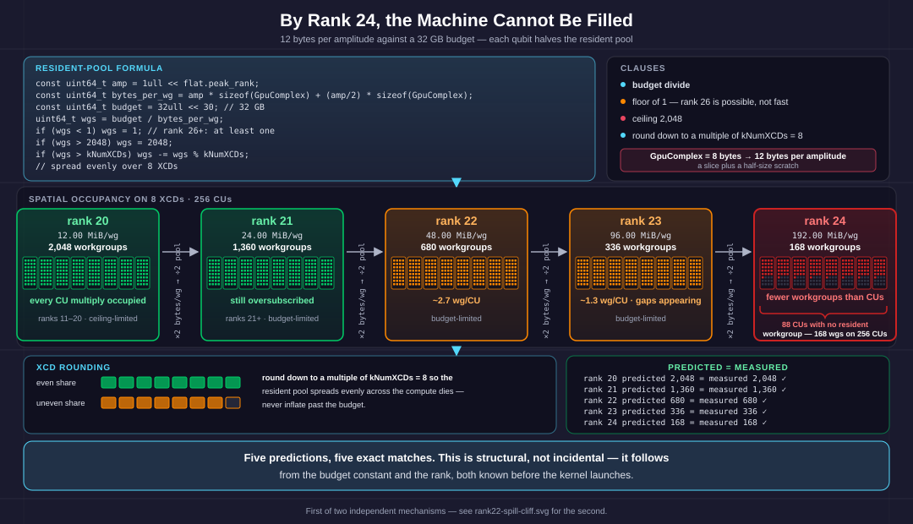
<figcaption><b>Figure 14.1</b> — The pool formula drawn against the device. Each
added qubit doubles bytes per workgroup and so halves the resident pool against
the fixed 32 GB budget: 2,048 workgroups at rank 20 multiply-occupy every CU;
168 at rank 24 leave 88 CUs with no resident workgroup at all. The formula
predicted all five grids exactly, which is what makes this structural rather
than incidental — both inputs are known before the kernel launches.</figcaption>
</figure>

**The second mechanism is register spilling, and it is measured, not inferred.**
The three weakest circuits — `qv22_L6` (0.980), `qv23_L5` (0.990), `qv24_L4`
(0.882) — are exactly the three whose kernels spill. This does not require
interpreting a performance counter: the AMDHSA metadata note in each `.hsaco`
states it directly.

| rank | circuit | ratio | `.vgpr_count` | `.agpr_count` | `.vgpr_spill_count` | `.sgpr_spill_count` | scratch |
|---:|---|---:|---:|---:|---:|---:|---:|
| 20 | `qv20_seed42` | 0.850 | 104 | 40 | **0** | **0** | 96 |
| 20 | `qv20_L8` | 0.732 | 106 | 42 | **0** | **0** | 112 |
| 21 | `qv21_L8` | 0.736 | 104 | 40 | **0** | **0** | 112 |
| 22 | `qv22_L6` | 0.980 | 128 | 64 | **136** | **762** | 448 |
| 23 | `qv23_L5` | 0.990 | 128 | 64 | **199** | **662** | 576 |
| 24 | `qv24_L4` | 0.882 | 128 | 64 | **152** | **594** | 480 |

Read out of the binaries with `llvm-readelf --notes`, e.g. for rank 22:

```
.vgpr_count:       128       .agpr_count:       64
.vgpr_spill_count: 136       .sgpr_spill_count: 762
.private_segment_fixed_size: 448
```

Ranks 20 and 21 sit *below* the VGPR 128 / AGPR 64 cap and spill nothing. Rank
22 and above take the cap and spill 594–762 scalars to scratch — which is
HBM-backed, and therefore the same memory these kernels are already
bandwidth-bound on. Spilling and the collapse in speedup begin at exactly the
same rank.

> **A note on two register numbers that disagree.** `rocprofv3` reports 52, 56
> and 64 VGPRs for these kernels where the metadata says 104, 106 and 128. The
> scratch sizes match one-to-one across the two sources (96/112/112/448/576/480),
> so these are certainly the same kernels. The counts differ by roughly 2× and
> `rocprofv3` reports `Accum_VGPR_Count = 0` where the metadata reports 40–64
> AGPRs, so the profiler is evidently reporting a different quantity — an
> allocation granule or an architected-only count — rather than contradicting
> the binary. §15.5 tabulates the profiler's numbers because that is what that
> chapter's other columns come from; **the spill counts above are from the
> `.hsaco` and are the authoritative ones.** §10 analyses this boundary in
> depth from the same metadata.

§10 establishes what this is *not*: it is not driven by circuit length. The
three spilling kernels are the three **shortest** in the tier (320–359
instructions), while a rank-14 kernel emitting 16,521 instructions — 46× more —
spills 4 SGPRs. What changes at the boundary is a single baked constant, the
`amp_capacity` crossing 2²². The mechanism inside LLVM's allocator has not been
isolated, and §16 keeps that as the top open item.

> **What this section does not claim.** An earlier draft argued the QV band was
> explained by an occupancy inversion — "V2 runs a third as many waves, each 3×
> longer" — computed as `SQ_WAVE_CYCLES / SQ_WAVES`. That quotient is not
> admissible here. `SQ_WAVES` is collected in pass `pmcA` and `SQ_WAVE_CYCLES`
> in pass `pmcC`: **different executions of the kernel**. And `SQ_WAVES` does not
> reconcile with launch geometry on precisely these circuits — SVM launches an
> identical 512-workgroup, 256-thread grid on `qv20`, `qv21_L8` and `qv22_L6`
> and reports 8,832, 10,240 and 8,000 waves respectively, where the geometry
> implies 2,048 in all three. On the other 20 circuits `SQ_WAVES` equals
> workgroups × 4 exactly. Whatever the rank-≥20 counts measure, dividing a
> pass-C cycle count by a pass-A wave count that disagrees with the launch
> geometry does not measure per-wave cost. The claim was removed rather than
> repaired.

### 14.6 What V2 does *not* spend

Three counters are worth reporting for what they rule out.

**MFMA = 0 on all 52 cells.** 26 circuits × 2 backends, none missing. Neither
backend issues a single matrix-core instruction. The workload is a butterfly
reduction over amplitude pairs — `cadd`/`csub`/`cmul` on 2-element complex values
with a strided access pattern — not a GEMM. Any proposal to bring the matrix
cores to bear on this workload is unsupported by this corpus, and the zero is
measured rather than assumed. (An earlier draft could only claim 51 of 52:
`qv24_L4_seed42`'s SVM counter block was missing from the truncated job 50785,
and was recorded as *unmeasured* rather than rounded down to zero.)

**LDS is cheaper on V2 by construction, not by optimization.**

| tier | V2 LDS | SVM LDS | ratio |
|---|---:|---:|---:|
| coop | 13,312 B | 23,040 B | 0.578 |
| global | 1,024 B | 8,704 B | **0.118** |
| register | 0 B | 0 B | — |

The coop figure is the sum of the declared arrays — `lds_v[1024]` and
`lds_red_scratch[512]` at 8 B each is 12,288 B, plus `lds_red0`/`lds_red1`
(128 B) and `lds_state`, for 13,064 B in the ELF — and the global-tier kernel
declares neither amplitude array, because at rank > 10 the amplitudes live in
HBM. Its ELF figure is 784 B of `lds_state` and `lds_shot` alone
(`v2_specializer.cc:204-205`). The 8.5× gap is therefore a consequence of the
tier's design, not a tuning result.

> The table quotes `rocprofv3`'s `LDS_Block_Size`, which is the ELF
> `.group_segment_fixed_size` **rounded up to a 256-byte granule**: 13,064 →
> 13,312 and 784 → 1,024. Both columns are rounded the same way, so the ratios
> are unaffected. See §9.3 for how this granule was mistaken for a code change.

The dynamic counter agrees. `SQ_INSTS_LDS` on the coop tier runs 0.60–0.77× SVM;
on the register tier V2 executes **zero** LDS instructions against SVM's 25,280.
On the surface family's coop and global circuits, however, V2 issues *more*
(1.13–1.25×) — folded axes turn some LDS traffic into direct indexed access, and
the direction of that trade depends on the circuit.

**Scratch, on the register tier, is 4.3× smaller**: 656–1,040 B against SVM's
uniform 4,480 B. The SVM kernel must provision for the worst opcode it might
interpret; V2 provisions for the opcodes this circuit actually contains.

### 14.7 A sanity check: does the counter model explain the time?

If the story above is right, a single derived quantity should predict the
measured ratio. `SQ_BUSY_CYCLES` — cycles during which the SQ has work — is the
natural candidate, and unlike §14.5's rejected quotient it is a ratio of the same
counter between two arms, not a division across passes.

Across all 26 circuits, the busy-cycle ratio against the kernel-time ratio gives
**Pearson r = 0.942**, median relative error **5.5 %**, mean **9.0 %**.

The residual is informative. The six largest errors are, in order,
`circuit_d5_p0.0005` (28.2 %), `circuit_d5_p0.001` (27.2 %),
`circuit_d5_p0.002` (26.4 %), `circuit_d5_p0.003` (25.0 %),
`circuit_d5_p0.005` (21.2 %) and `cultivation_d5` (17.9 %) — **the entire d5
family, and nothing else**. §14.8 is about the same six circuits, and the two
observations are plausibly the same phenomenon seen through two counters.

### 14.8 One result that does not fit

The `circuit_d5` family wins, but its **L2 hit rate is still depressed**: 91.1–92.1 %
for V2 against 97.6–98.4 % for SVM, and `cultivation_d5` shows 90.9 % against
98.9 %. This is a residue of the regression documented in §11.1 — the same
circuits, the same direction, at a fraction of the magnitude (pre-fence the gap
was 71.5 % against 98.0 %, `VERIFIED_FACTS.md:158`).

They win anyway, on the strength of a 0.64 VALU ratio and a 0.16 SALU ratio. But
a 6-point L2 deficit on the one circuit family V2 finds hardest, showing up in
the same six circuits as §14.7's busy-cycle residual, is not explained by
anything in this chapter. §16 records it as open. The honest summary is that V2
wins these circuits *despite* a memory-system disadvantage it did not have to
have.

A second unexplained result, in the opposite direction: on the two smallest
register-tier circuits V2's L2 hit rate is far *worse* than SVM's — `four_t`
52.3 % against 74.4 %, `frame_h` 52.2 % against 66.8 % — and V2 wins both anyway
(0.587, 0.742). At 13 µs and 12 µs these kernels are small enough that cache
behaviour is dominated by cold misses on first touch, and the hit *rate* is
computed over a small denominator. The result is recorded because it was
measured, not because it is understood.

## 15. The full benchmark report

§14 argued a thesis. This chapter is the underlying data, in full, with no
selection: 26 circuits, both backends, every counter collected, every launch
parameter recorded. **Where any earlier chapter of this report disagrees with a
number here, this chapter is correct.** §1–§10 were written against earlier runs
on a different node; several of their figures have been superseded and are
retained only where the text says so explicitly.

### 15.1 Provenance

```json
{ "run_id":  "20260727T125310Z_report-final-allfixtures",
  "label":   "report-final-allfixtures",
  "commit":  "79d4463",
  "branch":  "mlir-v2",
  "dirty":   false,
  "v2_specialize": true,
  "n_circuits":    26 }

{ "slurm_job_id": 50793,
  "node":         "smci350-rck-g03-d13-21",
  "partition":    "mi350x-es",
  "arch":         "gfx950",
  "note": "mi350x-es is heterogeneous. Do NOT compare ratios across nodes." }
```

> **The node caveat, stated once and meant throughout.** This job ran on
> `d13-21`. The absolute timings in §1–§10 come from `f13-21`. V2/SVM *ratios*
> within this job are sound — both arms, same job, same node, interleaved. The
> absolute microsecond figures must not be compared against those chapters.
> §1.3(d) is the record of what happens when this rule is broken: a projected
> ratio of ~0.40 for the d5 family against a measured 0.84, wrong by 2× in the
> flattering direction.

`v2_specialize: true` is not decoration. `V2_SPECIALIZE` is opt-in; with it
unset the harness measures the *interpreter*, and the resulting numbers look
like a 2–3× regression that is really a configuration error. The manifest
records the flag so a reader can tell which kernel was measured.

### 15.2 What each run does

Per circuit, per backend, five `rocprofv3` invocations — plus one untraced warm-up
whose purpose is to move `.hsaco` compilation and gating *off* the traced path:

```bash
prof() {  # $1=outdir  rest=cmd
  local outdir="$1"; shift; local cmd="$*"
  mkdir -p "$outdir"
  eval "$cmd" >/dev/null 2>&1   # warm: compile+gate the .hsaco OFF the traced path
  timeout 300 rocprofv3 --kernel-trace   --stats --output-format csv -d "$outdir/kt"   -- $cmd
  timeout 300 rocprofv3 --hsa-core-trace --stats --output-format csv -d "$outdir/hsa"  -- $cmd
  timeout 300 rocprofv3 --pmc $PMC_A --output-format csv -d "$outdir/pmcA" -- $cmd
  timeout 300 rocprofv3 --pmc $PMC_B --output-format csv -d "$outdir/pmcB" -- $cmd
  timeout 300 rocprofv3 --pmc $PMC_C --output-format csv -d "$outdir/pmcC" -- $cmd
}
```

The counters are split into three groups because the hardware cannot collect
them simultaneously (`bench_all.sh:81-83`):

```bash
PMC_A="SQ_WAVES,SQ_INSTS_VALU,SQ_INSTS_MFMA,SQ_INSTS_SALU,SQ_INSTS_LDS"
PMC_B="TCC_HIT_sum,TCC_MISS_sum"
PMC_C="SQ_BUSY_CYCLES,GRBM_GUI_ACTIVE,SQ_WAIT_INST_LDS,SQ_WAVE_CYCLES"
```

**Each group is a separate execution of the kernel.** Ratios *within* a group,
and ratios of one counter *between the two backends*, are sound. Quotients of
counters drawn from *different* groups are not, absent an argument that the runs
did identical work — §14.5 retracts a claim that violated exactly this.

Shot counts vary by circuit, from 20,000 on the small register-tier fixtures
down to 500 on `qv24_L4`, chosen so that each run completes inside the 300 s
`timeout` (`bench_all.sh:90-113`). Shot count therefore differs *between*
circuits but is identical between the two backends of any one circuit, which is
what the ratio requires.

### 15.3 The complete result table

Every circuit. Kernel time is `per_dispatch_ns_median`; each backend issues
exactly one dispatch of the kernel under test.

| # | circuit | tier | shots | V2 (µs) | SVM (µs) | V2/SVM |
|---:|---|---|---:|---:|---:|---:|
| 1 | `circuit_d3_p0.001` | register | 20,000 | 220.7 | 433.6 | 0.509 |
| 2 | `circuit_d5_p0.0005` | coop | 10,000 | 8,643.0 | 10,101.6 | 0.856 |
| 3 | `circuit_d5_p0.001` | coop | 10,000 | 8,599.8 | 10,158.4 | 0.847 |
| 4 | `circuit_d5_p0.002` | coop | 10,000 | 8,729.9 | 10,318.6 | 0.846 |
| 5 | `circuit_d5_p0.003` | coop | 10,000 | 8,808.8 | 10,516.1 | 0.838 |
| 6 | `circuit_d5_p0.005` | coop | 10,000 | 8,727.0 | 10,713.5 | 0.815 |
| 7 | `cultivation_d5` | coop | 20,000 | 16,421.3 | 20,900.8 | 0.786 |
| 8 | `four_t` | register | 20,000 | 13.1 | 22.3 | 0.587 |
| 9 | `frame_h` | register | 20,000 | 12.1 | 16.3 | 0.742 |
| 10 | `qv10` | coop | 20,000 | 1,385.6 | 4,349.7 | 0.319 |
| 11 | `qv20_L8_seed42` | global | 2,000 | 1,583,246.4 | 2,162,954.0 | 0.732 |
| 12 | `qv20_seed42` | global | 2,000 | 1,804,648.5 | 2,123,250.3 | 0.850 |
| 13 | `qv21_L8_seed42` | global | 2,000 | 2,977,385.5 | 4,045,316.0 | 0.736 |
| 14 | `qv22_L6_seed42` | global | 1,000 | 3,179,444.7 | 3,243,841.8 | 0.980 |
| 15 | `qv23_L5_seed42` | global | 1,000 | 6,086,167.4 | 6,146,952.4 | 0.990 |
| 16 | `qv24_L4_seed42` | global | 500 | 7,241,815.1 | 8,211,443.4 | 0.882 |
| 17 | `surface_d11_t10` | coop | 10,000 | 37,986.3 | 81,369.2 | 0.467 |
| 18 | `surface_d11_t15` | global | 5,000 | 19,589.4 | 75,946.8 | 0.258 |
| 19 | `surface_d11_t19` | global | 5,000 | 20,423.1 | 79,842.1 | 0.256 |
| 20 | `surface_d7_t10` | coop | 10,000 | 11,044.2 | 20,673.5 | 0.534 |
| 21 | `surface_d7_t15` | coop | 10,000 | 11,225.3 | 21,997.6 | 0.510 |
| 22 | `surface_d7_t19` | global | 5,000 | 6,246.9 | 20,152.3 | 0.310 |
| 23 | `surface_d7_t5` | register | 20,000 | 2,051.1 | 3,372.2 | 0.608 |
| 24 | `surface_d9_t10` | coop | 10,000 | 21,631.9 | 44,093.9 | 0.491 |
| 25 | `surface_d9_t15` | global | 5,000 | 11,368.7 | 41,325.4 | 0.275 |
| 26 | `surface_d9_t19` | global | 5,000 | 11,925.6 | 45,207.5 | 0.264 |

**Aggregates.** Arithmetic mean 0.626, median 0.670, **wins 26 / 26**.

Geometric mean — the correct average for a set of ratios, and the one that does
not let a single large speedup dominate:

| tier | n | geomean | best | worst |
|---|---:|---:|---:|---:|
| register | 4 | 0.606 | 0.509 | 0.742 |
| coop | 11 | 0.633 | 0.319 | 0.856 |
| global | 11 | 0.508 | 0.256 | 0.990 |
| **all** | **26** | **0.573** | 0.256 | 0.990 |

The global tier has both the best geomean *and* the widest spread — it contains
the surface circuits that fold hardest and the QV circuits that resist most.
Tier alone does not predict speedup; instruction mix (§14.4) and pool occupancy
(§14.5) do.

> **Total kernel time across the corpus is a misleading statistic, and is
> reported here only to be dismissed.** Summing all 26: V2 23.088 s against SVM
> 26.445 s, a ratio of 0.873. That number is dominated by the six QV circuits,
> which alone account for 22.9 s of V2's 23.1 s because they are run at high
> rank for thousands of shots. It describes the composition of this fixture list,
> not the backend. The per-circuit ratios above are the result.

### 15.4 Tier assignment

Tier is a function of `peak_rank` alone (`v2_kernel.cc:312-321`):

```cpp
constexpr uint32_t kRegMaxRank  = 4;
constexpr uint32_t kCoopMaxRank = 10;
const Tier tier = flat.peak_rank <= kRegMaxRank  ? REG
                : flat.peak_rank <= kCoopMaxRank ? COOP : GLOBAL;
```

This is worth stating because the fixture names actively mislead. Within the
surface family, `surface_d11_t10` runs **coop** while `surface_d11_t15` and
`surface_d11_t19` run **global** — same code distance, different tier — and
`surface_d7_t5` runs on the **register** tier despite its name suggesting kinship
with the other `surface_d7_*` circuits. The name encodes the circuit's
construction; the tier follows from the peak rank the StatevectorSqueeze pass
leaves behind. **Read the measured LDS size, not the fixture name.**

### 15.5 Launch geometry and resource footprint

| circuit | V2 LDS | SVM LDS | V2 scr | SVM scr | V2 VGPR | SVM VGPR | SGPR |
|---|---:|---:|---:|---:|---:|---:|---:|
| `circuit_d3_p0.001` | 0 | 0 | 1,024 | 4,480 | 64 | 60 | 112 |
| `four_t` | 0 | 0 | 656 | 4,480 | **32** | 60 | 112 |
| `frame_h` | 0 | 0 | 656 | 4,480 | **32** | 60 | 112 |
| `surface_d7_t5` | 0 | 0 | 1,040 | 4,480 | 64 | 60 | 112 |
| `qv10` | 13,312 | 23,040 | 0 | 8 | **36** | 64 | 112 |
| `circuit_d5_*` (5) | 13,312 | 23,040 | 336 | 8 | 64 | 64 | 112 |
| `cultivation_d5` | 13,312 | 23,040 | 336 | 8 | 64 | 64 | 112 |
| `surface_*` coop (4) | 13,312 | 23,040 | 288 | 8 | 64 | 64 | 112 |
| `surface_*` global (5) | 1,024 | 8,704 | 320–352 | 56 | 64 | 64 | 112 |
| `qv20_seed42` | 1,024 | 8,704 | 96 | 56 | **52** | 64 | 112 |
| `qv20_L8` | 1,024 | 8,704 | 112 | 56 | **56** | 64 | 112 |
| `qv21_L8` | 1,024 | 8,704 | 112 | 56 | **52** | 64 | 112 |
| `qv22_L6` | 1,024 | 8,704 | 448 | 56 | 64 | 64 | 112 |
| `qv23_L5` | 1,024 | 8,704 | 576 | 56 | 64 | 64 | 112 |
| `qv24_L4` | 1,024 | 8,704 | 480 | 56 | 64 | 64 | 112 |

Three observations, all structural:

- **LDS.** V2's coop kernels declare `lds_v[1024]` + `lds_red_scratch[512]` at
  8 B each = 12,288 B, plus `lds_red0`/`lds_red1` (128 B) and `lds_state` —
  13,064 B in the ELF, which the profiler reports as 13,312 (see below). The
  global kernels declare neither amplitude array, because at rank > 10 the
  amplitudes live in HBM; their ELF figure is 784 B of `lds_state` and
  `lds_shot` (`v2_specializer.cc:185-186`, `:204-205`), reported as 1,024. SVM
  provisions 23,040 / 8,704 B for the same tiers. The 8.5× global-tier gap is a
  consequence of where the amplitudes live, not of tuning.

  > `rocprofv3` reports `LDS_Block_Size` **rounded up to a 256-byte granule**:
  > 13,064 → 13,312 and 784 → 1,024. The ELF `.group_segment_fixed_size` is the
  > declared size; the profiler figure is the dispatch allocation. This table
  > quotes the profiler throughout, for consistency with its other columns.
- **Scratch, register tier.** 656–1,040 B against SVM's uniform 4,480 B — 4.3×.
  SVM must provision for the worst opcode it *might* interpret; V2 provisions for
  the opcodes the circuit actually contains.
- **VGPRs.** V2 uses fewer than SVM on five circuits (32, 32, 36, 52, 52/56) and
  the same 64 on the rest. It never uses more. The three QV circuits where V2 is
  at 64 are the three weakest results in the corpus, and they are also the three
  that spill — see §14.5.

> **The VGPR column above is `rocprofv3`'s, and it disagrees with the binaries.**
> The AMDHSA metadata in the same kernels' `.hsaco` files reports 104–128 VGPRs
> plus 40–64 AGPRs where the profiler reports 52–64 and `Accum_VGPR_Count = 0`.
> Scratch sizes match one-to-one across both sources, so these are the same
> kernels and the profiler is reporting a different quantity, not a different
> kernel. The column is retained here for consistency with the rest of this
> table, which is profiler-sourced. **For register allocation and spilling,
> §14.5 and §10 use the `.hsaco` metadata, and those are authoritative.**

### 15.6 The complete counter table

Instruction counts, both backends, all 26 circuits. MFMA is omitted from the
table because it is **0.0 in all 52 cells** — 26 circuits × 2 backends, none
missing.

| circuit | VALU V2 | VALU SVM | ratio | SALU V2 | SALU SVM | ratio |
|---|---:|---:|---:|---:|---:|---:|
| `circuit_d3_p0.001` | 3.79e+06 | 4.64e+06 | 0.817 | 1.10e+06 | 7.30e+06 | **0.150** |
| `circuit_d5_p0.0005` | 6.16e+08 | 9.69e+08 | 0.636 | 3.74e+08 | 2.40e+09 | 0.156 |
| `circuit_d5_p0.001` | 6.25e+08 | 9.77e+08 | 0.639 | 3.76e+08 | 2.40e+09 | 0.156 |
| `circuit_d5_p0.002` | 6.40e+08 | 9.92e+08 | 0.646 | 3.79e+08 | 2.41e+09 | 0.158 |
| `circuit_d5_p0.003` | 6.55e+08 | 1.00e+09 | 0.652 | 3.83e+08 | 2.41e+09 | 0.159 |
| `circuit_d5_p0.005` | 6.82e+08 | 1.03e+09 | 0.663 | 3.89e+08 | 2.42e+09 | 0.161 |
| `cultivation_d5` | 1.36e+09 | 2.06e+09 | 0.663 | 7.78e+08 | 4.83e+09 | 0.161 |
| `four_t` | 6.76e+04 | 1.56e+05 | 0.432 | 2.10e+04 | 1.90e+05 | **0.110** |
| `frame_h` | 4.13e+04 | 9.63e+04 | 0.429 | 2.10e+04 | 9.63e+04 | 0.218 |
| `qv10` | 5.02e+08 | 1.13e+09 | 0.445 | 1.20e+08 | 6.05e+08 | 0.198 |
| `qv20_L8_seed42` | 1.28e+11 | 1.54e+11 | 0.830 | 5.39e+09 | 1.57e+10 | 0.344 |
| `qv20_seed42` | 1.74e+11 | 2.11e+11 | 0.821 | 4.79e+09 | 1.39e+10 | 0.345 |
| `qv21_L8_seed42` | 2.40e+11 | 2.88e+11 | 0.835 | 1.01e+10 | 2.93e+10 | 0.345 |
| `qv22_L6_seed42` | 1.96e+11 | 2.30e+11 | 0.855 | 8.15e+09 | 2.33e+10 | 0.349 |
| `qv23_L5_seed42` | 2.73e+11 | 3.18e+11 | 0.861 | 1.16e+10 | 3.24e+10 | 0.357 |
| `qv24_L4_seed42` | 2.31e+11 | 2.68e+11 | 0.863 | 9.86e+09 | 2.73e+10 | **0.361** |
| `surface_d11_t10` | 4.14e+09 | 6.98e+09 | 0.594 | 2.76e+09 | 1.99e+10 | 0.139 |
| `surface_d11_t15` | 2.09e+09 | 4.34e+09 | 0.482 | 1.38e+09 | 9.99e+09 | 0.138 |
| `surface_d11_t19` | 2.19e+09 | 4.46e+09 | 0.490 | 1.40e+09 | 1.01e+10 | 0.138 |
| `surface_d7_t10` | 1.11e+09 | 1.82e+09 | 0.609 | 7.26e+08 | 5.00e+09 | 0.145 |
| `surface_d7_t15` | 1.15e+09 | 1.91e+09 | 0.602 | 7.56e+08 | 5.36e+09 | 0.141 |
| `surface_d7_t19` | 5.89e+08 | 1.18e+09 | 0.500 | 3.74e+08 | 2.63e+09 | 0.142 |
| `surface_d7_t5` | 2.62e+07 | 3.56e+07 | 0.735 | 9.15e+06 | 5.50e+07 | 0.167 |
| `surface_d9_t10` | 2.30e+09 | 3.83e+09 | 0.601 | 1.52e+09 | 1.07e+10 | 0.142 |
| `surface_d9_t15` | 1.17e+09 | 2.38e+09 | 0.492 | 7.64e+08 | 5.44e+09 | 0.140 |
| `surface_d9_t19` | 1.22e+09 | 2.54e+09 | 0.482 | 7.87e+08 | 5.75e+09 | 0.137 |

The SALU column is the chapter's punchline in raw form: **every value is below
the VALU value in the same row, on all 26 rows.** The range 0.110–0.361 is the
corpus-scale statement of §14.3.

### 15.7 Cache and activity counters

| circuit | L2 hit V2 | L2 hit SVM | busy ratio | GRBM ratio | time ratio |
|---|---:|---:|---:|---:|---:|
| `surface_d11_t19` | 97.4 % | 79.3 % | 0.255 | 0.254 | 0.256 |
| `surface_d11_t15` | 98.7 % | 98.3 % | 0.257 | 0.257 | 0.258 |
| `surface_d9_t19` | 97.4 % | 90.0 % | 0.253 | 0.254 | 0.264 |
| `surface_d9_t15` | 98.2 % | 98.6 % | 0.267 | 0.269 | 0.275 |
| `surface_d7_t19` | 97.0 % | 98.8 % | 0.281 | 0.288 | 0.310 |
| `qv10` | 99.6 % | 99.8 % | 0.291 | 0.289 | 0.319 |
| `surface_d11_t10` | 98.7 % | 99.1 % | 0.465 | 0.465 | 0.467 |
| `surface_d9_t10` | 98.4 % | 99.1 % | 0.479 | 0.481 | 0.491 |
| `circuit_d3_p0.001` | 95.3 % | 98.1 % | 0.505 | 0.442 | 0.509 |
| `surface_d7_t15` | 97.7 % | 99.1 % | 0.485 | 0.489 | 0.510 |
| `surface_d7_t10` | 97.7 % | 99.0 % | 0.501 | 0.504 | 0.534 |
| `four_t` | **52.3 %** | 74.4 % | 0.496 | 0.533 | 0.587 |
| `surface_d7_t5` | 99.2 % | 98.9 % | 0.587 | 0.595 | 0.608 |
| `qv20_L8_seed42` | 69.8 % | 69.8 % | 0.687 | 0.683 | 0.732 |
| `qv21_L8_seed42` | 69.4 % | 69.5 % | 0.692 | 0.686 | 0.736 |
| `frame_h` | **52.2 %** | 66.8 % | 0.712 | 0.391 | 0.742 |
| `cultivation_d5` | 90.9 % | 98.9 % | 0.645 | 0.650 | 0.786 |
| `circuit_d5_p0.005` | 91.1 % | 97.8 % | 0.642 | 0.654 | 0.815 |
| `circuit_d5_p0.003` | 91.4 % | 97.6 % | 0.629 | 0.641 | 0.838 |
| `circuit_d5_p0.002` | 91.6 % | 97.7 % | 0.623 | 0.638 | 0.846 |
| `circuit_d5_p0.001` | 91.9 % | 98.0 % | 0.617 | 0.644 | 0.847 |
| `qv20_seed42` | 69.9 % | 69.9 % | 0.769 | 0.765 | 0.850 |
| `circuit_d5_p0.0005` | 92.1 % | 98.4 % | 0.615 | 0.643 | 0.856 |
| `qv24_L4_seed42` | 68.3 % | 68.5 % | 0.885 | 0.879 | 0.882 |
| `qv22_L6_seed42` | 68.9 % | 69.0 % | 0.970 | 0.983 | 0.980 |
| `qv23_L5_seed42` | 68.0 % | 68.1 % | 1.004 | 1.002 | 0.990 |

**`SQ_BUSY_CYCLES` and `GRBM_GUI_ACTIVE` agree with each other almost
everywhere** — two independent activity counters, from the same pass, tracking
within a few percent on 24 of 26 circuits. They agree with kernel time at
Pearson r = 0.942 (§14.7).

The two circuits where the *activity counters* disagree with *each other* are
`frame_h` (busy 0.712, GRBM 0.391) and `circuit_d3` (0.505 / 0.442) — the two
shortest kernels in the corpus at 12 µs and 221 µs, where `GRBM_GUI_ACTIVE`
includes ramp-up the SQ counter does not.

**The d5 anomaly, stated precisely.** On all six d5-family circuits both
activity counters say ~0.62–0.65 while kernel time says 0.79–0.86. The GPU is
*less busy* on V2 and yet takes *longer* than that reduced busy-ness predicts.
This is the same set of six circuits that carry the entire busy-cycle residual
(§14.7) and the residual L2 deficit (§14.8, 91 % vs 98 %). Three counters, one
population, one unexplained mechanism. §16 records it as the chapter's main open
question.

### 15.8 Reproduction

```bash
sbatch V2_performance/tools/bench_all.sh report-final-allfixtures
```

The label is positional; partition, `--gpus=1` and the 01:55:00 walltime are
`#SBATCH` directives in the script itself. `V2_SPECIALIZE=1` is set by the
script rather than left to the caller, because unset it measures the bytecode
interpreter and reports a fake 2–3× regression.

The script is in-tree for a reason worth repeating. Its header records that it
"produced `20260726T182433Z_report-final-postdust` and every run before it, but
was never committed — it lived in `/tmp` and was lost." Every number in this
chapter is reproducible only because the harness that produced it is now
versioned alongside the results.

Two further guarantees: the run aborts rather than continuing past a missing
fixture (§14.1), and `manifest.json` records `dirty` — **every figure above is
void if it reads `true`.** For job 50793 it reads `false`. The expected
denominator is 26 and `summary.md` states the actual one.

## 16. Conclusions and open items

### 16.1 What was built, and what it is worth

Three rewrites of the `clifft` GPU backend, each answering the previous one's
failure:

| | approach | outcome |
|---|---|---|
| **SVM** | one interpreter kernel, three tiers, bytecode in HBM | the baseline. Correct, general, and paying interpretation cost on every instruction of every shot. |
| **Hybrid** | interpreter + per-circuit HIP source compiled at runtime | worked, did not push execution further. Compilation cost and HIP's launch path ate the gain. |
| **V1** | per-circuit MLIR → single monolithic kernel, no interpreter, no runtime | **failed.** Unrolling the circuit into straight-line IR produced kernels too large to compile or schedule. |
| **V2** | per-circuit specialization *over* a runtime, direct C → amdgcn, HSA dispatch | **0.573 geometric mean against SVM, 26 of 26 circuits faster.** |

The load-bearing lesson sits between V1 and V2, and it is not "MLIR was the
wrong tool." It is that **specialization and unrolling are separable, and V1
conflated them.** V1 assumed that to specialize a circuit you must emit it as
straight-line code. V2 specializes exactly as aggressively — the same constants
folded, the same branches removed — while keeping loops as loops and keeping a
runtime underneath. The result compiles in seconds instead of failing to
compile, and it is faster.

### 16.2 Where the speedup comes from

Three mechanisms, in descending order of how much of the corpus they explain.

**1. Scalar instruction deletion (§14.3).** The dominant effect, and not the one
the project expected. On **26 of 26 circuits** the SALU ratio is below the VALU
ratio — V2 issues 2.8× to 9.1× fewer scalar instructions. What disappears is the
interpreter's per-instruction overhead: bytecode address arithmetic (`pc * 40`,
a 64-bit multiply), the load, the `v_readfirstlane` to move the operand to the
scalar unit, the `active_k` reload, the bounds check, the switch dispatch. None
of it computed an amplitude.

This was documented for several drafts as work *moved* from the vector pipe to
the scalar pipe. That was wrong, and §14.3 retracts it: nothing migrates, both
pipes issue less, and the scalar pipe issues much less.

**2. Resource footprint (§14.6, §15.5).** V2's global-tier kernels declare 1,024
bytes of LDS against SVM's 8,704 — 8.5× — because with the amplitudes in HBM
there is nothing to stage. On the register tier V2 allocates 656–1,040 bytes of
scratch against SVM's uniform 4,480, and executes **zero** LDS instructions
against SVM's 25,280. These are consequences of specialization knowing what the
circuit contains, not of tuning.

**3. Nothing exotic.** `SQ_INSTS_MFMA` is **0 across all 52 cells** — 26
circuits × 2 backends. The workload is a butterfly reduction over pairs of
complex amplitudes, not a GEMM, and no part of this result comes from the matrix
cores. Any future proposal to use them is unsupported by this corpus.

The proximate check on all of it: `SQ_BUSY_CYCLES` ratio predicts kernel-time
ratio at **Pearson r = 0.942**, and `GRBM_GUI_ACTIVE` — an independent activity
counter — agrees with `SQ_BUSY_CYCLES` within a few percent on 24 of 26.

### 16.3 Where it does not come from

**The rank ceiling is real and it is register spilling (§14.5, §10).** Above
rank 21 the win collapses to 0.88–0.99. The cause is visible in the AMDHSA
metadata rather than inferred from counters:

| rank | spill (VGPR / SGPR) | ratio |
|---:|---|---:|
| 20–21 | 0 / 0 | 0.732–0.850 |
| 22 | 136 / 762 | 0.980 |
| 23 | 199 / 662 | 0.990 |
| 24 | 152 / 594 | 0.882 |

Spilling begins at exactly the rank where the speedup dies, and it spills to
HBM-backed scratch — the memory these kernels are already bandwidth-bound on.
Compounding it, the resident workgroup pool halves with every added qubit: the
HBM budget formula yields 2048/1360/680/336/168 workgroups for ranks 20–24
(predicted from source constants, matching the measured grids **five for five**),
so by rank 24 there are 168 workgroups on a 256-CU device and the machine cannot
be filled.

**Specialization does not help what it cannot fold.** §7's taxonomy predicted
this circuit-by-circuit before the corpus was measured: the surface family, all
frame ops and dormant measurements, folds 5.50× on VALU and runs at 0.256; the
d5 family is 19.1 % noise ops that fold 1.02×, and runs at 0.79–0.86. The
weakest coop-tier result was predicted from a single microbenchmark and was
correct.

### 16.4 Open items

Ordered by how much they would change the result.

**1. The rank-21/22 allocation cliff.** *The top item.* The three spilling
kernels are the three **shortest** in the tier (320–359 instructions); a rank-14
kernel emitting 16,521 instructions spills 4 SGPRs. Circuit length is not the
mechanism. What changes at the boundary is one baked constant — `amp_capacity`
crossing 2²² — and the emitted C is otherwise structurally identical. The cause
is inside LLVM's allocator and has not been isolated. **First step is an LLVM
allocation study at the boundary, not a code change.**

**2. The d5 anomaly: three counters, one population, no mechanism.** On all six
d5-family circuits, both activity counters say the GPU is ~0.63 as busy on V2
while kernel time says 0.79–0.86 — *less busy, and yet slower than that predicts*.
The same six circuits carry the entire busy-cycle residual (17.9–28.2 %, and
essentially zero elsewhere) and a residual L2 deficit (91 % against SVM's 98 %,
down from 71.5 % pre-fence but not gone). Three independent signals, one circuit
family, no explanation. This is the largest unexplained result in the report.

**3. The specializer does not yet bake per-circuit LDS sizing.** It knows each
circuit's peak rank and could size the coop tier's LDS exactly; it currently
inherits a conservative static bound (§9.3). A known, bounded win nobody has
taken.

**4. `batched16` is conditional, not a missed win.** HSA batched dispatch
measures 2,320 ns against the persistent path's 6,326 — 2.7× — but V2 issues
**one dispatch per run**, so there is nothing to amortize. It would pay only if
V2 moved to a multi-dispatch structure (chunked shot batches for progress
reporting, or memory-bounded rank-26 runs). Capability, not usage.

**5. The residual f32-vs-f64 branch-probability effect.** §12 established that
the d5 divergence was *not* precision — it was a threshold constant calibrated
for f64 and left in place when storage moved to f32. The genuine precision
effect predicted in §12.1, branch probabilities good to ~1e-6 relative, remains
real and unobserved: nothing in this corpus has isolated an instance. Bounded,
rare, and still open.

**6. The `rocprofv3` VGPR discrepancy.** The profiler reports 52–64 VGPRs and
`Accum_VGPR_Count = 0` where the `.hsaco` metadata reports 104–128 plus 40–64
AGPRs, for kernels whose scratch sizes match one-to-one. Not a threat to any
conclusion — the metadata is authoritative and the spill counts come from it —
but the report should not carry two numbers for one quantity indefinitely.

**7. `SQ_WAVES` on persistent global-tier kernels.** The counter does not
reconcile with launch geometry above rank 19: three identical 512-workgroup SVM
grids report 8,832 / 10,240 / 8,000 waves where geometry implies 2,048, while on
the other 20 circuits it equals workgroups × 4 exactly. §14.5 retracted a claim
built on it. Worth understanding before any future analysis uses this counter.

### 16.5 What this report is, and how to check it

Every quantitative claim here is backed by an artifact in the tree: a run
directory under `V2_performance/runs/`, a `.s` file under `lowering/`, or a line
of committed source. `V2_performance/VERIFIED_FACTS.md` is the ledger — sixteen
audit passes, each recording what was checked, what was wrong, and a method note
about how the error survived.

The instruction this report was written under was *trust data, not text*, and it
was aimed first at the report itself. The audits found, among others: a headline
that said 20 wins where the data said 26; a claimed mechanism (scalar
substitution) contradicted by a counter the project had already collected; a
residual attributed to the wrong circuit family because the surrounding argument
predicted it would land there; a per-wave cost computed by dividing counters from
two different profiling passes; and a hedge about spilling written against
evidence sitting in the binaries. Four of those five errors flattered the result
or the story. **That asymmetry is the argument for the ledger.**

Every number above is reproducible with one command:

```bash
sbatch V2_performance/tools/bench_all.sh <label>
```

If `manifest.json` reads `"dirty": true`, or the circuit count is not 26, the run
is void.

